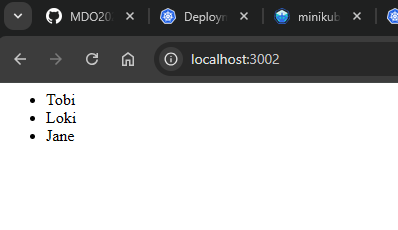

```sh
curl -LO https://storage.googleapis.com/minikube/releases/latest/minikube-latest.x86_64.rpm
```


```sh
minikube start
```


```sh
minikube kubectl -- get po -A
```


```sh
alias kubectl="minikube kubectl --"
```


```sh
minikube dashboard
```


```sh
docker pull msior/express-deploy-img
```


```sh
kubectl run express-single --image=docker.io/msior/express-deploy-img --port=3000 --labels app=express-single
```


```sh
kubectl port-forward pod/express-single 3001:3000
```


```sh
kubectl create deployment express-depl --image=docker.io/msior/express-deploy-img
```


```sh
kubectl expose deployment express-depl --type=NodePort --port=3000
```


```sh
kubectl port-forward service/express-depl 3002:3000
```





### Wyrzucić sekcję status


```sh
kubectl apply -f ./ITE/GCL07/MS417562/Sprawozdanie3/3_3/express-depl.yaml
```


```sh
kubectl rollout status deployment/express-depl
```
