```sh
docker build -f Dockerfile.build1 -t express-app-new .
```
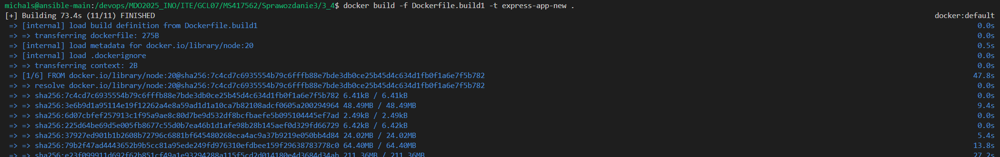

```sh
docker build -f Dockerfile.deploy1 -t msior/express-deploy-img:1.1 .
```
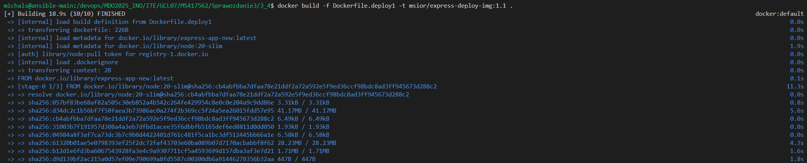

docker run -dit --name test -p 3000:3000 msior/express-deploy-img:1.1 
docker logs test

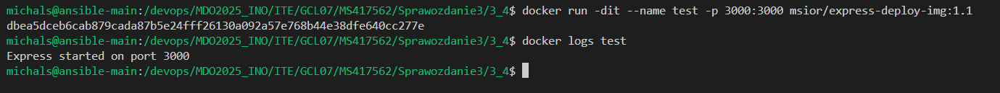
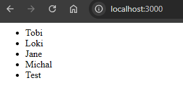

docker build -f Dockerfile.deploy1 -t msior/express-deploy-img:1.2 .

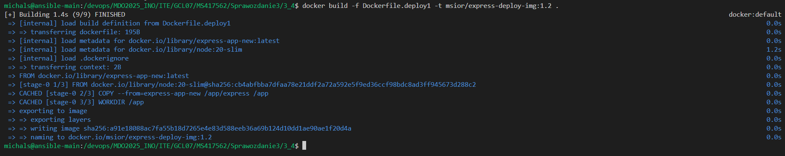

docker run -dit --name test2 msior/express-deploy-img:1.2

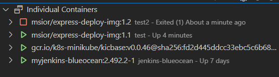

kubectl apply -f express-depl.yaml

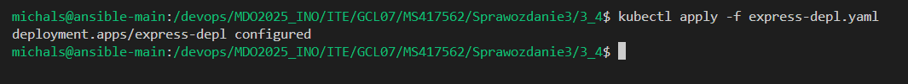
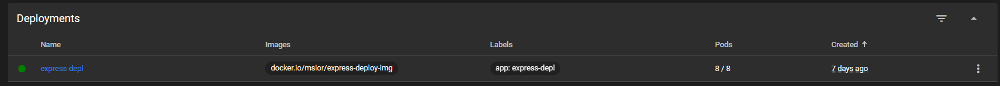

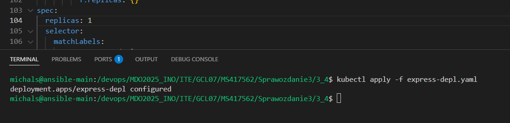


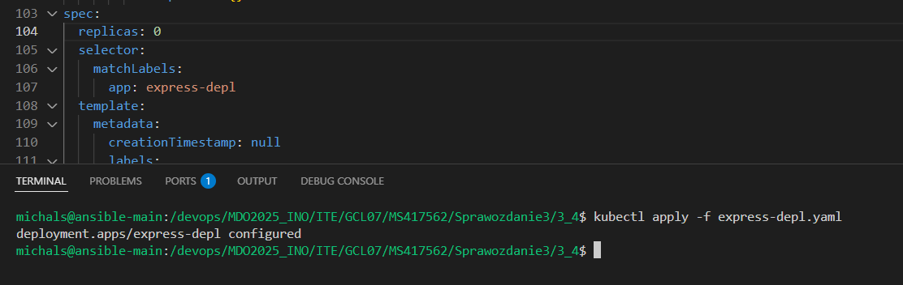
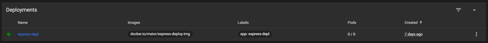

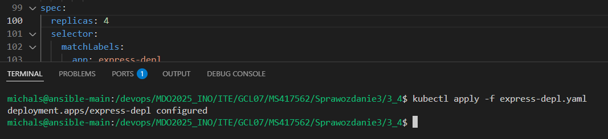
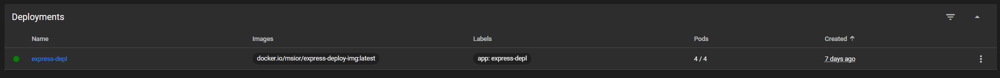

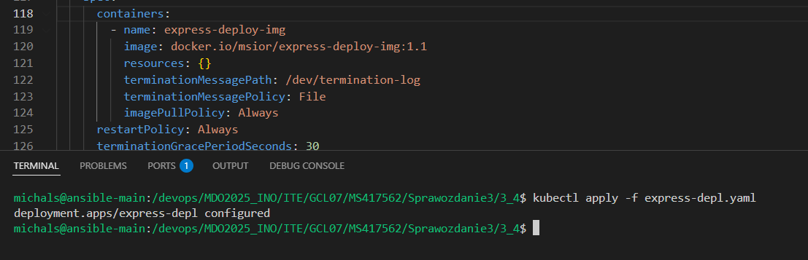
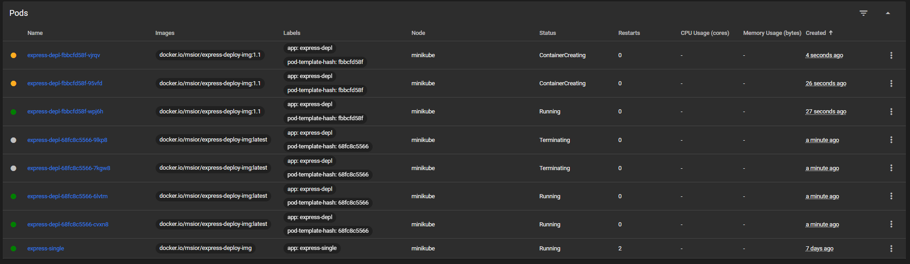
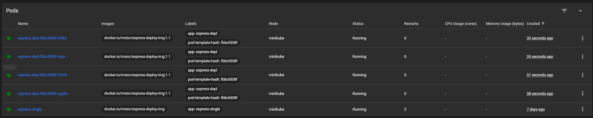

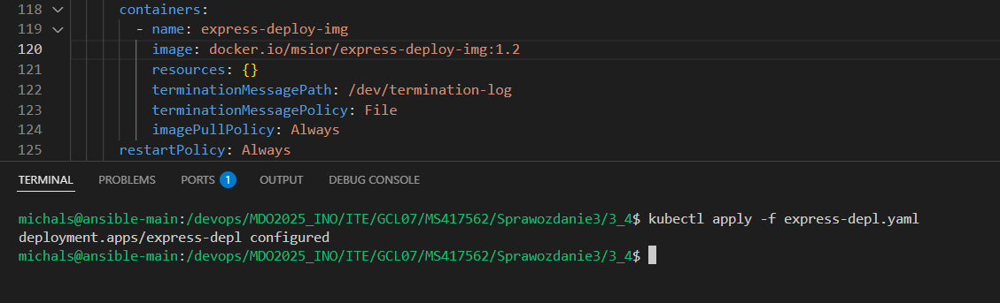
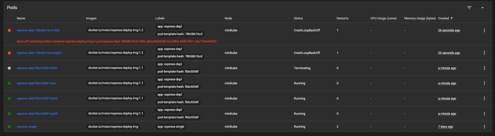
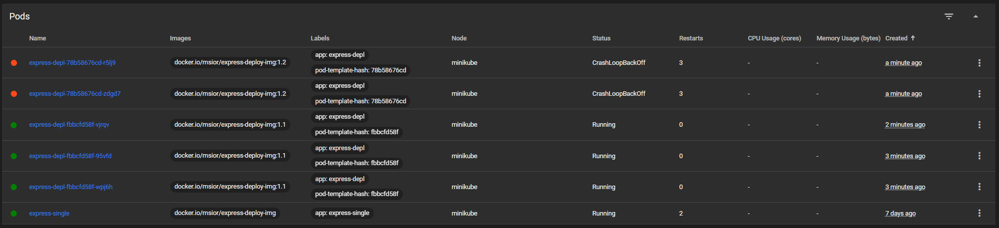

kubectl rollout history deployment/express-depl

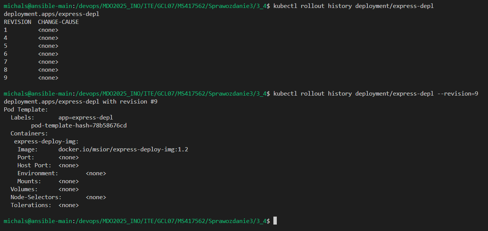

kubectl rollout undo deployment/express-depl 

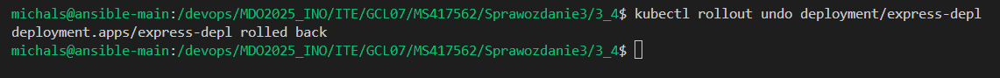
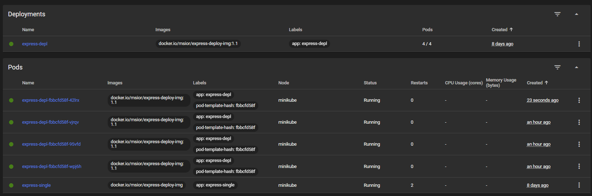

```sh
#!/bin/bash

DEPLOYMENT=express-depl
NAMESPACE=default
TIMEOUT=60
INTERVAL=5
START_TIME=$(date +%s)

echo "⏳ Sprawdzanie wdrożenia '$DEPLOYMENT' w namespace '$NAMESPACE'..."

until minikube kubectl -- rollout status deployment/$DEPLOYMENT -n $NAMESPACE 2>&1 | grep -q "successfully rolled out"; do
  CURRENT_TIME=$(date +%s)
  ELAPSED=$((CURRENT_TIME - START_TIME))

  if [ $ELAPSED -ge $TIMEOUT ]; then
    echo "❌ Timeout: wdrożenie nie zakończyło się w ciągu $TIMEOUT sekund."
    exit 1
  fi

  sleep $INTERVAL
done

echo "✅ Wdrożenie zakończone sukcesem."
exit 0
```

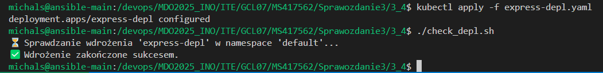

```yaml
strategy:
    type: RollingUpdate
    rollingUpdate:
      maxUnavailable: 2
      maxSurge: 30%
```


```yaml
strategy:
  type: Recreate
```