# ĆW 8 - Automatyzacja i zdalne wykonywanie poleceń za pomocą Ansible

## 1. Instalacja zarządcy Ansible

### Instalacja maszyny ansible-target

#### Zainstalowanie maszyny z obrazu tego samego co główna Fedora. Podczas instalacji stworzenie użytkownika <b>ansible</b>. Nadanie odpowiedniego hostname


#### Zapewnienie obecności <i>tar</i> i <i>openssh-server</i>


#### Włączenie ssh
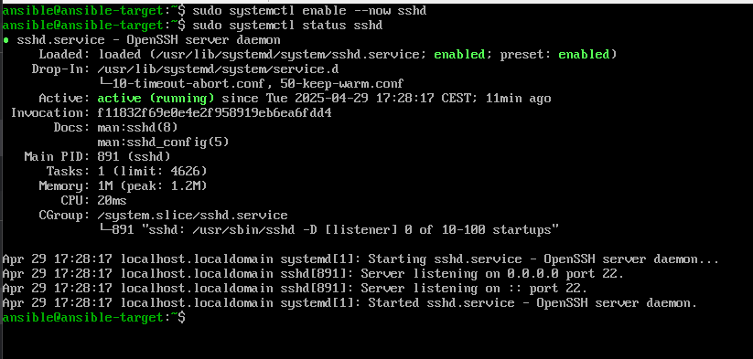

#### Stworzenie punktu kontrolnego w Hyper-v (PPM i "Punkt kontrolny")


#### Wyeksportowanie dla bezpieczeństwa obecnej wersji maszyny (PPM i "Eksportuj")


### Instalacja Ansible na głównej maszynie

#### Ustawienie nazwy głównej maszyny na <b>ansible-main</b>


#### Zainstalowanie ansible
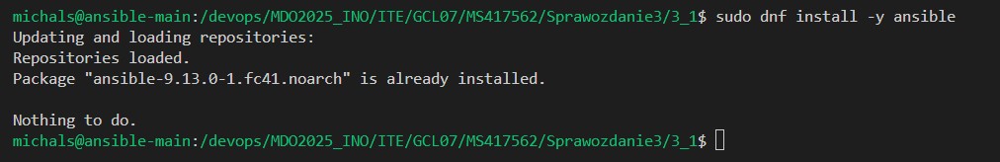

#### Wygenerowanie nowego klucza ssh na głównej maszynie, który będzie wykorzystywany do komunikacji z innymi maszynami


#### Skopiowanie klucza ssh na docelową maszynę (wymiana kluczy)


#### Próba zalogowanie przez ssh na maszynę <b>ansible-target</b>. Udało się bez podawania hasła
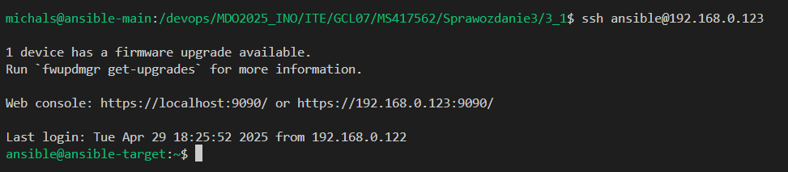

## Inwentaryzacja

#### Dodanie na dwóch maszynach DNS w celu rozpoznawania nazwy hostów (plik /etc/hosts)


#### Testowy ping z maszyny <b>ansible-target</b> do maszyny głównej (udana komunikacja po nazwie)


#### Stworzenie pliku inwentaryzacji (inventory.ini). Dodanie sekcji <code>Orchestrators</code> (maszyny zarządzające) i <code>Endpoints</code> (maszyny docelowe)
```ini
[Orchestrators]
ansible-main

[Endpoints]
ansible-target ansible_user=ansible
```

#### Wysłanie żądania <i>ping</i> do wszystkich maszyn za pomocą wbudowanego narzędzia w ansible
```sh
ansible all -i <inventory_file> -m <module>
```


## Zdalne wywoływanie procedur

#### Stworzenie playbooka (playbook.yaml) i dodanie taska odpowiadającego za wykonanie żądania ping

```yaml
- name: Ping all hosts
  hosts: all
  gather_facts: no
  tasks:
    - name: Ping
      ansible.builtin.ping:
```
```sh
ansible-playbook -i <inventory_file> <playbook_file>
```


#### Rozbudowanie playbooka o kolejne zadania (Pojawia się błąd o braku hasła dla użytkownika do korzstania z sudo)
```yaml
- name: Ping all hosts
  hosts: all
  gather_facts: no
  tasks:
    - name: Ping
      ansible.builtin.ping:

- name: Copy inventory.ini file to Endpoints
  hosts: Endpoints
  gather_facts: no
  tasks:
    - name: Copy inventory.ini file
      ansible.builtin.copy:
        src: inventory.ini
        dest: /tmp/inventory.ini

- name: Ping all hosts v2
  hosts: all
  gather_facts: no
  tasks:
    - name: Ping to compare
      ansible.builtin.ping:

- name: Update system packages on Fedora
  hosts: all
  become: yes
  tasks:
    - name: Update all packages (Fedora)
      ansible.builtin.yum:
        name: "*"
        state: latest
        update_cache: yes

- name: Restart sshd and rngd services
  hosts: all
  become: yes
  tasks:
    - name: Restart sshd
      ansible.builtin.service:
        name: sshd
        state: restarted
      ignore_errors: yes 

    - name: Restart rngd
      ansible.builtin.service:
        name: rngd
        state: restarted
      ignore_errors: yes  
```


#### Rozwiązania problemu są dwa:
- Podczas wywoływania polecenia ansible-playbook dodać flagę --ask-become-pass
- Dodać w inventory.ini ansible_user i ansible_become_password

#### Pierwsze rozwiązanie nie zadziała, ponieważ użytkownicy na maszynach mają inne hasła, a tutaj można podać tylko jedno hasło


#### Dodanie w inventory odpowiednich parametrów (Teraz wszystko poprawnie przechodzi)
```yaml
[Orchestrators]
ansible-main ansible_user=michals ansible_become_pass=123

[Endpoints]
ansible-target ansible_user=ansible ansible_become_pass=ansible
```


#### Niestety Aktualziacja paczek systemu nie chce się zakończyć (trwa bardzo długo). Pominięcie obecnie tego kroku

#### Wynik ostatnich zadań z playbooka. sshd zostało poprawnie zresetowane, a rngd nie zostało znalezione na maszynach (ponieważ w pliku .yaml było podane, żeby ignorować tutaj errory, to cały proces zakończł się poprawnie)


## Zarządzanie stworzonym artefaktem

### Mój projekt to express zbudowany do kontenera docker i wrzucony na docker hub. Z tego powodu muszę stworzyć playbook instalujący dockera, pobierający obraz, uruchamiający kontener, czekający na udane uruchomienie serwisu oraz odpytanie go. Na koniec kontener zostaje zatrzymany i usunięty

#### Stworzenie nowego pliku playbooka z zadaniami. Na górze zostają dodane zmienne, żeby ułatwić jego możliwą edycję
```yaml
- name: Deploy express application with Docker
  hosts: Endpoints
  become: yes
  vars:
    docker_img: "docker.io/msior/express-deploy-img"
    container_name: "express_app_container"
    app_port: 3000

  tasks:
    - name: Install Docker
      become: true
      command: dnf install -y docker
      args:
        creates: /usr/bin/docker

    - name: Start Docker service
      ansible.builtin.service:
        name: docker
        state: started
        enabled: yes

    - name: Pull Docker image
      ansible.builtin.docker_image:
        name: "{{ docker_img }}"
        tag: latest
        source: pull

    - name: Create and start Docker container
      ansible.builtin.docker_container:
        name: "{{ container_name }}"
        image: "{{ docker_img }}"
        state: started
        restart_policy: always
        published_ports:
          - "{{ app_port }}:{{ app_port }}"

    - name: Ensure the application is running
      ansible.builtin.uri:
        url: "http://localhost:{{ app_port }}"
        status_code: 200
      register: app_status
      until: app_status is success
      retries: 5
      delay: 10

    - name: Display application status
      ansible.builtin.debug:
        msg: "Express application is running at http://{{ inventory_hostname }}:{{ app_port }}"
      when: app_status is success

    - name: App response
      ansible.builtin.uri:
        url: "http://localhost:{{ app_port }}"
        return_content: yes
      register: app_response
      when: app_status is success
    
    - name: Display application response
      ansible.builtin.debug:
        msg: "Application response: {{ app_response.content }}"

    - name: Stop container
      ansible.builtin.docker_container:
        name: "{{ container_name }}"
        state: stopped

    - name: Remove container
      ansible.builtin.docker_container:
        name: "{{ container_name }}"
        state: absent
```


#### Widać poprawne wykonanie wszystkich etapów i udane odpytanie aplikacji na porcie 3000.

# ĆW 9 - Pliki odpowiedzi dla wdrożeń nienadzorowanych

## Prosta instalacja nienadzorowana

#### Skopiowanie pliku anacondy do repo.


#### Edycja pliku pod nasze potrzeby. Skopiowany plik jest spisem ustawień jakie zostały wybrane podczas graficznej instalacji systemu. (Dodanie wzmianek o potrzebnych repozytoriach do obecnej wersji Fedory, odpowiednie ustawienie zakładania dysku, użytkownika oraz ustawienia nazwy hostname). 
```cfg
# Generated by Anaconda 41.35
# Generated by pykickstart v3.58
#version=DEVEL
graphical

url --mirrorlist=http://mirrors.fedoraproject.org/mirrorlist?repo=fedora-41&arch=x86_64
repo --name="updates" --mirrorlist=http://mirrors.fedoraproject.org/mirrorlist?repo=updates-released-f41&arch=x86_64

# Keyboard layouts
keyboard --vckeymap=us --xlayouts='us'
# System language
lang en_US.UTF-8


network --hostname=fedoraInstall
network --bootproto=dhcp --device=link --activate --onboot=yes

%packages
@^server-product-environment
@admin-tools
@cloud-infrastructure
@text-internet

%end

# Run the Setup Agent on first boot
firstboot --enable

# System timezone
timezone Europe/Warsaw --utc

# Root password
rootpw --lock

user --groups=wheel --name=msior --password=123 --plaintext --gecos="Michal Slezak"

# Partitioning
ignoredisk --only-use=sda

clearpart --all --initlabel

autopart --type=lvm

reboot
```

#### Wrzucenie pliku na repo oraz testowe sprawdzenie zawartości za pomocą strony raw.githubuserconent.com/<link_repo>. (Z tej strony instalator będzie w stanie bezproblemowo pobrać plik z repo)


#### Dodanie nowej maszyny i rozpoczęcie instalacji z obrazu ISO. Podczas wejścia do gruba, przejście do edycji parametrów i dopisanie <code>init.ks=<link_do_pliku></code>


#### System rozpoczyna instalację poprzez pobranie pliku i zaczytanie konfiguracji


#### Po przejściu do graficznego etapu, po kilku sekundach system automatycznie rozpoczął dalszy proces instalacji (udane zaczytanie konfiguracji i pominięcie ingerencji graficznej użytkownika)


#### Po udanej instalacji, próba zalogowania na użytkownika (wszystko poprawnie działa)


## Instalacja nienadzorowana z uruchomieniem programu express za pomocą docker

#### Przygotowanie nowej wersji pliku (z pomocą AI). Dodanie odpowiednich paczek, które zaweirają dockera. W sekcji %post (sekcja wykonywana po instalacji systemu) dodanie skryptu uruchamiającego dockera, pobierania obrazu i tworzenia kontenera.

```cfg
# Generated by Anaconda 41.35
# Generated by pykickstart v3.58
#version=DEVEL
graphical

url --mirrorlist=http://mirrors.fedoraproject.org/mirrorlist?repo=fedora-41&arch=x86_64
repo --name="updates" --mirrorlist=http://mirrors.fedoraproject.org/mirrorlist?repo=updates-released-f41&arch=x86_64

# Keyboard layouts
keyboard --vckeymap=us --xlayouts='us'
# System language
lang en_US.UTF-8

network --hostname=fedoraInstall
network --bootproto=dhcp --device=link --activate --onboot=yes

%packages
@^server-product-environment
@admin-tools
@cloud-infrastructure
@text-internet
moby-engine 

%end

# Run the Setup Agent on first boot
firstboot --enable

# System timezone
timezone Europe/Warsaw --utc

# Root password
rootpw --lock

user --groups=wheel --name=msior --password=123 --plaintext --gecos="Michal Slezak"

# Partitioning
ignoredisk --only-use=sda
clearpart --all --initlabel
autopart --type=lvm

reboot

%post --log=/root/kickstart-post.log

# --- Konfiguracja Docker i uruchomienie kontenera po starcie systemu ---

systemctl enable docker.service

cat << 'EOF' > /usr/local/sbin/run-my-app-container.sh
#!/bin/bash

IMAGE_NAME="msior/express-deploy-img"
CONTAINER_NAME="my-express-app"

sleep 10

if ! docker pull $IMAGE_NAME; then
    exit 1
fi

if [ "$(docker ps -aq -f name=^/${CONTAINER_NAME}$)" ]; then
    docker stop $CONTAINER_NAME
    docker rm $CONTAINER_NAME
fi

if ! docker run -d --name $CONTAINER_NAME -p 8080:3000 --restart=unless-stopped $IMAGE_NAME; then
    exit 1
fi

EOF

chmod +x /usr/local/sbin/run-my-app-container.sh

cat << 'EOF' > /etc/systemd/system/run-my-app-container.service
[Unit]
Description=Pull and run my application container
Requires=docker.service
After=network-online.target docker.service

[Service]
Type=oneshot
RemainAfterExit=yes
ExecStart=/usr/local/sbin/run-my-app-container.sh

[Install]
WantedBy=multi-user.target
EOF

systemctl daemon-reload
systemctl enable run-my-app-container.service

echo "Konfiguracja Docker i usługi startowej dla kontenera zakończona."
echo "Kontener msior/express-deploy-img zostanie pobrany i uruchomiony po restarcie systemu."
echo "Będzie dostępny na porcie 8080 hosta (mapowany na port 3000 kontenera)."

# --- Koniec konfiguracji Docker ---

%end
```

#### Po przeprowadzeniu intalacji na nowym pliku, przetestowanie działania (docker jest zainstalowany i działa, a wraz z nim uruchomiony kontener)
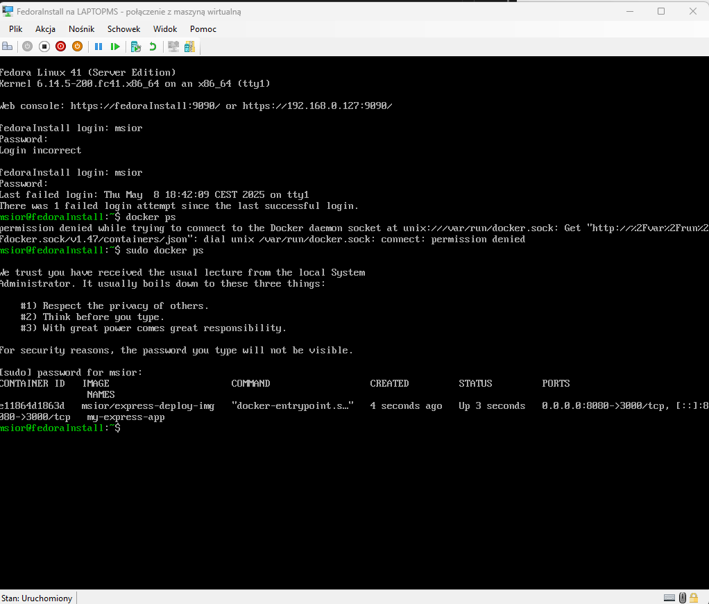

#### Z poziomu roota, można odczytać logi z procesu uruchamianego w sekcji %post (plik /root/kickstart-post.log)


#### Potwierdzenie działania aplikacji


# ĆW 10/11 - Kubernetes

## Instalacja klastra Kubernetesa

#### Pobranie paczki minikube i zainstalowanie.
```sh
curl -LO https://storage.googleapis.com/minikube/releases/latest/minikube-latest.x86_64.rpm
```


#### Uruchomienie minikube (Inicjacja z pobraniem dodatkowych bibliotek i plików)
```sh
minikube start
```
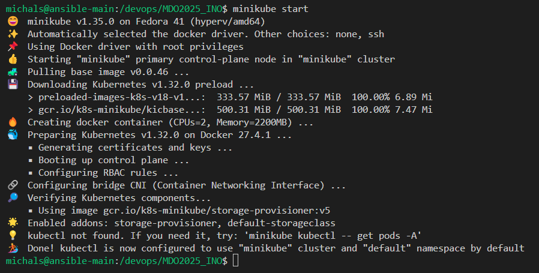

#### Pobranie kubectl z minikube
```sh
minikube kubectl -- get po -A
```
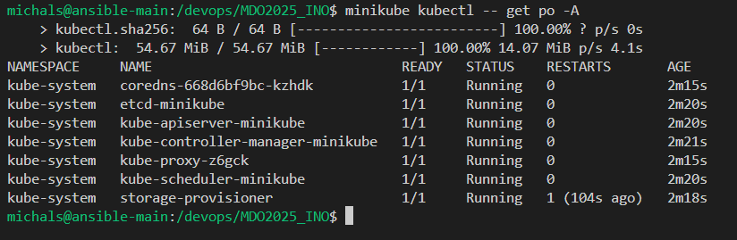

#### Dodanie aliasu w celu ułatwienia pracy i pisania poleceń
```sh
alias kubectl="minikube kubectl --"
```


#### Uruchomienie panelu minikube (Dzięki otwarciu w VSC, Visual automatycznie doda przekierowanie portu, przez co można przejść na link podany w konsoli)
```sh
minikube dashboard
```
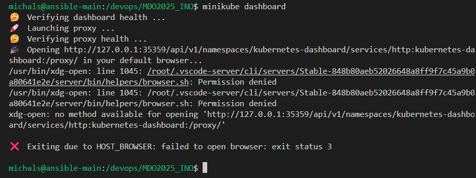

#### Przekeirowanie portów stworzone przez VSC


#### Panel zarządzania k8s


## Przygotowanie i uruchomienie własnej aplikacji na k8s

#### Pobranie aplikacji z docker hub
```sh
docker pull msior/express-deploy-img
```
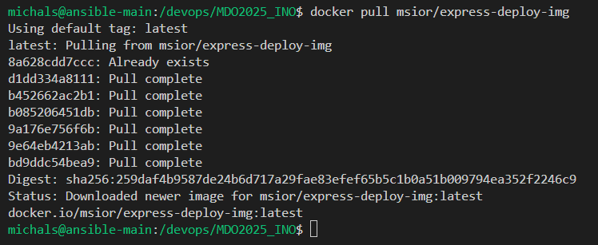

#### Stworzenie pod'a naszej aplikacji (stworzenie pod'a który ma w sobie kontener naszej aplikacji oraz ma wskazany port komunikacyjny, żeby móc komunikować się z aplikacją)
```sh
kubectl run express-single --image=docker.io/msior/express-deploy-img --port=3000 --labels app=express-single
```
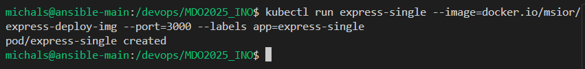

#### Przekierowanie portu, żeby móc przeprowadzić komunikację z pod'em wewnątrz VM.
```sh
kubectl port-forward pod/express-single 3001:3000
```


#### Dodanie przekierowania portów w VSC, żeby działała komunikacja z aplikacją z poziomu komputera rzeczywistego
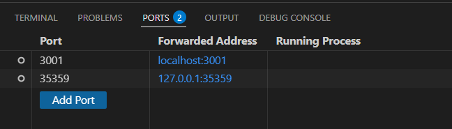

#### Wynik działania. Przeglądarka poprawnie komunikuje się z aplikacją z k8s
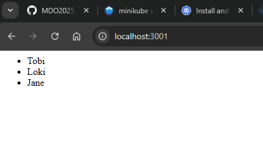

#### W panelu zarządzania również pojawił się wpis o nowym podzie
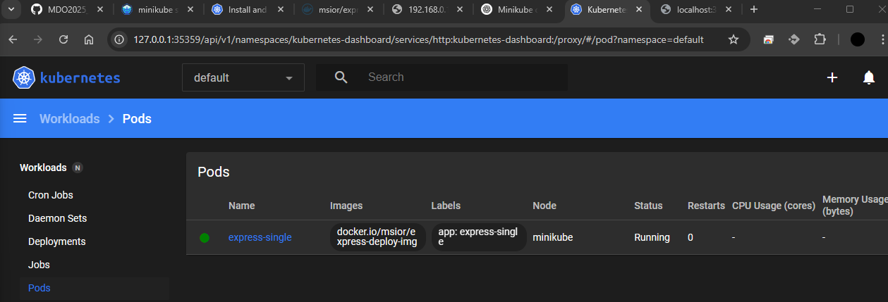

## Przygotowanie wdrożenia

#### Stworzenie wdrożenia na bazie obrazu projektu express
```sh
kubectl create deployment express-depl --image=docker.io/msior/express-deploy-img
```
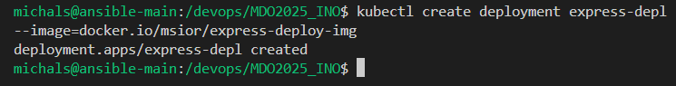

#### Wynik działania na panelu. Obecnie wdrożenie posiada pod sobą jednego pod'a


#### Wystawienie portu do komunikacji z wdrożeniem (stworzenie loadBalancera - service)
```sh
kubectl expose deployment express-depl --type=NodePort --port=3000
```


#### Przekierowanie portu dla umożliwienia komunikacji z poziomu VM
```sh
kubectl port-forward service/express-depl 3002:3000
```
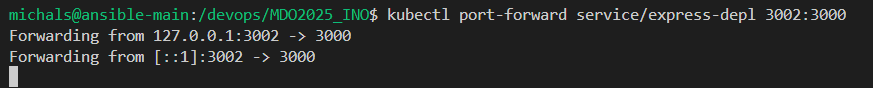

#### Przekierowanie dla umożliwienia komunikacji z poziomu komputera głównego


#### Wynik działania (teraz poprzez loadbalancer zostajemy wrzuceni do jednego z dostępnych podów - obecnie tylko 1 pod)


#### Skalowanie wdrożenia. Na liście klkamy w trzy kropki i wybieramy <i>Scale</i>. Wybieramy teraz ile podów ma być w danym wdrożeniu
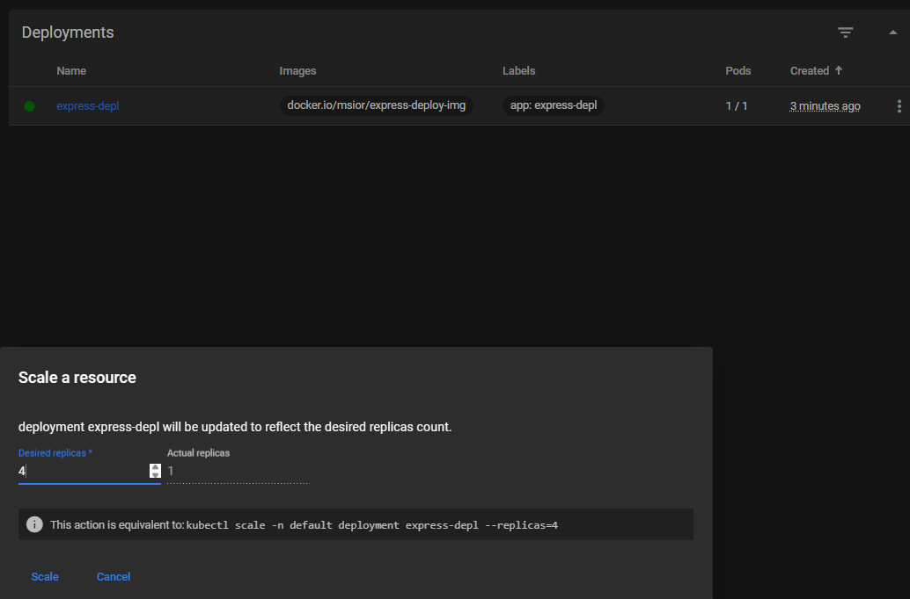

#### Po chwili zostaną utworzone nowe pody (teraz mamy 4/4)


#### Ponowny test działania. Tym razem różnica jest taka, że mogliśmy zostać dołączeni do jednego z 4 podów - w zależności od ustawionego działania servisu i zapchania poszczególnych podów


## Przygotowanie pliku .yaml

#### Wdrożenie manualne można łatwo przerobić na automatyczne poprzez plik .yaml. Podczas tworzenia wdrożenia, plik .yaml był automatycznie rozwijany. Teraz przechodząc do edycji wdrożenia mamy dostęp do konfiguracji - teraz można odwzorować wdrożenie z pliku.


#### Zawartość pliku którą kopiujemy


#### Wklejamy do pliku .yaml na repo. Na początku należy pamiętać, żeby usunąć sekcję <b>status</b>. W pliku można zedytować ilość replik (podów) we wdrożeniu. Zmieniamy na 10


#### Załączamy konfigurację podając plik .yaml
```sh
kubectl apply -f ./ITE/GCL07/MS417562/Sprawozdanie3/3_3/express-depl.yaml
```


#### Po chwili będzie można zaobserwować, że ilość replik została zmieniona na 10
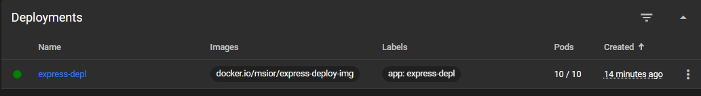

#### Można również sprawdzić status wdrożenia poprzez odpowiednie polecenie
```sh
kubectl rollout status deployment/express-depl
```


## Przygotowanie nowych obrazów pod testy aktualizacji wersji

#### Przygotowanie nowych Dockerfile i zbudowanie obrazów. W aplikacji express zostanie zmieniony return zwracany przez serwer. Przygotowanie nowego pliku bazy danych z lista użytkowników. Plik newDBFile.js

```js
'use strict'

var users = [];

users.push({ name: 'Tobi' });
users.push({ name: 'Loki' });
users.push({ name: 'Jane' });
users.push({ name: 'Michal' });
users.push({ name: 'Test' });

module.exports = users;
```

#### W Dockerfile po sklonowaniu repo podmiana plików za pomocą COPY

```Dockerfile
FROM node:20
WORKDIR /app
RUN git clone https://github.com/expressjs/express.git
WORKDIR /app/express
COPY newDBFile.js ./examples/content-negotiation/db.js
RUN npm install
```

#### Zbudowanie nowego obrazu budowy
```sh
docker build -f Dockerfile.build1 -t express-app-new .
```
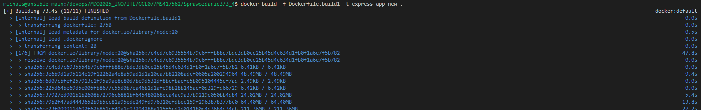

#### Zbudowanie nowego obrazu deploy (nadanie wersji 1.1 w celu odróżnienia)
```sh
docker build -f Dockerfile.deploy1 -t msior/express-deploy-img:1.1 .
```


#### Uruchomienie kontenera na nowym obrazie i przetestowanie działania
```sh
docker run -dit --name test -p 3000:3000 msior/express-deploy-img:1.1 
docker logs test
```
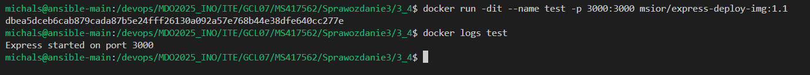
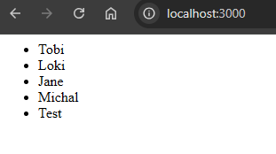

#### Wrzucenie obrazu na docker hub
```sh
docker push msior/express-deploy-img:1.1
```


#### Przygotowanie obrazu który będzie zwracał błąd (Dodanie w entrypoint polecenia false)

```Dockerfile
FROM node:20-slim

COPY --from=express-app-new /app/express /app

WORKDIR /app

CMD ["false"]
```

#### Zbudowanie obrazu jako wersja 1.2
```sh
docker build -f Dockerfile.deploy1 -t msior/express-deploy-img:1.2 .
```


#### Uruchomienie kontenera i przetestowanie działania. Jak widać kontener zwraca, że zakończył pracę z błędem Exited(1)
```sh
docker run -dit --name test2 msior/express-deploy-img:1.2
```
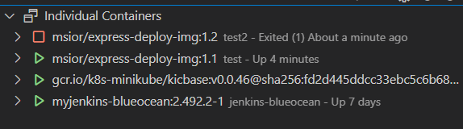

#### Wrzucenie obrazu na docker hub
```sh
docker push msior/express-deploy-img:1.2
```


## Zmiany w deploymencie

#### Na podstawie poprzedniego pliku wdrożenia .yaml ustawienie liczby replik na 8
```sh
kubectl apply -f express-depl.yaml
```


#### Zmiana i ustawienie liczby replik na 1

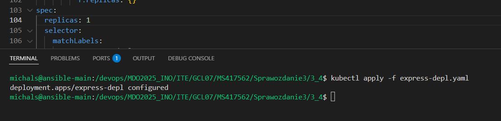

#### Zmiana i ustawienie liczby replik na 0

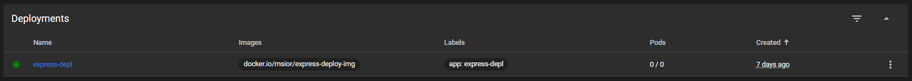

#### Zmiana i ustawienie liczby replik na 1


#### Zmiana i ustawienie liczby replik na 4 oraz zmiana wersji obrazu na nową (1.1). Można zaobserwować, że część podów działa na starej wersji, część uruchomiła się na nowej. Po pewnym czasie, pody ze starą wersją znikają i pozostają tyle te z nową (W tym procesie suma podów przekrana ilość docelowych dla zapewnienia ciągłości działania i testów 'rolling upgrade')

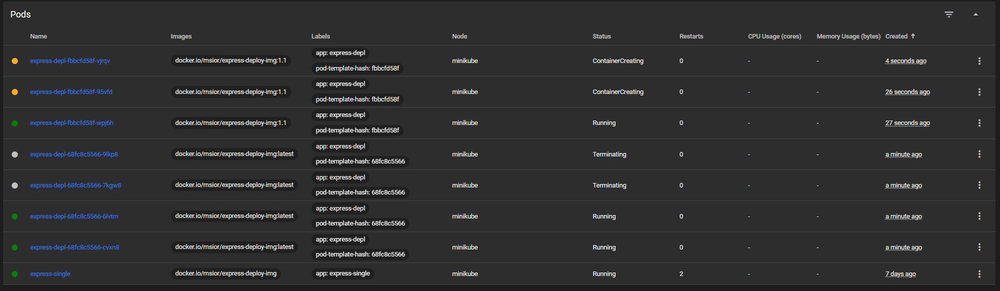


#### Zmiana obrazu na wadliwy i załadowanie wdrożenia. Ponownie pojawi się część pod'ów na nowej wersji. Tym razem pody te nie będą działać, przez co system wróci do pełnego działania na poprzedniej sprawnej wersji, ale pody wadliwe zostaną z informacją o błędzie

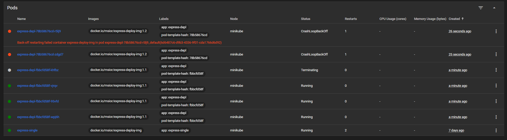


#### Sprawdzenie historii rollout'ów
```sh
kubectl rollout history deployment/express-depl
```


#### Cofnięcie ostatniego rollouta - usunięcie wadliwych pod'ów
```sh
kubectl rollout undo deployment/express-depl 
```
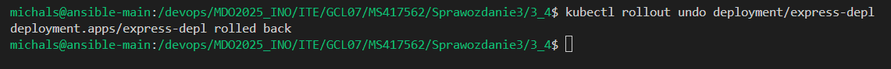
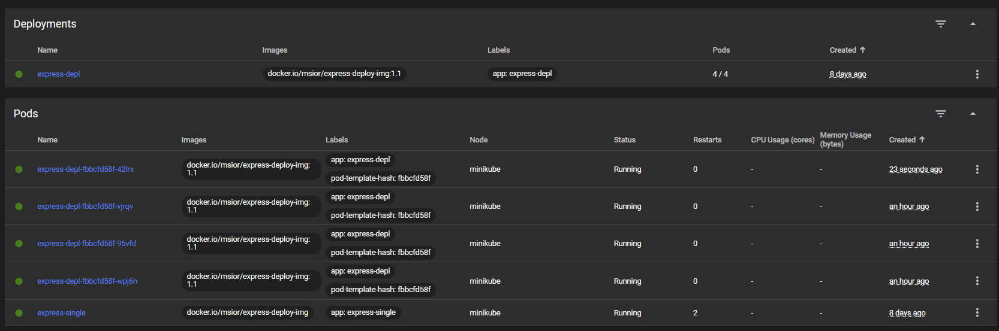

## Skrypt kontroli wdrożeń

#### Stworzenie skryptu z pomocą AI, który sprawdza czy dane wdrożenie się udało w czasie 60 sekund
```sh
#!/bin/bash

DEPLOYMENT=express-depl
NAMESPACE=default
TIMEOUT=60
INTERVAL=5
START_TIME=$(date +%s)

echo "⏳ Sprawdzanie wdrożenia '$DEPLOYMENT' w namespace '$NAMESPACE'..."

until minikube kubectl -- rollout status deployment/$DEPLOYMENT -n $NAMESPACE 2>&1 | grep -q "successfully rolled out"; do
  CURRENT_TIME=$(date +%s)
  ELAPSED=$((CURRENT_TIME - START_TIME))

  if [ $ELAPSED -ge $TIMEOUT ]; then
    echo "❌ Timeout: wdrożenie nie zakończyło się w ciągu $TIMEOUT sekund."
    exit 1
  fi

  sleep $INTERVAL
done

echo "✅ Wdrożenie zakończone sukcesem."
exit 0
```

#### Przetestowanie działania skryptu


## Strategie wdrożenia

#### Przygotowanie plików wdrożeń z 3 różnymi strategiami

#### Canary
```yaml
apiVersion: apps/v1
kind: Deployment
metadata:
  name: express-canary
spec:
  replicas: 4
  selector:
    matchLabels:
      app: express-canary
      version: v1
  template:
    metadata:
      labels:
        app: express-canary
        version: v1
    spec:
      containers:
      - name: express-deploy-img
        image: docker.io/msior/express-deploy-img:latest
        imagePullPolicy: Always
```

#### Recreate
```yaml
apiVersion: apps/v1
kind: Deployment
metadata:
  name: express-recreate
spec:
  replicas: 4
  strategy:
    type: Recreate
  selector:
    matchLabels:
      app: express-recreate
      version: v1
  template:
    metadata:
      labels:
        app: express-recreate
        version: v1
    spec:
      containers:
      - name: express-deploy-img
        image: docker.io/msior/express-deploy-img:latest
        imagePullPolicy: Always
```

#### Rolling
```yaml
apiVersion: apps/v1
kind: Deployment
metadata:
  name: express-rolling
spec:
  replicas: 4
  strategy:
    type: RollingUpdate
    rollingUpdate:
      maxUnavailable: 2
      maxSurge: 30%
  selector:
    matchLabels:
      app: express-rolling
      version: v1
  template:
    metadata:
      labels:
        app: express-rolling
        version: v1
    spec:
      containers:
      - name: express-deploy-img
        image: docker.io/msior/express-deploy-img:latest
        imagePullPolicy: Always
```

#### Załączenie nowych wdrożeń
```sh
kubectl apply -f depl-canary.yaml 
```
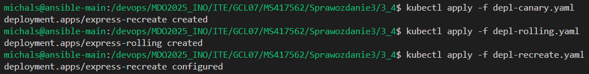

#### Sprawdzenie statusu wdrożenia
```sh
kubectl rollout status deployment/<nazwa_wdrożenia>
```


#### Wynik działania na panelu


### Opis działania strategi:
- Canary - Ręczne sterowanie ruchem - możliwość testów na kilku nowych podach i samodzielna ocena dalszych kroków, ponieważ nie wymusza automatycznego wycofania
- Recreate - Podczas zmiany wszystkie obecne pody zostają usunięte i po chwili podmienione innymi ( w tym czasie następuje brak dostępu do aplikacji)
- Rolling - Stoptniowe wdrażanie. Tworzy kilka nowych podów na nowej wersji i testuje ich działanie. Jeśli wszystko jest ok, podmienia wszystkie pody na nową wersje. Zapewnia to ciągłość działania aplikacji (Ilość generowanych dodatkowych podów można konfigurować)

