# Sprawozdanie 1
**Autor:** Paweł Socała  
**System:** Fedora  
**Wirtualizacja** VirtualBox

<br>

# Lab 1 - Wprowadzenie, Git, Gałęzie, SSH

## Klonowanie repozytorium (https i ssh)

Na początku zainstalowano gita oraz obsługę kluczy ssh. Następnie sklonowano repozytorium przedmiotowe za pomocą https i personal access data.

<br>

Wersja https:
```bash
git clone https://github.com/InzynieriaOprogramowaniaAGH/MDO2025_INO.git
```

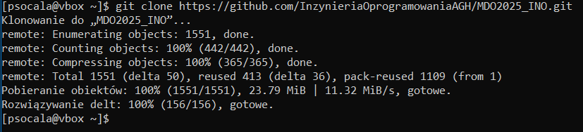

<br>

Wersja ssh:
Najpierw stworzono dwa klucze ssh: jeden z hasłem, a drugi bez hasła.
```bash
ssh-keygen -t ed25519 -C "psocala12@gmail.com"
```

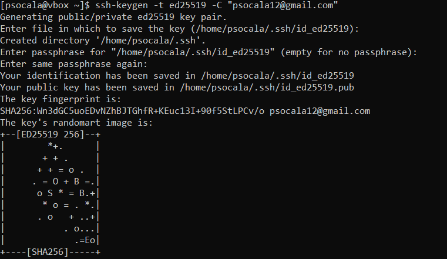


```bash
ssh-keygen -t ecdsa -b 521 -C "psocala12@gmail.com"
```

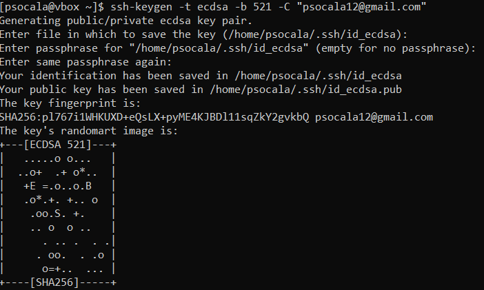

<br>

Po stworzeniu kluczy dodano go do prywatnych kluczy na stronie github. Kolejno uruchomiono agenta ssh oraz dodano do niego klucz co pozwoliło na uwierzytelnienie użytkownika oraz sklonowanie repozytorium przy użyciu ssh.


```bash
eval "$(ssh-agent -s)"
Agent pid 1054
ssh-add ~/.ssh/id_ed25519

git clone git@github.com:InzynieriaOprogramowaniaAGH/MDO2025_INO.git
```

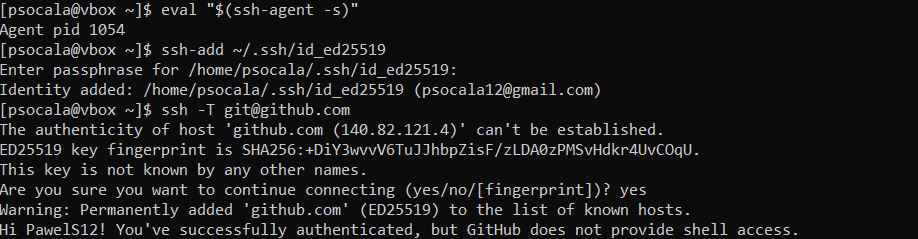

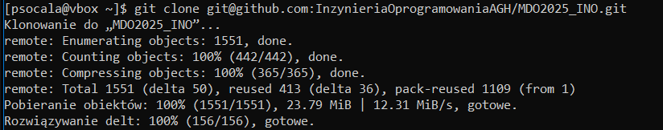

<br>

## Konfiguracja F2A
Konfiguracja F2A:

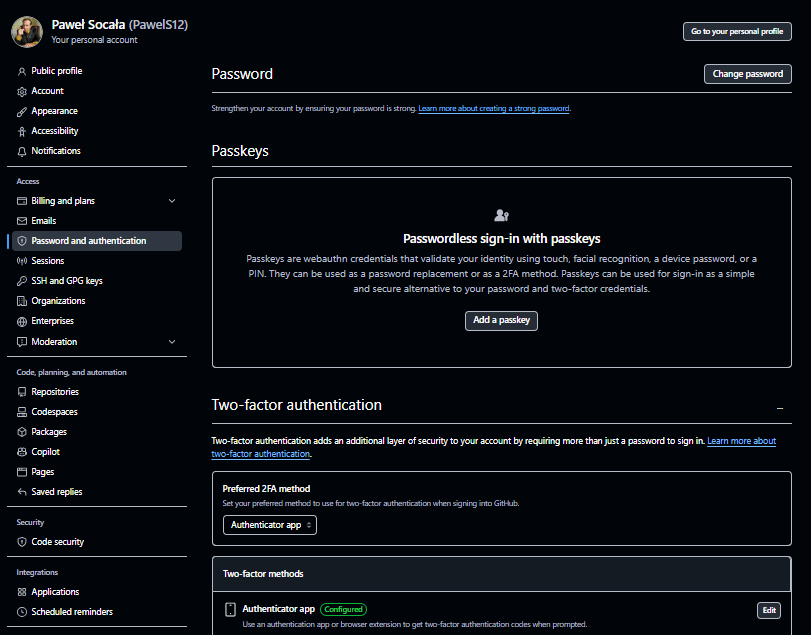

<br>

## Git hook oraz push
Przełączenie na gałąź main, a następnie gałąź GCL07. Po przełączeniu utworzono prywatną gałąź PS417836.

```bash
git checkout main
git checkout GCL07
git branch
git checkout -b PS417836
```

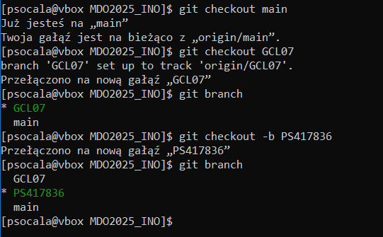

<br>

Następnie stworzono odpowiedni katalog oraz git hooka `commit-msg`, który odpowiada za prawidłową nazwę commitów. 

```bash
mkdir -p GCL07/PS417836
cd GCL07/PS417836
nano commit-msg
chmod +x commit-msg
cp commit-msg ../../.git/hooks/commit.msg
```

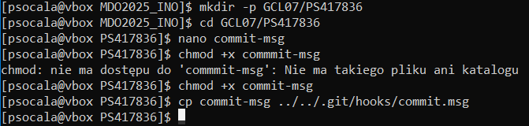

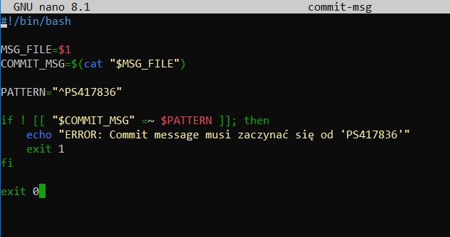


<br>

Na końcu ćwiczeń zatwierdzono i spushowano zmiany do gałęzi grupowej.

```bash
git commit -m "PS417836 sprawozdanie i git hook"
git push origin PS417836
```

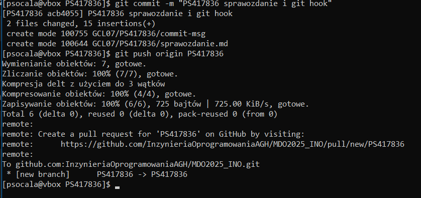

<br>

# Lab 2 - Git, Docker

## Instalacja Dockera
Na początku ćwiczeń zaistalowano dockera w systemie Fedora oraz zarejestrowano się w Docker Hub. 

```bash
sudo docker install -y docker
```

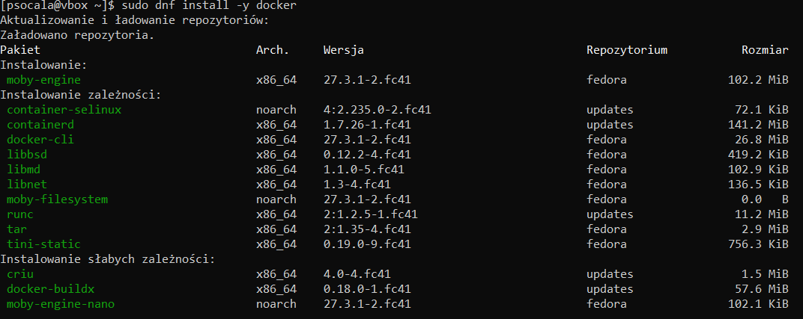

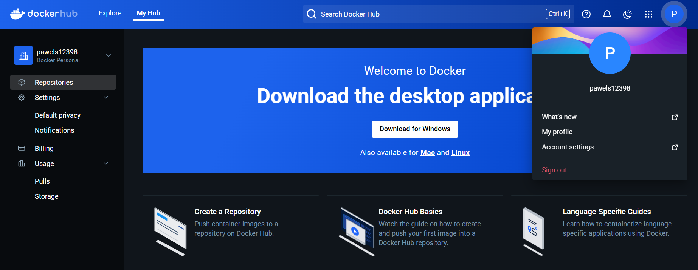

<br>

## Pobranie obrazów
Kolejnym krokirm było pobranie obrazów: hello-world, busybox, ubuntu lub fedora i mysql. Po pobraniu sprawdzono dostępne obrazy. 

```bash
sudo docker pull hello-world
sudo docker pull ubuntu
sudo docker pull mysql
sudo docker pull fedora
sudo docker pull busybox

sudo docker images
```
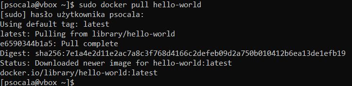
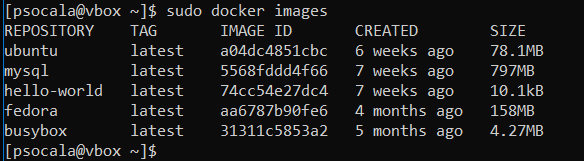

<br>

## Uruchomienie kontenera z obrazem busybox
Uruchomiono kontener interaktywnie oraz sprawdzono wersję.

```bash
sudo docker run -it busybox
busybox --version               # w kontenerze
```
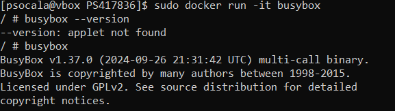

<br>

## System w kontenerze
Uruchomiono obraz Fedory w systemie Fedora. Następnie zaprezentowano procesy oraz zaktualizowano pakiety.

```bash
sudo docker run -it fedora
dnf install procps -y       # w kontenerze
ps -aux                     # w kontenerze
```

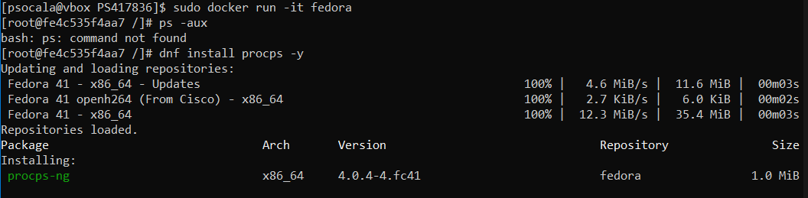
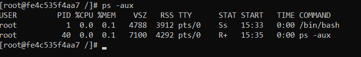
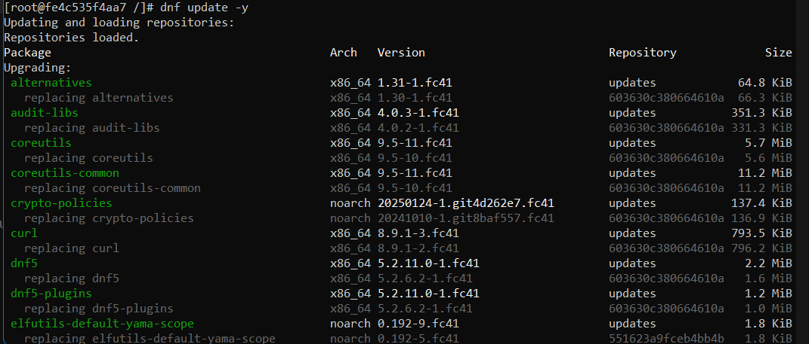

<br>

## Własny Dockerfile
Stworzono plik `Dockerfile`, który następnie zbudowano oraz uruchomiono. Na końcu sprawdzono czy repozytorium przedmiotowe znajduje się wewnątrz kontenera. Plik Dockerfile znajduje się w folderze `lab_2`. 

```bash
sudo docker build -t fedora_my_image
sudo docker run -it fedora_my_image
ls /MMDO2025_INO                    # w kontenerze
```

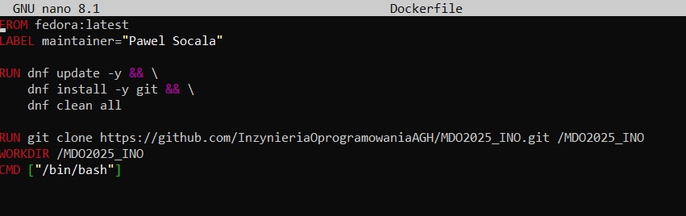

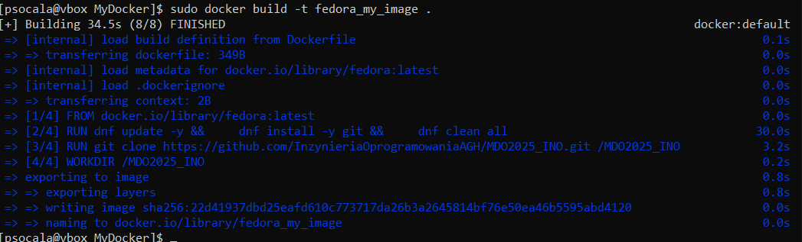

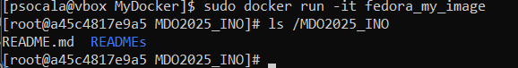

<br>

## Wyczyszczenie aktywnych kontenerów
Na koniec ćwiczeń sprawdzono aktywne kontenery, wyczyszczono je oraz aktywne obrazy. 

*Niestety zgubiłem screeny z widocznym czyszczeniem obrazów oraz kontenerów.*

```bash
sudo docker ps
sudo docker rm fedora_my_image
sudo docker image prune
```

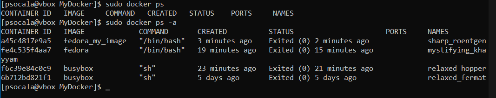

<br>

# Lab 3 - Dockerfiles, kontener jako definicja etapu


# Lab 4 - Dodatkowa terminologia w konteneryzacji, instancja Jenkins
