# Sprawozdanie 1
**Autor:** Paweł Socała  
**System:** Fedora  
**Wirtualizacja** VirtualBox

<br>

# Lab 1 - Wprowadzenie, Git, Gałęzie, SSH

## Klonowanie repozytorium (https i ssh)

Na początku zainstalowano gita oraz obsługę kluczy ssh. Następnie sklonowano repozytorium przedmiotowe za pomocą https i personal access data.

<br>

Wersja https:
```bash
git clone https://github.com/InzynieriaOprogramowaniaAGH/MDO2025_INO.git
```


<br>

Wersja ssh:
Najpierw stworzono dwa klucze ssh: jeden z hasłem, a drugi bez hasła.
```bash
ssh-keygen -t ed25519 -C "psocala12@gmail.com"
```


```bash
ssh-keygen -t ecdsa -b 521 -C "psocala12@gmail.com"
```


<br>

Po stworzeniu kluczy dodano go do prywatnych kluczy na stronie github. Kolejno uruchomiono agenta ssh oraz dodano do niego klucz co pozwoliło na uwierzytelnienie użytkownika oraz sklonowanie repozytorium przy użyciu ssh.


```bash
eval "$(ssh-agent -s)"
Agent pid 1054
ssh-add ~/.ssh/id_ed25519

git clone git@github.com:InzynieriaOprogramowaniaAGH/MDO2025_INO.git
```


<br>

## Konfiguracja F2A
Konfiguracja F2A:


<br>

## Git hook oraz push
Przełączenie na gałąź main, a następnie gałąź GCL07. Po przełączeniu utworzono prywatną gałąź PS417836.

```bash
git checkout main
git checkout GCL07
git branch
git checkout -b PS417836
```


<br>

Następnie stworzono odpowiedni katalog oraz git hooka `commit-msg`, który odpowiada za prawidłową nazwę commitów. 

```bash
mkdir -p GCL07/PS417836
cd GCL07/PS417836
nano commit-msg
chmod +x commit-msg
cp commit-msg ../../.git/hooks/commit.msg
```


<br>

Na końcu ćwiczeń zatwierdzono i spushowano zmiany do gałęzi grupowej.

```bash
git commit -m "PS417836 sprawozdanie i git hook"
git push origin PS417836
```


<br>

# Lab 2 - Git, Docker

## Instalacja Dockera
Na początku ćwiczeń zaistalowano dockera w systemie Fedora oraz zarejestrowano się w Docker Hub. 

```bash
sudo docker install -y docker
```


<br>

## Pobranie obrazów
Kolejnym krokirm było pobranie obrazów: hello-world, busybox, ubuntu lub fedora i mysql. Po pobraniu sprawdzono dostępne obrazy. 

```bash
sudo docker pull hello-world
sudo docker pull ubuntu
sudo docker pull mysql
sudo docker pull fedora
sudo docker pull busybox

sudo docker images
```


<br>

## Uruchomienie kontenera z obrazem busybox
Uruchomiono kontener interaktywnie oraz sprawdzono wersję.

```bash
sudo docker run -it busybox
busybox --version               # w kontenerze
```


<br>

## System w kontenerze
Uruchomiono obraz Fedory w systemie Fedora. Następnie zaprezentowano procesy oraz zaktualizowano pakiety.

```bash
sudo docker run -it fedora
dnf install procps -y       # w kontenerze
ps -aux                     # w kontenerze
```


<br>

## Własny Dockerfile
Stworzono plik `Dockerfile`, który następnie zbudowano oraz uruchomiono. Na końcu sprawdzono czy repozytorium przedmiotowe znajduje się wewnątrz kontenera. Plik Dockerfile znajduje się w folderze `lab_2`. 

```bash
sudo docker build -t fedora_my_image
sudo docker run -it fedora_my_image
ls /MMDO2025_INO                    # w kontenerze
```


<br>

## Wyczyszczenie aktywnych kontenerów
Na koniec ćwiczeń sprawdzono aktywne kontenery, wyczyszczono je oraz aktywne obrazy. 

*Niestety zgubiłem screeny z widocznym czyszczeniem obrazów oraz kontenerów.*

```bash
sudo docker ps
sudo docker rm fedora_my_image
sudo docker image prune
```


<br>

# Lab 3 - Dockerfiles, kontener jako definicja etapu
Do wykonania ćwiczeń wybrano repozytrium irssi: https://github.com/irssi/irssi

<br>

## Repozytorium irssi poza kontenerem
Na początku ćwiczeń sklonowano repozytroium irssi poza kontenerem, zainstalowano potrzebne zależności oraz przeprowadzono build programu wraz z testami.

```bash
git clone https://github.com/irssi/irssi.git
cd irssi
sudo dnf install -y make automake autoconf gcc-c__ pkg-config ncurses-devel openssl-devel curl-devel perl-devel glib2-devel

ninja -C build
ninja -C build test
```
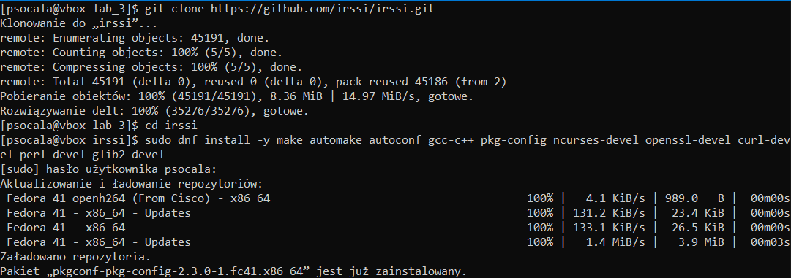

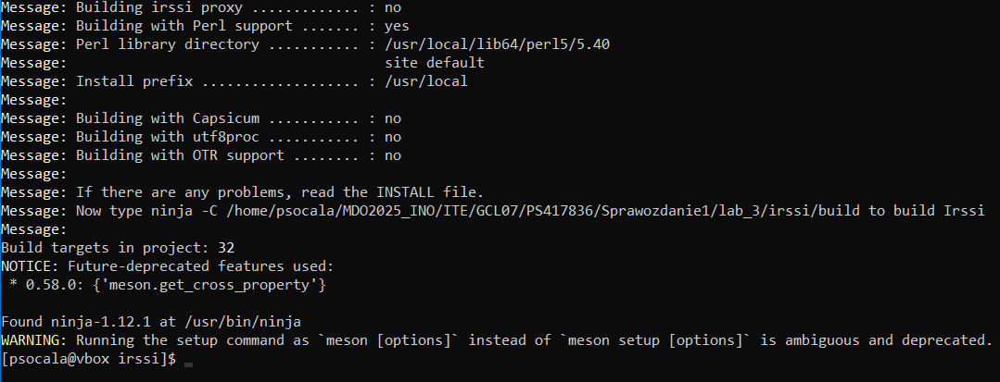

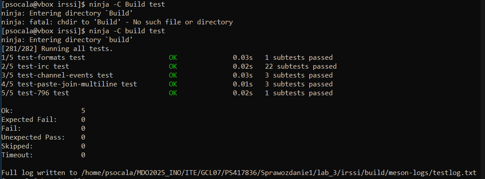

<br>

## Build irssi za pomocą stworzonych Dockerfiles

Na początku stworzono pliki `Dockerfile` oraz `Dockerfile.test` (bazujący na `Dockerfile`). Pliki znajdują się w folderze `lab_3/docker_irssi`. 


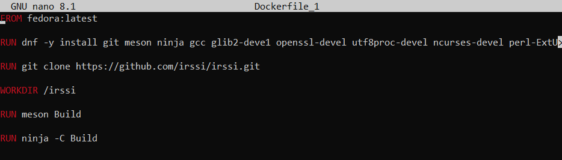

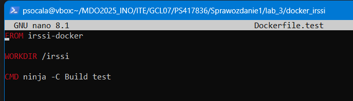

<br>

Następnie wykonano build oraz testy na kontenerze.

```bash
sudo docker run -it --name irssi-build-container irssi-docker /bin/bash

sudo docker build -t irssi-test -f Dockerfile.test .
```
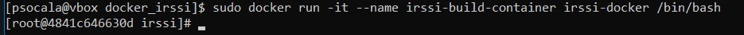

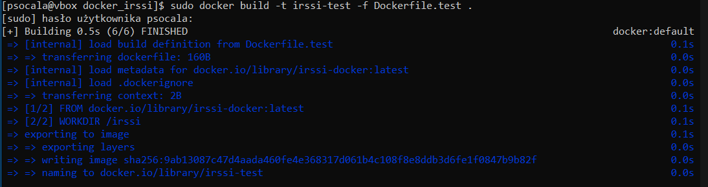

> W samym kontenerze pracuje instancja systemu oraz wszystkie zależności i aplikacje potrzebne do działania. 


<br>

# Lab 4 - Dodatkowa terminologia w konteneryzacji, instancja Jenkins

## Stworzenie woluminów oraz kontenera bazowego
Na początku ćwiczeń stworzono dwa woluminy: wejscie oraz wyjscie.

```bash
sudo docker volume create wejscie
sudo docker volume create wyjscie
```
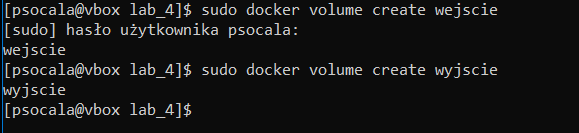

Następnie stworzono kontener bazowy `Dockerfile.irssivolumes` do połączenia go z woluminami. Na tym etapie kontener nie posiada zależności git ani repozytrium irssi.

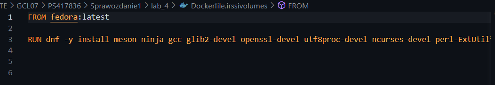

<br>

## Sklonowanie repozytrium na wolumin wejściowy
Na początku tego kroku przeniesiono sie do folderu `/_data` wewnątrz woluminu i sklonowano do niego repozytrium irssi. Kolejno wykonano build oraz run kontenera razem z woluminami.

```bash
cd /var/lib/docker/volumes/wejscie/_data
git clone https://github.com/irssi/irssi.git

sudo docker build -t irssi-volumes -t Dockerfile.irssivolues .

sudo docker run -it --rm wejscie:/input -v wyjscie:/output irssi-volues /bin/bash
```
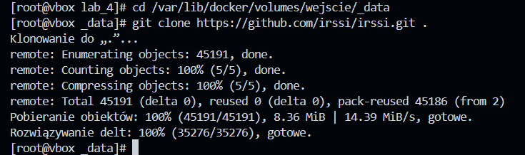

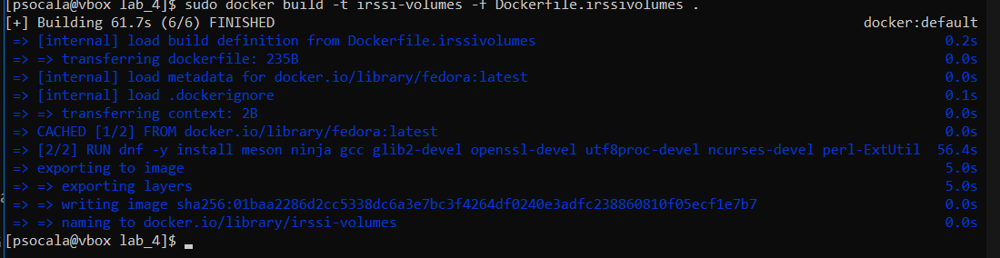

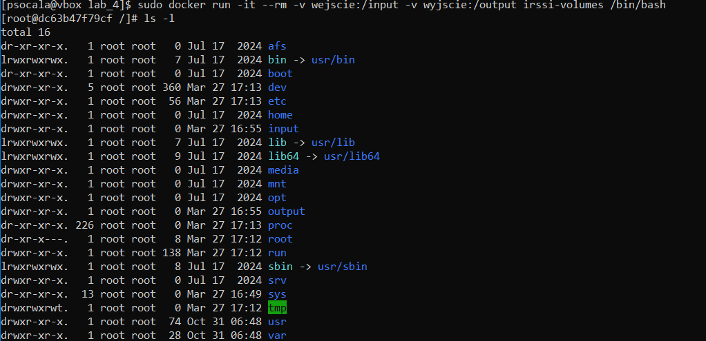

<br>

## Zapisanie plików do woluminu wyjściowego
Aby zbudowane pliki były dostępne poza kontenerem zapisano je w woluminie wyjściowym. Na końcu sprawdzono czy pliki rzeczywiście dostępne są poza kontenerem.

```bash
ninja -C /output

ls -ls /var/lib/docker/volumes/wyjscie/_data
```


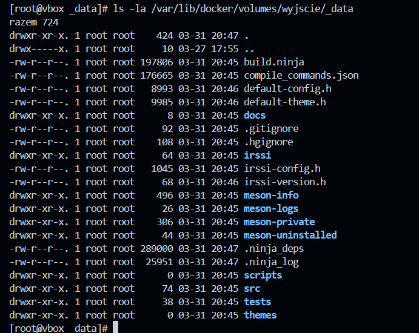

<br>

## Eksponowanie portu, serwer iperf3
Na początku uruchomiono wewnątrz kontenera serwer iperf3, połączono się z nim za pomocą drugiego kontenera oraz zbadano ruch.

```bash
cd lab_4
ls
docker pull networkstatic/iperf3
docker run -it -d --name iperf3-server -p 5201:5201 networkstatic/iperf3 -s

docker run -it --name iperf3-client networkstatic/iperf3 -c 172.17.0.2
```
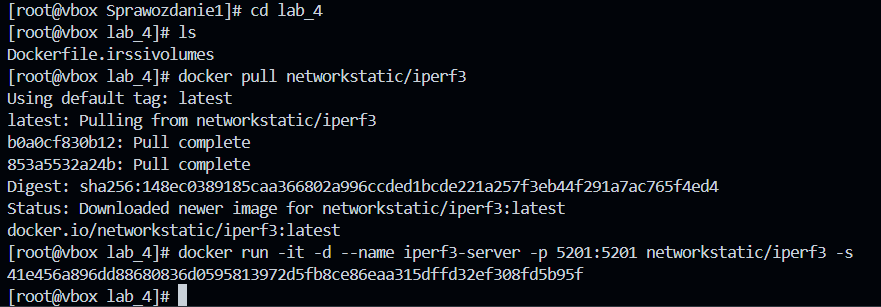

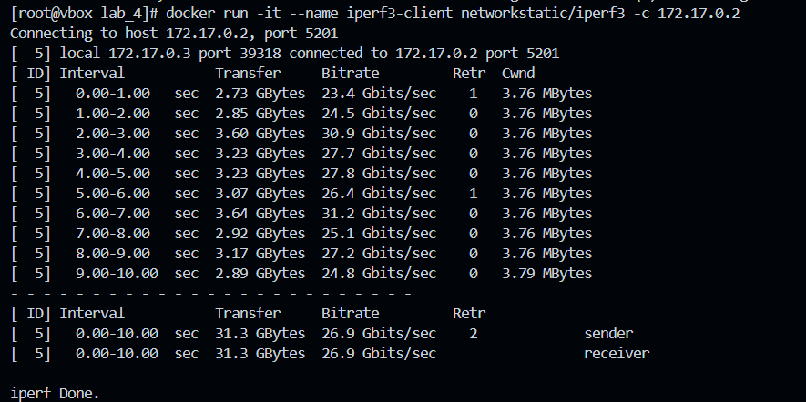

<br>

## Eksponowanie portu, stworzenie sieci
W tym etapie stworzono customową sieć oraz dodano do niej nowe kontenery.

```bash
docker rn -d --name iperf3-server-net iperf3-network networkstatic/iperf3 -s

docker run -it --name iperf3-client-net --network iperf3-network networkstatic/iperf3 -c iperf3-server-net
```
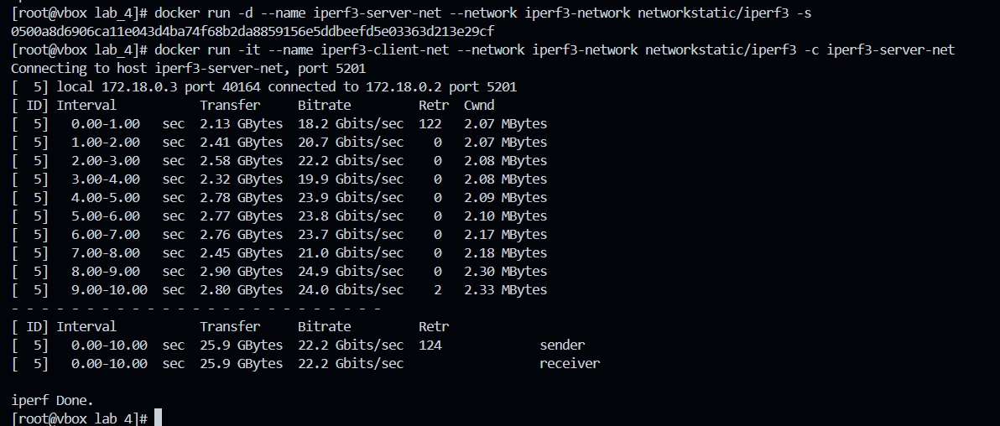

<br>

## Przepustowość komunikacji
Sprawdzono przepustowość komunikacji między kontenerami w sieci poprzez ukazanie logów.

```bash
docker logs iperf3-server-net
```
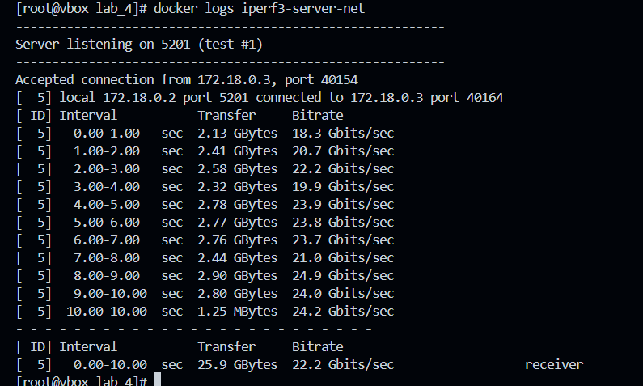

<br>

## Jenkins, inicjalizacja
Na początku zapoznano się z dokuentacją Jenkinsa, a następnie przeprowadzono instalację. Plik `Docker.jenkins` znajduje się w folderze `lab_4`.

```bash
docker network create jenkins
docker build -f Dockerfile.jenkins -t myjenkins-blueocean:2.492.2-1 .

docker run \
  --name jenkins-blueocean \
  --restart=on-failure \
  --detach \
  --network jenkins \
  --env DOCKER_HOST=tcp://docker:2376 \
  --env DOCKER_CERT_PATH=/certs/client \
  --env DOCKER_TLS_VERIFY=1 \
  --publish 8080:8080 \
  --publish 50000:50000 \
  --volume jenkins-data:/var/jenkins_home \
  --volume jenkins-docker-certs:/certs/client:ro \
  myjenkins-blueocean:2.492.2-1

  docker ps -a
```
Stworzenie sieci Jenkins:
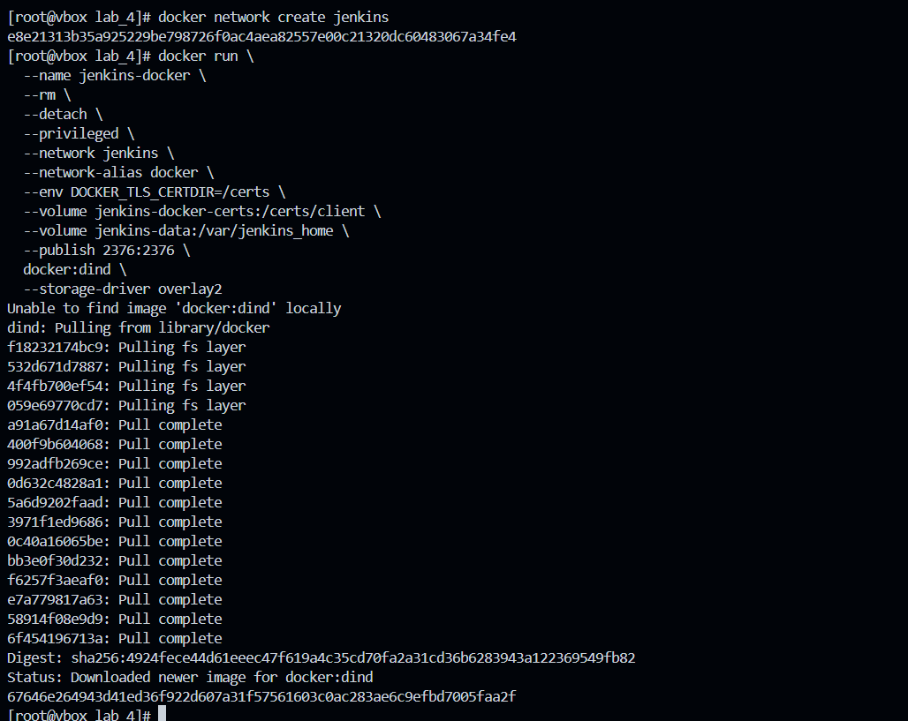

Stworzenie obrazu:
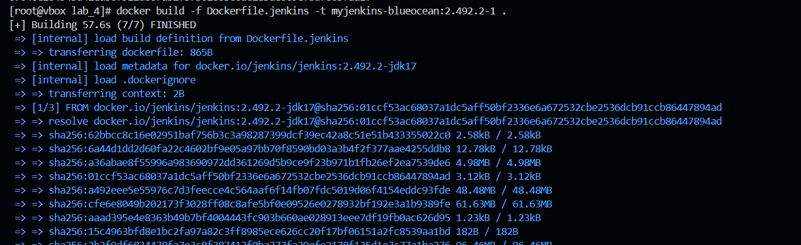

Uruchomienie kontenera z pomocą DIND:
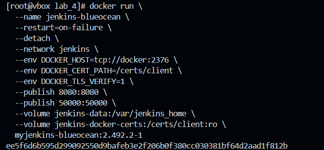

Sprawdzenie czy kontener jest uruchomiony:
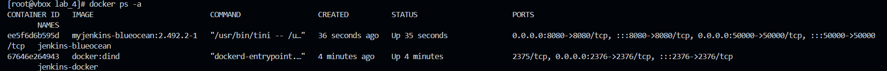

<br>

## Jenkins w przeglądarce
W tym etapie otworzono Jenkinsa w przeglądarce za pomocą adresu: https://localhost:8080


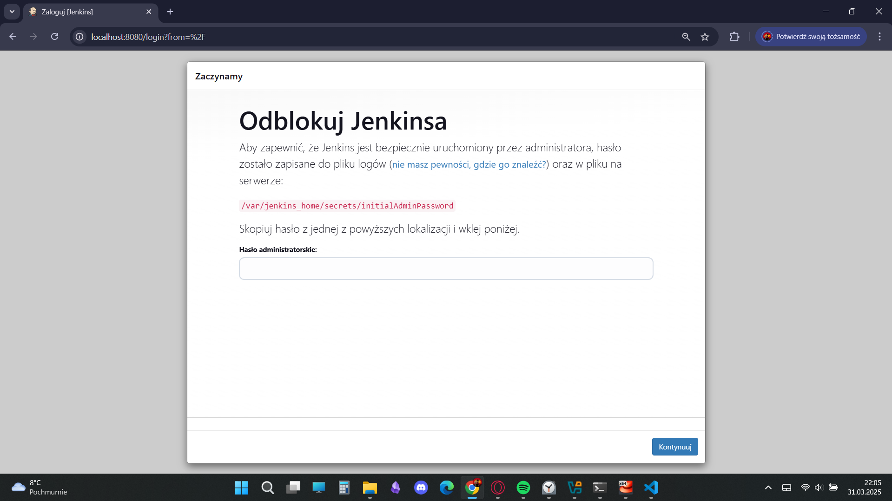  
<br>
Następnie zdobyto hasło do logowania i zalogowano się na stronie.

```bash
sudo cat /var/lib/docker/volumes/jenkins-data/_data/secret/initialAdinPassword
```


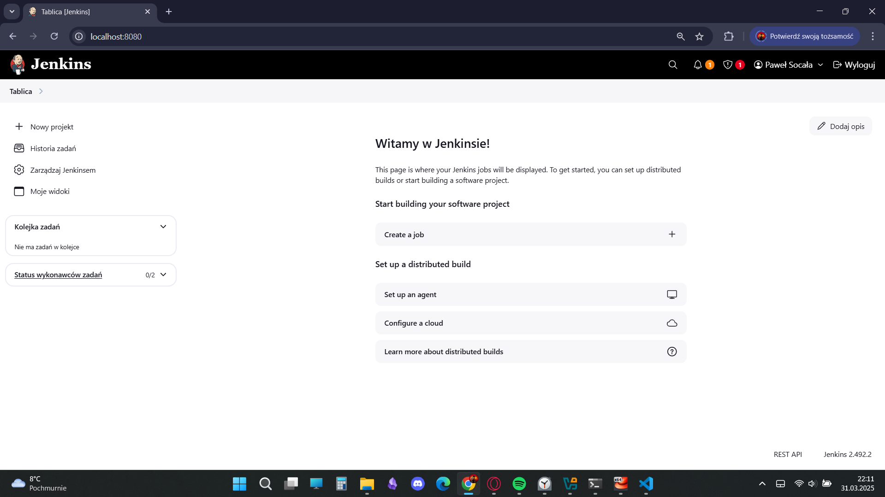
