# Sprawozdanie 2
**Autor:** Paweł Socała  
**System:** Fedora  
**Wirtualizacja** VirtualBox

<br>
<br>

# Lab 5 - Pipeline, Jenkins, izolacja etapów

<br>

## Stworzenie instancji Jenkins


<br>

Na początku stworzono sieć mostkową.
```bash
sudo docker network create jenkins
sudo docker network ls
```

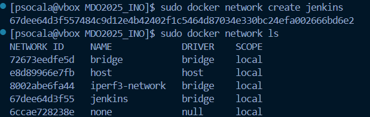

<br>

Następnie uruchomiono poocnika DIND zgodnie z dokumentacją na stronie: https://www.jenkins.io/doc/book/installing/docker/
```bash
sudo docker run \
--name jenkins-docker \
--detach \
--privileged \
--network jenkins \
--network-alias docker \
--env DOCKER_TLS_CERTDIR=/certs \
--volume jenkins-docker-certs:/certs/client \
--volume jenkins-data:/var/jenkins_home \
--publish 2376:2376 \
docker:dind \
--storage-driver overlay2
```
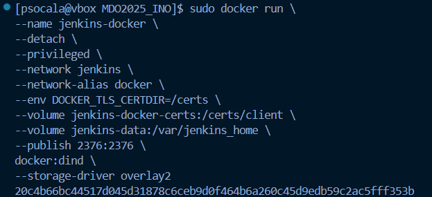

<br>

Kolejnym krokiem było stworzenie pliku `Dockerfile.jenkins` oraz uruchomienie budowania obrazu. Plik dostępny jest w katalogu `Sprawozdanie2`. 

```bash
FROM jenkins/jenkins:2.492.2-jdk17
USER root
RUN apt-get update && apt-get install -y lsb-release ca-certificates curl && \
    install -m 0755 -d /etc/apt/keyrings && \
    curl -fsSL https://download.docker.com/linux/debian/gpg -o /etc/apt/keyrings/docker.asc && \
    chmod a+r /etc/apt/keyrings/docker.asc && \
    echo "deb [arch=$(dpkg --print-architecture) signed-by=/etc/apt/keyrings/docker.asc] \
    https://download.docker.com/linux/debian $(. /etc/os-release && echo \"$VERSION_CODENAME\") stable" \
    | tee /etc/apt/sources.list.d/docker.list > /dev/null && \
    apt-get update && apt-get install -y docker-ce-cli && \
    apt-get clean && rm -rf /var/lib/apt/lists/*
USER jenkins
RUN jenkins-plugin-cli --plugins "blueocean docker-workflow"

sudo docker build -f ./Dockerfile.jenkins -t myjenkins .
```

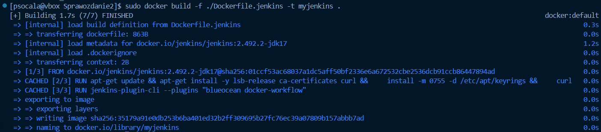

<br>

Na końcu uruchomiono kontener.

```bash
sudo docker run \
  --name jenkins-blueocean \
  --restart=on-failure \
  --detach \
  --network jenkins \
  --env DOCKER_HOST=tcp://docker:2376 \
  --env DOCKER_CERT_PATH=/certs/client \
  --env DOCKER_TLS_VERIFY=1 \
  --publish 8080:8080 \
  --publish 50000:50000 \
  --volume jenkins-data:/var/jenkins_home \
  --volume jenkins-docker-certs:/certs/client:ro \
  myjenkins
```

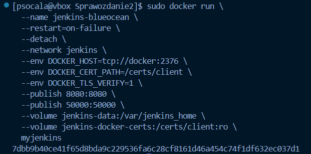

<br>

Po utworzeniu i uruchomieniu kontenera skonfigurowanio Jenkinsa w przeglądarce pod adresem: http://127.0.0.1:8080/

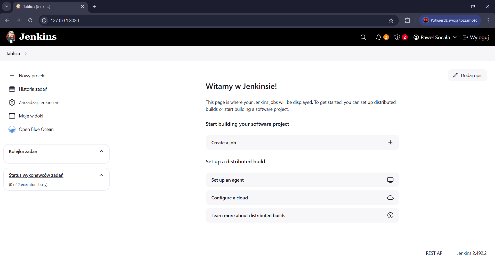

<br>

## Zadanie wstępne: uruchomienie

W tym etapie laboratorium stworzono 3 projekty:

1. Wyświetlanie uname
```bash
uname -a
```
<br>

2. Funkcja do sprawdzania parzystości godziny
```bash
HOUR=$(date +%H)
if [ $((HOUR % 2)) -ne 0 ]; then
  echo "Godzina: ($HOUR) jest nieparzysta."
  exit 1
else
  echo "Godzina: ($HOUR) jest parzysta."
fi
```
<br>

3. Pobranie obrazu ubuntu
```bash
docker pull ubuntu
```
<br>

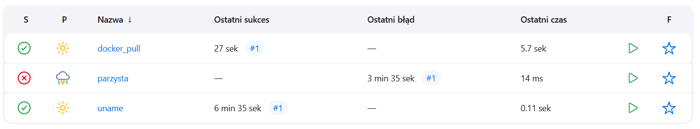
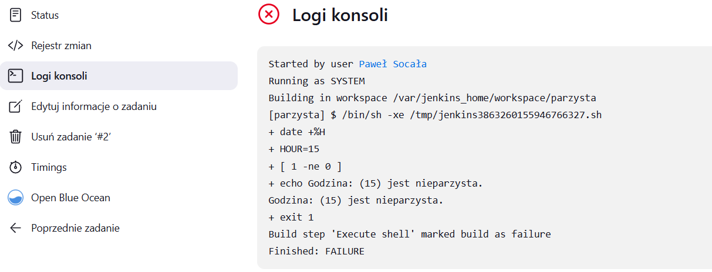

<br>

## Zadanie wstępne: obiekt typu pipeline

Obiekt pipeline służący do czyszczenia środowiska, sklonowania repozytorium przedmiotu oraz checkout'u na osobistą gałąź. Pipeline uruchomiony wielokrotnie działa bez zarzutów.

```bash
pipeline {
    agent any

    stages {
        stage('Clean') {
            steps {
                cleanWs()
                sh 'docker image rm -f irssi-docker irssi-test'
                sh 'docker builder prune -a -f'
            }
        }
        
        stage('Git clone') {
            steps {
                git url: 'https://github.com/InzynieriaOprogramowaniaAGH/MDO2025_INO.git', branch: 'PS417836'
            }
        }
        
        stage('Build') {
            steps {
                dir('ITE/GCL07/PS417836/Sprawozdanie1/lab_3/docker_irssi') {
                    sh 'docker build -f Dockerfile -t irssi-docker .'
                }
            }
        }
        
        stage('Build test') {
            steps {
                dir('ITE/GCL07/PS417836/Sprawozdanie1/lab_3/docker_irssi') {
                    sh 'docker build -f Dockerfile.test -t irssi-test .'
                }
            }
        }
    }
}
```

<br>


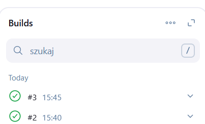

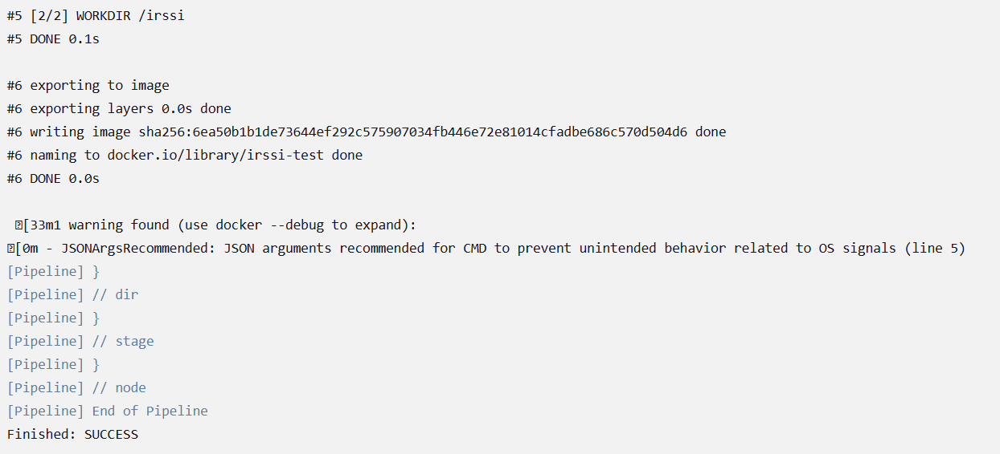


<br>
<br>

# Lab 6 - Pipeline: lista kontrolna i Lab 7 - Jenkinsfile

<br>

## Diagram UML, przedstawiający plan na wdrożenie

Obraz diagramu został wygenerowany przez Chat GPT na podstawie podanych kroków pipeline.

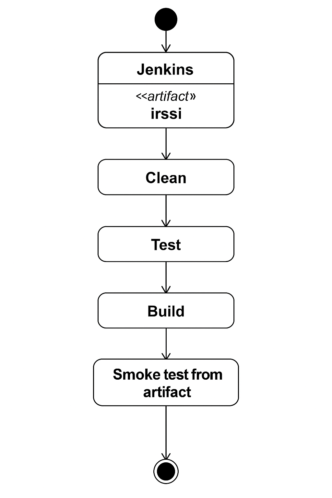

Pipeline będzie tworzył paczkę .deb, dalatego stworzono nowe pliki Dockera tak, aby używały one Ubuntu zamiast Fedory jak było dotychczas. 

<br>

Plik `Dockerfile.irssibuild`

Instaluje wszystkie niezbędne narzędzia i biblioteki do budowy irssi z kodu źródłowego. W efekcie końcowym plik konfiguruje i kompiluje projekt irssi.

```bash
FROM ubuntu:latest

RUN apt-get update && \
    apt-get install -y git meson build-essential ninja-build pkg-config \
    libglib2.0-dev libssl-dev perl libncurses-dev
ENV USER=root

WORKDIR /build

RUN git clone https://github.com/irssi/irssi.git

WORKDIR /build/irssi

RUN meson Build

RUN ninja -C Build
```

<br>

Plik `Dockerfile.irssitest`

Plik wykonuje testy jednostkowe dla irssi.

```bash
FROM build-irssi:latest

WORKDIR /build/irssi

RUN meson test -C Build
```

<br>

Plik `build.sh`

Plik nicjalizuje strukturę pakietu .deb za pomocą dh_make. Tworzy plik debian/rules, który definiuje jak budować pakiet przy użyciu systemu meson. W efekcie końcowym plik tworzy pakiet .deb oraz kopiuje go do katalogu /out.

```bash
dh_make --single --createorig -c gpl3 --email "bw@example.com" --yes

cat << 'EOF' > debian/rules
#!/usr/bin/make -f

%:
    dh \$@ --buildsystem=meson
EOF

chmod +x debian/rules

debuild -us -uc

mv ../*.deb /out
```

<br>

## Stworzenie pipelinu

### Część 1 - clean

Ta część pipeline'u usuwa wszystkie nieużywane zasoby Dockera: zatrzymane kontenery, nieużywane obrazy, nieużywane woluminy, nieużywane sieci oraz usuwa stare paczki .deb i stare logi.

```bash
stage('Clean') {
	steps {
       sh 'docker system prune -f'
       sh '''
          find . -name "*.deb" -delete || true
          find . -name "*.log" -delete || true
       '''
	}
}
```

<br>

### Część 2 - build

Ten etap buduje obraz Dockera z aplikacją irssi na podstawie pliku `Dockerfile.irssibuild`, który został wcześniej przedstawiony.

```bash
stage('Build') {
	steps {
		dir('ITE/GCL07/PS417836/Sprawozdanie2') {
			sh 'docker build --no-cache -t build-irssi -f Dockerfile.irssibuild .'
		}
	}
}
```

<br>

### Część 3 - test

Ten etap buduje obraz testowy test-irssi, który uruchamia testy jednostkowe aplikacji irssi na bazie wcześniej zbudowanego obrazu build-irssi i zapisuje wynik do pliku .log, który jest archiwizowany jako artefakt.

```bash
stage('Test') {
	steps {
		dir('ITE/GCL07/PS417836/Sprawozdanie2') {
			sh 'docker build --no-cache --progress=plain -t test-irssi -f Dockerfile.test . 2>&1 | tee test-output.log'
			sh "mv test-output.log test-logs-${BUILD_NUMBER}.log"
		}
	}
	post {
		always {
			dir('ITE/GCL07/PS417836/Sprawozdanie2') {
				archiveArtifacts artifacts: "test-logs-${BUILD_NUMBER}.log", fingerprint: true
			}
		}
	}
}
```

<br>

### Część 4 - build artifact

Ten etap buduje końcowy pakiet .deb z aplikacją irssi, a następnie zapisuje go jako artefakt pipeline’u. W środku tego obrazu uruchamiany jest build_irssi.sh (skrypt opisywany był we wcześniejszych krokach).

```bash
stage('Build Artifact') {
	steps {
		dir('ITE/GCL07/PS417836/Sprawozdanie2') {
			sh "docker build --no-cache -t artifact-irssi --build-arg VERSION=${BUILD_NUMBER} -f Dockerfile.deb ."
			sh 'docker run --rm -v .:/out artifact-irssi'
		}
	}
	post {
		always {
			dir('ITE/GCL07/PS417836/Sprawozdanie2') {
				archiveArtifacts artifacts: '*.deb', fingerprint: true
			}
		}
	}
}
```

<br>

### Część 5 - smoke test

Etap Smoke Test przeprowadza szybką, podstawową weryfikację zbudowanego pakietu .deb, aby sprawdzić, czy: instaluje się bez błędów, aplikacja irssi faktycznie się uruchamia.

```bash
stage('Smoke Test') {
		steps {
			dir('ITE/GCL07/PS417836/Sprawozdanie2') {
				script {
					sh '''
						docker run --rm --user=root -v ".:/deb" ubuntu:latest bash -c '
						apt-get update
  
						DEB_FILE=$(find /deb -name "*.deb" | head -n 1)
						dpkg -i "$DEB_FILE" || true
						apt-get install -f -y
  
						irssi --version
					'
				'''
			}
		}
	}
}
```

<br>

### Cały pipeline

Plik `Jenkinsfile`
```bash
pipeline {
    agent any
    
	stages {
		stage('Clean') {
        	steps {
               sh 'docker system prune -f'
               sh '''
                  find . -name "*.deb" -delete || true
                  find . -name "*.log" -delete || true
               '''
        	}
        }
	  
		stage('Build') {
        	steps {
        		dir('ITE/GCL07/PS417836/Sprawozdanie2') {
        			sh 'docker build --no-cache -t build-irssi -f Dockerfile.irssibuild .'
        		}
        	}
        }
	
		stage('Test') {
        	steps {
        		dir('ITE/GCL07/PS417836/Sprawozdanie2') {
        			sh 'docker build --no-cache --progress=plain -t test-irssi -f Dockerfile.test . 2>&1 | tee test-output.log'
        			sh "mv test-output.log test-logs-${BUILD_NUMBER}.log"
        		}
        	}
        	post {
        		always {
        			dir('ITE/GCL07/PS417836/Sprawozdanie2') {
        				archiveArtifacts artifacts: "test-logs-${BUILD_NUMBER}.log", fingerprint: true
        			}
        		}
        	}
        }
	
		stage('Build Artifact') {
        	steps {
        		dir('ITE/GCL07/PS417836/Sprawozdanie2') {
        			sh "docker build --no-cache -t artifact-irssi --build-arg VERSION=${BUILD_NUMBER} -f Dockerfile.deb ."
        			sh 'docker run --rm -v .:/out artifact-irssi'
        		}
        	}
        	post {
        		always {
        			dir('ITE/GCL07/PS417836/Sprawozdanie2') {
        				archiveArtifacts artifacts: '*.deb', fingerprint: true
        			}
        		}
        	}
        }
	
		stage('Smoke Test') {
        		steps {
        			dir('ITE/GCL07/PS417836/Sprawozdanie2') {
        				script {
        					sh '''
        						docker run --rm --user=root -v ".:/deb" ubuntu:latest bash -c '
        						apt-get update
          
        						DEB_FILE=$(find /deb -name "*.deb" | head -n 1)
        						dpkg -i "$DEB_FILE" || true
        						apt-get install -f -y
          
        						irssi --version
        					'
        				'''
        			}
        		}
        	}
        }
	}
    post {
        always {
			echo "Pipeline complete with status: ${currentBuild.currentResult}"
		}
	}
}
```

<br>

### Ustawienia projektu pipeline w Jenkins
W ramach konfiguracji projektu typu pipeline w Jenkinsie, dodano ustawienie umożliwiające pobieranie definicji procesu CI/CD bezpośrednio z systemu kontroli wersji. W tym celu w sekcji „Pipeline” wybrano opcję Pipeline script from SCM.

Tak skonfigurowany projekt Jenkins automatycznie pobiera kod źródłowy z repozytorium, a następnie uruchamia pipeline zgodnie z instrukcjami zawartymi w pliku Jenkinsfile.

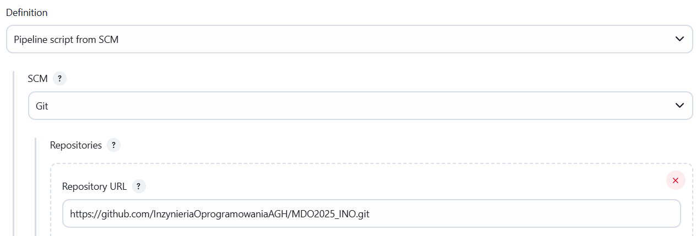

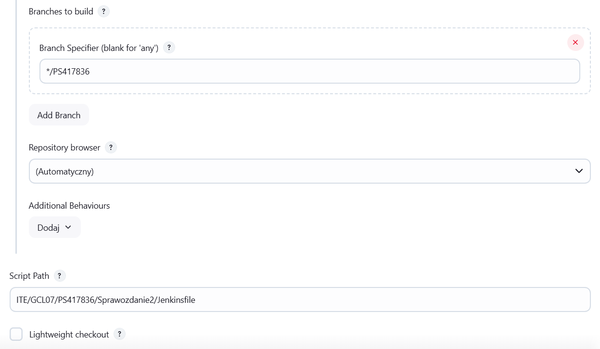

<br>

### Uruchomienie projektu

