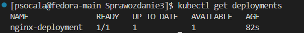

# Sprawozdanie 3
**Autor:** Paweł Socała  
**System:** Fedora  
**Wirtualizacja** VirtualBox

*Wszystkie stworzone pliki znajdują się w folderze Sprawozdanie3.
<br>
<br>

# Lab 8 - Ansible

<br>

## Instalacja zarządcy Ansible


<br>

Na początku utworzono nową maszyne wirtualną na obrazie Fedory. Podczas instalacji utworzono użytkownika o nazwie ansible.


<br>

---

Po instalacji uruchomiono maszynę dodano nazwę hosta oraz zainstalowano pakiety tar i openSSH. 


```bash
sudo hostnamectl set-hostname ansible-target
exec bash

sudo dnf install tar openssh
```


<br>

---

Na końcu dodano migawkę, czyli zapisano obecny stan maszyny.


<br>

---

W kolejnym etapie zainstalowano Ansible na głównej maszynie.

```bash
sudo dnf install ansible
```


<br>

---

Wymiana kluczy:

Na początku wygenerowano klucze ssh na głównej maszynie.

```bash
ssh-keygen -f ~/.ssh/id_rsa_ansible
```


<br>

Sprawdzono adres ip maszyny Ansible oraz dodano go do pliku `/etc/hosts`.

```bash
ip a
sudo nano /etc/hosts
```


<br>

Na końcu wykonano wymianę kluczy za pomocą polecena ssh-copy-id oraz połączono się poprzez ssh bez wpisywania hasła.

```bash
ssh-copy-id -i ~/.ssh/id_rsa_ansible.pub ansible@ansible-target

ssh ansible@ansible-target
```


<br>

## Inwentaryzacja


<br>

Zmiana nazwy głównej maszyny na `fedora-main`.
```bash
sudo hostnamectl set-hostname fedora-main
exec bash
```


<br>

Kolejno dodano jeszcze adres maszyny fedora-main do pliku `/etc/hosts`.


<br>

---
Utworzenie pliku inwetnaryzacji `inventory.ini`:

```bash
touch inventory.ini
nano inventory.ini
```


Następnie wysłano ping do wszystkich hostów z pliku inventory.ini za pomocą modułu ping z ansible. Żądanie wyoknało się prawidłowo.


<br>

## Zdalne wywoływanie procedur


<br>

Kolejnym etapem było utworzenie pliku `playbook.yml`.

```bash
touch playbook.yml
nano playbook.yml
```

<br>


<br>

Piewrsze uruchomienie playbooka- błąd przy aktualizacji ponieważ sudo wymaga hasła.

```bash
ansible-playbook -i inventory.ini playbook.yml
```


<br>

Drugie uruchomienie - dodano flagę -K, przez którą wpisujemy hasło do hosta na początku wykonania oraz zainstalowano pakiet rng na ansible-target.

```bash
ansible-playbook -i inventory.ini playbook.yml -K
```


<br>

Test maszyny z wyłączoną kartą sieciową na maszynie ansible-target. Ansible nie był w stanie nawiązać połączenia.

```bash
sudo systemctl stop sshd
ansible-playbook -i inventory.ini playbook.yml -K

sudo systemctl start sshd # ponowne włączenie sshd na ansible-target
```


<br>

## Zarządzanie stworzonym artefaktem

<br>

Moja aplikacja to irssi. Artefakt to paczka .deb.

Struktura plików .yml:

```
install_irssi/
├── playbook.yml
└── roles/
    ├── install_docker/
    │   └── tasks/
    │       └── main.yml
    └── install_irssi/
        └── tasks/
            └── main.yml
```

<br>

Install docker `main.yml`:

Ten playbook sprawdza, czy Docker jest zainstalowany na maszynie docelowej, wykonując polecenie which docker. Jeśli Docker nie jest znaleziony (kod wyjścia różny od 0), to instaluje wymagane pakiety dnf-plugins-core i docker za pomocą menedżera pakietów dnf. Następnie niezależnie od tego, czy Docker był wcześniej zainstalowany, upewnia się, że usługa Docker jest uruchomiona i włączona do autostartu. Na koniec wykonuje polecenie docker --version, aby potwierdzić poprawną instalację i działanie Dockera.

```bash
- name: Check if Docker is installed
  command: which docker
  register: docker_check
  ignore_errors: true

- name: Install Docker on Fedora
  block:
    - name: Install required packages
      dnf:
        name:
          - dnf-plugins-core
          - docker
        state: present
        update_cache: true
  when: docker_check.rc != 0

- name: Ensure Docker service is started and enabled
  service:
    name: docker
    state: started
    enabled: true

- name: Verify Docker installation
  command: docker --version

```

<br>

Install irssi `main.yml`:

Ten playbook kopiuje pakiet irssi na maszynę zdalną, usuwa istniejący kontener o nazwie irssi-cont, a następnie tworzy nowy kontener z obrazem Ubuntu, w którym instaluje aplikację z przesłanego pakietu .deb. Po instalacji sprawdza, czy program działa poprawnie, wywołując jego wersję. Dzięki temu irssi jest uruchomione w środowisku kontenera Docker.

```bash
- name: Send .deb application to remote
  copy:
    src: irssi_1.0-1_amd64.deb
    dest: /tmp/irssi_1.0-1_amd64.deb

- name: Remove existing container if exists
  shell: docker rm -f irssi-cont || true

- name: Create container
  command: docker run -dit --name irssi-cont ubuntu:latest sleep infinity

- name: Update apt
  command: docker exec irssi-cont apt-get update


- name: Copy .deb file into the container
  command: docker cp /tmp/irssi_1.0-1_amd64.deb irssi-cont:/tmp/app.deb


- name: Install .deb app inside the container
  command: docker exec irssi-cont bash -c "dpkg -i /tmp/app.deb || apt-get install -f -y"


- name: Run application
  command: docker exec irssi-cont irssi --version
  register: app_status
  failed_when: app_status.rc != 0
  changed_when: false
```


Główny plik `playbook.yml`:

Ten playbook uruchamia zadania na grupie hostów Endpoints, wykonując je z podwyższonymi uprawnieniami (become: yes). Korzysta z kolekcji community.docker, co umożliwia używanie modułów związanych z Dockerem. Playbook wywołuje dwie role: install_docker oraz install_irssi. Dzięki temu cały proces wdrożenia Dockera oraz aplikacji jest zautomatyzowany i uporządkowany.

```bash
- name: Deploy docker and irssi
  hosts: Endpoints
  become: yes
  collections:
    - community.docker
  roles:
    - install_docker
    - install_irssi
```

<br>

Uruchomienie playbooka:

```bash
ansible-playbook -i inventory.ini install_irssi/playbook.yml -K
```


<br>
<br>

# Lab 9 - Pliki odpowiedzi dla wdrożeń nienadzorowanych
<br>

## Plik odpowiedzi

Na początku skopiowano plik odpowiedzi do folderu Sprawozdanie3 oraz nadano uprawnienia do modyfikacji tego pliku.

```bash
sudo cp /root/anaconda-ks.cfg /home/psocala/MDO2025_INO/ITE/GCL07/PS417836/Sprawozdanie3

sudo chmod +777 anaconda-ks.cfg
```

<br>

Modyfikacje:

Dodanie repozytoriów Fedory:

```bash
url --mirrorlist=http://mirrors.fedoraproject.org/mirrorlist?repo=fedora-41&arch=x86_64
repo --name=updates --mirrorlist=http://mirrors.fedoraproject.org/mirrorlist?repo=updates-released-f41&arch=x86_64
```

Założenie czystego dysku i formatowanie całości:

```bash
clearpart --all --initlabel
```
Ustawienie hostname:

```bash
network  --bootproto=dhcp --device=eth0 --ipv6=auto --activate --hostname=host-p-odpowiedzi
```

<br>

Cały plik anaconda-ks.cfg po modyfikacjach:

```bash
# Generated by Anaconda 41.35
# Generated by pykickstart v3.58
#version=DEVEL

# Keyboard layouts
keyboard --vckeymap=pl --xlayouts='pl'
# System language
lang pl_PL.UTF-8

network  --bootproto=dhcp --device=eth0 --ipv6=auto --activate --hostname=host-p-odpowiedzi

url --mirrorlist=http://mirrors.fedoraproject.org/mirrorlist?repo=fedora-41&arch=x86_64
repo --name=updates --mirrorlist=http://mirrors.fedoraproject.org/mirrorlist?repo=updates-released-f41&arch=x86_64

%packages
@^custom-environment

%end

# Run the Setup Agent on first boot
firstboot --enable

# Generated using Blivet version 3.11.0
ignoredisk --only-use=sda
autopart
# Partition clearing information
clearpart --all --initlabel

# System timezone
timezone Europe/Warsaw --utc

# Root password
rootpw --iscrypted --allow-ssh $y$j9T$EdlH0qTbCbkj9gMAkuj5uRDm$IiKbwuXZzs4aMwX82qfx4BsD3c0HCTeK0YOtfNw8wy0
```

<br>

Po dodaniu pliku do repozytorium przedmiotowego znajdujemy go i kopiujemy jego link. Następnie za pomocą narzędzie tinyurl zmniejszamy go aby łatwiej było wpisać go w virtualbox'ie.

```bash
https://tinyurl.com/44f7zd8y
```

<br>

---
Proces instalacji systemu:

Na początku standardowo rozpoczynamy instalacje maszyny z obrazem Fedory. Kolejno w oknie bootownia wybieramy klawisz e i wpisujemy skrócony link naszego pliku.


<br>

Ukończona instalacja systemu.


<br>

## Instalacja własnej aplikacji

<br>

Opis zmian pliku anaconda-ks:

Plik Kickstart automatyzuje instalację systemu Fedora 41, ustawiając polskie środowisko, sieć i użytkownika psocala z odpowiednimi uprawnieniami. Po zainstalowaniu podstawowych pakietów, w tym flatpak, pobiera on z serwera Jenkins plik instalacyjny Irssi w formacie Flatpak, wykorzystując do tego uwierzytelnienie loginem i tokenem API. Następnie instaluje ten pakiet oraz dodaje do pliku startowego użytkownika polecenie automatycznego uruchamiania Irssi po zalogowaniu. Całość kończy się automatycznym restartem systemu, co pozwala na szybkie i powtarzalne wdrożenie gotowego środowiska z preinstalowanym i działającym programem Irssi.

<br>

Plik anaconda-ks.cfg po modyfikacjach:

```bash
#version=DEVEL
# Generated by Anaconda 41.35
# Generated by pykickstart v3.58

keyboard --vckeymap=pl --xlayouts='pl'
lang pl_PL.UTF-8

url --mirrorlist=http://mirrors.fedoraproject.org/mirrorlist?repo=fedora-41&arch=x86_64
repo --name=updates --mirrorlist=http://mirrors.fedoraproject.org/mirrorlist?repo=updates-released-f41&arch=x86_64

ignoredisk --only-use=sda
clearpart --all --initlabel
autopart

network  --hostname=anacondatest

timezone Europe/Warsaw --utc

rootpw --iscrypted --allow-ssh $y$j9T$EdlH0qTbCbkj9gMAkuj5uRDm$IiKbwuXZzs4aMwX82qfx4BsD3c0HCTeK0YOtfNw8wy0
user --groups=wheel --name=psocala --password=$y$j9T$DKKrBZ/DTxGfL3nY47qmyLG9$4SuT5/d/Fnol7AFh/LhKFTwQW7fVMY.bII6hFc6YK57 --iscrypted --gecos="Paweł Socała"

%packages
@^server-product-environment
xdg-utils
dbus
fuse
wget
curl
flatpak
systemd
%end

firstboot --enable

%post
set -x
exec > /root/postinstall.log 2>&1

# Dodanie repozytorium Flathub (opcjonalne, można usunąć jeśli niepotrzebne)
flatpak remote-add --if-not-exists flathub https://flathub.org/repo/flathub.flatpakrepo

# Pobranie pliku .deb z Jenkinsa
curl -u psocala123:117ce25d6ce85c17ed3126f230f30e9d6a \
  -o /tmp/irssi.deb \
  "http://192.168.0.25:8080/job/irssi_pipeline_v2/lastSuccessfulBuild/artifact/irssi_6.0.0-1_amd64.deb"

# Instalacja pakietu .deb
dnf install -y /tmp/irssi.deb

# Dodanie autostartu irssi w .bash_profile użytkownika
mkdir -p /home/psocala
echo 'irssi' >> /home/psocala/.bash_profile
chown psocala:psocala /home/psocala/.bash_profile

# Usunięcie pobranego pliku
rm -f /tmp/irssi.deb

%end

reboot
```

<br>
<br>

# Lab 10 - Wdrażanie na zarządzalne kontenery: Kubernetes (1)
<br>

## Instalacja klastra Kubernetes

Na początku pobrano implementacje minikube oraz przeprowadzono instalację. 

```bash
curl -LO https://storage.googleapis.com/minikube/releases/latest/minikube_latest_amd64.deb

sudo dpkg -i minikube_latest_amd64.deb
```


<br>

---
Następnie uruchomiono minikube oraz zainstalowano klienta kubernetes.

```bash
minikube start --driver=docker
```


<br>

---

Kolejnym krokiem było uruchomineie dashboard w przeglądarce.

```bash
minikube dashboard
```


<br>

Możemy zauważyć że polecenie dashboard powoduje automatyzczne przekierowanie portu.


<br>

---

Kolejnym krokiem było utworzenie pod'a nginx ponieważ moją wybraną aplikacją było irssi która nie posiada interfejsu graficznego.

```bash
kubectl run nginx-pod --image=nginx --port=80 --labels app=nginx-pod
```


<br>

Teraz po uruchomieniu dashboarda widać nasz pod nginx. Można go zoabczyć równieć po wpisaniu polecenia poniżej.

```bash
kubectl get pods
```


<br>

## Wyprowadzenie portu

Kolejnym krokiem było uworzenie tunelu przekierowując porty. Po ucuhomieniu poniższego polecenia dodano port w visual studio oraz uruchomiono nginx w przeglądarce.

```bash
minikube kubectl -- port-forward pod/nginx-pod 3000:80
```


## Przekucie wdrożenia manualnego w plik wdrożenia (wprowadzenie)

Na początku stworzono plik wdrożenia `nginx-deploy.yaml`, a następnie wdrożono plik.

```bash
#plik

apiVersion: apps/v1
kind: Deployment
metadata:
  name: nginx-deployment
  labels:
    app: nginx
spec:
  replicas: 1
  selector:
    matchLabels:
      app: nginx
  template:
    metadata:
      labels:
        app: nginx
    spec:
      containers:
      - name: nginx
        image: nginx:1.14.2
        ports:
        - containerPort: 80

# wdrożenie
kubectl apply -f ./nginx-deploy.yaml
```


<br>

---
Sprawdzenie deploymentu:

1) Za pomocą polecenia:
```bash
kubectl get deployments
```



<br>

2) W dashboard


<br>

## Deployment 4 replik

Aby zmienić ilość replik wystarczy zmienić wartość w linii: replicas: 4 oraz nazwę wdrożenia. 

Poprawiony plik .yaml:

```bash
# plik

apiVersion: apps/v1
kind: Deployment
metadata:
  name: nginx-deployment-2
  labels:
    app: nginx
spec:
  replicas: 4
  selector:
    matchLabels:
      app: nginx
  template:
    metadata:
      labels:
        app: nginx
    spec:
      containers:
      - name: nginx
        image: nginx:1.14.2
        ports:
        - containerPort: 80

# wdrożenie
kubectl apply -f ./nginx-deploy.yaml
```


<br>

---
 
Sprawdzenie stanu nowego wdrożenia za pomocą rollout status oraz sprawdzenie dashboard.

```bash
kubectl rollout status deployment/nginx-deployment-2
```


<br>

## Wyeksportowanie wdrożenia jako serwis

W tym etapie tworzymy serwis z naszego wdrożenia, aby uzyskąć uniwersalny interfejs.

```bash
kubectl expose deployment nginx-dep --port=3001 --target-port=80
```


<br>

Teraz za pomocą polecenia sprawdzamy czy seriws jest uruchomiony.

```bash
kubectl get service
```


<br>

---
Teraz eksponujemy serwis za pomocą port-forwarding. Po uruchomieniu polecenia dodajemy port w visual studio oraz sprawdzamy czy adres działa w przeglądarce.

```bash
kubectl port-forward service/nginx-dep 3002:3001
```


<br>
<br>

# Lab 11 - Wdrażanie na zarządzalne kontenery: Kubernetes (2)
<br>

## Stworzenie nowych kontenerów

Na początku tworzymy dockera, który nie będzie działał prawidłowo: plik Dockerfile.bad.

```bash
FROM nginx:latest

ENTRYPOINT ["false"]
```

<br>

Kolejno budujemy obraz oraz wgrywamy go do minikube. Kolejno sprawdzamy czy obraz znajduje się w minikube.

```bash
docker build -t nginx:bad -f Dockerfile.bad .

minikube image load nginx:bad

minikube ssh
crictl images
```


<br>

## Zmiany w deploymencie

Zamian dokonywano z poziomu dashboarda modyfikując deployment z poprzednich laboratoriów.

1) Zwiększenie replik do 8


<br>

2) Zmniejszenie replik do 1 

Z czasem pody oznaczone na biało znikają i zostaje tylko 1.


<br>

3) Zmniejszenie replik do 0


<br>

4) Ponowne przeskalowanie do 4


<br>

5) Zmiana wersji obrazu - nowa wersja 1.27.5


<br>

6) Zmiana wersji obrazu - stara wersja 1.14.2


<br>

7) Zmiana obrazu na nginx:bad, który stworzono na początku zajęć.

Widać, że pody nie działają.


<br>

## Przywrócenie poprzednich wersji deploymentu

```bash
kubectl rollout undo deployment nginx-deployment-2
```


<br>

Po rolloucie pody powróciły do poprzedniego stanu.


<br>

## Kontrola wdrożenia

W tym kroku utworzono skrypt `deploy.sh`.

```bash
#!/bin/bash
echo "Wdrozenie w trakcie dzialania"

if minikube kubectl -- rollout status deployment nginx-deploy -n default --timeout=60s; then
  echo "Wdrozenie zakonczone prawidlowo."
else
  echo "Wdrozenie nie powiodlo sie."
  exit 1
fi
```

<br>

Aby móc przetestować skrypt użyto polecenia chmod.

```bash
chmod +x deploy.sh
kubectl apply -f ./nginx-deploy.yaml
./deploy.sh
```


<br>

## Różne strategie wdrożenia

1) Strategia recreate

Strategia ta usuwa wszystkie kontenery w tym samym czasie i tworzy nowe. W pliku .yaml zmieniono wersję nginx:1.27.5

```bash
apiVersion: apps/v1
kind: Deployment
metadata:
  name: nginx-deployment-2
  labels:
    app: nginx
    strategy: recreate
spec:
  replicas: 4
  strategy:
    type: Recreate
  selector:
    matchLabels:
      app: nginx
  template:
    metadata:
      labels:
        app: nginx
    spec:
      containers:
      - name: nginx
        image: nginx:1.27.5
        ports:
        - containerPort: 80
```
<br>

Działąjące pody ze zmienioną wersją:


<br>

---

2) Strategia Rolling Update

Nowe pody powstają seriami. Zmieniono werjsję nginx na 1.26.0

```bash
apiVersion: apps/v1
kind: Deployment
metadata:
  name: nginx-deployment-2
  labels:
    app: nginx
    strategy: recreate
spec:
  replicas: 4
  strategy:
    type: RollingUpdate
    rollingUpdate:
      maxUnavailable: 2
      maxSurge: 25%
  selector:
    matchLabels:
      app: nginx
  template:
    metadata:
      labels:
        app: nginx
    spec:
      containers:
      - name: nginx
        image: nginx:1.26.0
        ports:
        - containerPort: 80
```


<br>

---

3) Strategia Canary Deployment workload

Przy tej strategii tworzymy nowy plik: `nginx-canary.yaml`. W pliku dodajemy label "track: canry"

```bash
apiVersion: apps/v1
kind: Deployment
metadata:
  name: nginx-dep-canary
  labels:
    app: nginx
    track: canary
spec:
  replicas: 1
  selector:
    matchLabels:
      app: nginx
  template:
    metadata:
      labels:
        app: nginx
    spec:
      containers:
        - name: nginx
          image: nginx:1.27.5
          ports:
          - containerPort: 80
```
<br>

Pod canary działa oraz widać jego wdrożenie.


<br>

Jednak gdy wejdziemy w zakładkę Service, zauważymy, że jest tam nadal jeden serwis, ze wszystkimi naszymi podami. Jest tak, ponieważ serwis filtruje pody na podstawie labeli (w tym przypadku label app: nginx).


<br>

---

**Podsumowanie strategii:**

Recreate to najprostsza strategia, w której wszystkie stare Pody są najpierw usuwane, a następnie tworzone są nowe. Powoduje to krótką przerwę w działaniu aplikacji, ponieważ przez pewien czas żaden Pod nie jest dostępny. 

Rolling Update to domyślna i najczęściej używana strategia w Kubernetes. Polega na stopniowym zastępowaniu starych Podów nowymi. Dzięki temu aplikacja zachowuje ciągłość działania. 

Canary Deployment to bardziej zaawansowana strategia wdrożeniowa, w której nowa wersja aplikacji jest wdrażana tylko do części użytkowników, np. 5–10% ruchu. Pozwala to na bezpieczne testowanie nowej wersji w rzeczywistym środowisku bez wpływu na wszystkich użytkowników. 