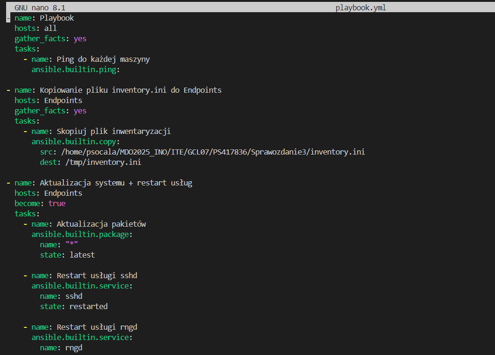

# Sprawozdanie 3
**Autor:** Paweł Socała  
**System:** Fedora  
**Wirtualizacja** VirtualBox

<br>
<br>

# Lab 8 - Ansible

<br>

## Instalacja zarządcy Ansible


<br>

Na początku utworzono nową maszyne wirtualną na obrazie Fedory. Podczas instalacji utworzono użytkownika o nazwie ansible.


<br>

---

Po instalacji uruchomiono maszynę dodano nazwę hosta oraz zainstalowano pakiety tar i openSSH. 


```bash
sudo hostnamectl set-hostname ansible-target
exec bash

sudo dnf install tar openssh
```


<br>

---

Na końcu dodano migawkę, czyli zapisano obecny stan maszyny.


<br>

---

W kolejnym etapie zainstalowano Ansible na głównej maszynie.

```bash
sudo dnf install ansible
```


<br>

---

Wymiana kluczy:

Na początku wygenerowano klucze ssh na głównej maszynie.

```bash
ssh-keygen -f ~/.ssh/id_rsa_ansible
```


<br>

Sprawdzono adres ip maszyny Ansible oraz dodano go do pliku `/etc/hosts`.

```bash
ip a
sudo nano /etc/hosts
```


<br>

Na końcu wykonano wymianę kluczy za pomocą polecena ssh-copy-id oraz połączono się poprzez ssh bez wpisywania hasła.

```bash
ssh-copy-id -i ~/.ssh/id_rsa_ansible.pub ansible@ansible-target

ssh ansible@ansible-target
```


<br>

## Inwentaryzacja


<br>

Zmiana nazwy głównej maszyny na `fedora-main`.
```bash
sudo hostnamectl set-hostname fedora-main
exec bash
```


<br>

Kolejno dodano jeszcze adres maszyny fedora-main do pliku `/etc/hosts`.


<br>

---
Utworzenie pliku inwetnaryzacji `inventory.ini`:

```bash
touch inventory.ini
nano inventory.ini
```


Następnie wysłano ping do wszystkich hostów z pliku inventory.ini za pomocą modułu ping z ansible. Żądanie wyoknało się prawidłowo.


<br>

## Zdalne wywoływanie procedur


<br>

Kolejnym etapem było utworzenie pliku `playbook.yml`.

```bash
touch playbook.yml
nano playbook.yml
```

<br>




<br>

Piewrsze uruchomienie playbooka- błąd przy aktualizacji ponieważ sudo wymaga hasła.

```bash
ansible-playbook -i inventory.ini playbook.yml
```


<br>

Drugie uruchomienie - dodano flagę -K, przez którą wpisujemy hasło do hosta na początku wykonania oraz zainstalowano pakiet rng na ansible-target.

```bash
ansible-playbook -i inventory.ini playbook.yml -K
```


<br>

Test maszyny z wyłączoną kartą sieciową na maszynie ansible-target. Ansible nie był w stanie nawiązać połączenia.

```bash
sudo systemctl stop sshd
ansible-playbook -i inventory.ini playbook.yml -K

sudo systemctl start sshd # ponowne włączenie sshd na ansible-target
```


<br>

## Zarządzanie stworzonym artefaktem

<br>

Moja aplikacja to irssi. Artefakt to paczka .deb.

Struktura plików .yml:

```
install_irssi/
├── playbook.yml
└── roles/
    ├── install_docker/
    │   └── tasks/
    │       └── main.yml
    └── install_irssi/
        └── tasks/
            └── main.yml
```

<br>

Install docker `main.yml`:

Ten playbook sprawdza, czy Docker jest zainstalowany na maszynie docelowej, wykonując polecenie which docker. Jeśli Docker nie jest znaleziony (kod wyjścia różny od 0), to instaluje wymagane pakiety dnf-plugins-core i docker za pomocą menedżera pakietów dnf. Następnie niezależnie od tego, czy Docker był wcześniej zainstalowany, upewnia się, że usługa Docker jest uruchomiona i włączona do autostartu. Na koniec wykonuje polecenie docker --version, aby potwierdzić poprawną instalację i działanie Dockera.

```bash
- name: Check if Docker is installed
  command: which docker
  register: docker_check
  ignore_errors: true

- name: Install Docker on Fedora
  block:
    - name: Install required packages
      dnf:
        name:
          - dnf-plugins-core
          - docker
        state: present
        update_cache: true
  when: docker_check.rc != 0

- name: Ensure Docker service is started and enabled
  service:
    name: docker
    state: started
    enabled: true

- name: Verify Docker installation
  command: docker --version

```

<br>

Install irssi `main.yml`:

Ten playbook kopiuje pakiet irssi na maszynę zdalną, usuwa istniejący kontener o nazwie irssi-cont, a następnie tworzy nowy kontener z obrazem Ubuntu, w którym instaluje aplikację z przesłanego pakietu .deb. Po instalacji sprawdza, czy program działa poprawnie, wywołując jego wersję. Dzięki temu irssi jest uruchomione w środowisku kontenera Docker.

```bash
- name: Send .deb application to remote
  copy:
    src: irssi_1.0-1_amd64.deb
    dest: /tmp/irssi_1.0-1_amd64.deb

- name: Remove existing container if exists
  shell: docker rm -f irssi-cont || true

- name: Create container
  command: docker run -dit --name irssi-cont ubuntu:latest sleep infinity

- name: Update apt
  command: docker exec irssi-cont apt-get update


- name: Copy .deb file into the container
  command: docker cp /tmp/irssi_1.0-1_amd64.deb irssi-cont:/tmp/app.deb


- name: Install .deb app inside the container
  command: docker exec irssi-cont bash -c "dpkg -i /tmp/app.deb || apt-get install -f -y"


- name: Run application
  command: docker exec irssi-cont irssi --version
  register: app_status
  failed_when: app_status.rc != 0
  changed_when: false
```


Główny plik `playbook.yml`:

Ten playbook uruchamia zadania na grupie hostów Endpoints, wykonując je z podwyższonymi uprawnieniami (become: yes). Korzysta z kolekcji community.docker, co umożliwia używanie modułów związanych z Dockerem. Playbook wywołuje dwie role: install_docker oraz install_irssi. Dzięki temu cały proces wdrożenia Dockera oraz aplikacji jest zautomatyzowany i uporządkowany.

```bash
- name: Deploy docker and irssi
  hosts: Endpoints
  become: yes
  collections:
    - community.docker
  roles:
    - install_docker
    - install_irssi
```

<br>

Uruchomienie playbooka:

```bash
ansible-playbook -i inventory.ini install_irssi/playbook.yml -K
```


<br>
<br>

# Lab 9 - Pliki odpowiedzi dla wdrożeń nienadzorowanych
<br>

## Plik odpowiedzi

Na początku skopiowano plik odpowiedzi do folderu Sprawozdanie3 oraz nadano uprawnienia do modyfikacji tego pliku.

```bash
sudo cp /root/anaconda-ks.cfg /home/psocala/MDO2025_INO/ITE/GCL07/PS417836/Sprawozdanie3

sudo chmod +777 anaconda-ks.cfg
```

<br>

Modyfikacje:

Dodanie repozytoriów Fedory:

```bash
url --mirrorlist=http://mirrors.fedoraproject.org/mirrorlist?repo=fedora-41&arch=x86_64
repo --name=updates --mirrorlist=http://mirrors.fedoraproject.org/mirrorlist?repo=updates-released-f41&arch=x86_64
```

Założenie czystego dysku i formatowanie całości:

```bash
clearpart --all --initlabel
```
Ustawienie hostname:

```bash
network  --bootproto=dhcp --device=eth0 --ipv6=auto --activate --hostname=host-p-odpowiedzi
```

<br>

Cały plik anaconda-ks.cfg po modyfikacjach:

```bash
# Generated by Anaconda 41.35
# Generated by pykickstart v3.58
#version=DEVEL

# Keyboard layouts
keyboard --vckeymap=pl --xlayouts='pl'
# System language
lang pl_PL.UTF-8

network  --bootproto=dhcp --device=eth0 --ipv6=auto --activate --hostname=host-p-odpowiedzi

url --mirrorlist=http://mirrors.fedoraproject.org/mirrorlist?repo=fedora-41&arch=x86_64
repo --name=updates --mirrorlist=http://mirrors.fedoraproject.org/mirrorlist?repo=updates-released-f41&arch=x86_64

%packages
@^custom-environment

%end

# Run the Setup Agent on first boot
firstboot --enable

# Generated using Blivet version 3.11.0
ignoredisk --only-use=sda
autopart
# Partition clearing information
clearpart --all --initlabel

# System timezone
timezone Europe/Warsaw --utc

# Root password
rootpw --iscrypted --allow-ssh $y$j9T$EdlH0qTbCbkj9gMAkuj5uRDm$IiKbwuXZzs4aMwX82qfx4BsD3c0HCTeK0YOtfNw8wy0
```

<br>

Po dodaniu pliku do repozytorium przedmiotowego znajdujemy go i kopiujemy jego link. Następnie za pomocą narzędzie tinyurl zmniejszamy go aby łatwiej było wpisać go w virtualbox'ie.

```bash
https://tinyurl.com/44f7zd8y
```

<br>

---
Proces instalacji systemu:

Na początku standardowo rozpoczynamy instalacje maszyny z obrazem Fedory. Kolejno w oknie bootownia wybieramy klawisz e i wpisujemy skrócony link naszego pliku.


<br>

Ukończona instalacja systemu.


<br>

## Instalacja własnej aplikacji

Podczas testowej próby instalacji mojej paczki irssi na głównej maszynie okazało się, że Fedora nie jest kompatybilna z potrzebną paczką ponieważ plik: /usr/lib64/libtinfo.so.6 istnieje, ale nie zawiera symbolu: NCURSES6_TINFO_5.0.19991023. Dlatego zdecydowałem się rozpakować paczkę .deb i sopiować pliki binarne do /usr/local/bin.


