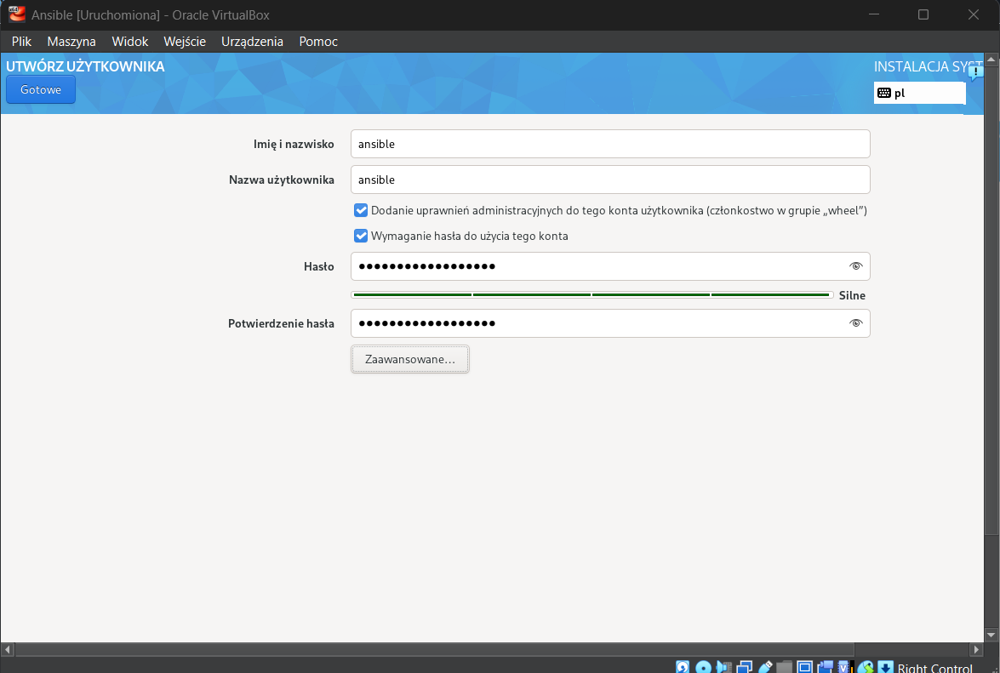

# Sprawozdanie 3
**Autor:** Paweł Socała  
**System:** Fedora  
**Wirtualizacja** VirtualBox

<br>
<br>

# Lab 8 - Ansible

<br>

## Instalacja zarządcy Ansible


<br>

Na początku utworzono nową maszyne wirtualną na obrazie Fedory. Podczas instalacji utworzono użytkownika o nazwie ansible.




<br>

---

Po instalacji uruchomiono maszynę dodano nazwę hosta oraz zainstalowano pakiety tar i openSSH. 


```bash
sudo hostnamectl set-hostname ansible-target
exec bash

sudo dnf install tar openssh
```


<br>

---

Na końcu dodano migawkę, czyli zapisano obecny stan maszyny.


<br>

---

W kolejnym etapie zainstalowano Ansible na głównej maszynie.

```bash
sudo dnf install ansible
```


<br>

---

Wymiana kluczy:

Na początku wygenerowano klucze ssh na głównej maszynie.

```bash
ssh-keygen -f ~/.ssh/id_rsa_ansible
```


<br>

Sprawdzono adres ip maszyny Ansible oraz dodano go do pliku `/etc/hosts`.

```bash
ip a
sudo nano /etc/hosts
```


<br>

Na końcu wykonano wymianę kluczy za pomocą polecena ssh-copy-id oraz połączono się poprzez ssh bez wpisywania hasła.

```bash
ssh-copy-id -i ~/.ssh/id_rsa_ansible.pub ansible@ansible-target

ssh ansible@ansible-target
```


## Inwentaryzacja


<br>

Zmiana nazwy głównej maszyny na `fedora-main`.
```bash
sudo hostnamectl set-hostname fedora-main
exec bash
```


Kolejno dodano jeszcze adres maszyny fedora-main do pliku `/etc/hosts`.

