# Class 1
## Introduction, Git, Branches, SSH

## 1. Install Git

```sh
git -v
```


## 2. Access Token

Create Personal Token at https://github.com/settings/tokens/new and use it to clone repo


Clone repository:
```sh
git clone https://github.com/InzynieriaOprogramowaniaAGH/MDO2025_INO.git
```


## 3. SSH keys
Create 2 SSH keys:
```sh
# with empty phrase
ssh-keygen -t ed25519 -C "patryk@twardosz.dev"

# with custom phrase 
ssh-keygen -t ed25519 -C "patryk@twardosz.dev"
```


Add SSH key on site and to ssh manager: 
https://github.com/settings/keys


```sh
eval "$(ssh-agent -s)"  # startup ssh agent
ssh-add ./devops_ssh_1  # add ssh
git clone git@github.com:InzynieriaOprogramowaniaAGH/MDO2025_INO.git
```


Add 2FA: https://github.com/settings/security


## 4. Swtich branch:
```sh
git branch          # check current branch
git checkout main   # switch to `main` branch
git branch          # check current branch
git fetch           # update remote repo
git checkout GCL07  # swithc to `GCL07` branch
```


## 5. Own branch
```sh
git checkout -b PT414333
```
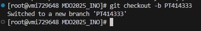

## 6. Git Hooks
Create direcotry:
`./ITE/GCL07/PT414333/`

Craete Git Hook (file: commit-msg)"
```sh commit-msg
#!/bin/sh
FILE=$1
MSG=$(cat "$FILE")

if [[ ! $MSG =~ ^PT414333 ]]; then
    echo "ERROR: Invalid commit message. It has to begin with 'PT414333'."
    exit 1
fi
```

Add Git hook:
```sh
chmod +x ITE/GCL07/PT414333/commit-msg
git config --local core.hooksPath ITE/GCL07/PT414333/
```

Test:

```sh
git add .
git commit -m "Test"
git commit -m "PT414333: Git Hook"
```


## 7. Push to remote
Push to remote repository
```sh
git push --set-upstream origin PT414333
```
Result:


# Class 2
## Git, Docker

## 1. Install Docker

Instructions:
https://docs.docker.com/engine/install/

For ArchLinux:
```sh
sudo pacman -S docker # Arch
```
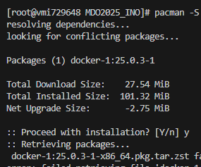

## 2. Create DockerHub account

Link:
https://app.docker.com/signup

Reslut:


## 3. Pull images

```sh
docker pull hello-world
docker pull busybox
docker pull ubuntu
docker pull mysql
```

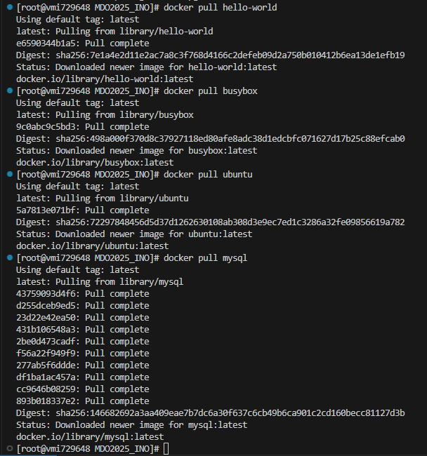

## 4. Run container

```sh
docker run -i -d --name Test busybox # run contaienr dettached
docker attach Test                   # attach std io

# inside container
busybox | head -1
```

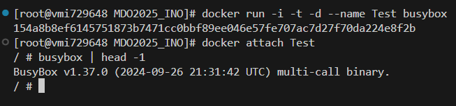

## 5. "System in container"

```sh
docker run -i -t -d --name Ubuntu ubuntu  # create new container
docker attach Ubuntu

# Inside contaienr
ps -fe

exit # exit from contaienr
```

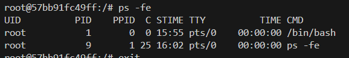

```sh
# On host
ps -fe
```


## 6. Create custom image

Create file: `Dockerfile` with content:
```Dockerfile
FROM ubuntu

RUN apt-get update && apt-get install -y git

RUN git clone https://github.com/InzynieriaOprogramowaniaAGH/MDO2025_INO.git
```
In `Dockerfile`'s directory:
```sh
docker build . -t test-image
```

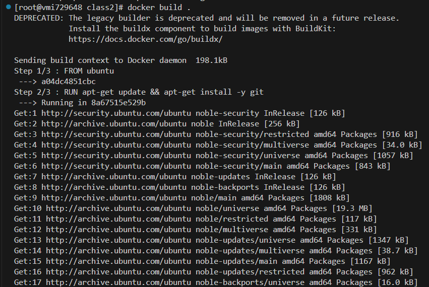


```sh
docker run -i -t -d --name Test test-image
docker attach Test

# Inside container
ls
```


## 7. Running containers
```sh
docker ps -la     # List all contaienrs

docker rm Test    # Remove container Test
docker rm Ubuntu  # Remove contaienr Ubuntu

docker ps -la
```


## 8. Images cleanup

```sh
docker image prune
```


# Class 3


## 1. Build & run tests in temporart container
```sh
docker run -i -t -d --name Ubuntu ubuntu
docker attach Ubuntu

# Inside container
apt -y update
apt -y install git meson gcc libglib2.0-dev libssl-dev libncurses-dev libutf8proc-dev libperl-dev

git clone https://github.com/irssi/irssi.git
cd irssi

meson Build
ninja -C Build && ninja -C Build test
```
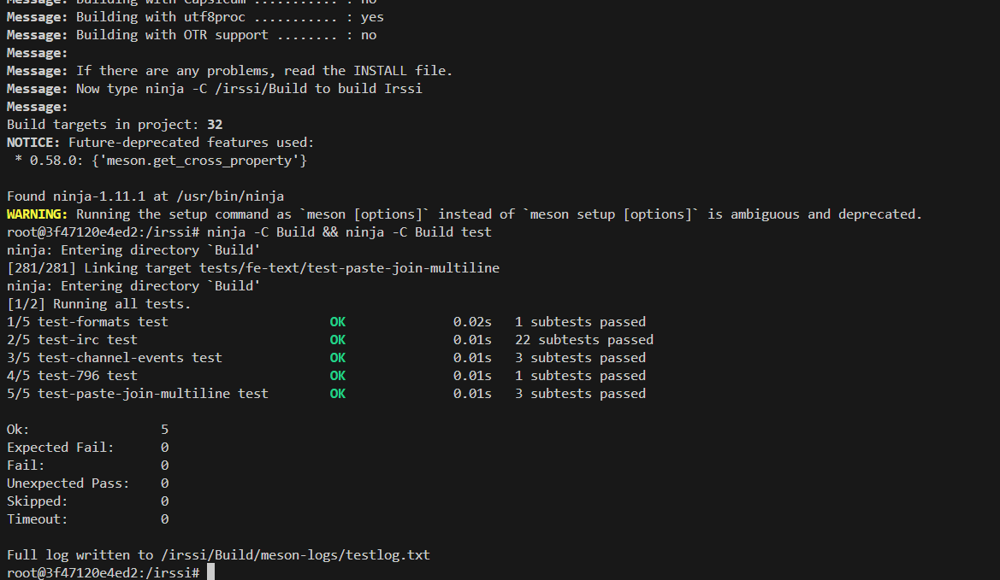

## 2. Create Dokerfiles for build & test

Create build [Dockerfile.irssi_b](class3/Dockerfile.irssi_b)
```Dockerfile
FROM ubuntu

RUN apt -y update && \
    apt -y install git meson gcc libglib2.0-dev libssl-dev libncurses-dev libutf8proc-dev libperl-dev

RUN git clone https://github.com/irssi/irssi.git
WORKDIR /irssi

RUN meson Build
RUN ninja -C Build
```

Create image:
```sh
docker build -f Dockerfile.irssi_b -t irssi-build .
```
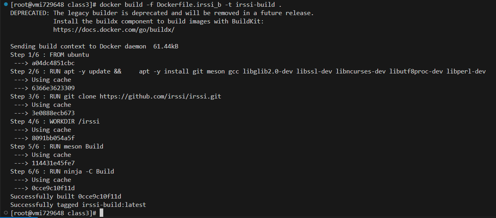

Create test [Dockerfile.irssi_t](class3/Dockerfile.irssi_t)
```Dockerfile
FROM irssi-build

WORKDIR /irssi

RUN ninja -C Build test
```
Create image:
```sh
docker build -f Dockerfile.irssi_t --no-cache -t irssi-tests .
```
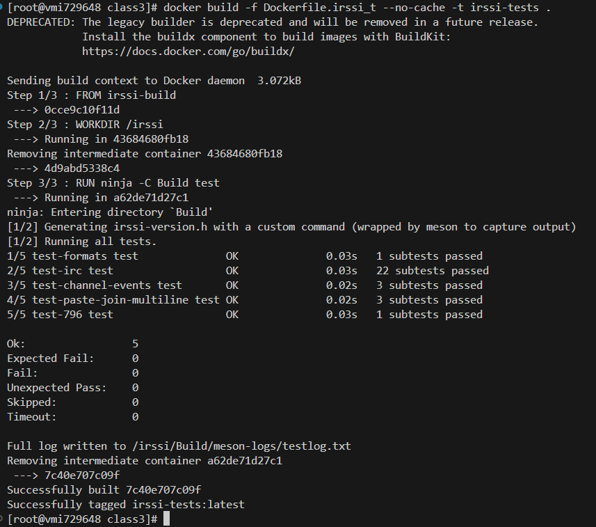

# Class 4
## 1. State persistance

Create [Dockerfile.build](class4/Dockerfile.build)
```Dockerfile
FROM ubuntu

RUN apt -y update && \
    apt -y install meson gcc libglib2.0-dev libssl-dev libncurses-dev libutf8proc-dev libperl-dev

WORKDIR /app
```

Build image from it.
```sh
docker build -f Dockerfile.build -t build .
```
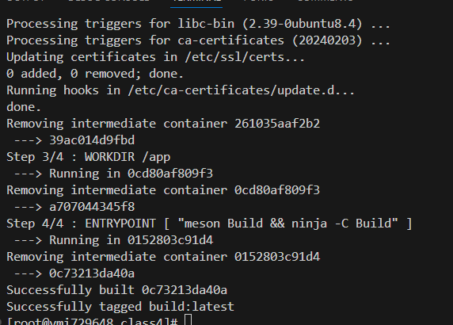


Create new volumes
```sh
docker volume create build-in
docker vloume create build-out
```
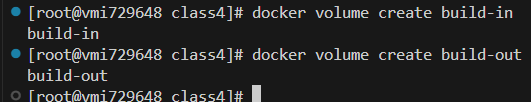

Clone repository to `build-in` volume
```sh
cd /var/lib/docker/volumes/build-in/_data
git clone https://github.com/irssi/irssi.git .
```
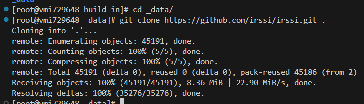


Create build container
```sh
docker run -it -v build-in:/app -v build-out:/app-out --name Build build

# Inside docker
meson ../app-out && ninja -C ../app-out
```
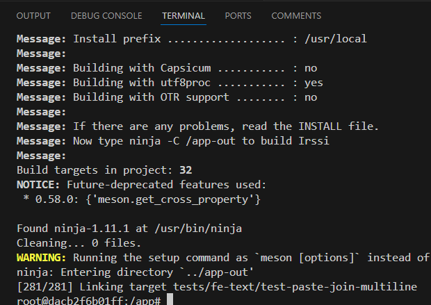

In order to provide srource code into container I mounted 2 volumes and cloned repository into input volume.  

## 2. Port exposing
Create iperf-server container:
```sh
docker pull networkstatic/iperf3
docker run -it -d --name iperf3-server -p 5201:5201 networkstatic/iperf3 -s
```
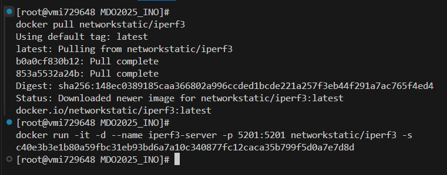

Connection create client container
```sh
docker run -it --name iperf3-client networkstatic/iperf3 -c 127.17.0.3
```
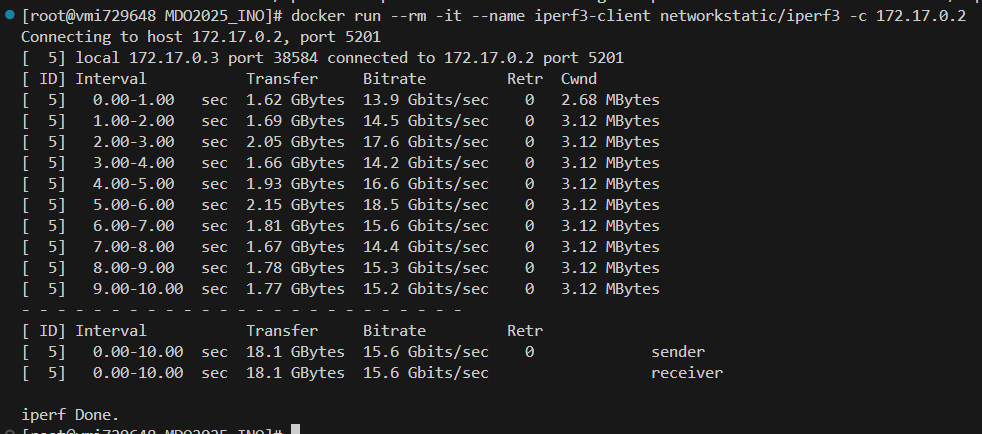

Create iperf network
```sh
docker network create iperf3-network
```
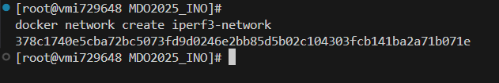

Create new containers in custom network
```sh
docker run -d --name iperf3-server-net -p 5201:5201 --network iperf3-network networkstatic/iperf3 -s
docker run -it --name iperf3-client-net --network iperf3-network networkstatic/iperf3 -c iperf3-server-net
```
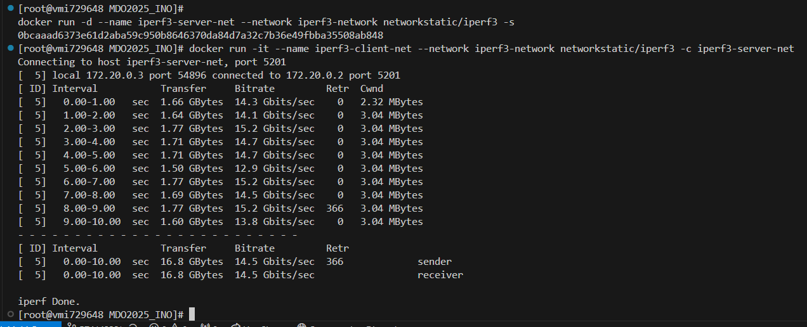

Test from host
```sh
iperf3 -c localhost
```
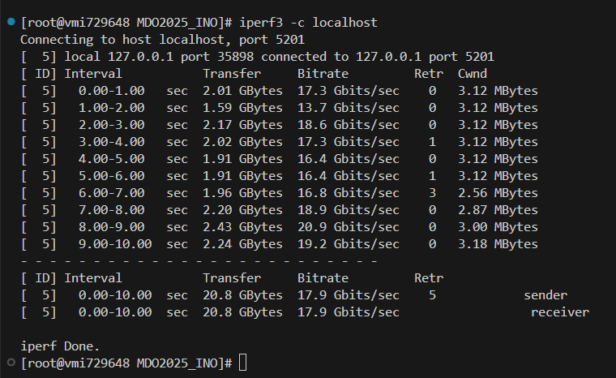


Get logs from iperf server.
```sh
docker logs iperf3-server-net
```
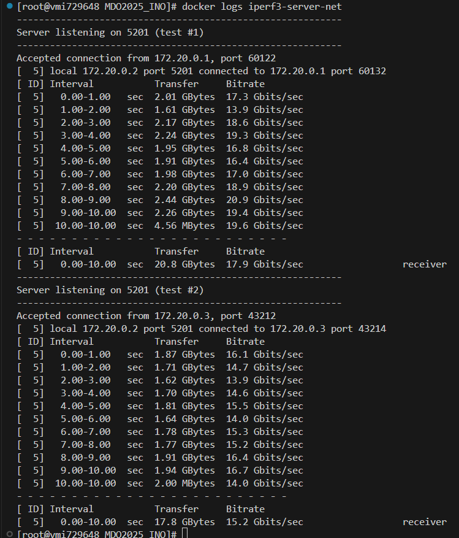

## 3. Jenkins setup

Create jenkins network
```sh
docker network create jenkins
```
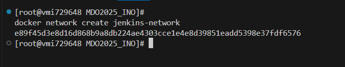

DIND container startup
```sh
docker run \
  --name jenkins-docker \
  --rm \
  --detach \
  --privileged \
  --network jenkins \
  --network-alias docker \
  --env DOCKER_TLS_CERTDIR=/certs \
  --volume jenkins-docker-certs:/certs/client \
  --volume jenkins-data:/var/jenkins_home \
  --publish 2376:2376 \
  docker:dind \
  --storage-driver overlay2
```
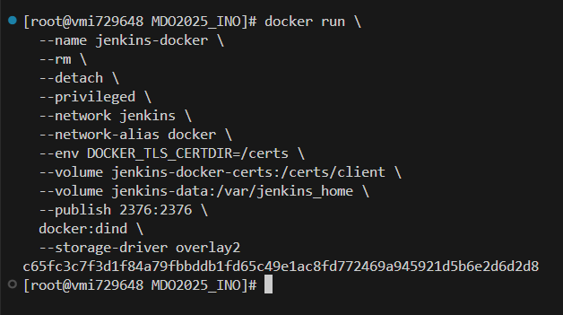

Create custom Jenkins image [Dockerfile.jenkins](class4/Dockerfile.jenkins)
```sh
cd ITE/GCL07/PT414333/Summary1/class4
docker build -f Dockerfile.jenkins -t myjenkins-blueocean:2.492.2-1 .
```
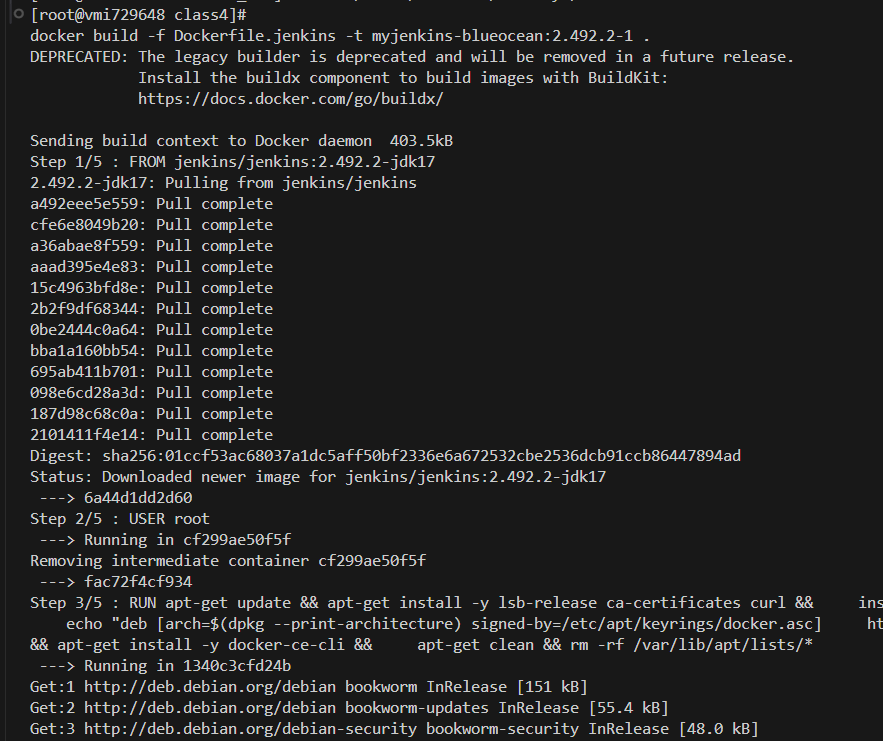

Run Jenkins container
```sh
docker run \
  --name jenkins-blueocean \
  --restart=on-failure \
  --detach \
  --network jenkins \
  --env DOCKER_HOST=tcp://docker:2376 \
  --env DOCKER_CERT_PATH=/certs/client \
  --env DOCKER_TLS_VERIFY=1 \
  --publish 8080:8080 \
  --publish 50000:50000 \
  --volume jenkins-data:/var/jenkins_home \
  --volume jenkins-docker-certs:/certs/client:ro \
  myjenkins-blueocean:2.492.2-1
```
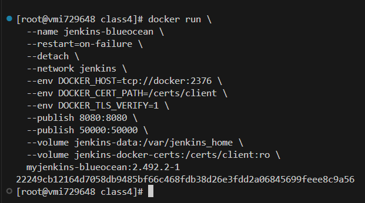
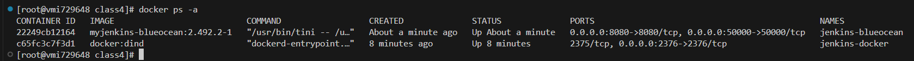


Open Jenkins in browser
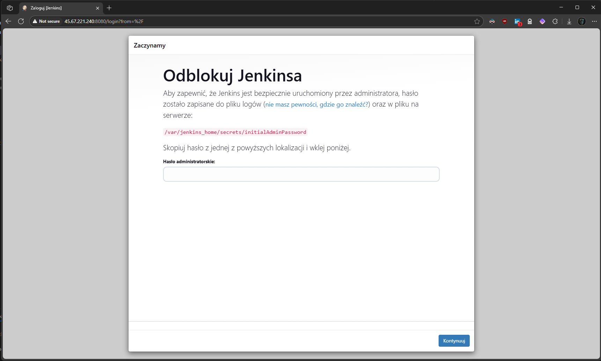

Get initail admin password
```sh
cat /var/lib/docker/volumes/jenkins-data/_data/secrets/initialAdminPassword
```
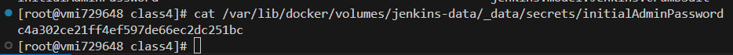
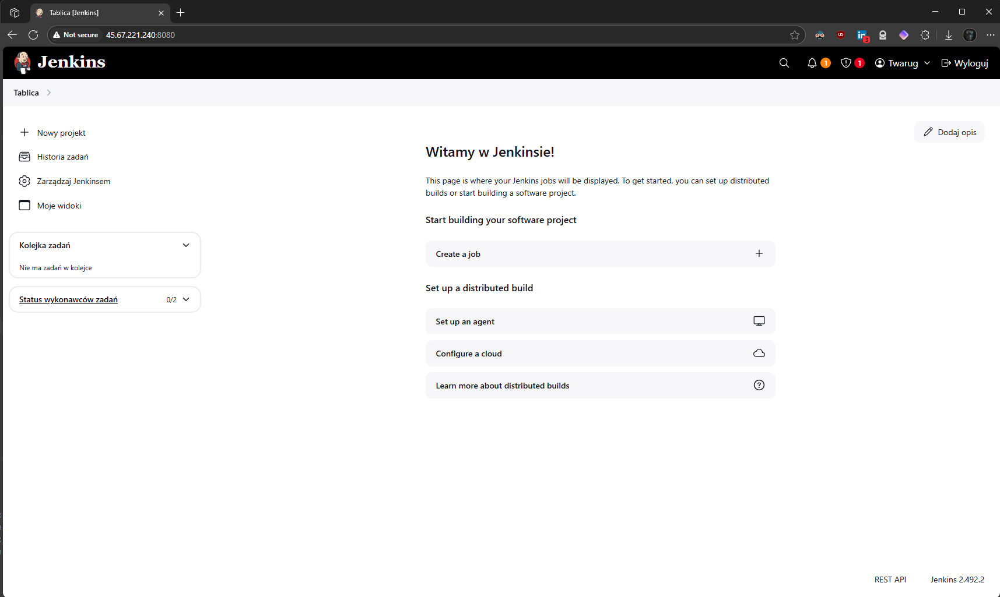