# Class 5-7
## Pipeline, Jenkins

## 1. Tworzenie instancji Jenkinsa

[Zostało udokumentowane na popzrednich zajęciach](../Sprawozdanie1/README.md#3-jenkins-setup)

## 2. Zadanie do wykonania na ćwiczeniach

### 1. Utworzenie projektu wyświetlającego `uname`

1. Tworzymy nowy projekt

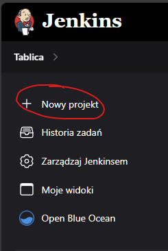

2. Nadajemy mu nazwe i wybieramy tryb `Projekt Ogólny`

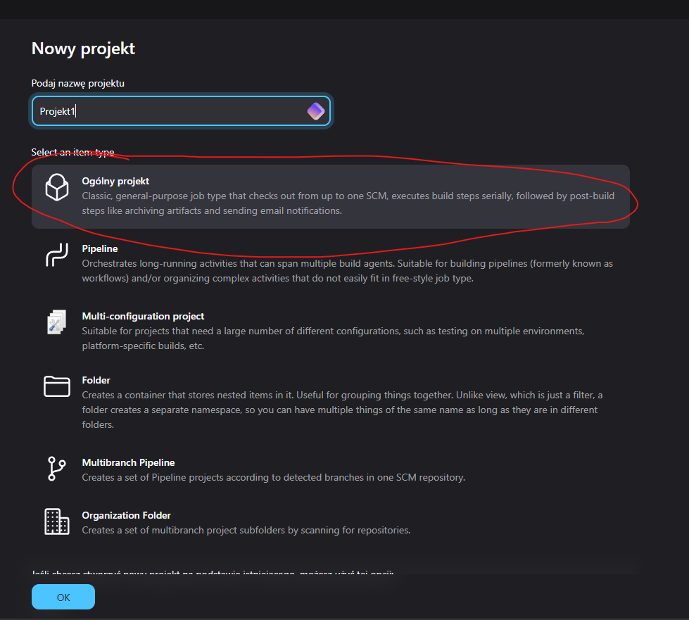

3. W sekcji `Enviroment`> `Kroki budowania` dodajemy krok `Uruchom powłokę` i jako komendę wpisujemy polecenie i zapisujemy:

```sh
#!/bin/bash

uname -a

docker ps
```

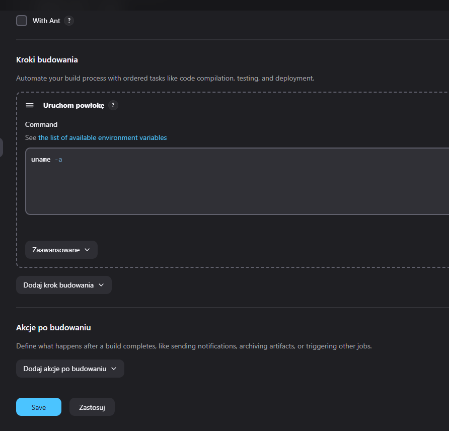

4. Uruchom utworzony projekt

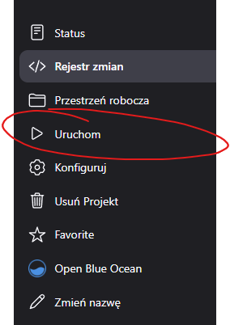

5. Otwórz artefakty uruchomienia

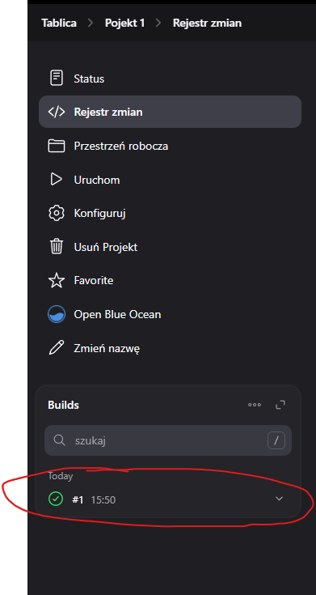

6. Otwórz logi

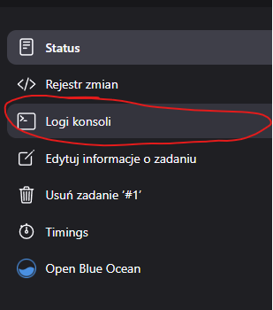

Polecenie zwarca ten sam `uname` co host.
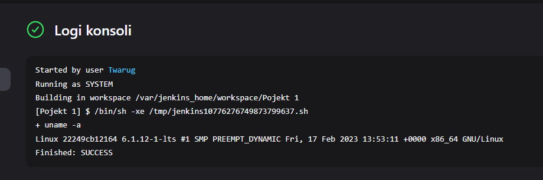


### 2. Utworzenie projektu zwracającego błąd, gdy godzina jest nieparzysta


1. Tworzymy nowy projekt (powtarzamy kroki 1. i 2. z [poprzedniego punkut](#1-utworzenie-projektu-wyświetlającego-uname))
2. W sekcji `Enviroment`> `Kroki budowania` dodajemy krok `Uruchom powłokę` i jako komendę wpisujemy poniższe polecenie i zapisujemy:

```sh
#!/bin/bash

current_hour=$(date +%H)
if (( current_hour % 2 != 0 )); then
  echo "Godzina jest nieparzysta. Błąd!"
  exit 1
else
  echo "Godzina jest parzysta. Sukces!"
  exit 0
fi
```

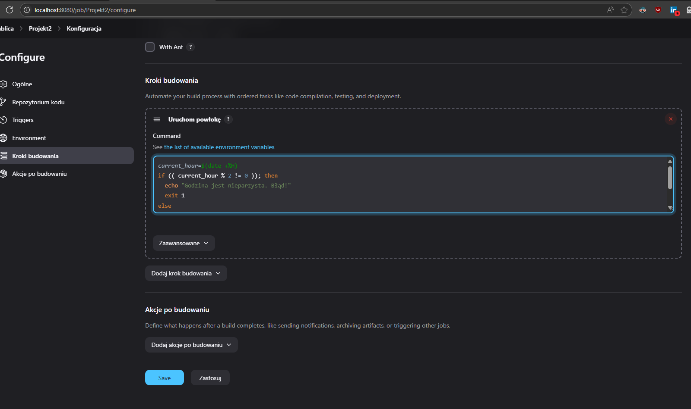


3. Uruchom projekt


4. Otwórz artefakty uruchomienia


5. Otwórz logi


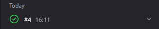


### 3. Pobierz w projekcie obraz kontenera

Otwórz [pierwszy projekt](#1-utworzenie-projektu-wyświetlającego-uname)

1. Wchodzimy w konfiguracje projektu

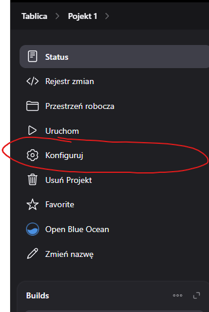

2. W sekcji `Enviroment`> `Kroki budowania` modyfikujemy krok `Uruchom powłokę` i jako komendę wpisujemy poniższe polecenie i zapisujemy

```sh
#!/bin/bash

uname -a

docker ps

docker pull ubuntu
```

3. Uruchom projekt


4. Otwórz artefakty uruchomienia

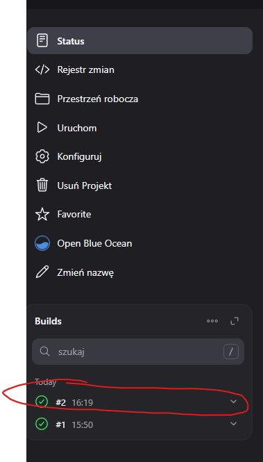

5. Otwórz logi


Na początku można zauważyć, że nie posiadamy żadnych obrazów kontenerów, co pokazuje nam, iż jest to osobna instajca docker'a od hosta.

Pobranie obrazu powiodło się.

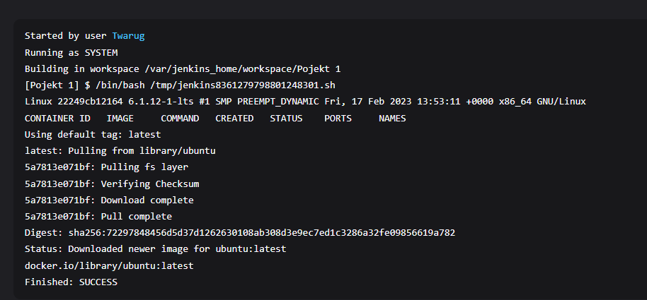

## 3. Tworzenie Pipeline

1. Utwórz nowy projekt


2. Nadajemy mu nazwe i wybieramy tryb `Pipeline`

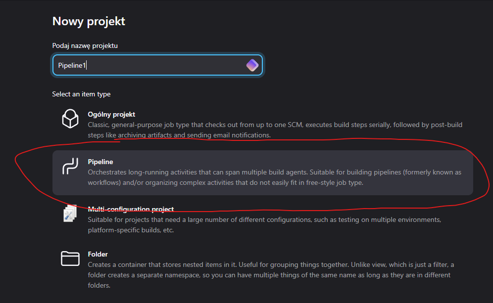

3. W sekcji `Pipeline` jako `Pipeline script` wpisujemy:

```groovy
pipeline {
    agent any

    stages {
        stage('Clean') {
            steps {
                cleanWs()
                sh 'docker image rm -f irssi-build irssi-test'
                sh 'docker builder prune -a -f'
            }
        }
        
        stage('Git clone') {
            steps {
                git url: 'https://github.com/InzynieriaOprogramowaniaAGH/MDO2025_INO.git', branch: 'PT414333'
            }
        }
        
        stage('Build build image') {
            steps {
                dir('ITE/GCL07/PT414333/Sprawozdanie1/class3') {
                    sh 'docker build -f Dockerfile.irssi_b -t irssi-build .'
                }
            }
        }
        
        stage('Build test image') {
            steps {
                dir('ITE/GCL07/PT414333/Sprawozdanie1/class3') {
                    sh 'docker build -f Dockerfile.irssi_t -t irssi-test .'
                }
            }
        }
    }
}
```
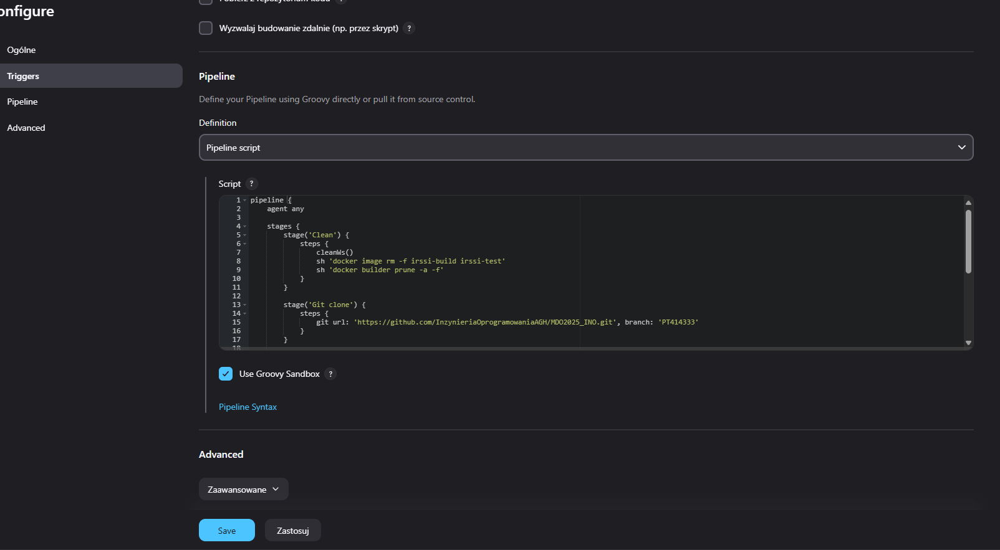


4. Uruchom projekt


5. Otwórz artefakty uruchomienia


6. Otwórz logi


Pipeline poprawnie wyczyścił sobie środwisko, poczym sklonował repozydorium i zbudował 2 obrazy.

Proces może być powtarzany wielokrotnie, bez żadnych dodatkowych akcji.

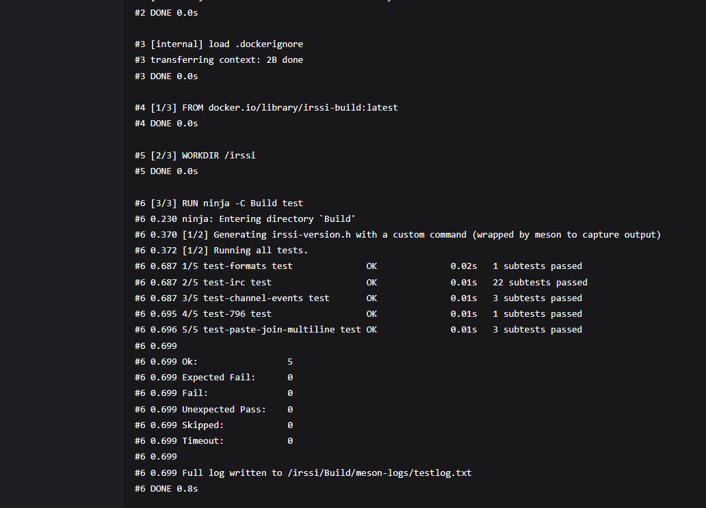


# Pipeline projektu `htop`
Implementacja Pipeline dla projektu [htop](https://github.com/htop-dev/htop)

## Diagram UML Pipeline

1. Cleanup - sprzątamy jakie kolwiek pozostałości po potencjalnie poprzednich uruchomieniach, przygotowujemy środowisko.
2. Clone - kolonujemy repozytorium docelowe.
3. Build - tworzymy docker image odpowiedzialny za zbudowanie aplikacji
4. Prep Test - tworzymy docker image opowiedzialny za przeprowadzenie testów
5. Test - uruchamiamy test aplikacji
6. Delpoy - uruchamiamy aplikację w czystym środowisku
7. Publish - załączamy artefakty build'a (rpm package) do `archiveArtifacts`.

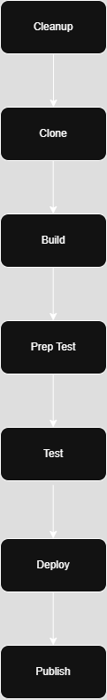

Cały pipeline został zaimplementowany w postaci [jenkinsfile](project/jenkinsfile)

### 1. Tworzenie potrzebnych plików.

[Dockerfile.build](project/Dockerfile.build) jest używany jako środowisko do wykonania build step'u. Jednocześnie tworzy on `rpm package`.

[Dockerfile.test](project/Dockerfile.test) jest używany do uruchomienia testu działania aplikacji. Bazuje na obrazie build. Z racj na charakter aplikacji, testy załączone z kodem źródłowym nie są wstanie zostać uruchomione w środowisku kontenera, z racji na charakter testów polegający na dostępie do GUI. Z racji na to wykonywany jest test uruchomieniowy.

[Dockerfile.deploy](project/Dockerfile.deploy) jest używany jako test uruchomienia aplikacji w czystym środowisku.

Dodatkowo dla celu stworzenia `rpm package` należy jeszcze stworzyć plik [htop.spec](project/htop.spec) zawierający specyfkiację potrzebną dla procesu pakowania. Paczka ta używana jest jako artefakt publikacji z racji na charakter budowanego programu, który opiera się na szczegółowych informacjach o środowisku, w którym został uruchomiony. Dlatego nie jest on dobrym kandynatem na uruchamianie w kontenerze.

Na końcu tworzymy plik [jenkinsfile](project/jenkinsfile) zawierający cały skrypt pipeline'u.

### 2. Tworzenie nowego piepline

Nadana została nazwa 'htop' i typ projektu ustawiony na `Pipeline`
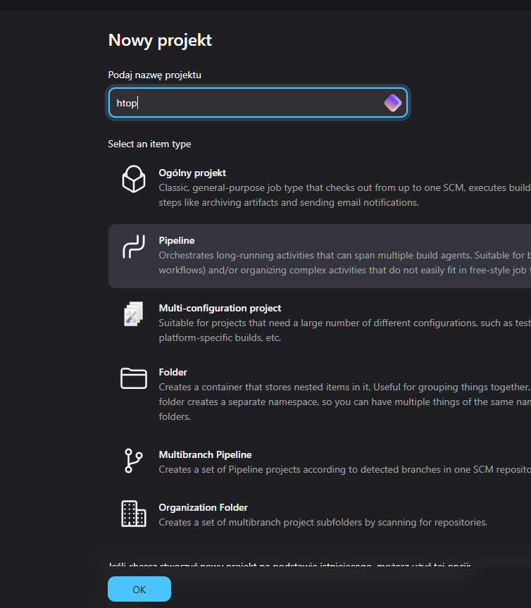


Ustawienie źródła skryptu Jenkins na [jenkinsfile](project/jenkinsfile) znajdujący się w repozytorium.
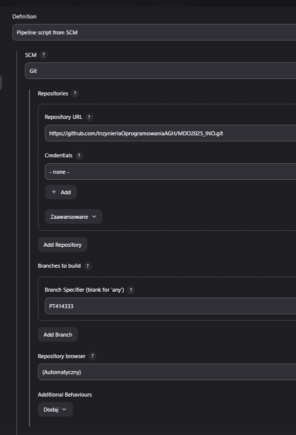

### 3. Uruchomienie Pipeline

Uruchom piepeline
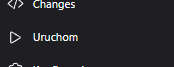

Po odczekaniu kilku minut, wejdź w informacjie o ostatnim uruchomieniu


Można zauważyć, iż build przebiegł poprawnie oraz został załączony artefakt w postaci paczki `rpm`.

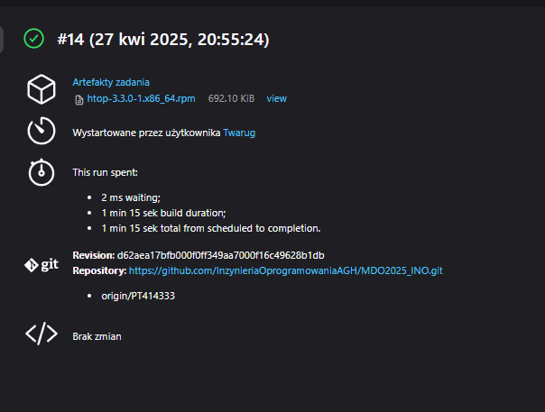

W logach można zauważyć, iż pipeline zaczyna się od pobrania repozytorium w celu pobrania skryptu pipeline (jenkinsfile)
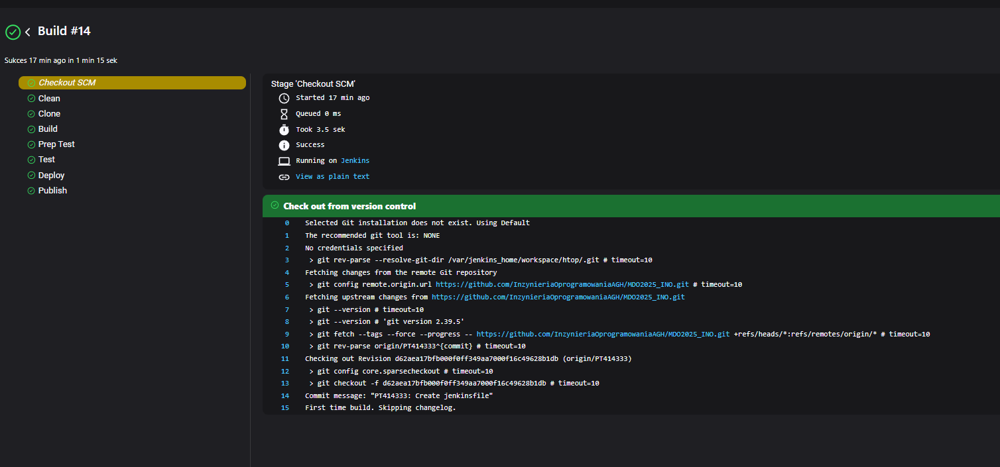
