# Class 8
1. Instalacja i konfiguracja ansible

Sprawdzenie dostępności `tar` i `ssh` server
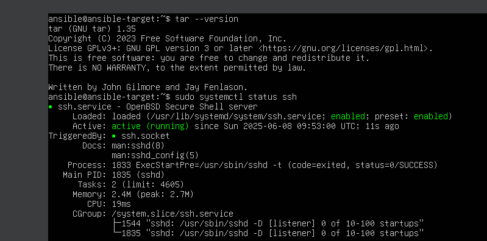

Nazwa użytkownika oraz nazwa hosta zostały nadane w trakcie instalowania systemu.
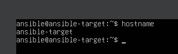

Instalowanie Ansible na głównej maszynie.
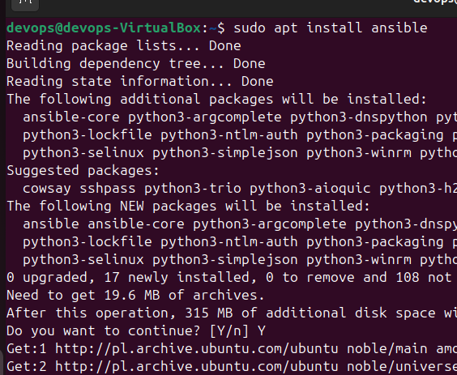


Generowanie klucza ssh na głównej maszynie.
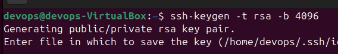

Wygenerowany publiczhny klucz został wklejony do pliku `~/.ssh/authorized_keys` na maszynie docelowej.
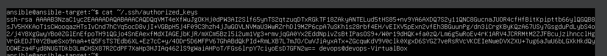

2. Konfiguracja lokalnych DNS dla obu maszyn
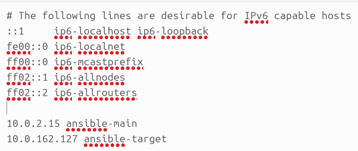
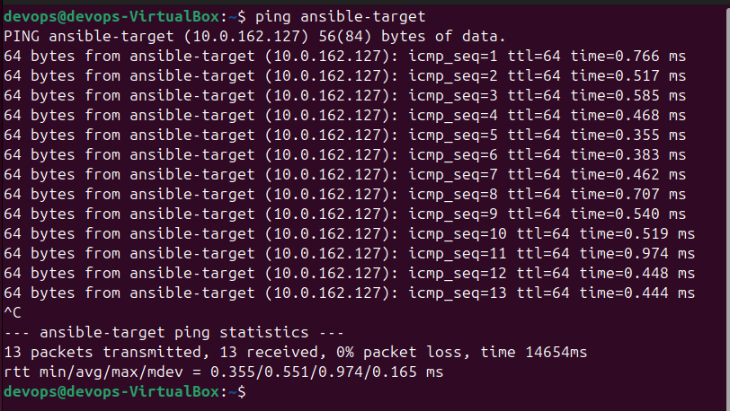
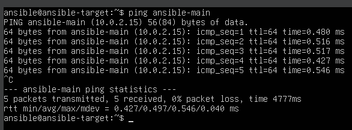

3. Inwentaryzacja
Stworzenie pliku inwentaryzacji
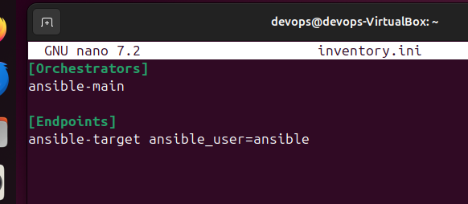

3. Zdalne wywoływanie procedur

Przygotowanie [playbook'a](class8/task.yml)
```yml
---
- name: Basic operations
  hosts: all
  gather_facts: true
  become: yes
  vars:
    inventory_owner: "{{ 'devops' if inventory_hostname == 'ansible-main' else 'ansible' }}"

  tasks:
    - name: Send ping request
      ping:

    - name: Copy inventory file
      ansible.builtin.copy:
        src: ~/ansible/inventory.ini
        dest: /tmp/inventory.ini
        owner: "{{ inventory_owner }}"
        group: "{{ inventory_owner }}"
        mode: "7777"

    - name: Update system packages
      block:
        - name: Update packages (skip kernel)
          ansible.builtin.package:
            name: "*"
            state: latest
            update_cache: yes
          register: update_result
          notify: reboot_if_needed
          become: true

    - name: Restart services
      service:
        name: "{{ item }}"
        state: restarted
      loop:
        - sshd
        - rngd

    - name: Skip message for control node
      debug:
        msg: "Skipping package updates on control node (ansible-main)"
      when: inventory_hostname == 'ansible-main'

  handlers:
    - name: reboot_if_needed
      ansible.builtin.reboot:
        msg: "Reboot initiated by Ansible"
        connect_timeout: 5
        reboot_timeout: 600
        pre_reboot_delay: 0
        post_reboot_delay: 30
      when:
        - update_result.changed
        - inventory_hostname != 'ansible-main'
```
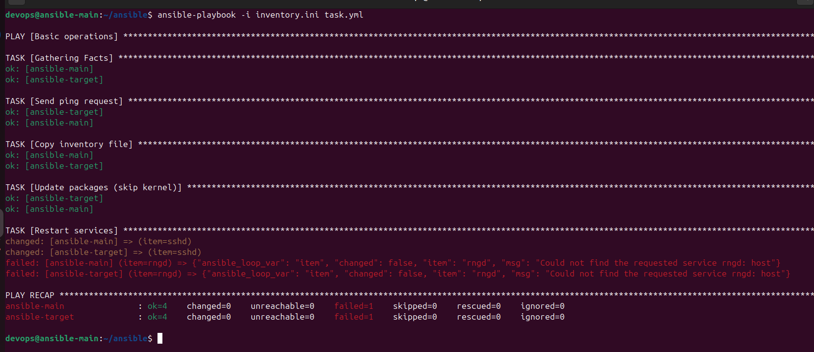


Depoly aplikacji w kontenerze.
[Playbook](class8/container.yml)

```yml
---
- name: Manage Docker Application
  hosts: Endpoints
  gather_facts: true
  become: yes
  vars:
    inventory_owner: "{{ 'devops' if inventory_hostname == 'ansible-main' else 'ansible' }}"

  tasks:
    - name: Install Docker and dependencies
      block:
        - name: Install Docker package from standard repo
          ansible.builtin.package:
            name: docker.io
            state: latest
            update_cache: yes

        - name: Start and enable Docker service
          ansible.builtin.systemd:
            name: docker
            state: started
            enabled: yes
            daemon_reload: yes

        - name: Ensure group "docker" exists
          ansible.builtin.group:
            name: docker
            state: present

        - name: Add user 'ansible' to docker group
          ansible.builtin.user:
            name: ansible
            groups: docker
            append: yes

        - name: Copy executable file
          ansible.builtin.copy:
            src: ~/ansible/app/
            dest: /tmp/app/
            owner: "{{ inventory_owner }}"
            group: "{{ inventory_owner }}"
            mode: "0755"
      rescue:
        - name: Display error message if Docker installation fails
          debug:
            msg: "Failed to install Docker. Please check logs for details."
          when: ansible_failed_task is defined

    - name: Build image
      community.docker.docker_image:
        name: htop
        source: build
        build:
          path: /tmp/app

    - name: Run container
      community.docker.docker_container:
        name: htop
        image: htop
        state: started
            
    - name: Stop the container
      community.docker.docker_container:
        name: htop
        state: stopped

    - name: Remove the container
      community.docker.docker_container:
        name: htop
        state: absent

    - name: Remove the Docker image (optional)
      community.docker.docker_image:
        name: htop
        state: absent

  handlers:
    - name: Reload firewalld
      ansible.posix.firewalld:
        state: reloaded
```
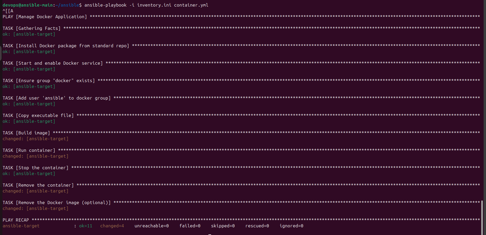

# Class 9

1. Utworzenie pliku odpowiedi

[Zawartość pliku](class9/anaconda-ks.cfg)

Zadania:
 - pobranie systemu Fedora 41
 - aktualizacja repozytoriów
 - instalacja docker'a
 - uruchomienie kontenera

Wybrałem sposób instalacji z raw plików GitHub'a jednak aby nie przepisywać długiego linku użyłem serwisu do ich skracania.

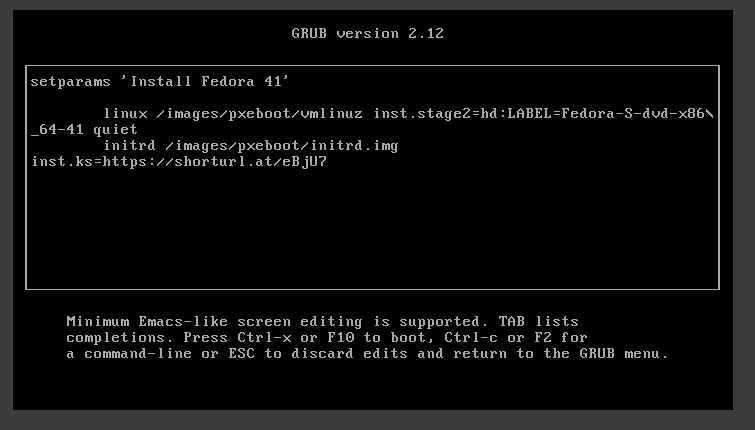

Uruchomienie instalacji.
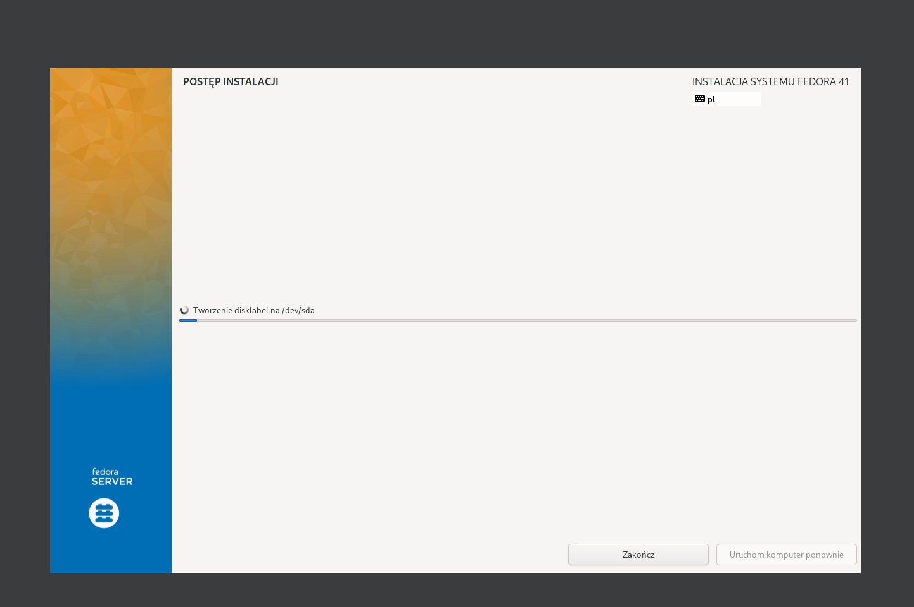

Sprawdzenie dziłania stworzeonego kontenera.
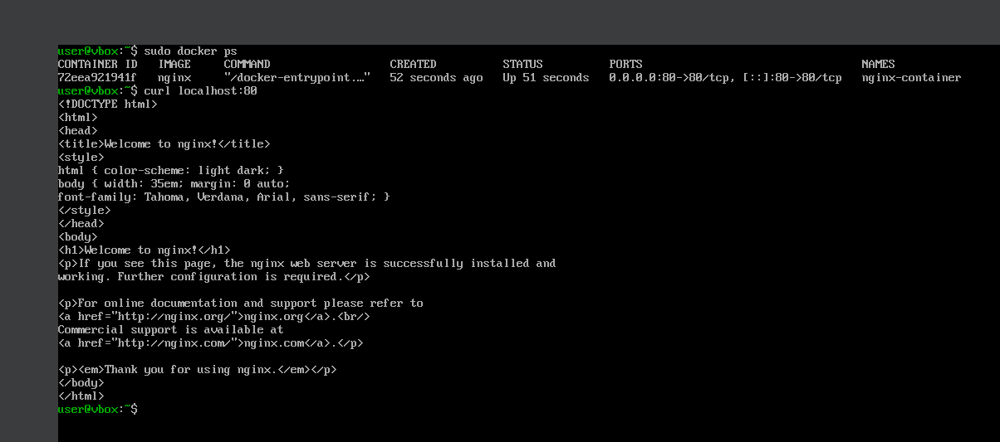

# Class 10

1. Instalacja Kubernetes

Z racji na mój system operacyjny (Arch Linux) zmuszony zostałem do instalacji binarnej.
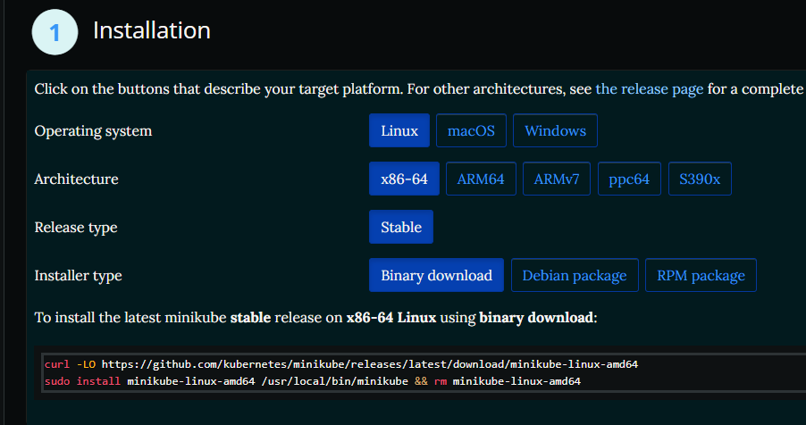

Aby uruchomić `minikube` musziałem zalogować jako zwykły użytkownik (nie root).
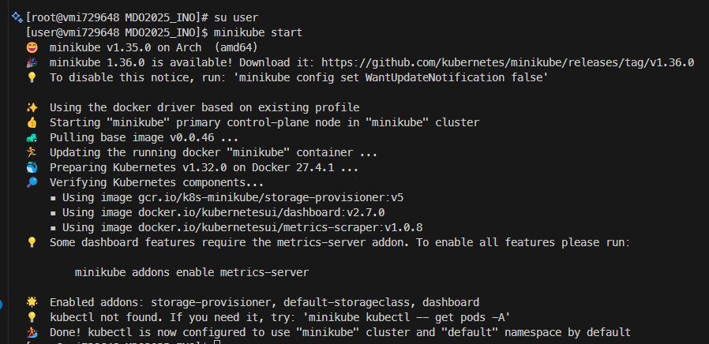

Po uruchomieniu `minikube` możemy uruchomić jego dashboard
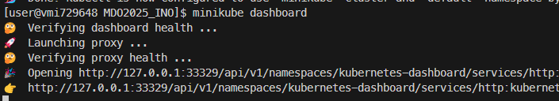

Dzięki przekierowaniu portów przez VS Code mam dostęp do Dashbord'a po localhost
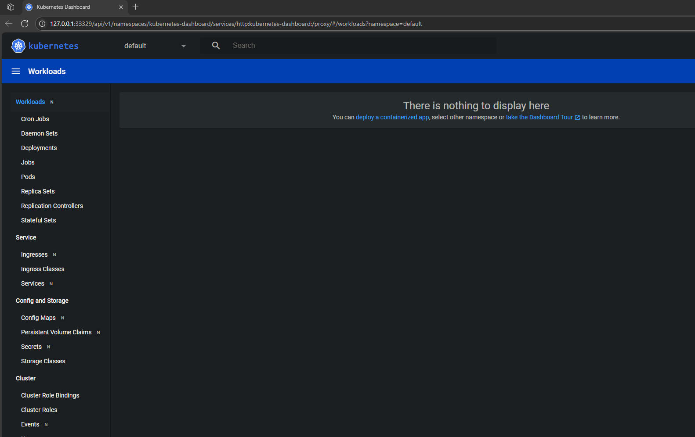

2. Budowa obrazu

Z racji fakt, iż aplikacja z poprzednich zajęć (`htop`) nie jest aplikacją ciągle działającą zmuszony zostałem do posłużenia się kontenerami uruchamiającymi `nginx`'a.

[Dockerfile.v1](class10/deploy/Dockerfile.v1)

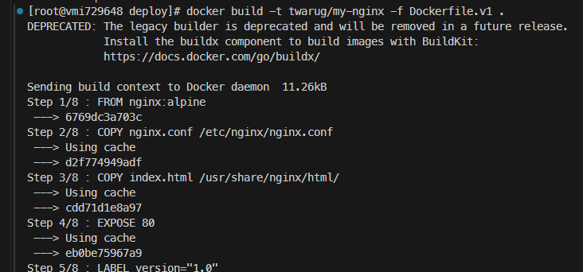
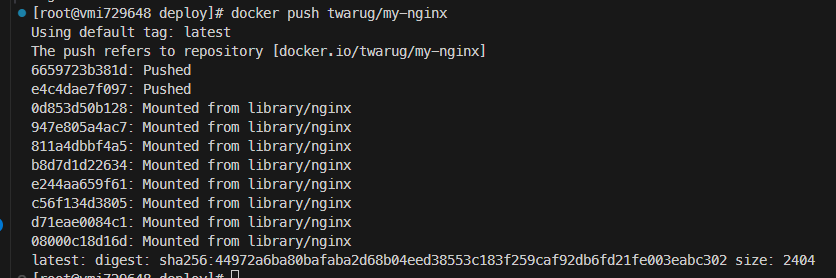

3. Uruchamianie

Stworzenie Pod'a
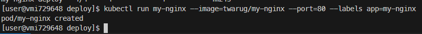
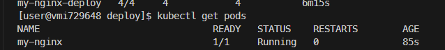

Przekierowanie portów

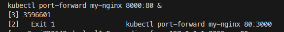

Test aplikacji

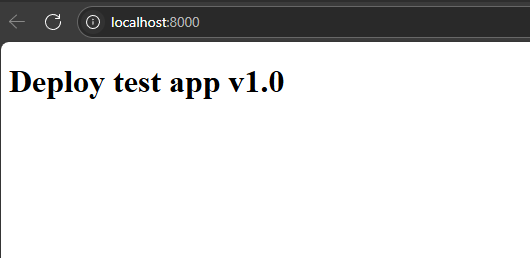


4. Wykożystanie plików drożenia

Uruchomienie na bazie [pliku wdrożenia](class10/deploy/deploy.yml)

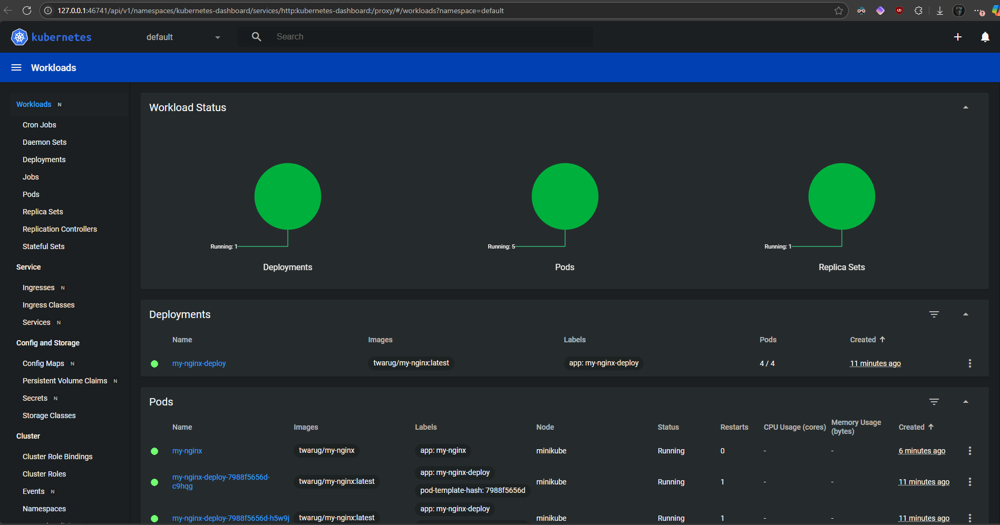
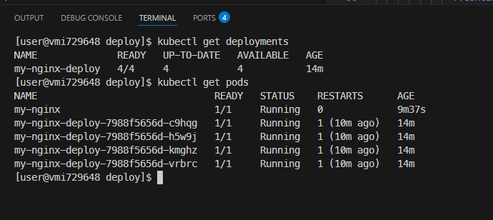