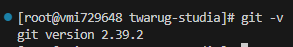
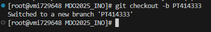

## 1. Install Git

```sh
git -v
```


## 2. Access Token

Create Personal Token at https://github.com/settings/tokens/new and use it to clone repo


Clone repository:
```sh
git clone https://github.com/InzynieriaOprogramowaniaAGH/MDO2025_INO.git
```


## 3. SSH keys
Create 2 SSH keys:
```sh
# with empty phrase
ssh-keygen -t ed25519 -C "patryk@twardosz.dev"

# with custom phrase 
ssh-keygen -t ed25519 -C "patryk@twardosz.dev"
```


Add SSH key on site and to ssh manager: 
https://github.com/settings/keys


```sh
ssh-add ./devops_ssh_1
git clone git@github.com:InzynieriaOprogramowaniaAGH/MDO2025_INO.git
```


Add 2FA: https://github.com/settings/security


## 4. Swtich branch:
```sh
git branch          # check current branch
git checkout main   # switch to `main` branch
git branch          # check current branch
git fetch           # update remote repo
git checkout GCL07  # swithc to `GCL07` branch
```


## 5. Own branch
```sh
git checkout -b PT414333
```


## 6. Git Hooks
Create direcotry:
`./ITE/GCL07/PT414333/`

Craete Git Hook (file: commit-msg)"
```sh commit-msg
#!/bin/sh
FILE=$1
MSG=$(cat "$FILE")

if [[ ! $MSG =~ ^PT414333 ]]; then
    echo "ERROR: Invalid commit message. It has to begin with 'PT414333'."
    exit 1
fi
```

Add Git hook:
```sh
chmod +x ITE/GCL07/PT414333/commit-msg
git config --local core.hooksPath ITE/GCL07/PT414333/
```

Test:

```sh
git add .
git commit -m "Test"
git commit -m "PT414333: Git Hook"
```
