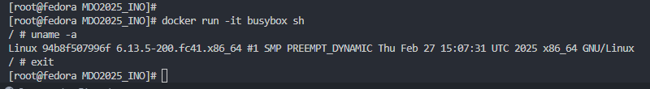
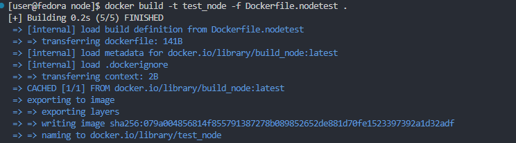

- [Sprawozdanie z lab1](#sprawozdanie-z-lab1)
  - [Lab 1: Konfiguracja SSH i GitHub](#lab-1-konfiguracja-ssh-i-github)
    - [1.1. Wygenereowanie klucza SSH metodą `ed25519`](#11-wygenereowanie-klucza-ssh-metodą-ed25519)
    - [1.2. Dodanie klucza SSH do GitHub'a](#12-dodanie-klucza-ssh-do-githuba)
    - [1.3. Sprawdzenie adresu IP maszyny wirtualnej **Fedora**](#13-sprawdzenie-adresu-ip-maszyny-wirtualnej-fedora)
    - [1.4. Konfiguracja połączenia w **VS Code** z pomocą wtyczki *Remote SSH*](#14-konfiguracja-połączenia-w-vs-code-z-pomocą-wtyczki-remote-ssh)
    - [1.5. Napisanie *hook'a*](#15-napisanie-hooka)
    - [1.6. Nadanie uprawnień dla pliku `commit-message`](#16-nadanie-uprawnień-dla-pliku-commit-message)
- [Sprawozdanie z lab2](#sprawozdanie-z-lab2)
  - [Lab 2: Docker – Podstawy](#lab-2-docker--podstawy)
    - [2.1. Zainstalowanie `Docker'a`](#21-zainstalowanie-dockera)
    - [2.2. Zalogowanie się oraz pobranie wymaganych obrazów](#22-zalogowanie-się-oraz-pobranie-wymaganych-obrazów)
    - [2.3. Uruchomienie `busybox`](#23-uruchomienie-busybox)
    - [2.4. Interaktywne uruchomienie](#24-interaktywne-uruchomienie)
    - [2.5. **PID'y** dockerowe](#25-pidy-dockerowe)
    - [2.6. Aktualizacja pakietów w kontenerze **Fedory**](#26-aktualizacja-pakietów-w-kontenerze-fedory)
    - [2.7. Złożenie konteneru z `Dockerfile'a`](#27-złożenie-konteneru-z-dockerfilea)
    - [2.8. Odpalenie konteneru z **Fedorą**](#28-odpalenie-konteneru-z-fedorą)
    - [2.9. Usunięcie wszystkich obrazów](#29-usunięcie-wszystkich-obrazów)
- [Sprawozdanie z lab3](#sprawozdanie-z-lab3)
  - [Lab 3: Praca z repozytoriami i kontenerami](#lab-3-praca-z-repozytoriami-i-kontenerami)
    - [**Irssi**](#irssi)
      - [3.1. Instalacja potrzebnych zależności i test na hoście](#31-instalacja-potrzebnych-zależności-i-test-na-hoście)
      - [3.2. Kontener i Dockerfile do buildowania](#32-kontener-i-dockerfile-do-buildowania)
      - [3.3. Kontener i Dockerfile do testowania](#33-kontener-i-dockerfile-do-testowania)
    - [**NodeDummyTest**](#nodedummytest)
      - [3.4. Sklonowanie repo na hosta i przeprowadzenie `install` oraz `start` na hoście](#34-sklonowanie-repo-na-hosta-i-przeprowadzenie-install-oraz-start-na-hoście)
      - [3.5. Kontener wykonujący *install*](#35-kontener-wykonujący-install)
      - [3.6. Kontener dla `docker run` do testowania Node](#36-kontener-dla-docker-run-do-testowania-node)
- [Sprawozdanie z lab4](#sprawozdanie-z-lab4)
  - [Lab 4: Zaawansowane konfiguracje z Dockerem](#lab-4-zaawansowane-konfiguracje-z-dockerem)
    - [4.1. Zapoznanie się z dokumentacją](#41-zapoznanie-się-z-dokumentacją)
    - [4.2. Przygotowanie woluminów](#42-przygotowanie-woluminów)
    - [4.3. Kontener bazowy](#43-kontener-bazowy)
    - [4.4. Odpalenie kontenera z zamontowaniem lokalnego folderu w trybie interaktywnym](#44-odpalenie-kontenera-z-zamontowaniem-lokalnego-folderu-w-trybie-interaktywnym)
    - [4.5. Włączenie kontenera docelowego](#45-włączenie-kontenera-docelowego)
    - [4.6. Eksponowanie portu i uruchomienie `iperf3`](#46-eksponowanie-portu-i-uruchomienie-iperf3)
    - [4.7. Wykorzystanie własnej sieci](#47-wykorzystanie-własnej-sieci)
    - [4.8. Odczyt logów](#48-odczyt-logów)
    - [4.9. Instalacja **Jenkins** (*bez DIND, bo nie umiem czytać*)](#49-instalacja-jenkins-bez-dind-bo-nie-umiem-czytać)
    - [4.10. Ekran logowania Jenkins](#410-ekran-logowania-jenkins)
- [Dyskusje](#dyskusje)
  - [Przygotowanie finalnego artefaktu](#przygotowanie-finalnego-artefaktu)
  - [Wymagania w Jenkinsie](#wymagania-w-jenkinsie)
  - [LLM](#llm)

# Sprawozdanie z lab1

---

## Lab 1: Konfiguracja SSH i GitHub

### 1.1. Wygenereowanie klucza SSH metodą `ed25519`

### 1.2. Dodanie klucza SSH do GitHub'a

### 1.3. Sprawdzenie adresu IP maszyny wirtualnej **Fedora**

### 1.4. Konfiguracja połączenia w **VS Code** z pomocą wtyczki *Remote SSH*

### 1.5. Napisanie *hook'a*

### 1.6. Nadanie uprawnień dla pliku `commit-message`

---

# Sprawozdanie z lab2

---

## Lab 2: Docker – Podstawy

### 2.1. Zainstalowanie `Docker'a`

### 2.2. Zalogowanie się oraz pobranie wymaganych obrazów

### 2.3. Uruchomienie `busybox`

### 2.4. Interaktywne uruchomienie

### 2.5. **PID'y** dockerowe
- 
- 

### 2.6. Aktualizacja pakietów w kontenerze **Fedory**

### 2.7. Złożenie konteneru z `Dockerfile'a`
- **Plik:** [Dockerfile](Dockerfile)
- 

### 2.8. Odpalenie konteneru z **Fedorą**

### 2.9. Usunięcie wszystkich obrazów

> 2.10 Uświadomienie sobie, że robienie wszystkiego w głównym katalogu repo jako `root` nie należało do moich najlepszych pomysłów (2 godziny nie mogłem wystawić commita).

---

# Sprawozdanie z lab3

---

## Lab 3: Praca z repozytoriami i kontenerami

> **Ważne:** Do przeprowadzenia ćwiczenia użyto przykładowych repozytoriów podanych na zajęciach.

### **Irssi**

#### 3.1. Instalacja potrzebnych zależności i test na hoście

#### 3.2. Kontener i Dockerfile do buildowania
- **Plik:** [Dockerfile.Cbuild](Dockerfile.Cbuild)
- 

#### 3.3. Kontener i Dockerfile do testowania
- **Plik:** [Dockerfile.Ctest](Dockerfile.Ctest)
- 

### **NodeDummyTest**

#### 3.4. Sklonowanie repo na hosta i przeprowadzenie `install` oraz `start` na hoście
- 
- 

#### 3.5. Kontener wykonujący *install*
- **Plik:** [Dockerfile.build](Dockerfile.build)

#### 3.6. Kontener dla `docker run` do testowania Node
- **Plik:** [Dockerfile.nodetest](Dockerfile.nodetest)
- 
- 

---

# Sprawozdanie z lab4

---

## Lab 4: Zaawansowane konfiguracje z Dockerem

### 4.1. Zapoznanie się z dokumentacją

### 4.2. Przygotowanie woluminów

### 4.3. Kontener bazowy
- **Plik:** [Dockerfile.base](Dockerfile.base) – sklonowanie repo lokalnie
- 

### 4.4. Odpalenie kontenera z zamontowaniem lokalnego folderu w trybie interaktywnym

### 4.5. Włączenie kontenera docelowego
- 
- 

### 4.6. Eksponowanie portu i uruchomienie `iperf3`

### 4.7. Wykorzystanie własnej sieci

### 4.8. Odczyt logów
- 
- 

### 4.9. Instalacja **Jenkins** (*bez DIND, bo nie umiem czytać*)

### 4.10. Ekran logowania Jenkins
- **Status:** *Jest, działa*
- 

---

# Dyskusje

## Przygotowanie finalnego artefaktu

- **Publikacja w formie kontenera:**  
  Należy zastosować **multi-stage build** – w pierwszym etapie budowana jest aplikacja, a następnie kopiowane są jedynie finalne pliki do obrazu. Dzięki temu obraz staje się mniejszy i pozbawiony zbędnych elementów.

- **Dedykowana ścieżka publikacji:**  
  Możliwe jest wydzielenie osobnego Dockerfile lub etapu w pipeline, który odpowiada wyłącznie za publikację gotowego obrazu. Takie podejście upraszcza cały proces.

- **Dystrybucja w formie pakietu:**  
  W przypadku dystrybucji programu jako JAR, DEB, RPM lub EGG konieczny jest dodatkowy krok (np. w osobnym kontenerze lub etapie pipeline). Do tego celu można wykorzystać narzędzia, takie jak `fpm`, umożliwiające przygotowanie odpowiedniego formatu.

## Wymagania w Jenkinsie

- **Uruchomienie Dockerfile dla buildera:**
  - Agent Jenkins powinien mieć zainstalowanego Dockera.
  - Użytkownik Jenkins musi dysponować odpowiednimi uprawnieniami do uruchamiania poleceń Docker (np. poprzez członkostwo w grupie `docker`).
  - Wykorzystywanie wtyczki **Docker Pipeline** ułatwia integrację z Dockerem.

- **Uruchamianie Docker Compose:**
  - Docker Compose musi być zainstalowany na agencie.
  - Uruchamianie odbywa się za pomocą poleceń shellowych lub dedykowanych wtyczek, przy czym środowisko musi mieć zapewnione odpowiednie uprawnienia.

## LLM
- **Używanie Czata dżi pi ti podczas pracy**
  - Całe sprawozdanie przeredagował pod kątem stylistycznym w markdownie
    - >*Prompt: przeredaguj stylistycznie i dołączona treść sprawozdania*
  - Troubleshooting
  - Wytłumaczenie kontekstu instrukcji, uzupełnianie braków w mojej wiedzy 
    - >*Prompt: wyłumacz mi dlaczego ....*
  - Wielokrotne utrudnienie mi pracy poprzez tragiczne poprawienie komend Docker przy okazji labów 4 i fragmentu o zachowaniu stanu XDXD