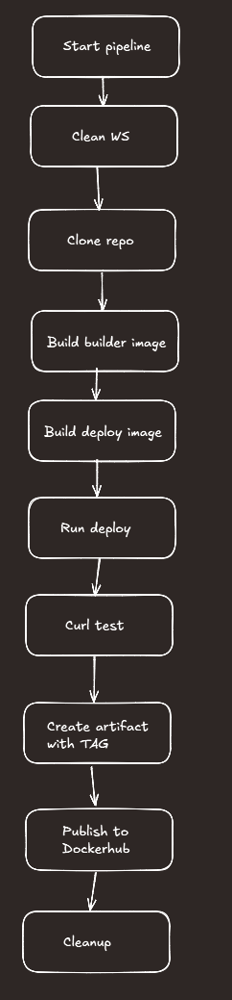
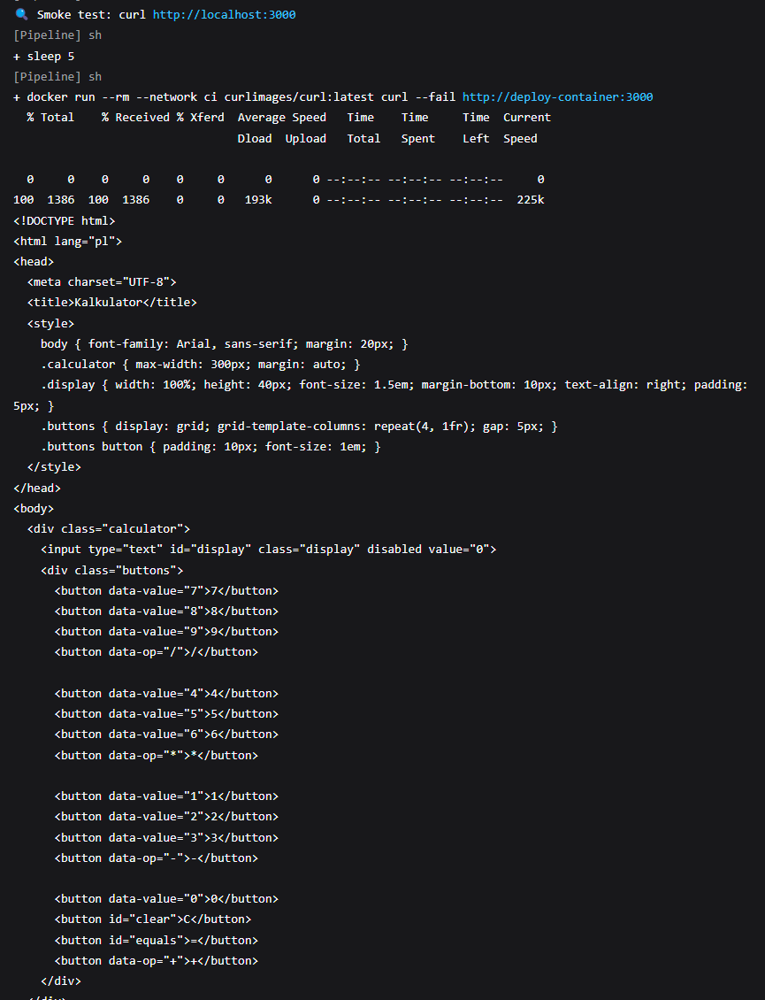
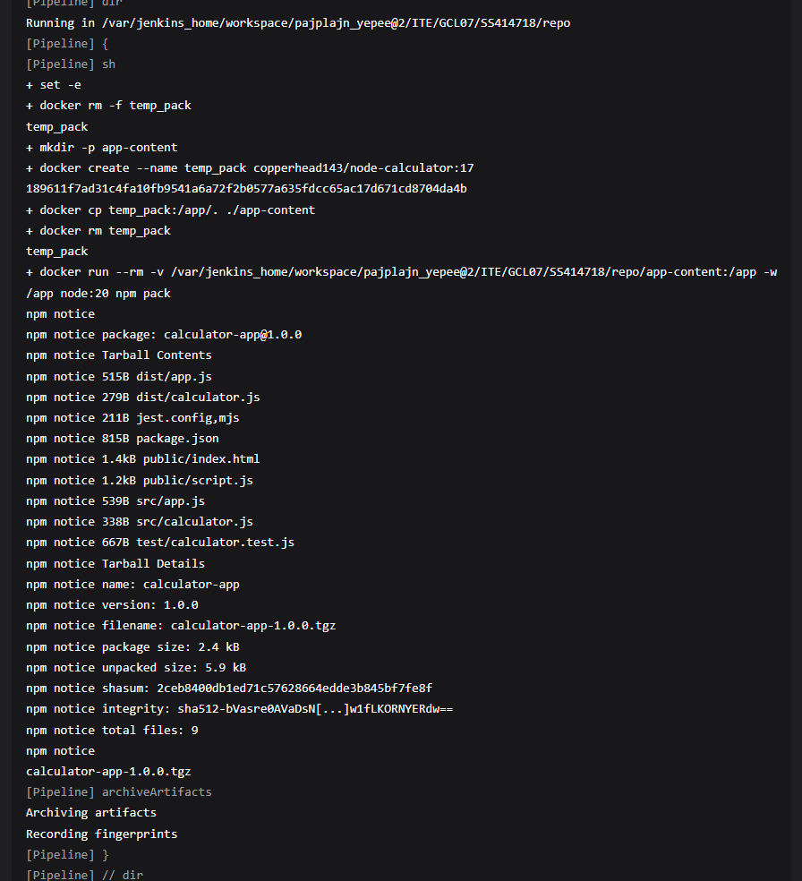
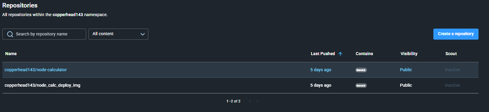
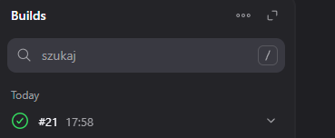

# Lab 5 - Jenkins

---

## Utworzenie instalacji Jenkinsa i uruchomienie
*Zainstalowano Jenkins zgodnie z dostarczoną dokumentacją, pozwalam sobie nie załączać tego procesu w sprawozdaniu, jedyne co było wymagane to przeczytanie kilku akapitów.*

---

## 1. Podstawowe projekty
### - Projekt *uname*

```sh
#!/bin/bash
uname -a
docker ps
```
---
### - Projekt *godzina*

```sh
#!/bin/bash

curr_hr=$(date +%H)
if (( curr_hr % 2 != 0 )); then
  echo "godzina nieparzysta"
  exit 1
else
  echo "godzina parzysta"
  exit 0
fi
```

## 2. Pipeline własnego projektu 
Do wykonania tego, użyłem swojej aplikacji prostego i w miarę nie działającego kalkulatora napisanego w `Node.js`.

### 2.1 Przygotowanie lokalne
---
#### 2.1.1 [Dockerfile używany do buildowania](Dockerfile.builder)
```dockerfile
FROM node:18-alpine
RUN apk add --no-cache git
RUN git clone https://github.com/copperhead143/AGH-Node-Calculator-DevOps.git
WORKDIR /AGH-Node-Calculator-DevOps
RUN npm install
RUN npm run build
```
Używam kontenera node z dodatkowym Gitem aby umożliwić sklonowanie repo z aplikacją

#### 2.1.2 [Dockerfile używany w kroku Deploy](Dockerfile.deploy)
```dockerfile
#syntax=docker/dockerfile:1.3
ARG BUILDER_IMAGE
FROM ${BUILDER_IMAGE} AS node_app_build
FROM node:18-alpine
WORKDIR /app
COPY --from=node_app_build /AGH-Node-Calculator-DevOps/node_modules ./node_modules
COPY --from=node_app_build /AGH-Node-Calculator-DevOps ./
EXPOSE 3000
CMD ["npm", "start"]
```
Ten Dockerfile wykonuje deploy, kopiuje *node_modules* oraz pliki źródłowe aplikacji, eksponuje port 3000 i uruchamia aplikację.

#### 2.1.3 Build kontenerów


#### 2.1.4 Utworzenie sieci
```sh
docker network create ci
```

#### 2.1.5 Uruchomienie kontenera deploy w sieci
```sh
docker run -it --rm --network ci --name node_deploy -p 3000:3000 node_app_deploy
```

#### 2.1.6 Uruchomienie kontenera ***curl*** na adres projektu
```sh
docker run --rm --network ci curlimages/curl curl -s http://web:3000
```


#### 2.1.7 Pushowanie obrazu na ***Dockerhub***
Czynnością wymaganą do tego kroku było zalogowanie się do Dockera na maszynie za pomocą komendy `docker login`
```sh
docker tag copperhead143/node_calc_deploy_img:latest copperhead143/node_calc_deploy_img:latest

docker push copperhead143/node_calc_deploy_img
```


---

### 2.2 Przygotowanie Pipeline w Jenkinsie
---

#### 2.2.1 Diagram UML


#### 2.2.2 Przygotowanie Pipeline w konifiguracji Jenkinsa
```groovy
pipeline {
  agent any
  environment {
    DOCKER_BUILDKIT = "1"
    IMAGE_NAME = "copperhead143/node-calculator"
    TAG        = "${BUILD_NUMBER}"
  }
  stages {
       stage('Clean') {
           steps {
               cleanWs()
            }
        }
    stage('Checkout') {
      steps {
        echo " Klonowanie repozytorium i przejście na main"
        git url: 'https://github.com/InzynieriaOprogramowaniaAGH/MDO2025_INO.git',
            branch: 'main'
        sh 'git checkout SS414718'
      }
    }
    
        
    stage('Build (builder)') {
      steps {
        echo "🔧 Budowanie obrazu builder:${TAG}"
        dir('ITE/GCL07/SS414718/repo'){
            sh """
                docker build \
                 -f Dockerfile.builder \
                -t builder:${TAG} \
                 .
             """
        }
      }
    }

    stage('Build (deploy image)') {
      steps {
        echo "budowanie finalnego obrazu ${IMAGE_NAME}:${TAG}"
        dir('ITE/GCL07/SS414718/repo'){
          sh """
            docker build \
              -f Dockerfile.deploy \
              --build-arg BUILDER_IMAGE=builder:${TAG} \
              -t ${IMAGE_NAME}:${TAG} \
              .
          """
        }
      }
    }

    stage('Run deploy container') {
      steps {
        echo "Usuwanie starego kontenera i uruchomienie nowego"
        sh 'docker rm -f deploy-container || true'
        sh """
        docker network create ci || true
          docker run -dit --rm \
          --network ci \
            --name deploy-container \
            -p 3000:3000 \
            ${IMAGE_NAME}:${TAG}
        """
      }
    }

    stage('Test HTTP') {
      steps {
        echo "curl"
        sh 'sleep 5'
            sh '''
            docker run --rm --network ci \
            curlimages/curl:latest \
            curl --fail http://deploy-container:3000
            '''
      }
    }
    
stage('Create .tgz Artifact') {
  steps {
    dir('ITE/GCL07/SS414718/repo') {
      sh '''
        set -e
        docker rm -f temp_pack
        mkdir -p app-content

        docker create --name temp_pack "$IMAGE_NAME:$TAG"

        docker cp temp_pack:/app/. ./app-content

        docker rm temp_pack

        docker run --rm \
          -v "$PWD/app-content":/app \
          -w /app node:20 \
          npm pack
      '''
      archiveArtifacts artifacts: 'app-content/*.tgz', fingerprint: true
    }
  }
}

        
    stage('Publish to DockerHub') {
      steps {
        echo "Wypychanie obrazu do Docker Hub"
        withCredentials([usernamePassword(
          credentialsId: 'szymon',
          usernameVariable: 'DOCKER_USER',
          passwordVariable: 'DOCKER_PASS'
        )]) {
          sh """
            echo "$DOCKER_PASS" | docker login -u "$DOCKER_USER" --password-stdin
            docker push ${IMAGE_NAME}:${TAG}
            docker tag ${IMAGE_NAME}:${TAG} ${IMAGE_NAME}:latest
            docker push ${IMAGE_NAME}:latest
          """
        }
      }
    }
  }

  post {
    always {
      echo "Pipeline zakończony"
    }
    cleanup {
      sh 'docker rm -f deploy-container || true'
    }
  }
}
```

Ten pipeline CI/CD w Jenkinsie czyści workspace, klonuje repozytorium, buduje etapowy obraz `builder:${BUILD_NUMBER}` z zależnościami (`Dockerfile.builder`) oraz finalny obraz `copperhead143/node-calculator:${BUILD_NUMBER}` (`Dockerfile.deploy`), uruchamia kontener w sieci `ci` na porcie 3000, weryfikuje endpoint przy pomocy obrazu `curl`, wyciąga katalog `/app` z kontenera, pakuje go jako `.tgz` (`npm pack`) i archiwizuje w Jenkinsie, a na końcu loguje się do Docker Huba za pomocą bezpiecznych poświadczeń i wypycha obrazy pod tagami `${BUILD_NUMBER}` oraz `latest`.

#### 2.2.3 Działanie pipeline (działanie jeszcze bez pakowania)


*nie wklejam, która to próba, bo wstyd*

#### 2.2.4 Działanie pipeline po dodaniu pakowania
`curl`



`pakowanie`


`działa`


`dockerhub`


#### 2.2.5 Konifguracja SCM



## 3. Podsumowanie
---
### 3.1 Napotkane problemy
 - Nie wiedzieć czemu, ale kontener DIND do Jenkinsa przestawał działać nawet po uśpieniu komputera, tym bardziej po wyłączeniu, wymagało to ponownej instalacji Jenkinsa wg. dokumentacji,
 - Po aktualizacji Windowsa, Fedora przestała się włączać, nie mam pojęcia jak to było ze sobą powiązane, może zbieg okoliczności, wyeksportowanie maszyny, usunięcie starej i przywrócenie naprawiło błąd,
 - Przez chwilę nie mogłem dojść do porozumienia ze ścieżkami w kopiowaniu, tak nie postawiłem kropki za /
  
### 3.2 LLM użycie
- Poprawa pipeline'a, dokładniej mówiąc tagowania,
- Instrukcja jak wpisać w bezpieczny sposób Credentials do Jenkinsa i ich użyć