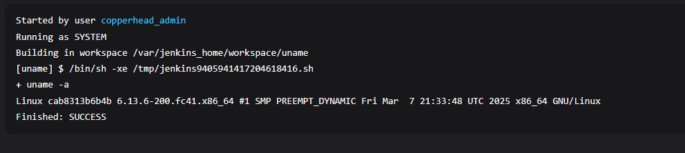
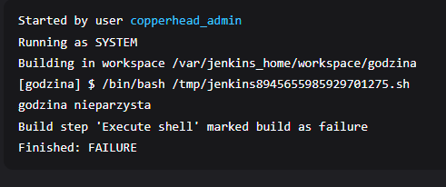
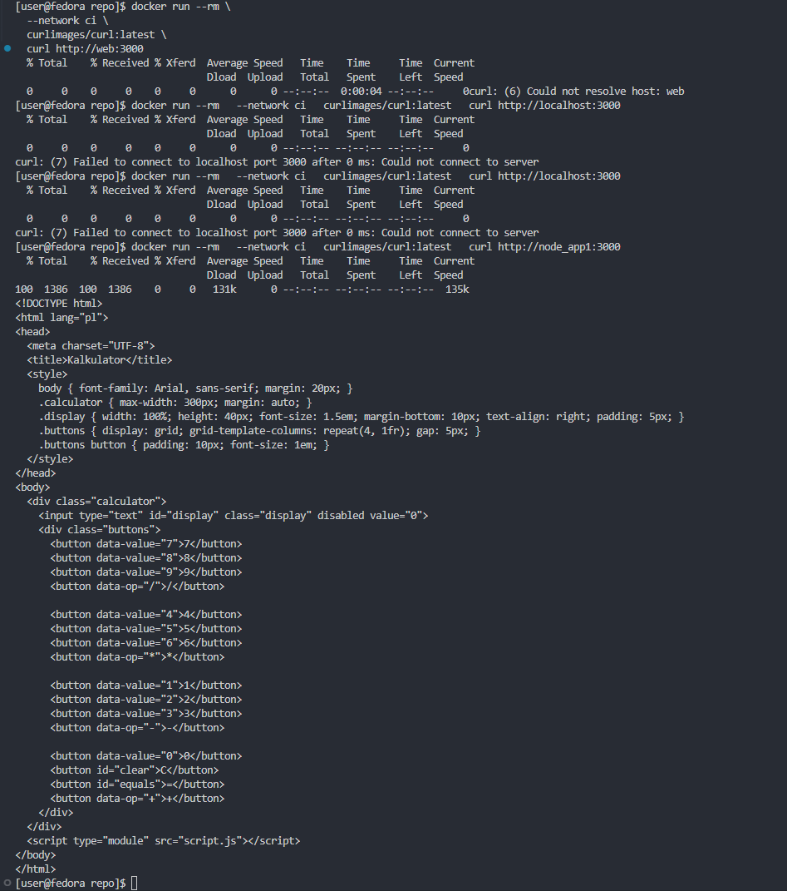
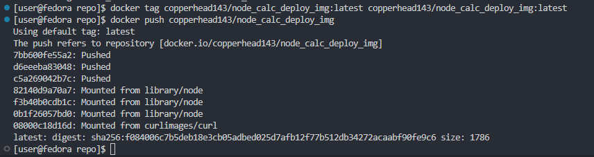
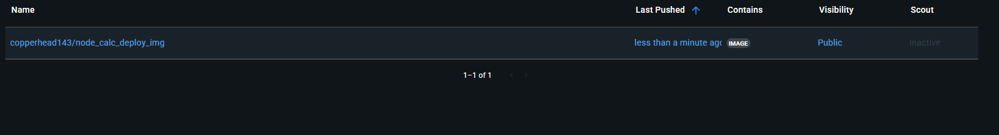

# Lab 5 - Jenkins

---

## Utworzenie instalacji Jenkinsa i uruchomienie
*Zainstalowano Jenkins zgodnie z dostarczoną dokumentacją, pozwalam sobie nie załączać tego procesu w sprawozdaniu, jedyne co było wymagane to przeczytanie kilku akapitów*

---

## 1. Podstawowe projekty
### - Projekt *uname*

```sh
#!/bin/bash
uname -a
docker ps
```
---
### - Projekt *godzina*

```sh
#!/bin/bash

curr_hr=$(date +%H)
if (( curr_hr % 2 != 0 )); then
  echo "godzina nieparzysta"
  exit 1
else
  echo "godzina parzysta"
  exit 0
fi
```
---
### - Projekt *obraz w kontenerze*
[//]: <> (tutaj wkleić działanie)

## 2. Pipeline własnego projektu 
Do wykonania tego, użyłem swojej aplikacji prostego i w miarę nie działającego kalkulatora napisanego w `Node.js`.

### 2.1Przygotowanie lokalne
---
#### 2.1.1 [Dockerfile używany do buildowania](Dockerfile.builder)
```dockerfile
FROM node:18-alpine
RUN apk add --no-cache git
RUN git clone https://github.com/copperhead143/AGH-Node-Calculator-DevOps.git
WORKDIR /AGH-Node-Calculator-DevOps
RUN npm install
RUN npm run build
```
Używam kontenera node z dodatkowym Gitem aby umożliwić sklonowanie repo z aplikacją

#### 2.1.2 [Dockerfile używany w kroku Deploy](Dockerfile.deploy)
```dockerfile
#syntax=docker/dockerfile:1.3
ARG BUILDER_IMAGE
FROM ${BUILDER_IMAGE} AS node_app_build
FROM node:18-alpine
WORKDIR /app
COPY --from=node_app_build /AGH-Node-Calculator-DevOps/node_modules ./node_modules
COPY --from=node_app_build /AGH-Node-Calculator-DevOps ./
EXPOSE 3000
CMD ["npm", "start"]
```
Ten Dockerfile wykonuje deploy, kopiuje *node_modules* oraz pliki źródłowe aplikacji, eksponuje port 3000 i uruchamia aplikację.

#### 2.1.3 Build kontenerów


#### 2.1.4 Utworzenie sieci
```sh
docker network create ci
```

#### 2.1.5 Uruchomienie kontenera deploy w sieci
```sh
docker run -it --rm --network ci --name node_deploy -p 3000:3000 node_app_deploy
```

#### 2.1.6 Uruchomienie kontenera ***curl*** na adres projektu
```sh
docker run --rm --network ci curlimages/curl curl -s http://web:3000
```


#### 2.1.7 Pushowanie obrazu na ***Dockerhub***
Czynnością wymaganą do tego kroku było zalogowanie się do Dockera na maszynie za pomocą komendy `docker login`
```sh
docker tag copperhead143/node_calc_deploy_img:latest copperhead143/node_calc_deploy_img:latest

docker push copperhead143/node_calc_deploy_img
```



---

### 2.2 Przygotowanie Pipeline w Jenkinsie
---
