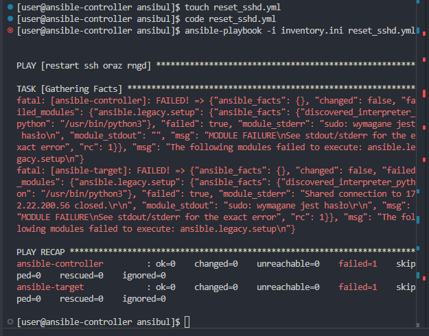
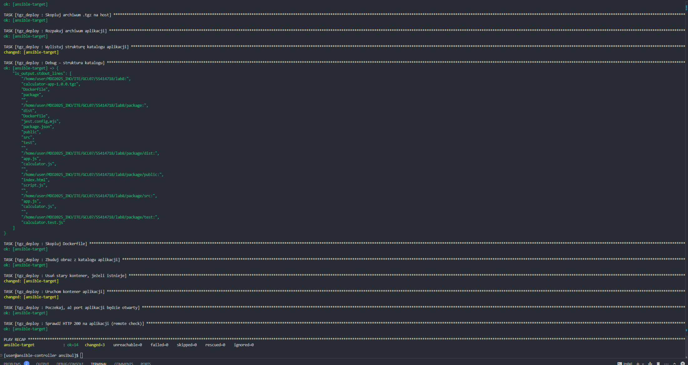
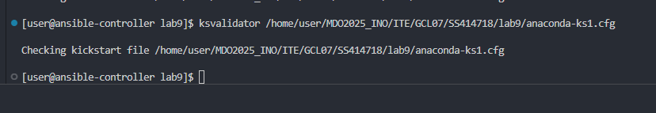
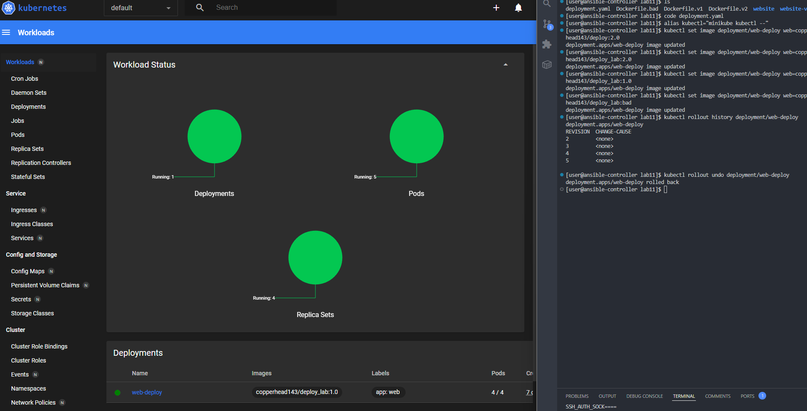

# Lab8 - Ansibul

## 8.1 Utworzyłem drugą maszynę Fedora, połaczenie przez SSH, hostname *ansible-target*, user *ansible*
Dodatkowo wymieniłem klucze ssh, oraz do `/etc/hosts/` dopisałem **"ip-hosta" ansible-taget** w celu możliwości połączenia się bez hasła
Obecnej maszynie nadałem hostname *ansible-controller* dla przejrzystości


## 8.2 Utworzyłem [plik inwentaryzacji](inventory.ini)
```ini
[Orchestrators]
ansible-controller ansible_connection=local

[Endpoints]
ansible-target   ansible_user=ansible   ansible_host=ansible-target   ansible_private_key_file=/home/user/.ssh/ansible-keys/ansible-target
```

## 8.3 Wysłanie [pinga](sit.yml) do wszystkich hostow za pomocą playbook'a
```yml
---
- name: Spinguj wszystkie hosty
  hosts: all
  gather_facts: no

  tasks:
    - name: Ping test
      ansible.builtin.ping:
```


## 8.4 Przekopiowanie pliku inwentaryzacji na drugą maszynę
```yml
---
- name: Copy inventory file to endpoints
  hosts: Endpoints
  tasks:
    - name: Copy inventory file
      ansible.builtin.copy:
        src: ./inventory.ini
        dest: /tmp/inventory.ini
```


## 8.5 Drugie wywołanie powoduje tylko sprawdzenie czy na docelowej maszynie znajduje się taki plik


## 8.6 Wywołanie [reset](reset_sshd.yml) sshd
```yml
- name: restart ssh
  hosts: all
  gather_facts: no
  become: yes
  tasks:
    - name: Restart sshd
      ansible.builtin.service:
        name: sshd
        state: restarted
```

### 8.6.1 Error

---
Jak widać nie można zrestować sshd bezpośrednio ze względu na to, że użytkownicy mają różne hasła.
Można to rozwiązać w prosty sposób dopisując w pliku inwentaryzacyjnym dyrektywy:
```ini
ansible_become_pass=zaq12wsxx
```
Jednak jest to rozwiązanie niebezpieczne, przez co zdecydowałem się na użycie drugiej opcji, jaką jest ansible_vault.

### 8.6.2 Ansible_vault
W domyślnym folderze `host_vars` utworzyłem dwa pliki, odpowiednio dla kontrolera i celu. W nich za pomocą polecenia
```sh
ansible-vault encrypt
```
zaszyfrowałem odpowiadające hasła.


Następnie przy wywołaniu playbook'a dodaje opcję **--ask-vault-pass**


Jak widać przechodzi bez problemów.

## 8.7 Próba pingu przy wyłączonej usłudze SSH


## 8.8 Inicjalizacja `ansible-galaxy` i roli `tgz-deploy`


### 8.8.1 [Defaults](roles/tgz_deploy/defaults/main.yml)
```yml
---
app_tgz: calculator-app-1.0.0.tgz
app_dir: /home/user/MDO2025_INO/ITE/GCL07/SS414718/lab8
image_name: calculator-app:1.0.0
container_name: calculator_app
ports:
  - "3001:3000"

# defaults file for roles/tgz_deploy
```

### 8.8.2 roles/tgz_deploy/files
***Umieściłem tylko paczkę .tgz będącą efektem pipelineu***

### 8.8.3 [Tasks](roles/tgz_deploy/tasks/main.yml)
```yml
---
- name: Upewnij się, że Docker jest zainstalowany
  ansible.builtin.dnf:
    name: docker
    state: present

- name: Uruchom i włącz docker
  ansible.builtin.systemd:
    name: docker
    state: started
    enabled: yes

- name: Utwórz katalog na aplikację
  ansible.builtin.file:
    path: "{{ app_dir }}"
    state: directory
    owner: ansible
    group: ansible
    mode: '0755'

- name: Skopiuj archiwum .tgz na host
  ansible.builtin.copy:
    src: "{{ app_tgz }}"
    dest: "{{ app_dir }}/{{ app_tgz }}"
    owner: ansible
    group: ansible
    mode: '0644'

- name: Rozpakuj archiwum aplikacji
  ansible.builtin.unarchive:
    src: "{{ app_dir }}/{{ app_tgz }}"
    dest: "{{ app_dir }}"
    remote_src: yes
    owner: ansible

- name: Wylistuj strukturę katalogu aplikacji
  ansible.builtin.command:
    cmd: ls -R "{{ app_dir }}"
  register: ls_output

- name: Debug – struktura katalogu
  ansible.builtin.debug:
    var: ls_output.stdout_lines

- name: Skopiuj Dockerfile
  ansible.builtin.template:
    src: Dockerfile.j2
    dest: "{{ app_dir }}/package/Dockerfile"
    owner: ansible
    mode: '0644'

- name: Zbuduj obraz z katalogu aplikacji
  community.docker.docker_image:
    name: "{{ image_name }}"
    tag: latest
    source: build
    build:
      path: "{{ app_dir }}/package"
      dockerfile: Dockerfile

- name: Usuń stary kontener, jeżeli istnieje
  community.docker.docker_container:
    name: "{{ container_name }}"
    state: absent
    force_kill: yes

- name: Uruchom kontener aplikacji
  community.docker.docker_container:
    name: "{{ container_name }}"
    image: "{{ image_name }}"
    state: started
    restart_policy: always
    ports: "{{ ports }}"

- name: Poczekaj, aż port aplikacji będzie otwarty
  ansible.builtin.wait_for:
    port: "{{ ports[0].split(':')[0] }}"
    state: started
    timeout: 60
  delegate_to: "{{ inventory_hostname }}"

- name: Sprawdź HTTP 200 na aplikacji (remote check)
  ansible.builtin.uri:
    url: "http://localhost:3000/"
    status_code: 200
    return_content: no
  delegate_to: "{{ inventory_hostname }}"

# tasks file for roles/tgz_deploy

```

### 8.8.4 [Dockerfile.j2](roles/tgz_deploy/templates/Dockerfile.j2) jako `Template`
```dockerfile
FROM node:18-alpine

WORKDIR /app
COPY . .

RUN npm install --production

EXPOSE 3000
CMD ["npm","start"]

```

### 8.8.5 Playbook [deploy_tgz](deploy_tgz.yml) używany do włączenia roli

## 8.9 Wywołanie `tgz_deploy`

`
Oczywiście zabrakło pythona do Dockera ;DDD
`


`
Teraz już działa
`

---

# Lab9 - Kopaćstart

## 9.1 Pobranie pliku [anaconda-ks.cfg](anaconda-ks1.cfg)
Pobrałem przez polecenie `cat` jako `sudo`

## 9.2 Utworzyłem nową maszynę Fedora
Użyłem pliku `.iso` w wersji everything, ponieważ limit danych w akademiku się zbliżał.

`Ważne aby maszyna była gen. 2.`

Kolejnym problemem jaki napotkałem na tym etapie był `Secure_boot`, który skutecznie uniemożliwiał włączenie się instalatora. Dlaczego tak jest? Nie mam pojęcia.

## 9.3 Modyfikacja pliku kickstart
```cfg
# Generated by Anaconda 41.35
# Generated by pykickstart v3.58
#version=DEVEL
textKv

# Keyboard layouts
keyboard --vckeymap=us --xlayouts='us'Kv
# System language
lang pl_PL.UTF-8

#zmiana hostname
network --bootproto=dhcp --device=eth0 --onboot=on --hostname=szymon

#partycjonowannie
ignoredisk --only-use=sda
clearpart --all --initlabel --drives=sda
autopart --type=lvm


bootloader --location=mbr --boot-drive=sda

timezone Europe/Warsaw --utc


# Root password
rootpw --iscrypted $y$j9T$xhKzK0c1vGm593WENUOP6niB$b2bORTZQi/F6hbjKBx6rdlr8blGj4n5aWC5/j7EksV5
user --groups=wheel --name=user --password=$y$j9T$IVATL/NZgLT7n4ukZPDoMLqP$9D2debDHBmbq1nqIsvB.QedZykAY7x7P1YKGc.ILVZD --iscrypted --gecos="szymon"

skipx
firstboot --enable
reboot

%packages
@^custom-environment
docker
wget
tar
git
%end


%post --log=/root/ks-post.log --interpreter /usr/bin/bash
set -x

systemctl enable docker.service

URL="https://raw.githubusercontent.com/copperhead143/AGH-Node-Calculator-DevOps/main/calculator-app-1.0.0.tgz"
wget -O /tmp/myapp.tgz "$URL"

mkdir -p /usr/local/bin
tar -xzf /tmp/myapp.tgz -C /usr/local/bin
chmod +x /usr/local/bin/myapp

cat > /etc/systemd/system/myapp.service << 'EOF'
[Unit]
Description=MyApp Service
After=network.target docker.service

[Service]
Type=simple
ExecStart=/usr/local/bin/myapp
Restart=on-failure

[Install]
WantedBy=multi-user.target
EOF

systemctl enable myapp.service

cat /root/ks-post.log > /dev/tty1
%end
```

## 9.4 Sprawdzenie pliku kickstart
W dokumentacji znalazłem sprytne narzędzie `ksvalidator`, ktore sprawdza poprawność pliku.
Z czystej ciekawości postanowiłem sprawdzić jak działa, plik nie wykazał żadnych błędów.


## 9.5 Host pliku kickstart na lokalnym serwerze HTTP


## 9.6 Edycja `GRUB`
Podczas instalacji, klikamy `e` na opcji *Install Fedora 41* po czym w GRUB dopisujemy linijkę:
```ini
inst.ks=http://111.222.333.444:8000/anaconda-ks1.cfg
```

## 9.7 Instalacja nienadzorowana


## 9.8 Działający Docker oraz aplikacja


# Lab10/11 - Kubernetes

## 10.1 Instalacja `minikube`
Kwestia przeklikania komend z dokumentacji, pozwoliłem sobie nie załączać screenów i dokładniejszych instrukcji.

*(wcale nie dlatego, że nie zrobiłem screenów)*

[**O tutaj tutorial**](https://minikube.sigs.k8s.io/docs/start/?arch=%2Flinux%2Fx86-64%2Fstable%2Fbinary+download)

## 10.2 Deploy pojedyńczego poda
Na tych zajęciach w celach demo używałem oficjalnego obrazu `nginx` w wersji latest.
```sh
kubectl run nginx-single --image=nginx -- port=80 --labels app=nginx-single
```

```sh
kubectl port-forward pod/nginx-single 8888:80
```

## 10.3 Deploy poda z 4 replikami


## 10.4 Eksport deploymentu do [YML](minikube.yaml)
```yml
kind: Deployment
apiVersion: apps/v1
metadata:
  name: nginx-depl
  namespace: default
  uid: c402e0a1-da80-4995-a4dc-2a64ebff7d32
  resourceVersion: '4197'
  generation: 2
  creationTimestamp: '2025-05-22T16:20:30Z'
  labels:
    app: nginx-depl
  annotations:
    deployment.kubernetes.io/revision: '1'
  managedFields:
    - manager: dashboard
      operation: Update
      apiVersion: apps/v1
      fieldsType: FieldsV1
      fieldsV1:
        f:spec:
          f:replicas: {}
      subresource: scale
    - manager: kubectl-create
      operation: Update
      apiVersion: apps/v1
      time: '2025-05-22T16:20:30Z'
      fieldsType: FieldsV1
      fieldsV1:
        f:metadata:
          f:labels:
            .: {}
            f:app: {}
        f:spec:
          f:progressDeadlineSeconds: {}
          f:revisionHistoryLimit: {}
          f:selector: {}
          f:strategy:
            f:rollingUpdate:
              .: {}
              f:maxSurge: {}
              f:maxUnavailable: {}
            f:type: {}
          f:template:
            f:metadata:
              f:labels:
                .: {}
                f:app: {}
            f:spec:
              f:containers:
                k:{"name":"nginx"}:
                  .: {}
                  f:image: {}
                  f:imagePullPolicy: {}
                  f:name: {}
                  f:resources: {}
                  f:terminationMessagePath: {}
                  f:terminationMessagePolicy: {}
              f:dnsPolicy: {}
              f:restartPolicy: {}
              f:schedulerName: {}
              f:securityContext: {}
              f:terminationGracePeriodSeconds: {}
    - manager: kube-controller-manager
      operation: Update
      apiVersion: apps/v1
      time: '2025-05-22T16:22:55Z'
      fieldsType: FieldsV1
      fieldsV1:
        f:metadata:
          f:annotations:
            .: {}
            f:deployment.kubernetes.io/revision: {}
        f:status:
          f:availableReplicas: {}
          f:conditions:
            .: {}
            k:{"type":"Available"}:
              .: {}
              f:lastTransitionTime: {}
              f:lastUpdateTime: {}
              f:message: {}
              f:reason: {}
              f:status: {}
              f:type: {}
            k:{"type":"Progressing"}:
              .: {}
              f:lastTransitionTime: {}
              f:lastUpdateTime: {}
              f:message: {}
              f:reason: {}
              f:status: {}
              f:type: {}
          f:observedGeneration: {}
          f:readyReplicas: {}
          f:replicas: {}
          f:updatedReplicas: {}
      subresource: status
spec:
  replicas: 4
  selector:
    matchLabels:
      app: nginx-depl
  template:
    metadata:
      creationTimestamp: null
      labels:
        app: nginx-depl
    spec:
      containers:
        - name: nginx
          image: nginx
          resources: {}
          terminationMessagePath: /dev/termination-log
          terminationMessagePolicy: File
          imagePullPolicy: Always
      restartPolicy: Always
      terminationGracePeriodSeconds: 30
      dnsPolicy: ClusterFirst
      securityContext: {}
      schedulerName: default-scheduler
  strategy:
    type: RollingUpdate
    rollingUpdate:
      maxUnavailable: 25%
      maxSurge: 25%
  revisionHistoryLimit: 10
  progressDeadlineSeconds: 600

```

## 11.1 Utworzenie 3 Dockerfile z dwoma działającymi wersjami, jeden nie działający, push na Dockerhub
[**Dockerfile.v1**](lab11/Dockerfile.v1)

Te obrazy różnią się jedynie plikiem `index.html`

[**Dockerfile.v2**](lab11/Dockerfile.v2)

[**Dockerfile.bad**](lab11/Dockerfile.bad)


## 11.2 [Deployment.yml](lab11/deployment.yaml) używany do stworzenia poda i replik


## 11.3 Zmiana ilości replik


## 11.4 Zmiana obrazów
**Na 2.0**


**Na 1.0**


**Na zepsute**


## 11.5 Rollback do ostatniej działającej wersji


## 11.6 Strategie uaktualnienia
**Recreate - zastąpi stary pod nowym**
```yml
strategy:
  type: Recreate
```

**RollingUpdate pozwala na okreslenie ile replik ma być uruchominych przy aktualizacji, a ile ma być wyłączone**
```yml
strategy:
  type: RollingUpdate
  rollingUpdate:
    maxUnavailable: 2
    maxSurge: 30%
```

# Wnioski

- **Ansible (Lab 8):**  
  • Bezhasłowe SSH i inwentaryzacja ułatwiają zarządzanie.  
  • `ansible-vault` pozwala bezpiecznie przechowywać hasła.  
  • Rola `tgz-deploy` pokazuje, jak w prosty sposób zainstalować Dockera, zbudować obraz i uruchomić kontener na docelowym hoście.

- **Kickstart (Lab 9):**  
  • Plik Kickstart umożliwia całkowicie zautomatyzowaną instalację Fedory (party­cjonowanie, użytkownicy, pakiety).  
  • Sekcja `%post` pozwala od razu uruchomić dodatkowe usługi (np. Docker, własną aplikację).  
  • `ksvalidator` pomaga szybko zweryfikować poprawność składni.

- **Kubernetes (Lab 10/11):**  
  • Deployment pojedynczego poda i port-forward to najprostszy test działania klastra.  
  • Deklaratywne skalowanie (liczba replik) oraz rollbacki umożliwiają szybkie reagowanie na błędy (np. wadliwy obraz).  
  • Strategie aktualizacji:  
    – **Recreate**: wyłącza stare pody przed uruchomieniem nowych (krótkie przestoje).  
    – **RollingUpdate**: wymienia instancje stopniowo, zapewniając ciągłość działania.
