- [Sprawozdanie z lab1](#sprawozdanie-z-lab1)
  - [1.1. Wygenereowanie klucza ssh metodą `ed25519`](#11-wygenereowanie-klucza-ssh-metodą-ed25519)
  - [1.2. Dodanie klucza SSH do GitHub'a](#12-dodanie-klucza-ssh-do-githuba)
  - [1.3. Sprawdzenie adresu IP maszyny wirtualnej fedora](#13-sprawdzenie-adresu-ip-maszyny-wirtualnej-fedora)
  - [1.4. Konfiguracja połączenia w VS Code z pomocą wtyczki Remote SSH](#14-konfiguracja-połączenia-w-vs-code-z-pomocą-wtyczki-remote-ssh)
  - [1.5. Napisanie hook'a](#15-napisanie-hooka)
  - [1.6. Nadanie uprawnień dla pliku `commit-message`](#16-nadanie-uprawnień-dla-pliku-commit-message)
  - [1.7. Sprawdzenie działania hook'a](#17-sprawdzenie-działania-hooka)
- [Sprawozdanie lab2](#sprawozdanie-lab2)
  - [2.1. Zainstalowanie `Docker'a`](#21-zainstalowanie-dockera)
  - [2.2 Zalogowanie się oraz pobranie wymaganych obrazów](#22-zalogowanie-się-oraz-pobranie-wymaganych-obrazów)
  - [2.3. Uruchomienie `busybox`](#23-uruchomienie-busybox)
  - [2.4. Interaktywne uruchomienie](#24-interaktywne-uruchomienie)
  - [2.5. `PID'y` dockerowe](#25-pidy-dockerowe)
  - [2.6. Aktualizacja pakietów w kontenerze Fedory](#26-aktualizacja-pakietów-w-kontenerze-fedory)
  - [2.7. Złożenie konteneru z `Dockerfile'a`](#27-złożenie-konteneru-z-dockerfilea)
  - [2.8. Odpalenie konteneru z Fedorą](#28-odpalenie-konteneru-z-fedorą)
  - [2.9. Usunięcie wszystkich obrazów](#29-usunięcie-wszystkich-obrazów)

# Sprawozdanie z lab1

---

## 1.1. Wygenereowanie klucza ssh metodą `ed25519`
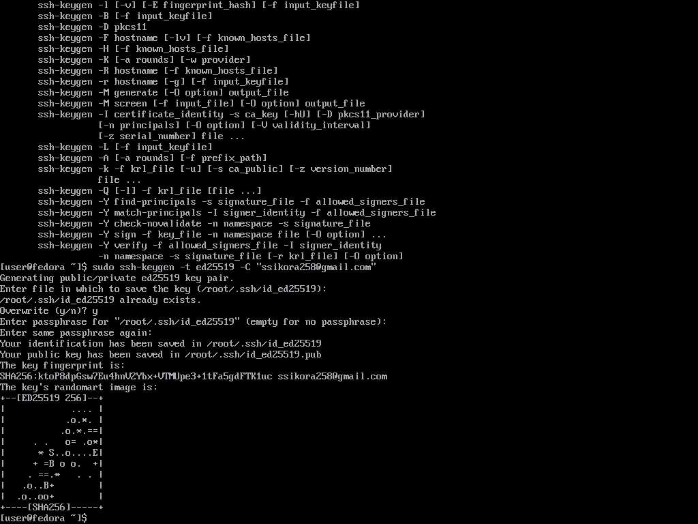

## 1.2. Dodanie klucza SSH do GitHub'a
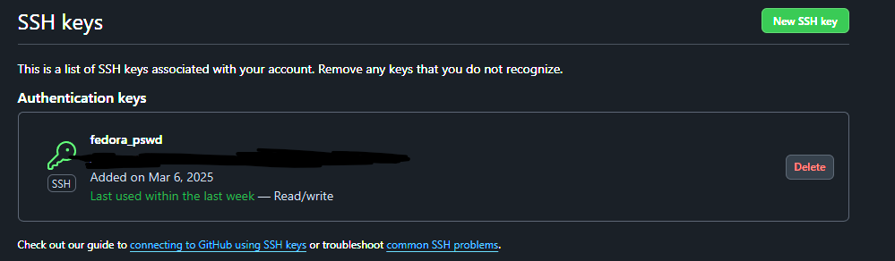

## 1.3. Sprawdzenie adresu IP maszyny wirtualnej fedora
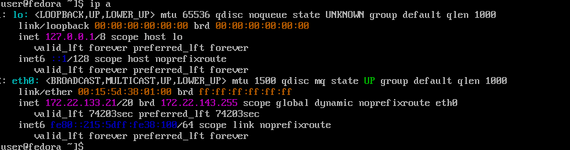

## 1.4. Konfiguracja połączenia w VS Code z pomocą wtyczki Remote SSH
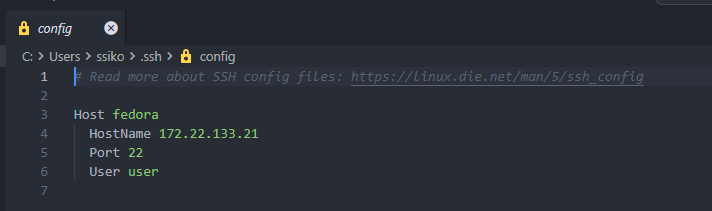

## 1.5. Napisanie hook'a 
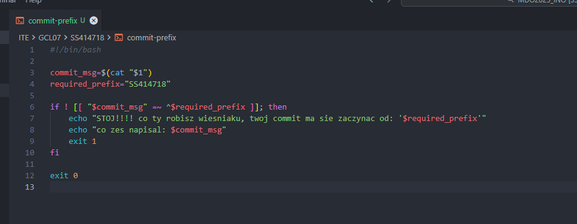

## 1.6. Nadanie uprawnień dla pliku `commit-message`
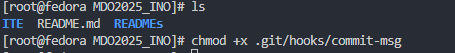

## 1.7. Sprawdzenie działania hook'a
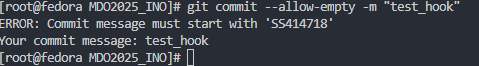

# Sprawozdanie lab2

---

## 2.1. Zainstalowanie `Docker'a`
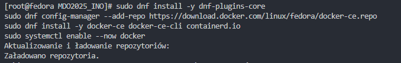

## 2.2 Zalogowanie się oraz pobranie wymaganych obrazów
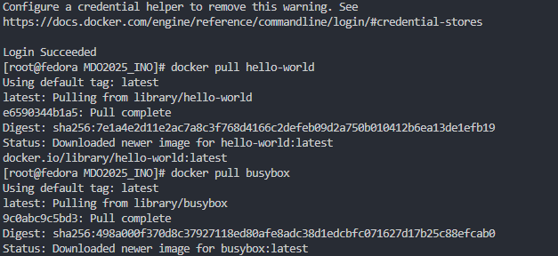

## 2.3. Uruchomienie `busybox`
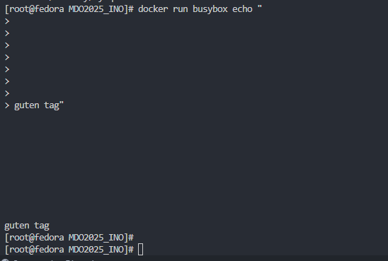

## 2.4. Interaktywne uruchomienie 
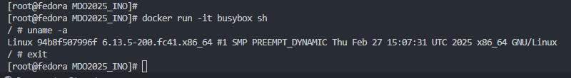

## 2.5. `PID'y` dockerowe
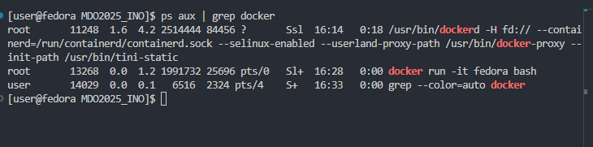
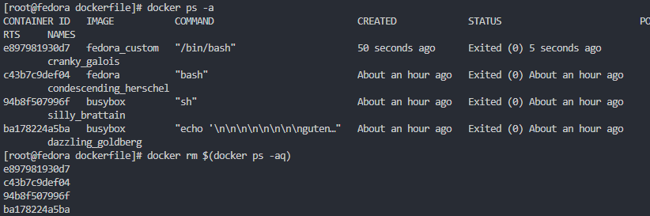

## 2.6. Aktualizacja pakietów w kontenerze Fedory
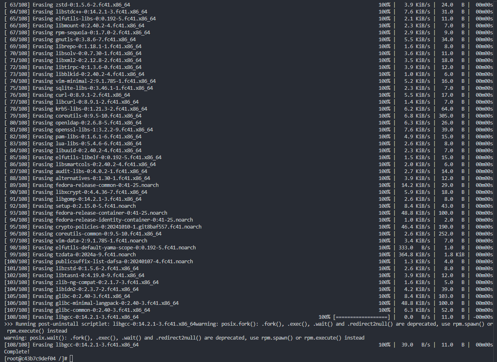

## 2.7. Złożenie konteneru z `Dockerfile'a`
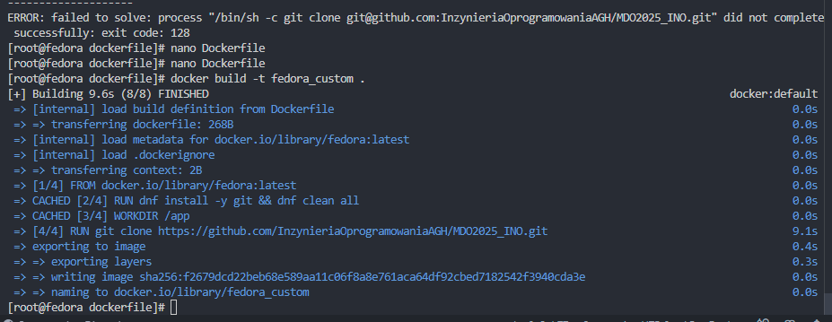

## 2.8. Odpalenie konteneru z Fedorą
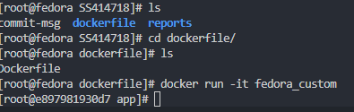

## 2.9. Usunięcie wszystkich obrazów
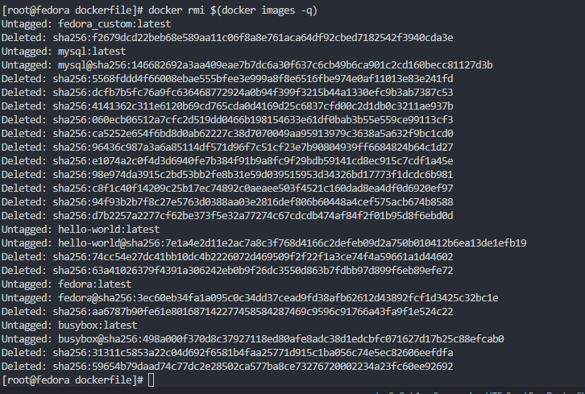