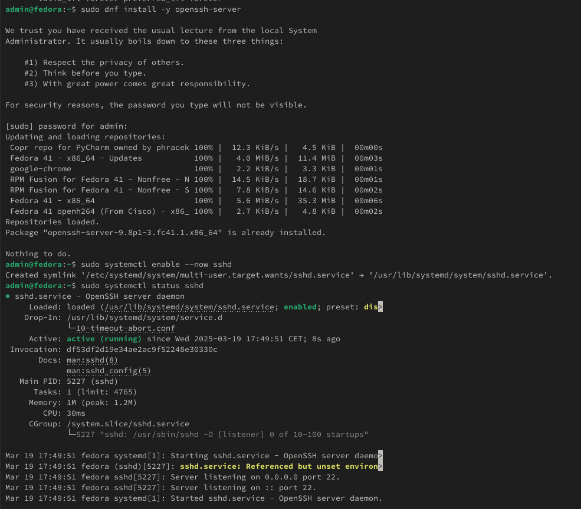
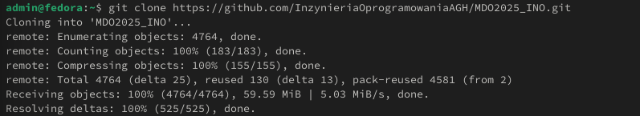
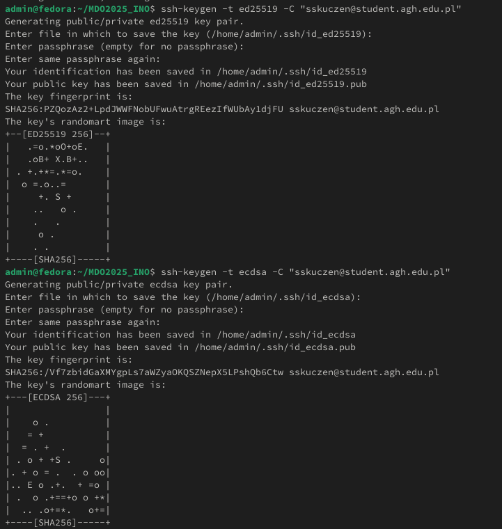
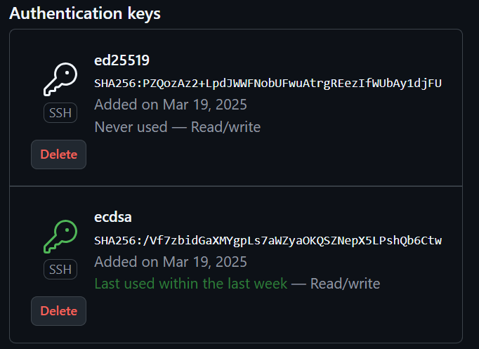
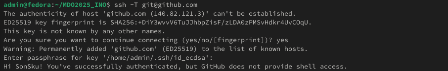
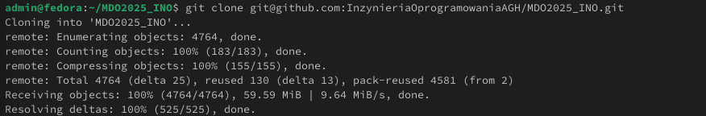
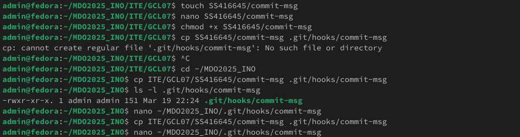
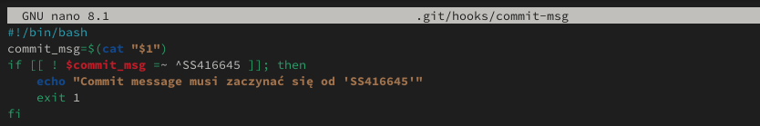

**Sprawozdanie**

**1\. Instalacja klienta Git i obsługi kluczy SSH**

**2\. Klonowanie repozytorium przez HTTPS i personal access token**

**3\. Klonowanie repozytorium za pomocą klucza SSH**

Dodanie kluczy do GitHub:

Testowanie dostępu:

ssh -T <git@github.com>

Klonowanie przez SSH:

**4\. Konfiguracja 2FA**

**5\. Przełączanie gałęzi**

**6\. Tworzenie katalogu**

**7\. Tworzenie Git Hooka**

Treść skryptu:

**8\. Dodanie pliku sprawozdania**

**9\. Próba scalania gałęzi do gałęzi grupowej**

**10\. Aktualizacja sprawozdania i wysyłka zmian**
