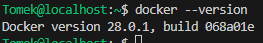
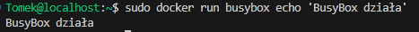
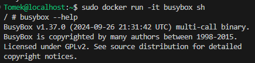
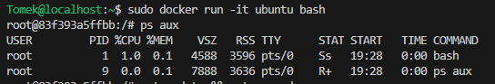
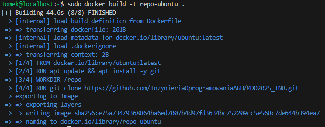
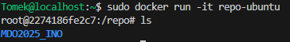
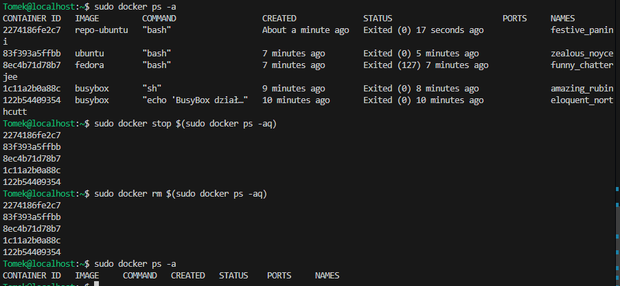

# Sprawozdanie 1

## Lab 1

1.  **Instalacja Git i konfiguracja SSH**

    Do instalacji Gita użyto polecenia:
    ```bash
    sudo dnf install git
    ```

    Sprawdzenie powodzenia instalacji wykonano za pomocą:
    ```bash
    git --version
    ```
    

    Wygenerowano dwa klucze SSH

    ```bash
    ssh-keygen -t ed25519 -C "tomek.sieminski23@gmail.com"
    ```
    Klucze zostały zapisane na GitHubie

    Po skonfigurowaniu kluczy, repozytorium zostało sklonowane przy użyciu SSH:
    ```bash
    git clone git@github.com:InzynieriaOprogramowaniaAGH/MDO2025_INO.git
    ```
    

2. **Konfiguracja gałęzi w Git**

    Przełączono się na gałąź main, a potem na gałąź grupy 7

    Utworzono gałąź o nazwie 'TS416767':
    ```bash
    git checkout -b TS416767
    ```
    

3. **Tworzenie katalogu i githooka**

    Utworzono katalog w /ITE/GCL07
    ```bash
    mkdir TS416767
    ```

    

    Napisano hooka commit-msg do walidacji prefiksu w commitach
    ```bash
    #!/bin/bash
    COMMIT_MSG_FILE=$1
    COMMIT_MSG=$(head -n 1 "$COMMIT_MSG_FILE")

    if [[ ! "$COMMIT_MSG" =~ ^TS416767 ]]; then
        echo "ERROR: Każdy commit MUSI zaczynać się od 'TS416767'!!!"
        exit 1
    fi
    exit 0		
    ```

    Umieszczono go w odpowiednim katalogu

    

    Dodano odpowiednie uprawnienia
    ```bash
    chmod +x .git/hooks/commit-msg
    ```

    Przetestowano czy hook działa

    

4. **Dodanie zrzutów ekranu i utworzenie sprawozdania**

    Dodano zrzuty ekranu do katalogu 'Lab1'

    Stworzono sprawozdanie i przesłano je do repozytorium zdalnego

    

## Lab 2

1. **Instalacja Dockera**
    ```bash
    sudo dnf install -y dnf-plugins-core
    sudo dnf install -y docker
    sudo systemctl start docker
    sudo systemctl enable docker
    ```

    Sprawdzenie wersji Dockera
    

2. **Rejestracja w DockerHub**

    Zarejestrowano się w DockerHub

    

    Zalogowano się na utworzone konto w Fedorze

    

3. **Pobieranie obrazów Dockera**

    Pobrano wybrane obrazy przy pomocy komend:

    ```bash
    docker pull hello-world
    docker pull busybox
    docker pull ubuntu
    docker pull fedora
    docker pull mysql
    ```

    Pobrane obrazy

    

4. **Uruchomienie kontenera BusyBox**

    Uruchomienie proste:
    

    Uruchomienie w trybie interaktywnym:
    


5. **Uruchomienie Ubuntu w kontenerze**

    Sprawdzenie procesu PID 1 w kontenerze:  

    

    Aktualizacja pakietów w kontenerze:
    ```bash 
    apt update && apt upgrade -y
    ```

    Wyjście z kontenera
    ```bash 
    exit
    ```
6. **Tworzenie Dockerfile**

    Utworzono plik Dockerfile  

    ```bash 
    FROM ubuntu:latest

    RUN apt update && apt install -y git

    WORKDIR /repo
    RUN git clone https://github.com/InzynieriaOprogramowaniaAGH/MDO2025_INO.git

    CMD ["bash"]                        
    ```

    Zbudowano obraz
    

    Uruchomiono kontener i sprawdzono repozytorium
    

7. **Usuwanie kontenerów i obrazów**

    Sprawdzono listy wszystkich kontenerów, a następnie zatrzymano i usunięto:

    

## Lab 3
