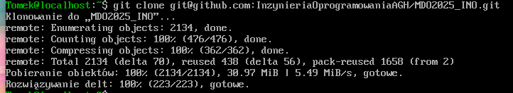
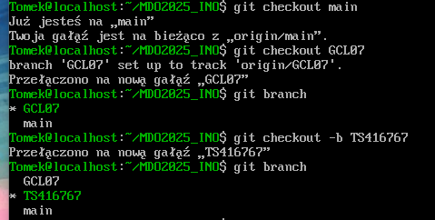
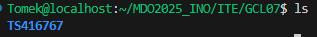
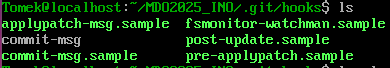
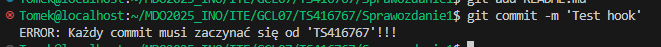
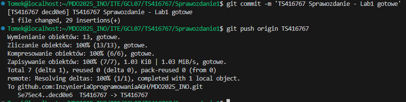

# Sprawozdanie 1

## Lab 1

1.  **Instalacja Git i konfiguracja SSH**

    Do instalacji Gita użyto polecenia:
    ```bash
    sudo dnf install git
    ```

    Sprawdzenie powodzenia instalacji wykonano za pomocą:
    ```bash
    git --version
    ```
    

    Wygenerowano dwa klucze SSH

    ```bash
    ssh-keygen -t ed25519 -C "tomek.sieminski23@gmail.com"
    ```
    Klucze zostały zapisane na GitHubie

    Po skonfigurowaniu kluczy, repozytorium zostało sklonowane przy użyciu SSH:
    ```bash
    git clone git@github.com:InzynieriaOprogramowaniaAGH/MDO2025_INO.git
    ```
    

2. **Konfiguracja gałęzi w Git**

    Przełączono się na gałąź main, a potem na gałąź grupy 7

    Utworzono gałąź o nazwie 'TS416767':
    ```bash
    git checkout -b TS416767
    ```
    

3. **Tworzenie katalogu i githooka**

    Utworzono katalog w /ITE/GCL07
    ```bash
    mkdir TS416767
    ```

    

    Napisano hooka commit-msg do walidacji prefiksu w commitach
    ```bash
    #!/bin/bash
    COMMIT_MSG_FILE=$1
    COMMIT_MSG=$(head -n 1 "$COMMIT_MSG_FILE")

    if [[ ! "$COMMIT_MSG" =~ ^TS416767 ]]; then
        echo "ERROR: Każdy commit MUSI zaczynać się od 'TS416767'!!!"
        exit 1
    fi
    exit 0		
    ```

    Umieszczono go w odpowiednim katalogu

    

    Dodano odpowiednie uprawnienia
    ```bash
    chmod +x .git/hooks/commit-msg
    ```

    Przetestowano czy hook działa

    

4. **Dodanie zrzutów ekranu i utworzenie sprawozdania**

    Dodano zrzuty ekranu do katalogu 'Lab1'

    Stworzono sprawozdanie i przesłano je do repozytorium zdalnego

    

## Lab 2
