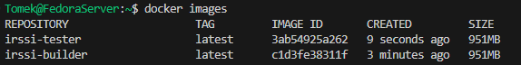
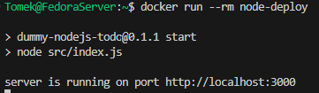
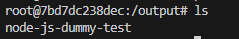

# Sprawozdanie 1

## Lab 1

1.  **Instalacja Git i konfiguracja SSH**

    Do instalacji Gita użyto polecenia:
    ```bash
    sudo dnf install git
    ```

    Sprawdzenie powodzenia instalacji wykonano za pomocą:
    ```bash
    git --version
    ```
    

    Wygenerowano dwa klucze SSH

    ```bash
    ssh-keygen -t ed25519 -C "tomek.sieminski23@gmail.com"
    ```
    Klucze zostały zapisane na GitHubie

    Po skonfigurowaniu kluczy, repozytorium zostało sklonowane przy użyciu SSH:
    ```bash
    git clone git@github.com:InzynieriaOprogramowaniaAGH/MDO2025_INO.git
    ```
    

2. **Konfiguracja gałęzi w Git**

    Przełączono się na gałąź main, a potem na gałąź grupy 7

    Utworzono gałąź o nazwie 'TS416767':
    ```bash
    git checkout -b TS416767
    ```
    

3. **Tworzenie katalogu i githooka**

    Utworzono katalog w /ITE/GCL07
    ```bash
    mkdir TS416767
    ```

    

    Napisano hooka commit-msg do walidacji prefiksu w commitach
    ```bash
    #!/bin/bash
    COMMIT_MSG_FILE=$1
    COMMIT_MSG=$(head -n 1 "$COMMIT_MSG_FILE")

    if [[ ! "$COMMIT_MSG" =~ ^TS416767 ]]; then
        echo "ERROR: Każdy commit MUSI zaczynać się od 'TS416767'!!!"
        exit 1
    fi
    exit 0		
    ```

    Umieszczono go w odpowiednim katalogu

    

    Dodano odpowiednie uprawnienia
    ```bash
    chmod +x .git/hooks/commit-msg
    ```

    Przetestowano czy hook działa

    

4. **Dodanie zrzutów ekranu i utworzenie sprawozdania**

    Dodano zrzuty ekranu do katalogu 'Lab1'

    Stworzono sprawozdanie i przesłano je do repozytorium zdalnego

    

## Lab 2

1. **Instalacja Dockera**
    ```bash
    sudo dnf install -y dnf-plugins-core
    sudo dnf install -y docker
    sudo systemctl start docker
    sudo systemctl enable docker
    ```

    Sprawdzenie wersji Dockera

    

2. **Rejestracja w DockerHub**

    Zarejestrowano się w DockerHub

    

    Zalogowano się na utworzone konto w Fedorze

    

3. **Pobieranie obrazów Dockera**

    Pobrano wybrane obrazy przy pomocy komend:

    ```bash
    docker pull hello-world
    docker pull busybox
    docker pull ubuntu
    docker pull fedora
    docker pull mysql
    ```

    Pobrane obrazy

    

4. **Uruchomienie kontenera BusyBox**

    Uruchomienie proste:

    

    Uruchomienie w trybie interaktywnym:

    


5. **Uruchomienie Ubuntu w kontenerze**

    Sprawdzenie procesu PID 1 w kontenerze:  

    

    Aktualizacja pakietów w kontenerze:
    ```bash 
    apt update && apt upgrade -y
    ```

    Wyjście z kontenera
    ```bash 
    exit
    ```
6. **Tworzenie Dockerfile**

    Utworzono plik Dockerfile  

    ```bash 
    FROM ubuntu:latest

    RUN apt update && apt install -y git

    WORKDIR /repo
    RUN git clone https://github.com/InzynieriaOprogramowaniaAGH/MDO2025_INO.git

    CMD ["bash"]                        
    ```

    Zbudowano obraz

    

    Uruchomiono kontener i sprawdzono repozytorium

    

7. **Usuwanie kontenerów i obrazów**

    Sprawdzono listy wszystkich kontenerów, a następnie zatrzymano i usunięto:

    

## Lab 3

### Repozytoria programów
- [Irssi](https://github.com/irssi/irssi)
- [Node-js-dummy-test](https://github.com/devenes/node-js-dummy-test)

#### 1. Przeprowadzenie testów - irssi
- Klonowanie repozytorium:
    ```
    git clone https://github.com/irssi/irssi.git
    ```
    
- Instalacja `meson`:
    ```
    sudo dnf install meson
    ```
    

- Sprawdzenie brakujących zależności:
    ```
    meson build
    ```
- Instalacja potrzebnych zależności:
    ```
    dnf -y install meson gcc glib2-devel openssl-devel ncurses-devel utf8proc-devel cmake pkg-config libssl-devel perl-devel perl-ExtUtils*
    ```
- Zbudowanie aplikacji i uruchomienie testów:
    ```
    meson build
    ```
    ```
    ninja test
    ```
    

#### 2. Przeprowadzenie buildu irssi interaktywnie w kontenerze
- Uruchomienie kontenera z obrazu Fedory:
    ```
    docker run -it --rm fedora bash
    ```
- Sklonowanie repozytorium:
    ```
    git clone https://github.com/irssi/irssi.git
    ```
- Instalacja zależności i zbudowanie obrazu:
    ```
    dnf -y install meson gcc glib2-devel openssl-devel ncurses-devel utf8proc-devel cmake pkg-config libssl-devel perl-devel perl-ExtUtils*
    ```
    ```
    meson build
    ```
    

---

Utworzenie pliku `irssi-build.Dockerfile` - do budowania aplikacji:

```dockerfile
FROM fedora

RUN dnf -y update && dnf -y install git meson ninja* gcc glib2-devel utf8proc* ncurses* perl-Ext*

RUN git clone https://github.com/irssi/irssi.git
WORKDIR /irssi
RUN meson build
RUN meson compile -C build
```

Utworzenie pliku `irssi-test.Dockerfile` - do tworzenia obrazu z uruchomionymi testami:

```dockerfile
FROM irssi-builder

WORKDIR /irssi/Build
RUN meson test -C build
```

Do zbudowania obrazu kontenera używamy polecenia:
```
docker build -t irssi-builder -f ./irssi-build.Dockerfile .
```
Po wykonaniu tego polecenia, Docker tworzy obraz na podstawie pliku `irssi-build.Dockerfile`, który zawiera instrukcje potrzebne do zbudowania naszej aplikacji. Obraz ten oznaczamy tagiem `irssi-builder`.


Z zbudowanego obrazu możemy uruchomić kontener poleceniem:
```
docker run irssi-builder
```
Jednak, zgodnie z naszą konfiguracją, kontener ten zakończy działanie od razu po uruchomieniu, ponieważ nie został zaprojektowany do długotrwałego działania czy interaktywnego użytkowania. Obraz ten ma służyć wyłącznie do zbudowania naszej aplikacji, a nie do jej uruchomienia czy użytkowania.

Aby przetestować naszą aplikację, tworzymy inny obraz Docker, tym razem z przeznaczeniem do uruchamiania testów. Do tego celu używamy innego Dockerfile:
```
docker build -t irssi-tester -f ./irssi-test.Dockerfile .
```
Tym sposobem zbudowany obraz `irssi-tester` jest przeznaczony do uruchamiania testów. Podobnie jak w przypadku budowania, obraz ten jest specjalnie zaprojektowany do wykonania testów i nie jest przeznaczony do długotrwałego działania jako kontener.



Dzięki takiej konfiguracji, mamy oddzielne obrazy dla procesu budowania (`irssi-builder`) i testowania (`irssi-tester`) naszej aplikacji. Obrazy te są używane wyłącznie do swoich dedykowanych zadań. Uruchomienie kontenera z tych obrazów bezpośrednio nie uruchomi aplikacji ani testów automatycznie. Akcje te wykonujemy tylko poprzez proces budowania Dockera z odpowiednim Dockerfile.

---

### Aplikacja w node

Uruchomienie interaktywne kontenera poleceniem:
```
sudo docker run --rm -it node /bin/bash
```
Aktualizacja listy dostępnych pakietów i ich wersji:
```
apt-get update
```
Sklonowanie repozytorium:
```
git clone https://github.com/devenes/node-js-dummy-test
```
W katalogu `node-js-dummy-test` instalujemy potrzebne zależności:
```
npm install
```
Uruchomienie testów:
```
npm run test
```


---

#### Automatyzacja procesu korzystając z plików Dockerfile

Utworzenie plików `node-build.Dockerfile`, `node-test.Dockerfile` oraz `node-deploy.Dockerfile`

**node-build.Dockerfile**
```dockerfile
FROM node

RUN git clone https://github.com/devenes/node-js-dummy-test
WORKDIR /node-js-dummy-test

RUN npm install
```

**node-test.Dockerfile**
```dockerfile
FROM node-builder

RUN npm test
```

**node-deploy.Dockerfile**
```dockerfile
FROM node-builder

CMD ["npm", "start"]
```

Budowanie obrazów:
```
docker build -t node-builder -f ./node-build.Dockerfile .
docker build -t node-tester -f ./node-test.Dockerfile .
docker build -t node-deploy -f ./node-deploy.Dockerfile .
```


Uruchomienie aplikacji:
```
docker run --rm node-deploy
```


---


## Lab4
#### 1. Zbudowanie obrazu kontenera z poprzednich laboratoriów
```
docker build -t base-node .
```

#### 2. Przygotowanie woluminów wejściowego i wyjściowego, i podłączenie ich do kontenera bazowego.
- Przygotowanie woluminów
    ```
    docker volume create input_volume
    docker volume create output_volume
    ```
    
    
#### 3. Uruchomienie kontenera
```
docker run -it --name base-cont -v input_volume:/input -v output_volume:/output base-node bash
```

#### 4. Sklonowanie repozytorium na wolumin wejściowy
Sklonowanie repozytorium do wolumina wejściowego za pomocą `docker copy`
```
docker cp ../node-js-dummy-test base-cont:/input
```

#### 6. Instalacja zależności i testowanie
```
npm install
```
```
npm test
```

#### 7. Przeniesienie zbudowanego programu do woluminu wyjściowego
```
cp -r /input/node-js-dummy-test/ /output/
```

### Eksponowanie portu

#### 1. Uruchomienie wewnątrz kontenera serwera iperf (iperf3)
- Pobranie obrazu
    ```
    docker pull networkstatic/iperf3
    ```
    
- Uruchomienie obrazu
    ```
    docker run -it --name=perfcont -p 5201:5201 networkstatic/iperf3 -s
    ```
    
#### 3. Połączenie się z nim z drugiego kontenera, zbadanie ruchu
- Zbadanie ruchu
    ```
    docker inspect perfcont
    ```
    
- Podłączenie się z drugiego kontenera
    ```
    docker run -it --name=drugi networkstatic/iperf3 -c 172.21.255.66
    ```
    
#### 4. Pobranie iperf3
```
dnf install iperf3
```

#### 5. Łączenie się z hosta i zbadanie ruchu
```
iperf3 -c localhost -p 5201
```

#### 6. Połączenie się spoza hosta
```Powershell
.\iperf3.exe -c 172.21.255.66 -p 5201
```

