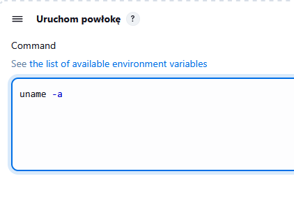

# Sprawozdanie 2 
### Tomasz Siemiński [TS416767]

# Pipeline, Jenkins, izolacja etapów

### Pobranie i uruchomienie Jenkinsa w Dockerze
1. **Utworzenie sieci w Dockerze, używając polecenia** 
    ```ssh
    docker network create jenkins
    ```
    

2. **Pobranie i uruchomienie `Dind`** za pomocą `docker run`
    ```
    docker run --name jenkins-docker --rm --detach --privileged --network jenkins --network-alias docker --env DOCKER_TLS_CERTDIR=/certs --volume jenkins-docker-certs:/certs/client --volume jenkins-data:/var/jenkins_home --publish 2376:2376 docker:dind --storage-driver overlay2
    ```
    

3. **Utworzenie pliku Dockerfile**
    ```dockerfile
    FROM jenkins/jenkins:2.492.3-jdk17
    USER root
    RUN apt-get update && apt-get install -y lsb-release ca-certificates curl && \
        install -m 0755 -d /etc/apt/keyrings && \
        curl -fsSL https://download.docker.com/linux/debian/gpg -o /etc/apt/keyrings/docker.asc && \
        chmod a+r /etc/apt/keyrings/docker.asc && \
        echo "deb [arch=$(dpkg --print-architecture) signed-by=/etc/apt/keyrings/docker.asc] \
        https://download.docker.com/linux/debian $(. /etc/os-release && echo \"$VERSION_CODENAME\") stable" \
        | tee /etc/apt/sources.list.d/docker.list > /dev/null && \
        apt-get update && apt-get install -y docker-ce-cli && \
        apt-get clean && rm -rf /var/lib/apt/lists/*
    USER jenkins
    RUN jenkins-plugin-cli --plugins "blueocean docker-workflow"
    ```
4. **Zbudowanie obrazu na podstawie powyższego Dockefile'a za pomocą `docker build`**
    ```
    docker build -t myjenkins-blueocean:2.492.3-1 .
    ```
    
5. **Uruchomienie Jenkins'a w dokerze za pomocą `docker run`**
    ```
    docker run   --name jenkins-blueocean   --restart=on-failure   --detach   --network jenkins   --env DOCKER_HOST=tcp://docker:2376   --env DOCKER_CERT_PATH=/certs/client   --env DOCKER_TLS_VERIFY=1   --publish 8080:8080   --publish 50000:50000   --volume jenkins-data:/var/jenkins_home   --volume jenkins-docker-certs:/certs/client:ro   myjenkins-blueocean:2.492.3-1
    ```
    

6. **Otwarcie Jenkins'a na porcie `8080` i rozpoczęcie pracy**


### Projekty wstępne

1. **Utworzenie projektu wyświetlającego `uname`**  
   Stworzenie projektu, który wyświetla wynik polecenia `uname`.
   ```groovy
    uname -a
   ```
   
   

2. **Utworzenie projektu testowego**  
   Stworzenie projektu, który zwraca błąd, gdy godzina jest nieparzysta.
   ```groovy
    #!/bin/bash
    current_hour=$(date +"%H")
    if [ $((current_hour % 2)) -ne 0]; then
    echo "FAILURE: The hour is odd."
    exit 1
    fi
    echo "SUCCESS: The hour is even."
   ```
   
   


3. **Obiekt pipeline w Jenkinsie**
    Utworzenie projektu typu `Pipeline`, który:
    - Sklonuje repo przedmiotowe (MDO2025_INO)
    - Zrobi checkout do pliku Dockerfile na osobistej gałęzi
    - Zbuduje obraz z Dockerfile'a

    Plik node-js-build.Dockerfile

    ```dockerfile
    FROM node:23-alpine

    RUN apk add --no-cache git
    RUN git clone https://github.com/devenes/node-js-dummy-test
    WORKDIR /node-js-dummy-test

    RUN npm install
    ```

    Pipeline script

    ```groovy
    pipeline {
        agent any

        environment {
            IMAGE_NAME = 'obraz'
        }

        stages {
            stage('Klonowanie repozytorium') {
                steps {
                    git branch: 'TS416767', url: 'https://github.com/InzynieriaOprogramowaniaAGH/MDO2025_INO.git'
                }
            }

            stage('Budowanie obrazu Docker') {
                steps {
                    script {
                        sh "docker build -t $IMAGE_NAME -f ./ITE/GCL07/TS416767/node-js-build.Dockerfile ."
                    }
                }
            }
        }
    }
    ```
    
    

## Pipeline z aplikacją Node-JS-DUMMY ###

### Diagram UML ###
Diagram przedstawia plan uruchomienia aplikacji NODE-JS-DUMMY przy użyciu SCM.


***Zmienne środowiskowe***
Zdefiniowane zmienne środowiskowe w `Jenkinsfile`:
 - `DIR` - ścieżka do katalogu z projektem
 - `BUILD` - nazwa obrazu budującego
 - `TEST` - nawa obrazu wykonującego testy
 - `DEPLOY` - nazwa obrazu wypychającego aplikację 

 
```groovy
environment {
    DIR = 'MDO2025_INO/ITE/GCL07/TS416767/Pipeline'
    BUILD = "node-build:23-alpine"
    TEST = "node-test:v${BUILD_NUMBER}"
    DEPLOY = "node-deploy:v${BUILD_NUMBER}"
}
```

### Stages ###
**Prepare**

- Klonowanie repozytorium Git oraz przełączenie na konkretną gałąź.

- **Kroki**:
    1. Usunięcie katalogu `MDO2025_INO` ( o ile istnieje).
    2. Klonowanie repozytorium z `https://github.com/InzynieriaOprogramowaniaAGH/MDO2025_INO.git`.
    3. Przełączanie się na gałąź `TS416767`.


```groovy
stage('Prepare') {
            steps {
                sh '''
                    rm -rf MDO2025_INO
                    git clone https://github.com/InzynieriaOprogramowaniaAGH/MDO2025_INO.git
                    cd MDO2025_INO
                    git checkout TS416767
                '''
            }
}
```
**Logs**
 
- Tworzenie katalogu dla logów.
    
- **Kroki**:
    1. Tworzenie katalogu `logs` w katalogu projektu.

```groovy
stage('Logs') {
            steps {
                dir(env.DIR) {
                    sh 'mkdir -p logs'
                }
            }
}
```
**Build**

 - Budowanie obrazu Docker na podstawie pliku node-js-build.Dockerfile

        ```dockerfile
        FROM node:23-alpine

        RUN apk add --no-cache git
        RUN git clone https://github.com/devenes/node-js-dummy-test
        WORKDIR /node-js-dummy-test

        RUN npm install
        ```

- **Funkcja**: Budowanie środowiska Node.js z zależnościami.

- **Szczegóły**:
    - Bazuje na obrazie `node:23-alpine`.
    - Instalacja `git` oraz klonowanie repozytorium z aplikacją `node-js-dummy`.
    - Instalacja zależności Node.js za pomocą `npm install`.

- **Kroki**:
     	1. Budowanie obrazu Docker o nazwie `node-build:23-alpine`.
     	2. Logowanie wyników procesu budowania do pliku `logs/build.log`.

 
```groovy
stage('Build') {
            steps {
                dir(env.DIR) {
                    sh "docker build -t ${BUILD} -f node-js-build.Dockerfile . > logs/build.log 2>&1"
                }
            }
}
```
**Tests**

- Testowanie aplikacji przy użyciu obrazu node-js-test.Dockerfile.

        ```dockerfile
        FROM node-build:23-alpine

        WORKDIR /node-js-dummy-test
        RUN npm run test
        ```

-  **Funkcja**: Uruchamianie testów aplikacji.

-  **Szczegóły**:
     - Bazuje na obrazie `node-build:23-alpine`.
     - Uruchamia testy zdefiniowane w `package.json` przez `npm run test`.

- **Kroki**:
     1. Budowanie obrazu Docker `node-test:v(WERSJA_BUILD'U))`.
     2. Logowanie wyników testów do pliku `logs/test.log`.


```groovy
stage('Tests') {
            steps {
                dir(env.DIR) {
                    sh "docker build -t ${TEST} -f node-js-test.Dockerfile . > logs/test.log 2>&1"
                }
            }
}
```

**Deploy**

- Uruchamianie aplikacji w kontenerze Docker przy użyciu node-js-deploy.Dockerfile.

        ```dockerfile
        FROM node-build:23-alpine

        WORKDIR /node-js-dummy-test
        CMD ["npm", "start"]
        ```
-  **Funkcja**: Uruchamianie aplikacji.

-  **Szczegóły**:
     - Bazuje na obrazie `node-build:23-alpine`.
     - Uruchamia aplikację zdefiniowaną w `package.json` przez `npm start`.

 - **Kroki**:
     1. Tworzenie sieci Docker `node_js_app_deploy` (z opcją ignorowania błędów, jeśli już istnieje).
     2. Budowanie obrazu Docker `node-js-deploy:v(WERSJA_BUILD'U)`.
     3. Usuwanie istniejącego kontenera `app` (jeśli występuje).
     4. Uruchamianie kontenera `app` z mapowaniem portu 3000 na 3000 oraz przypisaniem do sieci `node_js_app_deploy`.

```groovy
stage('Deploy') {
            steps {
                sh 'docker network create node_js_app_deploy || true'
                dir(env.DIR) {
                    sh """
                        docker build -t ${DEPLOY} -f node-js-deploy.Dockerfile .
                        docker rm -f app || true
                        docker run -d -p 3000:3000 --name app --network node_js_app_deploy ${DEPLOY}
                    """
                }
            }
}
```

**Test Deployment**

- Dodatkowy stage mający na celu testowanie uruchomionej aplikacji.

- **Kroki**:
     1. Wykonanie żądania HTTP do aplikacji (w sieci Docker `node_js_app_deploy`) przy użyciu narzędzia `curl`.

```groovy
stage('Test Deployment') {
            steps {
                dir(env.DIR) {
                    sh '''
                        echo "Testing app from inside Docker network..."
                        docker run --network node_js_app_deploy --rm curlimages/curl curl -v http://app:3000
                    '''
                }
            }
}
```


**Publish**

- Archiwizacja logów jako artefakt.

- **Kroki**:
     1. Tworzenie katalogu `artifacts_(WERSJA_BUILD'U)`.
     2. Archiwizacja logów do pliku `artifacts_(WERSJA_BUILD'U).tar`.
     3. Publikacja artefaktu.

```groovy
stage('Publish') {
            steps {
                dir(env.DIR) {
                    sh '''
                        mkdir -p artifacts_${BUILD_NUMBER}
                        tar -cvf artifacts_${BUILD_NUMBER}.tar logs/*.log
                    '''
                    archiveArtifacts artifacts: "artifacts_${BUILD_NUMBER}.tar"
                }
            }
}
```

**Post-actions**

- Czyszczenie środowiska Docker.

- **Kroki**:
     1. Usunięcie obrazów Docker używanych w pipeline.
     2. Przeprowadzenie pełnego czyszczenia środowiska Docker (usunięcie wszystkich kontenerów, sieci, wolumenów itd.).

```groovy
post {
        always {
            echo 'Cleaning up...'
            sh """
                docker rmi ${BUILD} ${TEST} ${DEPLOY} || true
                docker system prune --all --volumes --force || true
            """
        }
}
```
### Przygotowanie Pipeline'a w Jenkins przy użyciu SCM ###
Wybranie opcji `Pipeline script from SCM` przy tworzeniu nowego projekty w celu uruchomienia Pipeline'a z repozytorium.


### Wyniki i logi ###
Wszystkie stage przebiegły pomyślnie, co widać na poniższym zrzucie ekranu.


Artefakty, tworzone przy budowie obrazów, są gotowe do pobrania od razu po wykonaniu Pipeline. 


build.log

	#0 building with "default" instance using docker driver

	#1 [internal] load build definition from node-js-build.Dockerfile
	#1 transferring dockerfile: 269B done
	#1 DONE 0.1s

	#2 [internal] load metadata for docker.io/library/node:23-alpine
	#2 DONE 1.5s

	#3 [internal] load .dockerignore
	#3 transferring context: 2B done
	#3 DONE 0.1s

	#4 [1/5] FROM docker.io/library/node:23-alpine@sha256:86703151a18fcd06258e013073508c4afea8e19cd7ed451554221dd00aea83fc
	#4 resolve docker.io/library/node:23-alpine@sha256:86703151a18fcd06258e013073508c4afea8e19cd7ed451554221dd00aea83fc 0.0s done
	#4 sha256:86703151a18fcd06258e013073508c4afea8e19cd7ed451554221dd00aea83fc 6.41kB / 6.41kB done
	#4 sha256:0d468be7d2997dd2f6a3cda45e121a6b5140eb7ba3eba299a215030dbb0fb1ca 1.72kB / 1.72kB done
	#4 sha256:2b99bc550caad6f10cf0fd4ad72f86a14cc9818a05a66cc72d1997a4e8ee5c77 6.18kB / 6.18kB done
	#4 DONE 0.2s

	#5 [2/5] RUN apk add --no-cache git
	#5 0.227 fetch https://dl-cdn.alpinelinux.org/alpine/v3.21/main/x86_64/APKINDEX.tar.gz
	#5 0.613 fetch https://dl-cdn.alpinelinux.org/alpine/v3.21/community/x86_64/APKINDEX.tar.gz
	#5 1.239 (1/12) Installing brotli-libs (1.1.0-r2)
	#5 1.292 (2/12) Installing c-ares (1.34.5-r0)
	#5 1.328 (3/12) Installing libunistring (1.2-r0)
	#5 1.378 (4/12) Installing libidn2 (2.3.7-r0)
	#5 1.415 (5/12) Installing nghttp2-libs (1.64.0-r0)
	#5 1.452 (6/12) Installing libpsl (0.21.5-r3)
	#5 1.490 (7/12) Installing zstd-libs (1.5.6-r2)
	#5 1.536 (8/12) Installing libcurl (8.12.1-r1)
	#5 1.618 (9/12) Installing libexpat (2.7.0-r0)
	#5 1.661 (10/12) Installing pcre2 (10.43-r0)
	#5 1.735 (11/12) Installing git (2.47.2-r0)
	#5 2.350 (12/12) Installing git-init-template (2.47.2-r0)
	#5 2.387 Executing busybox-1.37.0-r12.trigger
	#5 2.402 OK: 21 MiB in 29 packages
	#5 DONE 2.6s

	#6 [3/5] RUN git clone https://github.com/devenes/node-js-dummy-test
	#6 0.338 Cloning into 'node-js-dummy-test'...
	#6 DONE 1.1s

	#7 [4/5] WORKDIR /node-js-dummy-test
	#7 DONE 0.1s

	#8 [5/5] RUN npm install
	#8 10.01 
	#8 10.01 added 354 packages, and audited 355 packages in 10s
	#8 10.01 
	#8 10.01 37 packages are looking for funding
	#8 10.01   run `npm fund` for details
	#8 10.04 
	#8 10.04 17 vulnerabilities (3 low, 3 moderate, 9 high, 2 critical)
	#8 10.04 
	#8 10.04 To address issues that do not require attention, run:
	#8 10.04   npm audit fix
	#8 10.04 
	#8 10.04 To address all issues (including breaking changes), run:
	#8 10.04   npm audit fix --force
	#8 10.04 
	#8 10.04 Run `npm audit` for details.
	#8 10.04 npm notice
	#8 10.04 npm notice New major version of npm available! 10.9.2 -> 11.3.0
	#8 10.04 npm notice Changelog: https://github.com/npm/cli/releases/tag/v11.3.0
	#8 10.04 npm notice To update run: npm install -g npm@11.3.0
	#8 10.04 npm notice
	#8 DONE 10.6s

	#9 exporting to image
	#9 exporting layers
	#9 exporting layers 1.4s done
	#9 writing image sha256:4ba9bad0e4aa339afbdbda172b091492ec36c1b8e6e0469abad479c90936926c
	#9 writing image sha256:4ba9bad0e4aa339afbdbda172b091492ec36c1b8e6e0469abad479c90936926c done
	#9 naming to docker.io/library/node-build:23-alpine done	
	#9 DONE 1.4s
	

test.log

	
	#0 building with "default" instance using docker driver

	#1 [internal] load build definition from node-js-test.Dockerfile
	#1 transferring dockerfile: 185B done
	#1 DONE 0.0s

	#2 [internal] load metadata for docker.io/library/node-build:23-alpine
	#2 DONE 0.0s

	#3 [internal] load .dockerignore
	#3 transferring context: 2B done
	#3 DONE 0.0s
	
	#4 [1/3] FROM docker.io/library/node-build:23-alpine
	#4 DONE 0.1s

	#5 [2/3] WORKDIR /node-js-dummy-test
	#5 DONE 0.0s

	#6 [3/3] RUN npm run test
	#6 0.445 
	#6 0.445 > dummy-nodejs-todo@0.1.1 test
	#6 0.445 > jest src/index.test.js
	#6 0.445 
	#6 2.309 PASS src/index.test.js
	#6 2.310   GET /
	#6 2.311     ✓ should return 200 OK (34 ms)
	#6 2.311 
	#6 2.317 Test Suites: 1 passed, 1 total
	#6 2.317 Tests:       1 passed, 1 total
	#6 2.317 Snapshots:   0 total
	#6 2.317 Time:        0.896 s
	#6 2.317 Ran all test suites matching /src\/index.test.js/i.
	#6 DONE 2.5s

	#7 exporting to image
	#7 exporting layers 0.1s done
	#7 writing image sha256:59a4ec6af4358362c508ebe086b3916a1fcca881e163f181ee0b2aab00e1b1c0
	#7 writing image sha256:59a4ec6af4358362c508ebe086b3916a1fcca881e163f181ee0b2aab00e1b1c0 done
	#7 naming to docker.io/library/node-test:v4 done
	#7 DONE 0.1s


### Potwierdzenie działania aplikacji ###
Działanie aplikacji potwierdza wynik stage'u `Test Deployment` w którym, treść `HTML'a` aplikacji jest wypisywana w konsoli za pomocą polecenia `curl`.


