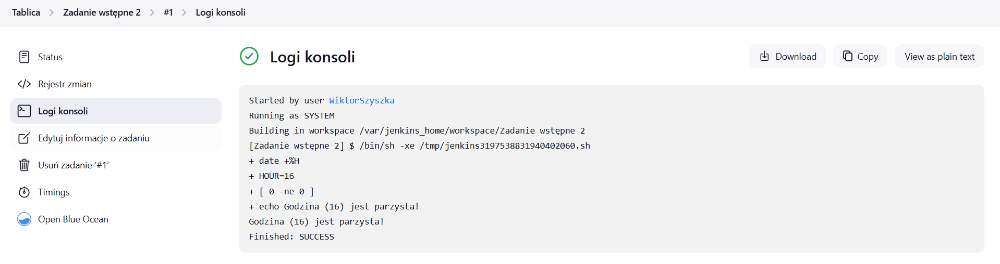
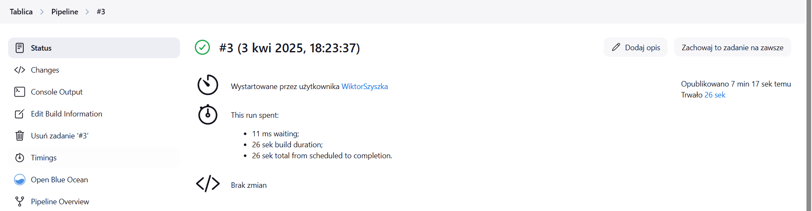
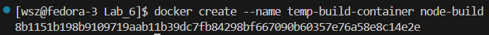
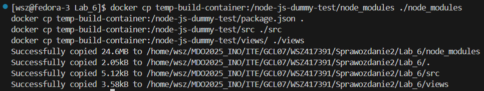
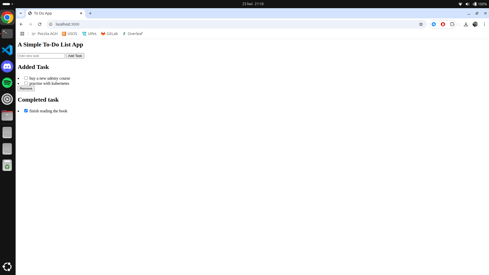
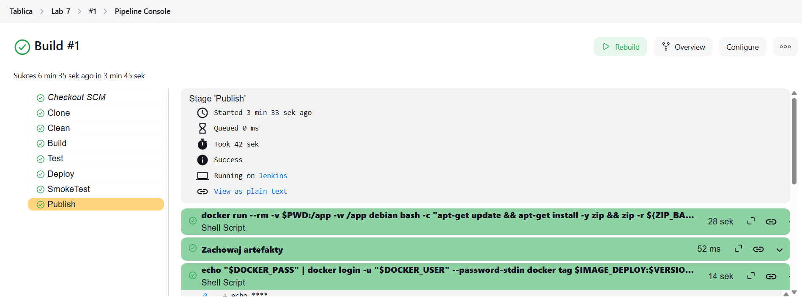
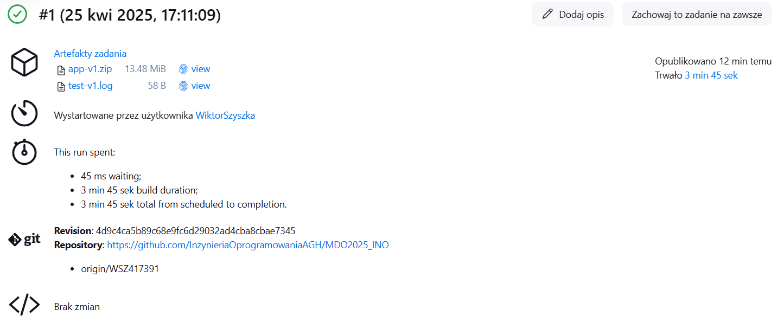

# Laboratorium 5 - Pipeline, Jenkins, Izolacja etapów

## Abstrakt
Celem laboratorium było zapoznanie się z konfiguracją i uruchamianiem środowiska Jenkins, tworzeniem pipeline'ów oraz izolacją etapów w procesie CI/CD. W ramach zajęć skonfigurowano środowisko Jenkins przy użyciu Dockera, zbudowano obrazy oraz kontenery, a także stworzono i dostosowano pipeline do automatyzacji procesów, uwzględniając zarządzanie repozytoriami, budowanie aplikacji oraz uruchamianie kontenerów.

### Wykonane kroki

1. **Uruchomienie Jenkins**

Wszystkie poniższe kroki zostały wykonane na bazie dokumentacji Jenkins'a: https://www.jenkins.io/doc/book/installing/docker/

1.1 *Utworzenie nowej sieci mostkowej*

```bash
docker network create jenkins
```

Powyższa komenda tworzy sieć mostkową o nazwie `jenkins`.


1.2 *Uruchomienie pomocnika DIND*

```bash
docker run \
--name jenkins-docker \
--detach \
--privileged \
--network jenkins \
--network-alias docker \
--env DOCKER_TLS_CERTDIR=/certs \
--volume jenkins-docker-certs:/certs/client \
--volume jenkins-data:/var/jenkins_home \
--publish 2376:2376 \
docker:dind \
--storage-driver overlay2
```

Opisy flag:
- `--name` - pozwala określić nazwę kontenera 
- `--detach` - uruchamia kontener w tle
- `--privileged` - obecnie uruchomienie *Docker in Docker* wymaga podania tego parametru
- `--network` - określenie z jakiej sieci ma korzystać stworzony kontener
- `--network-alias` - udostępnia *Docker in Docker* jako *docker* w sieci *jenkins*
- `--env` - umożliwia korzystanie z protokołu TLS na serwerze. Ze względu na użycie flagi `--privileged` uzycie tej flagi jest zalecane
- `--volume` - mapuje określone foldery wewnątrz kontenera na określone woluminy
- `--publish` - Udostępnia port demona Docker na hoscie (opcjonalne)


1.3 *Stworzenie Dockerfile*

```dockerfile
FROM jenkins/jenkins:2.492.2-jdk17
USER root
RUN apt-get update && apt-get install -y lsb-release ca-certificates curl && \
    install -m 0755 -d /etc/apt/keyrings && \
    curl -fsSL https://download.docker.com/linux/debian/gpg -o /etc/apt/keyrings/docker.asc && \
    chmod a+r /etc/apt/keyrings/docker.asc && \
    echo "deb [arch=$(dpkg --print-architecture) signed-by=/etc/apt/keyrings/docker.asc] \
    https://download.docker.com/linux/debian $(. /etc/os-release && echo \"$VERSION_CODENAME\") stable" \
    | tee /etc/apt/sources.list.d/docker.list > /dev/null && \
    apt-get update && apt-get install -y docker-ce-cli && \
    apt-get clean && rm -rf /var/lib/apt/lists/*
USER jenkins
RUN jenkins-plugin-cli --plugins "blueocean docker-workflow"
```

1.4 *Zbudowanie obrazu*

```bash
docker build -f ./Dockerfile.jenkins -t myjenkins .
```


1.5 *Zbudowanie kontenera*

```bash
docker run \
  --name jenkins-blueocean \
  --restart=on-failure \
  --detach \
  --network jenkins \
  --env DOCKER_HOST=tcp://docker:2376 \
  --env DOCKER_CERT_PATH=/certs/client \
  --env DOCKER_TLS_VERIFY=1 \
  --publish 8080:8080 \
  --publish 50000:50000 \
  --volume jenkins-data:/var/jenkins_home \
  --volume jenkins-docker-certs:/certs/client:ro \
  myjenkins
```

Opisy flag:
- `--name` - pozwala określić nazwę kontenera 
- `--restart` - określa w jakich przypadkach kontener zostanie uruchomiony ponownie
- `--detach` - kontener zostanie uruchomiony w tle
- `--network` - określenie z jakiej sieci ma korzystać stworzony kontener
- `--env` - określenie zmiennych środowiskowych 
- `--publish` - mapuje porty konteneru na porty hosta
- `--volume` - mapuje określone foldery wewnątrz kontenera na określone woluminy


1.6 *Strona logowania*

```bash
ip add
```
    
Dzieki tej komendzie otrzymamy adres IP naszej wirtualnej maszyny `Feodra 41`.

```http
192.168.1.51:8080
```

W naszym przypadku adresem IP maszyny wirtualnej jest `192.168.1.51`. Port `8080` został określony w poprzednich krokach. 


Po wpisaniu hasła znajdującego się w `\var\jenkins_home\secrets\initialAdminPassword` uzyskalismy dostęp do możliwości zainstalowania wtyczek.


1.7 *Instalacja wtyczek*


1.8 *Stworzenie pierwszego administratora*

1.9 *Konfiguracja instancji*


2. **Uruchomienie**

2.1 *Wyświetlenie `uname`*

```bash
uname -a
```

Powyższe polecenie wyświetla szczegółowe informacje o systemie operacyjnym i sprzęcie.


2.1 *Nieparzysta godzina*

```bash
HOUR=$(date +%H)

if [ $((HOUR % 2)) -ne 0 ]; then
    echo "Błąd: Godzina ($HOUR) jest nieparzysta!"
    exit 1
else
    echo "Godzina ($HOUR) jest parzysta!"
fi
```

Powyższy skrypt bashowy sprawdza, czy godzina jest podzielna przez 2, jeśli tak godzina jest parzysta, jeśli nie jest podzielna przez 2 godzina jest niepażysta. Każdy przypdek jest opatrzony odpowiednim komunikatem zwrotnym w postaci informacji wyświetlanej w terminalu.




2.3 *Pobranie `Ubuntu`*

```bash
docker pull ubuntu
```

Powyższa komenda pobiera obraz `Ubuntu` z Dockerhuba.


3. **Obiekt typu pipeline**

3.1 *Pierwsza uruchomienie*

```groovy
pipeline {
    agent any

    stages {
        stage('Zadanie') {
            steps {
                echo 'Klonowanie repozytorium przedmiotowego'
                sh 'git clone https://github.com/InzynieriaOprogramowaniaAGH/MDO2025_INO.git'
                dir('MDO2025_INO') {
                    sh 'git checkout WSZ417391'
                }
                dir('MDO2025_INO/ITE/GCL07/WSZ417391/Sprawozdanie1/Lab_3') {
                    sh '''
                    docker build -f ./Dockerfile.build -t node-build .
                    docker build -f ./Dockerfile.run -t node-run .
                    docker run -d --rm node-run
                    '''
                }
            }
        }
    }
}
```

Powyższy skrypt napisany w języku Groovy w pierwszej kolejności klonuje repozytorium przedmiotowe. Następnie zmienia położenie - polecenie `dir()`. W konkretnym folderze następuje zmiana gałęzi na `WSZ417391`. Kolejno następuje zmiana położenia na folder, w którym znajdują się `Dockerfile` potrzebne do przeprowadzenia skonteneryzowanej budowy i uruchomienia aplikacji - wszystko odbywa się na podstawie własnych `Dockerfile` z poprzednich zajęć. Cały pipeline zakończył się pomyślnie.


3.2.1 *Drugie uruchomienie*

Pipeline zakończył się niepowodzeniem, ponieważ w kontenerze istnieje już sklonowane repozytorium przedmiotwe.


3.2.2 *Dostosowanie konfiguracji Pipeline*

```groovy
pipeline {
    agent any

    stages {
        stage('Zadanie') {
            steps {
                echo 'Klonowanie repozytorium przedmiotowego'
                sh '''
                rm -rf MDO2025_INO
                git clone https://github.com/InzynieriaOprogramowaniaAGH/MDO2025_INO.git
                '''
                dir('MDO2025_INO') {
                    sh '''
                    git checkout WSZ417391
                    '''
                }
                dir('MDO2025_INO/ITE/GCL07/WSZ417391/Sprawozdanie1/Lab_3') {
                    sh '''
                    docker container prune -f
                    docker builder prune -f
                    docker image prune -f
                    docker build -f ./Dockerfile.build -t node-build .
                    docker build -f ./Dockerfile.run -t node-run .
                    docker run -d --rm node-run
                    '''
                }
            }
        }
    }
}
```

Do konfiguracji pipeline dodano następujące elementy. Przed każdym klonowaniem repozytorium jego katalog jest usuwany. Następnie przed uruchomieniem kontenera końcowego z działającą aplikacją, czyszczone są wszystkie kontenery `container prune`, cache docker wykorzystywane podczas budowania kontenerów `builder prune` oraz wszystkie obrazy `image prune` - opcja `-f` automatycznie akceptuje wszystkie potwierdzenia. Po wprowadzeniu tych zmian pipeline zakończył się pomyślnie.




## Historia terminala znajduje się w pliku `history.txt`


# Laboratorium 6 - Pipeline

## Abstrakt
Celem laboratorium było zaprojektowanie i wdrożenie pełnego procesu CI z wykorzystaniem Dockera i Jenkinsa. Stworzono skonteneryzowane środowiska dla poszczególnych etapów: budowania, testowania oraz wdrażania aplikacji. Efektem pracy było nie tylko stworzenie obrazów Docker i ich publikacja w DockerHub, ale również przygotowanie wersjonowanego artefaktu ZIP do alternatywnej formy dystrybucji. 

### Wykonane kroki

0. **DIND vs na kontenerze CI**

    **Docker-in-Docker (DIND)** - kontener Jenkinsa zawiera demona Dockera i pozwala na uruchamianie kolejnych kontenerów z jego wnętrza. Umożliwia pełną izolację i nie wymaga dostępu do hosta. Jednak niesie ze sobą zagrożenia bezpieczeństwa (kontener z uprawnieniami roota) oraz problemy z wydajnością i cache.

    **Na kontenerze CI** - natywne uruchomienie Dockera w kontenerze CI. Bezpieczniejsze i bardziej wydajne podejście, w którym kontener CI jedynie komunikuje się z Dockerem na hoście. Unika problemów z DIND i pozwala na wykorzystanie lokalnego cache.

1. **Diagram UML**

    

2. **Kontener Builder**

    ```dockerfile
    FROM node:22.10
    RUN git clone https://github.com/devenes/node-js-dummy-test
    WORKDIR /node-js-dummy-test
    RUN npm install
    ```

    Zdecydowano się na wersję `Node:22.10`, ponieważ jest to `LTS` , który gwarantuje stabilnośc i aktualność. Nie zdecydowano się na wersję `latest`, ponieważ jest ona niestabilna, w przeciwieństwie do wersji `22.10`, która zapewnia powtarzalność buildów. Kolejno klonowane jest repozytorium projektu. Następnie ustawiany jest katalog roboczy node-js-dummy-test - oznacza to, że wszystkie polecenia będą wykonywane w tym katalogu. Na sam koniec instalowane są wszystkie potrzebne zależności.

    ```bash
    docker build -f ./Dockerfile.build -t node-build .
    ```

    Powyższa komenda tworzy obraz o nazwie node-build na podstawie Dockerfile.build opcja `-f`. Kropka `.` na końcu polecenia określa katalog, który Docker przesyła do demona Dockera podczas budowania obrazu - w tym przypadku katalog bieżący.

    

3. **Kontener Tester**

    ```dockerfile
    FROM node-build
    WORKDIR /node-js-dummy-test
    CMD ["npm", "test"]
    ```

    Dockerfile wykorzystuje jako obraz bazowy utworzony przez nas wcześniej obraz `node-build`. Nie musimy ustawiać katalogu roboczego, ponieważ jest on dziedziczony z obrazu node-build. Na koniec uruchamiane są testy jednostkowe. Wyniki testów są zapisywane w pliku `test.log`.

    ```bash
    docker build -f ./Dockerfile.test -t node-test .
    ```

    Powyższa komenda tworzy obraz o nazwie `node-test` na podstawie Dockerfile.test opcja `-f`. Kropka `.` na końcu polecenia określa katalog, który Docker przesyła do demona Dockera podczas budowania obrazu - w tym przypadku katalog bieżący.

    

4. **Kontener Deploy**

    ```dockerfile
    FROM node:22.10-slim
    WORKDIR /app
    COPY node_modules/ ./node_modules/
    COPY package.json ./
    COPY src/ ./src/
    COPY views/ ./views/
    CMD ["npm", "start"]
    ```

    Wykorzystano obraz Node w tej samej wersji co dla kontenera budującego, czyli `22.10`, lecz w tym przypadku wykorzystano wersję `slim`, która jest mniejsza i szybsza do pobrania, ponieważ nie zawiera wielu narzędzi. Zgodnie z ustalonym z prowadzącym przebiegiem do kontenera `deploy` zostają skopiowane katalogi `node_modules`, `src`, `views` oraz plik `package.json`. Następnie za pomocą polecenia `npm start` aplikacja zostaje uruchomiona. 

    ```bash
    docker create --name temp-build-container node-build
    ```

    Powyższa komenda tworzy kontener tymczasowy o nazwie `temp-build-container` na podstawie obrazu `node-build`.

    

    ```bash
    docker cp temp-build-container:/node-js-dummy-test/node_modules ./node_modules
    docker cp temp-build-container:/node-js-dummy-test/package.json .
    docker cp temp-build-container:/node-js-dummy-test/src ./src
    docker cp temp-build-container:/node-js-dummy-test/views/ ./views
    ```

    Powyższa komenda kopiuje na hosta katalogi `node_modules`, `src`, `views` oraz plik `package.json`.

    

    

    ```bash
    docker rm temp-build-container
    ```

    Powyższa komenda usuwa kontener tymczasowy.

    

    ```bash
    docker build -f Dockerfile.deploy -t node-deploy .
    ```

    Powyższa komenda tworzy obraz o nazwie `node-deploy` na podstawie Dockerfile.deploy opcja `-f`. Kropka `.` na końcu polecenia określa katalog, który Docker przesyła do demona Dockera podczas budowania obrazu - w tym przypadku katalog bieżący.

    

    Kontener `build` nie nadaje się do roli kontenera `deploy`, dlatego stworzono oddzielny kontener typu `deploy`, specjalnie przeznaczony do uruchamiania aplikacji. W kontenerze `deploy` użyto wersji obrazu `node:22.10-slim`, która jest lżejsza i szybsza do pobrania, a także zawiera jedynie niezbędne do uruchomienia aplikacji pliki `(node_modules, src, views, package.json)`. Dzięki temu środowisko produkcyjne jest czyste, zoptymalizowane i pozbawione zbędnych zależności oraz plików tymczasowych obecnych w kontenerze buildowym `(np. .git, cache)`. Taka separacja zwiększa bezpieczeństwo, stabilność i wydajność aplikacji.

5. **Uruchomienie kontenera `Deploy`**

    ```bash
    docker network create ci
    docker run -dit --network ci --name deploy -p 3000:3000 node-deploy
    ```

    Pierwsza komenda tworzy sieć Dockera o nazwie `ci`. 
    Druga komenda uruchamia kontener o nazwie `deploy` w trybie interaktywnym w tle z przypiętym terminalem na bazie obrazu `node-deploy`. Dodatkowo mapuje port `3000` hosta na port `3000` kontenera. Opcja `--network` przypisuje kontener do sieci o nazwie `ci`.

    

6. **Test Curla - Smoke Test**

    ```bash
    docker run --rm --network ci curlimages/curl curl http://deploy:3000
    ```

    Powyższa komenda uruchamia tymczasowy kontener Dockera na podstawie obrazu `curlimages/curl`, który zawiera narzędzie `curl`. Kontener zostaje podłączony do sieci Dockera `ci`. Następnie wykonuje żądanie HTTP `http://deploy:3000`. Tak skonstruowany smoke test weryfikuje podstawową dostępność aplikacji po wdrożeniu.

    

7. **Push**

    ```bash
    docker tag node-deploy winterwollf/node-deploy
    docker push winterwollf/node-deploy
    ```

    Pierwsza komenda tworzy znacznik lokalnego obrazu node-deploy jako `winterwollf/node-deploy`.
    Druga komenda wysyła oznaczony obraz do zdalnego repozytorium DockerHub pod nazwą `winterwollf/node-deploy`.

    

    

    *Czy program powinien być dystrybuowany jako obraz Docker?*

    - Tak. 
    
        #### Zawartość obrazu Docker:

        - `node_modules`, `src`, `views`, `package.json` – są wymagane do działania aplikacji.

        - Logi i tymczasowe artefakty builda – zwiększają wagę obrazu i niepotrzebnie komplikują środowisko produkcyjne.

        - Całe sklonowane repozytorium .git – zawiera historię, której nie potrzebujemy w środowisku uruchomieniowym.

8. **Publish – artefakt ZIP**

    ```bash
    zip -r app.zip node_modules/ src/ views/ package.json
    ```

    Powyższa komenda tworzy archiwum `zip` o nazwie `app.zip`. Opcja `-r` dodaje pliki i fldery rekurencyjnie. Archiuwm znajduje się w repozytorium pod nazwą `app-v1.zip`.

    

    *Czy program powinien zostać „zapakowany” do jakiegoś przenośnego pliku-formatu*
        
    - Tak. W tym przypadku zdecydowano się na na zapakowanie programu do archiwum `zip`, które jest lekkie, niezależne od platformy idealny do szybkiej dystrybucji.

9. **Weryfikacja diagramu UML z rzeczywistością**

    Diagram końcowy różni się od początkowego dodaniem kontenera tymczasowego `temp-build-container`, który kopiuje odpowiednie pliki na hosta. Kontener tymczasowy był potrzebny, ponieważ obraz tworzony na podstawie Dockerfile.deploy nie mógł się zbudować z powodu braku wymaganych plików w lokalnym katalogu. Dodatkowo w kontenerze `deploy` kopiowane są dodatkowe foldery takie jak: `src` i `views`, które są niezbędne do poprawnego działania aplikacji.

    .png)

## Historia terminala znajduje się w pliku `history.txt`


# Laboratorium 7 - Jenkinsfile

## Abstrakt
Celem laboratorium było sworzenie pipeline bazującego na Jenkinsfile. Pipeline został zaimplementowany jako skrypt Jenkinsfile i automatyzuje każdy etap przetwarzania aplikacji, zapewniając przy tym powtarzalność oraz bezpieczeństwo.

### Wykonane kroki

1. **Jenkins - Credentials**

    Ponieważ wysłanie obrazu do zdalnego repozytorium DockerHub wymaga zalogowania, utworzono globalne credentials w Jenkins.

    

2. **Pipeline form SCM**

    

3. **Jenkinsfile**

    ```jenkinsfile
    pipeline {
        agent any

        environment {
            IMAGE_BUILD = 'node-build'
            IMAGE_TEST = 'node-test'
            IMAGE_DEPLOY = 'node-deploy'
            DOCKERHUB_REPO = 'winterwollf/node-deploy'
            ZIP_BASE = 'app'
            VERSION = "v${BUILD_NUMBER}"
            IMAGE_TAG = "winterwollf/node-deploy:v${BUILD_NUMBER}"
        }

        stages {
            stage('Clone') {
                steps {
                    git branch: 'WSZ417391', url: 'https://github.com/InzynieriaOprogramowaniaAGH/MDO2025_INO'
                }
            }

            stage('Clean') {
                steps {
                    dir('ITE/GCL07/WSZ417391/Sprawozdanie2') {
                        sh '''
                            docker container ls -a -q | xargs -r docker rm -f
                            docker volume ls -q | xargs -r docker volume rm -f
                            docker network ls -q --filter type=custom | xargs -r docker network rm -f
                            docker builder prune --all --force
                            docker images -q | sort -u | grep -vE '^(node:22\\.10|node:22\\.10-slim)$' | xargs -r docker rmi -f
                        '''
                    }
                }
            }

            stage('Build') {
                steps {
                    dir('ITE/GCL07/WSZ417391/Sprawozdanie2') {
                        sh 'docker build -f Dockerfile.build -t $IMAGE_BUILD .'
                    }
                }
            }

            stage('Test') {
                steps {
                    dir('ITE/GCL07/WSZ417391/Sprawozdanie2') {
                        sh 'docker build -f Dockerfile.test -t $IMAGE_TEST .'
                        sh 'docker run --rm $IMAGE_TEST > test-${VERSION}.log'
                        archiveArtifacts artifacts: "test-${VERSION}.log", onlyIfSuccessful: true
                    }
                }
            }

            stage('Deploy') {
                steps {
                    dir('ITE/GCL07/WSZ417391/Sprawozdanie2') {
                        sh '''
                            docker create --name temp-build-container $IMAGE_BUILD
                            docker cp temp-build-container:/node-js-dummy-test/node_modules ./node_modules
                            docker cp temp-build-container:/node-js-dummy-test/package.json .
                            docker cp temp-build-container:/node-js-dummy-test/src ./src
                            docker cp temp-build-container:/node-js-dummy-test/views ./views
                            docker rm temp-build-container
                            docker build -f Dockerfile.deploy -t $IMAGE_DEPLOY:$VERSION .
                        '''
                    }
                }
            }

            stage('SmokeTest') {
                steps {
                    dir('ITE/GCL07/WSZ417391/Sprawozdanie2') {
                        sh '''
                            docker network create ci || true
                            docker run -dit --network ci --name deploy -p 3000:3000 $IMAGE_DEPLOY:$VERSION
                            sleep 5
                            docker run --rm --network ci curlimages/curl curl http://deploy:3000
                            docker stop deploy
                            docker rm deploy
                            docker network rm ci
                        '''
                    }
                }
            }

            stage('Publish') {
                steps {
                    dir('ITE/GCL07/WSZ417391/Sprawozdanie2') {
                        withCredentials([usernamePassword(credentialsId: 'dockerhub-credentials', usernameVariable: 'DOCKER_USER', passwordVariable: 'DOCKER_PASS')]) {
                            sh '''
                                docker run --rm -v $PWD:/app -w /app debian bash -c "apt-get update && apt-get install -y zip && zip -r ${ZIP_BASE}-${VERSION}.zip node_modules/ src/ views/ package.json"
                            '''
                            archiveArtifacts artifacts: "${ZIP_BASE}-${VERSION}.zip", onlyIfSuccessful: true

                            sh '''
                                echo "$DOCKER_PASS" | docker login -u "$DOCKER_USER" --password-stdin
                                docker tag $IMAGE_DEPLOY:$VERSION $IMAGE_TAG
                                docker push $IMAGE_TAG
                            '''
                        }
                    }
                }
            }
        }
    }
    ```

### Zmienne środowiskowe

W sekcji environment zdefiniowano zmienne wykorzystywane we wszystkich etapach pipeline'u:

- IMAGE_BUILD – nazwa obrazu Docker wykorzystywanego do budowania aplikacji i instalowania zależności.
- IMAGE_TEST – nazwa obrazu, w którym uruchamiane są testy jednostkowe.
- IMAGE_DEPLOY – nazwa końcowego obrazu Docker, w którym aplikacja będzie uruchamiana produkcyjnie.
- DOCKERHUB_REPO – ścieżka do repozytorium na DockerHub, gdzie zostanie wysłany obraz.
- ZIP_NAME – nazwa tworzonego artefaktu .zip zawierającego zbudowaną aplikację.

### Etap 1: Clone
Pierwszym krokiem jest pobranie kodu źródłowego z repozytorium GitHub. Pipeline klonuje gałąź `WSZ417391`. Operacja ta umożliwia dalsze przetwarzanie lokalnego kodu wewnątrz agenta Jenkins. Takie podejście w praktyce sprawia, że repozytorium jest klonowane dwa razy. Pierwszy raz na etapie poszukiwania Jenkinsfile - Jenkins klonuje repozytorium, aby móc uruchomić pipeline `(Pipeline from SCM)`. Drugi raz repozytorium klonowane jest w samym pipeline, aby móc uruchomić Dockerfile. 

### Etap 2: Clean
W celu zapewnienia czystego i spójnego środowiska budowania, w tym etapie usuwane są wszystkie nieużywane kontenery, obrazy, cache budowania oraz sieci Docker (z wyjątkiem tych potrzebnych do budowania – node:22.10 i node:22.10-slim). Dzięki temu każdy pipeline zaczyna się w stanie identycznym i niezależnym od poprzednich uruchomień.

### Etap 3: Build
W tym kroku budowany jest obraz `node-build` na podstawie pliku `Dockerfile.build`. 

### Etap 4: Test
Etap testowania polega na zbudowaniu obrazu `node-test`. Testy są wykonywane w kontenerze, a wynik zapisany w pliku `test.log`. Plik ten jest następnie archiwizowany przez Jenkins jako artefakt, co umożliwia jego późniejszą analizę.

### Etap 5: Deploy
Tworzony jest tymczasowy kontener na podstawie `node-build`, z którego kopiowane są potrzebne zasoby – katalog `node_modules`, `src`, `views` oraz plik `package.json`. Skopiowane zasoby są następnie używane do budowy lekkiego obrazu produkcyjnego - obraz jest wersjonowany. Takie podejście pozwala znacząco zmniejszyć wagę finalnego obrazu oraz ograniczyć jego zależności tylko do niezbędnych komponentów.

### Etap 6: Publish
W ostatnim kroku tworzony jest archiwum `.zip` zawierające zbudowaną aplikację oraz wymagane pliki, ponieważ agent Jenkins nie ma uprawnień do instalowania pakietów systemowych, proces pakowania został przeniesiony do kontenera debian, w którym instalowane jest narzędzie zip. Archiuwm `zip` jest wersjonowane. Dodatkowo wykonywane jest logowanie do DockerHub z wykorzystaniem bezpiecznych poświadczeń przechowywanych w Jenkinsie. Gotowy obraz `node-deploy` zostaje otagowany i opublikowany w zdalnym repozytorium DockerHub.

*Czy obraz z rejestru DockerHub jest gotowy do uruchomienia bez modyfikacji?*

- Tak, ponieważ obraz zawiera `node_modules`, `src`, `views`, `package.json`. Ustawiono `CMD ["npm", "start"]`, więc nie trzeba podawać komendy przy docker run. Obraz oparty jest na `node:22.10-slim`, więc nie ma nieprzenośnych zależności.

W celu zademonstrowania, iż opublikowany obraz działa, zmieniłem maszynę na swojego prywatnego laptopa z Linuxem 24.04. Pobrałem obraz bezpośrednio z DockerHuba. Następnie na jego podstawie utworzyłem kontener, w którym wyeksponowałem port 3000. W przeglądarce wyszukałem `http://localhost:3000`. Poniższe zdjęcia potwierdzają, że obraz na kompletnie innej maszynie z kompletnie innym systemem operacyjnym działa poprawnie.




*Czy plik ZIP można uruchomić na innej maszynie?*

- Tak, jeśli maszyna będzie miała zainstalowanego `node:22.10-slim`.

4. **Działanie pipeline**

    #### 1) Pierwsze uruchomienie

    

    

    

    #### 2) Drugie uruchomienie

    

    

    

5. **Ansible**

**1) Utworzono nową wirtualną maszynę**

Utworzono nową wirtualną maszynę bazującą na obrazie `Fedora 41`


**2) Utworzono użytkownika o nazwie `ansible`**


**3) Nadano maszynie *hostname* ansible-target**

```bash
sudo hostnamectl set-hostname ansible-target
exec bash
```

Powyższa komenda nadaje maszynie hostname `ansible-target`. Druga z nich ponownie uruchamia `bash`.


**4) Instalacja programu `tar` i `OpenSSH`**

```bash
sudo dnf install tar openssh
```

Powyższa komenda pozwala na pobranie narzędzi *tar* oraz *openssh*. W tym przypadku paczki nie zostały pobrane, ponieważ były już zainstalowane ich najnowsze wersje.


**5) Migawka maszyny**

Migawka zapisuje stan maszyny — pamięć RAM, dyski, ustawienia.


**6) Instalacja Ansible**


**7) Wymiana kluczy SSH**

```bash
ssh-keygen -f ~/.ssh/id_rsa_ansible
```

Powyższa komenda na głównej maszynie generuje klucz ssh. Wszystkie opcje zostały zatwierdzone `Enter`.


```bash
ip a
```

Powyższa komenda zwróci adres maszyny `ansible-target`.


```bash
sudo nano /etc/hosts
```

Powyższa komenda otworzy plik `hosts` do które należy dodać adres IP hosta `ansible-target` wraz z dopiskiem jego nazwy. Stworzy do alias jej adesu IP z nazwą `ansible-target`.


```bash
ssh-copy-id -i ~/.ssh/id_rsa_ansible.pub ansible@ansible-target
```

Powyższa komenda kopiuje klucz ssh na maszynę `ansible-target`. Podczas przesyłania klucza ssh wymagane jest podanie hasła.


```bash
nano ~/.ssh/config
```

Ponieważ wygenerowany klucz nie jest domyślny `id_rsa` tylko `id_rsa_ansible` należy poinstruować SSH, żeby użył tego konkretnego klucza. Powyższa komenda otworzy plik `config`, w którym należy dodać następujące dane:

```bash
Host ansible-target
    HostName ansible-target
    IdentityFile ~/.ssh/id_rsa_ansible
```

Wyjaśnienie:
- `Host ansible-target` – mówi: *dla tego hosta (ansible-target) używaj specjalnych ustawień niż zwykle*,
- `HostName ansible-target` – mówi: *kiedy wpiszę ssh ansible-target, naprawdę chodzi o nazwę lub IP ansible-target*,
- `IdentityFile ~/.ssh/id_rsa_ansible` – wskazuje, który klucz prywatny ma być używany do logowania (domyślnie SSH używa ~/.ssh/id_rsa).


```bash
ssh ansible@ansible-target
```

Powyższa komenda łączy się po ssh z maszyną `ansible-target`. Pokazuje to tym samym, że nastąpiła poprawna wymiana kluczy i podawanie hasła nie jest wymagane.


## Historia terminala znajduje się w pliku `history.txt`
