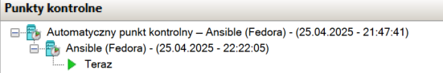
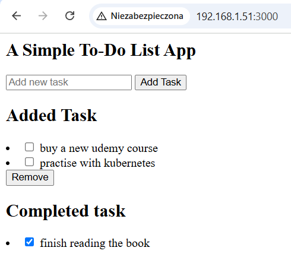
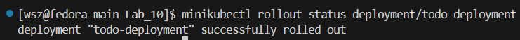
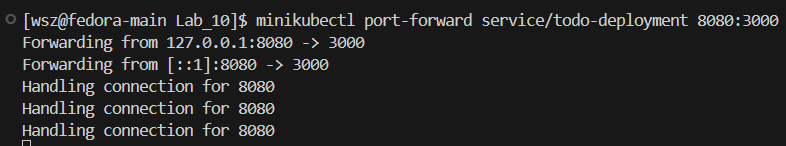
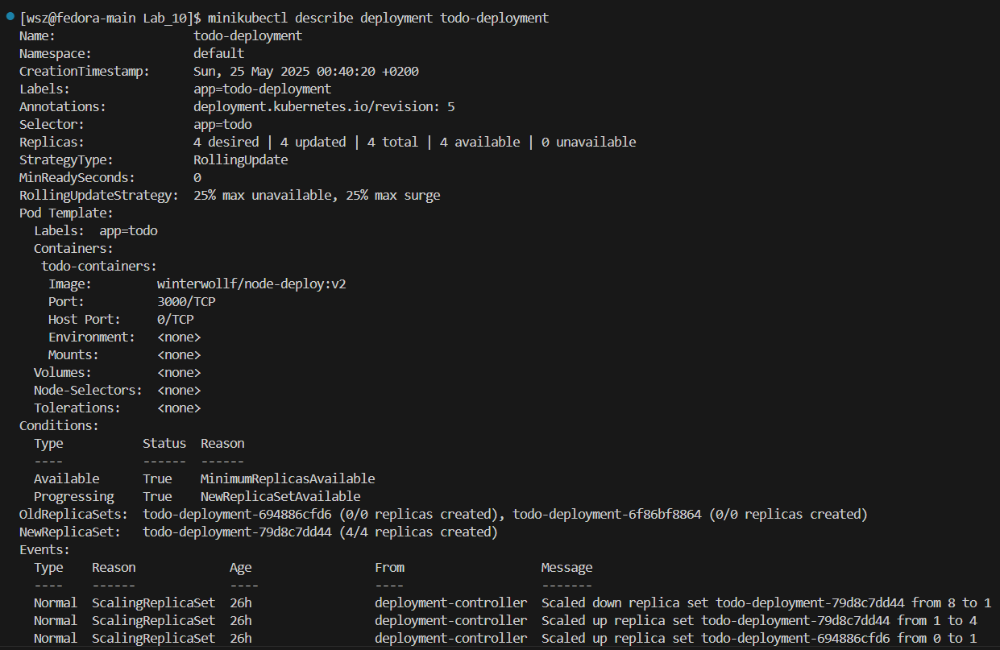

# Laboratorium 8 - Ansible

## Abstrakt
Celem laboratorium było praktyczne zapoznanie się z narzędziem Ansible do automatyzacji zarządzania konfiguracją i wdrażania oprogramowania na wielu maszynach. W trakcie zajęć skonfigurowano środowisko z dwoma maszynami, przygotowano pliki inwentaryzacyjne, wymieniono klucze SSH oraz utworzono i uruchomiono playbooki realizujące zadania administracyjne i wdrożeniowe. Laboratorium pozwoliło na zdobycie doświadczenia w automatyzacji instalacji oprogramowania, zarządzaniu kontenerami Docker oraz weryfikacji poprawności działania wdrożonych usług.

### Wykonane kroki

### Instalacja zarządcy Ansible

**1) Utworzono nową wirtualną maszynę**

Utworzono nową wirtualną maszynę bazującą na obrazie `Fedora 41`


**2) Utworzono użytkownika o nazwie `ansible`**


**3) Nadano maszynie *hostname* ansible-target**

```bash
sudo hostnamectl set-hostname ansible-target
exec bash
```

Powyższa komenda nadaje maszynie hostname `ansible-target`. Druga z nich ponownie uruchamia `bash`.


**4) Instalacja programu `tar` i `OpenSSH`**

```bash
sudo dnf install tar openssh
```

Powyższa komenda pozwala na pobranie narzędzi *tar* oraz *openssh*. W tym przypadku paczki nie zostały pobrane, ponieważ były już zainstalowane ich najnowsze wersje.


**5) Migawka maszyny**

Migawka zapisuje stan maszyny — pamięć RAM, dyski, ustawienia.



**6) Instalacja Ansible**


**7) Wymiana kluczy SSH**

```bash
ssh-keygen -f ~/.ssh/id_rsa_ansible
```

Powyższa komenda na głównej maszynie generuje klucz ssh. Wszystkie opcje zostały zatwierdzone `Enter`.


```bash
ip a
```

Powyższa komenda zwróci adres maszyny `ansible-target`.


```bash
sudo nano /etc/hosts
```

Powyższa komenda otworzy plik `hosts` do które należy dodać adres IP hosta `ansible-target` wraz z dopiskiem jego nazwy. Stworzy do alias jej adesu IP z nazwą `ansible-target`.


```bash
ssh-copy-id -i ~/.ssh/id_rsa_ansible.pub ansible@ansible-target
```

Powyższa komenda kopiuje klucz ssh na maszynę `ansible-target`. Podczas przesyłania klucza ssh wymagane jest podanie hasła.


```bash
nano ~/.ssh/config
```

Ponieważ wygenerowany klucz nie jest domyślny `id_rsa` tylko `id_rsa_ansible` należy poinstruować SSH, żeby użył tego konkretnego klucza. Powyższa komenda otworzy plik `config`, w którym należy dodać następujące dane:

```bash
Host ansible-target
    HostName ansible-target
    IdentityFile ~/.ssh/id_rsa_ansible
```

Wyjaśnienie:
- `Host ansible-target` – mówi: *dla tego hosta (ansible-target) używaj specjalnych ustawień niż zwykle*,
- `HostName ansible-target` – mówi: *kiedy wpiszę ssh ansible-target, naprawdę chodzi o nazwę lub IP ansible-target*,
- `IdentityFile ~/.ssh/id_rsa_ansible` – wskazuje, który klucz prywatny ma być używany do logowania (domyślnie SSH używa ~/.ssh/id_rsa).


```bash
ssh ansible@ansible-target
```

Powyższa komenda łączy się po ssh z maszyną `ansible-target`. Pokazuje to tym samym, że nastąpiła poprawna wymiana kluczy i podawanie hasła nie jest wymagane.


### Inwentaryzacja

1. **Zmiana nazwy komputera**

```bash
sudo hostnamectl set-hostname fedora-main
exec bash
```

Powyższa komenda nadaje maszynie hostname `fedora-main`. Druga z nich ponownie uruchamia bash.


2. **Nazwy DNS**

    1) Dla maszyny głównej

    ```bash
    cat ~/.ssh/id_rsa_ansible.pub >> ~/.ssh/authorized_keys
    chmod 600 ~/.ssh/authorized_keys
    ```

    Pierwsze polecenie otwiera plik `id_rsa_ansible.pub`. Następnie `>>` dopisuje jego zawartość na końcu pliku `~/.ssh/authorized_keys`. Dzięki temu maszyna `fedora-main` zaufa temu kluczowi i pozwoli na logowanie SSH bez hasła. Druga komenda zmienia uprawnienia, aby właściciel otrzymał prawa do odczytu i zapisu.

    

    2) Dla maszyny `ansible-target`.

    ```bash
    ip a
    ```

    Powyższa komenda pokaże adres IP hosta `fedora-main`.

    

    ```bash
    sudo nano /etc/hosts
    ```

    Powyższa komenda otworzy plik hosts do które należy dodać adres IP hosta `fedora-main` wraz z dopiskiem jego nazwy. Stworzy do alias jej adesu IP z nazwą `fedora-main`.

    

3. **Zweryfikowanie łączności**

```bash
ssh ansible@ansible-target
```

Powyższa komenda uruchomiona na maszynie głównej `fedora-main` ustanowi połączenie ssh z maszyną `ansible-target`.


```bash
ping ansible-target
```

Powyższa komenda wyślę pakiety ICMP typu *echo request* do hosta `ansible-target`. 


4. **Utworzenie pliku inwentaryzacji**

```bash
touch inventory.ini
nano touch inventory.ini
```

Powyższa komenda tworzy plik `touch inventory.ini`. Druga komenda włącza edytor plików `nano`.


```ini
[Orchestrators]
fedora-main ansible_user=wsz ansible_ssh_private_key_file=~/.ssh/id_rsa_ansible

[Endpoints]
ansible-target ansible_user=ansible ansible_ssh_private_key_file=~/.ssh/id_rsa_ansible
```

W pliku `inventory.ini` dodano dwie grupy: `Orchestrators` do której dopisano hosta `fedora-main` oraz drugą grupę o nazwie `Endpoints` w której znajduje się host `ansible-target`. Każdy z hostów ma zdefiniowanego `ansible_user` odpowiedniego dla hosta oraz za pomocą `ansible_ssh_private_key_file` ścieżkę do pliku z odpowiednim kluczem SSH.


5. **Wysłanie żądania `ping`**

```bash
ansible all -i inventory.ini -m ping
```

Opcje:
 - `all` -> oznacza wszystkie hosty z inwentarza
 - `-i` -> wskazuje plikz inwentarza
 - `-m ping` -> określenie modułu `ping` w Ansible. Nie jest to "zwykłe" wysłanie pakietu ICMP.


### Zdalne wywołanie procedur

1. **Utworzenie pliku playbook.yml**

```bash
touch playbook.yml
nano playbook.yml
```

Powyższa komenda tworzy plik `playbook.yml`. Druga komenda włącza edytor plików `nano`.


2. **Edycja playbook.yml**

```yml
- name: Playbook
  hosts: all
  gather_facts: yes
  tasks:
    - name: Ping do wszystkich maszyn
      ansible.builtin.ping:

- name: Skopiuj plik inventory.ini na Endpoints
  hosts: Endpoints
  gather_facts: yes
  tasks:
    - name: Skopiuj plik inwentaryzacji
      ansible.builtin.copy:
        src: Lab_8/inventory.ini
        dest: /tmp/inventory.ini
```

- `name` -> określa nazwę operacji
- `hosts` -> określa na jakich hostach zostanie wykonana operacja
- `gather_facts` -> opcja pobierania faktów o systemie (np. OS, RAM, CPU)
- `task` -> sekcja w której określa się faktyczne zadanie do wykonania


3. **Uruchomienie playbooka**

1) Pierwsze uruchomienie

```bash
ansible-playbook -i inventory.ini playbook.yml
```

Powyższa komenda uruchamia playbook. Opcja `-i` wskazuje plik `inventory.ini` (w nim znajdują się nasze grupy). 


Komenda `copy` wykryła, że plik `/tmp/inventory.ini` jeszcze nie istniał na `ansible-target`, więc został skopiowany, dlatego status: `changed=1`. Pozostałe operacje skończyły się statusem `ok`.


2) Drugie uruchomienie

```bash
ansible-playbook -i inventory.ini playbook.yml
```

Przy drugim uruchomieniu plik `/tmp/inventory.ini` już istniał na `ansible-target` i był identyczny z tym, który miał zostać skopiowany. Ansible porównuje zawartość i widzi, że nie musi nic robić, dlatego status: `changed=0`.


4. **Aktualizacja pakietów w systemie oraz restart usług**

```bash 
sudo dnf install rngd
```

Powyższa komenda została uruchomiona na maszynie `ansible-target` w celu instalacji narzędzia `rngd`.


```yml
- name: Playbook
  hosts: all
  gather_facts: yes
  tasks:
    - name: Ping do wszystkich maszyn
      ansible.builtin.ping:

- name: Skopiuj plik inventory.ini na Endpoints
  hosts: Endpoints
  gather_facts: yes
  tasks:
    - name: Skopiuj plik inwentaryzacji
      ansible.builtin.copy:
        src: Lab_8/inventory.ini
        dest: /tmp/inventory.ini

- name: Aktualizacja systemu + restart usług
  hosts: Endpoints
  become: true
  tasks:
    - name: Aktualizacja pakietów
      ansible.builtin.package:
        name: "*"
        state: latest

    - name: Restart usługi sshd
      ansible.builtin.service:
        name: sshd
        state: restarted

    - name: Restart usługi rngd
      ansible.builtin.service:
        name: rngd
        state: restarted
```

Opcja `become: True` oznacza podniesienie uprawnień do poziomu `root`. Jest to niezbędne, aby przeprowadzić operację aktualizacji pakietów.


```bash
ansible-playbook -i inventory.ini playbook.yml --ask-become-pass
```

Opcja `--ask-become-pass` sprawi, że zostaniemy spytani o hasło roota. Po jego wprowadzeniu playbook zostanie uruchomiony. Playbook wykonał się w całości poprawnie.


5. **Przeprowadzenie operacji względem maszyny z wyłączonym serwerem SSH**

```bash
sudo systemctl stop sshd
```

Powyższa komenda wyłączy usługę SSH na maszynie `ansible-target`.


```
ansible-playbook -i inventory.ini playbook.yml --ask-become-pass
```

Opcja `--ask-become-pass` sprawi, że zostaniemy spytani o hasło roota. Po jego wprowadzeniu playbook zostanie uruchomiony. Ansible nie był w stanie nawiązać połączenia SSH. Host został oznaczony jako `unreachable` w `PLAY RECAP`. Zadania dla tej maszyny nie zostały wykonane.


```bash
sudo systemctl start sshd
```

Powyższa komenda włączy usługę SSH na maszynie `ansible-target`.


### Zarządzanie stworzonym artefaktem 

#### Kontener

1. **Utworzenie szkieletu roli**

```bash
ansible-galaxy init wsz
```

Powyższa komenda utworzy szkielet roli `wsz` w obecnym katalogu. Po jej wykonaniu generowana jest standardowa struktura katalogów i plików.


Struktura katalogów:
- `defaults/main.yml` – domyślne wartości zmiennych,
- `tasks/main.yml` – główne zadania roli,
- `handlers/main.yml` – obsługa zdarzeń,
- `templates/` – katalog na szablony Jinja2,
- `files/` – katalog na statyczne pliki,
- `vars/main.yml` – zmienne specyficzne dla roli,
- `meta/main.yml` – metadane roli,
- `README.md` – plik z dokumentacją roli,
- `tests/` – katalog na testy roli.


2. **Dodanie zadań**

**Plik:** `tasks/main.yml`
```yaml
---
- name: Instalacja Dockera
  ansible.builtin.package:
    name:
      - docker
      - docker-compose
    state: present

- name: Uruchomienie i włączenie usługi Docker
  ansible.builtin.service:
    name: docker
    state: started
    enabled: true

- name: Pull obrazu z Docker Hub
  community.docker.docker_image:
    name: winterwollf/node-deploy
    tag: v2
    source: pull

- name: Uruchomienie kontenera
  community.docker.docker_container:
    name: node_app
    image: winterwollf/node-deploy:v2
    state: started
      published_ports:
        - "3000:3000"

- name: Weryfikacja działania aplikacji
  ansible.builtin.uri:
    url: http://localhost:3000
    return_content: yes
  register: response
  retries: 5
  delay: 3
  until: response.status == 200

- name: Zatrzymanie kontenera
  community.docker.docker_container:
    name: node_app
    state: stopped

- name: Usunięcie kontenera
  community.docker.docker_container:
    name: node_app
    state: absent
```

-> `Instalacja Dockera`

Wykorzystuje moduł Ansible `ansible.builtin.package`, który służy do instalowania, aktualizowania i usuwania pakietów systemowych. W naszym przypadku poprzez użycie opcji `state: present` informujemy Ansible do jakiego stanu ma doprowadzić - *Upewnij się, że pakiet jest zainstalowany. Jeśli nie jest, zainstaluj go.* 

-> `Uruchomienie i włączenie usługi Docker`

Wykorzystuje moduł Ansible `ansible.builtin.service`, który zarządza usługami systemowymi. W naszym przypadku informujemy Ansible, że usługa ma zostać włączona `state: started` oraz, że ma ona być włączana automatycznie przy starcie systemu.

-> `Pull obrazu z Docker Hub`

Wykorzystuje moduł `community.docker.docker_image` z kolekcji `community.docker`. Moduł ten pozwala na pobranie obrazu z DockerHuba. Za pomocą opcji `name` określono nazwę obrazu, `tag` określa wersję okrazu.

-> `Uruchomienie kontenera`

Wykorzystuje moduł `community.docker.docker_container` z kolekcji `community.docker`. Moduł ten pozwala na uruchomienie kontenera. Dodatkowe opcje pozwalają określić na podstawie jakiego obrazu ma zostać zbudowany kontener, oraz nadać mu nazwę - w naszym przypadku nazwa to `node_app`. Dodatkowo zmapowano port `3000:3000` w celu umożliwienia w dalszym kroku sprawdzenia łączności z kontenerem.

-> `Weryfikacja działania aplikacji`

Wykorzystuje moduł `ansible.builtin.uri`, który umożliwia wysyłanie żądań HTTP. Opcje:
- `url` - określa adres pod który zostanie wysłane żądanie,
- `return_content: yes` - zapisuje odpowiedź HTTP (body, headers) do zmiennej,
- `register: response` – zapisuje wynik do zmiennej response,
- `retries: 5` – określa maksymalną ilość prób,
- `delay: 3` – określa ilość sekund przerwy pomiędzy próbami,
- `until: response.status == 200` – kończy retry, jeśli odpowiedź HTTP ma kod 200 (OK).

-> `Zatrzymanie kontenera`

Wykorzystuje moduł `community.docker.docker_container` z kolekcji `community.docker`. Opcja `name` określa kontener, natomiast opcja `state: stopped` informujemy Ansible do jakiego stanu ma doprowadzić - *Upewnij się, że kontener został zatrzymany. Jeśli nie jest zatrzymany, zatrzymaj go.* 

-> `Usunięcie kontenera`

Wykorzystuje moduł `community.docker.docker_container` z kolekcji `community.docker`. Opcja `name` określa kontener, natomiast opcja `state: absent` informujemy Ansible do jakiego stanu ma doprowadzić - *Upewnij się, że kontener nie istnieje. Jeśli istnieje, usuń go.* 


3. **Utworzenie playbook_deploy.yml**

```bash
touch playbook_deploy.yml
nano playbook_deploy.yml
```

Powyższa komenda tworzy plik `playbook_deploy.yml`. Druga komenda włącza edytor plików `nano`.


4. **Edycja playbook_deploy.yml**

```yml
---
- name: Deploy
  hosts: all
  become: true
  collections:
    - community.docker
  roles:
    - wsz
```

- `name` -> określa nazwę operacji
- `hosts` -> określa na jakich hostach zostanie wykonana operacja
- `become` -> określa potrzebę użycia uprawnień roota
- `collections` -> określa listę kolekcji, które mają być użyte w tym playu
- `roles` -> określa listę ról, które mają być użyte w tym playu


5. **Uruchomienie playbooka**

```bash
ansible-playbook -i inventory.ini playbook_deploy.yml --ask-become-pass
```

Powyższa komenda uruchamia playbook. Opcja `-i` wskazuje plik `inventory.ini` (w nim znajdują się nasze grupy). Opcja `--ask-become-pass` sprawi, że zostaniemy spytani o hasło roota. Po jego wprowadzeniu playbook zostanie uruchomiony.

### Błąd uruchomienia 

Po uruchomieniu playbooka pojawił się błąd - **ModuleNotFoundError: No module named 'requests'**. Błąd informuje nas o braku biblioteki Pythona `requests` na maszynach zdalnych (`fedora-main`, `ansible-target`). Biblioteka ta jest wymagana przez moduły kolekcji `community`. Błąd rozwiązano dodając do pliku `tasks/main.yml` kroku instalacji pakietu `python3-requests`.

```yaml
...
- name: Instalacja biblioteki requests
  ansible.builtin.package:
    name: python3-requests
    state: present
```


### Poprawne uruchomienie

Playbook został uruchomiony z uprawnieniami roota na dwóch hostach: `fedora-main` oraz `ansible-target`. W ramach wykonania:

- zebrano fakty systemowe,
- zweryfikowano i zainstalowano Docker oraz wymagane biblioteki Pythona (requests),
- pobrano obraz `winterwollf/node-deploy:v2` z Docker Hub,
- uruchomiono kontener aplikacji z mapowaniem portu `3000`,
- sprawdzono dostępność aplikacji poprzez żądanie HTTP,
- kontener został następnie zatrzymany i usunięty.

Wszystkie zadania zakończyły się powodzeniem, bez błędów.


# Laboratorium 9 - Pliki odpowiedzi dla wdrożeń nienadzorowanych

## Abstrakt
Celem laboratorium było praktyczne zapoznanie się z procesem automatyzacji instalacji systemu operacyjnego przy użyciu plików odpowiedzi (Kickstart) w systemie Fedora. W ramach zajęć przygotowano i zmodyfikowano plik odpowiedzi, umożliwiający przeprowadzenie nienadzorowanej instalacji systemu wraz z konfiguracją użytkowników, repozytoriów, partycjonowania dysku oraz automatycznym wdrożeniem i uruchomieniem kontenera Docker. Laboratorium pozwoliło na zdobycie doświadczenia w przygotowywaniu własnych plików Kickstart, rozszerzaniu ich o dodatkowe funkcjonalności oraz testowaniu automatycznych instalacji zarówno z lokalnego, jak i zdalnego źródła.

### Wykonane kroki

### Plik odpowiedzi

**1) Pobranie pliku odpowiedzi**

```bash
sudo cp /root/anaconda-ks.cfg /home/wsz/MDO2025_INO/ITE/GCL07/WSZ417391/Sprawozdanie3/Lab_9/
```

Powyższa komenda kopiuje plik odpowiedzi `anaconda-ks.cfg` z systemu `Fedora 41`, który skonfigurowałem na pierwszych zajęciach.


**2) Nadanie uprawnień do odczytu pliku odpowiedzi**

```bash
sudo chmod +777 anaconda-ks.cfg
```

Powyższa komenda nadaje uprawnienia użytkownikom (właścicielowi, grupie i innym) pełne uprawnienia do odczytu, zapisu i uruchamiania. 


**3) Edycja pliku odpowidzi**

a) Usunięcie użytkownika `wsz`.

```
user --groups=wheel --name=wsz --password=$y$j9T$CgURy6eWbi0k/T0A5wuOCRZZ$YYj0dS/TX99HvKSOLlPIOShQ/a.KGvSqsqtjqoQ8xF5 --iscrypted --gecos="wsz"
```

b) Dodanie potrzebnych repozytoriów. Pierwsze repozytorium to główne repozytorium Fedora 41 z pakietami podstawowymi. Drugie repozytorium to repozytorium aktualizacji zawierające najnowsze poprawki bezpieczeństwa i błędów dla Fedory 41.

```
url --mirrorlist=http://mirrors.fedoraproject.org/mirrorlist?repo=fedora-41&arch=x86_64
repo --name=updates --mirrorlist=http://mirrors.fedoraproject.org/mirrorlist?repo=updates-released-f41&arch=x86_64
```

c) Założenie czystego dysku i formatowania całości. 
-> `--all:` usuwa wszystkie istniejące partycje ze wszystkich dysków
-> `--initlabel:` tworzy nową etykietę dysku

```
clearpart --all --initlabel
```

d) Ustawienie `hostname`.

```
network  --bootproto=dhcp --device=eth0 --ipv6=auto --activate --hostname=host-p-odpowiedzi
```

e) Cały plik odpowiedzi

```cfg
# Generated by Anaconda 41.35
# Generated by pykickstart v3.58
#version=DEVEL

# Keyboard layouts
keyboard --vckeymap=pl2 --xlayouts='pl','gb'
# System language
lang en_GB.UTF-8

# Network information
network  --bootproto=dhcp --device=eth0 --ipv6=auto --activate --hostname=host-p-odpowiedzi

url --mirrorlist=http://mirrors.fedoraproject.org/mirrorlist?repo=fedora-41&arch=x86_64
repo --name=updates --mirrorlist=http://mirrors.fedoraproject.org/mirrorlist?repo=updates-released-f41&arch=x86_64

%packages
@^custom-environment

%end

# Run the Setup Agent on first boot
firstboot --enable

# Generated using Blivet version 3.11.0
ignoredisk --only-use=sda
autopart
# Partition clearing information
clearpart --all --initlabel

timesource --ntp-pool=2.fedora.pool.ntp.org
# System timezone
timezone Europe/Warsaw --utc

# Root password
rootpw --iscrypted --allow-ssh $y$j9T$vSAPtTSsDFUOVQx8/MQl2X9w$jfNS2pMCtwEkKLV5gdlG3Y8o.QkhgNIYo3qynvCV.4A
```

**4) Pierwsza instalacja systemu z pliku odpowiedzi**


```
inst.ks=https://raw.githubusercontent.com/InzynieriaOprogramowaniaAGH/MDO2025_INO/refs/heads/WSZ417391/ITE/GCL07/WSZ417391/Sprawozdanie3/Lab_9/anaconda-ks.cfg
```

Powyższe polecenie wpisane po naciśnięciu klawisza `e` na ekranie GRUB - przejście w tryb edycji wpisu rozruchowego - spowoduje, że instalator Anaconda użyje zdalnego pliku `kickstart` znajdującego się pod wskazanym adresem URL.


**5) Rozszerzenie pliku odpowiedzi**

a) Dodanie repozytorium. Do prawidłowego działania Dockera potrzebne są pakiety: `docker-ce`, `docker-ce-cli`, `containerd.io`. Pakiety te dostępne są w domyślnych repozytoriach Fedory.   

```
repo --name=docker-ce-stable --baseurl=https://download.docker.com/linux/fedora/41/x86_64/stable
```

b) Instalacja Dockera. 
-> `docker-ce` – główny pakiet Dockera, zawierający silnik Docker Engine oraz komponenty niezbędne do działania kontenerów.
-> `docker-ce-cli` – klient CLI dla Dockera - możliwia zarządzanie kontenerami z poziomu terminala.
-> `containerd.io` – demon zarządzający cyklem życia kontenerów na niższym poziomie (run, pause, stop, etc.).

```
docker-ce
docker-ce-cli
containerd.io
```

### Sekcja `%post`

c) Włączenie usługi Docker przy starcie systemu

```
systemctl enable docker
```

d) Pobranie obrazu z DockerHuba

```
/usr/bin/docker pull winterwollf/node-deploy:v2 || true
```

e) Utworzenie jednostki systemd do uruchamiania kontenera. Pierwsze polecenie oznacza rozpoczęcie tworzenia pliku tekstowego `mycontainer.service` w katalogu `systemd`, z zawartością wpisywaną bezpośrednio poniżej aż do napotkania `EOF`.

**[Unit]**

-> `Description` – opis usługi, widoczny przy systemctl status.

-> `Requires` – ta usługa wymaga, by `docker.service` i `network-online.target` były aktywne.

-> `After` – usługa uruchomi się dopiero po tych jednostkach.

**[Service]**

-> `Restart=always` – usługa będzie automatycznie restartowana po awarii.

-> `ExecStartPre=-/usr/bin/docker rm -f deploy` – przed uruchomieniem kontenera spróbuje usunąć poprzedni o nazwie deploy (znak `-` ignoruje błędy jeśli kontener nie istnieje).

-> `ExecStart=/usr/bin/docker run` – właściwe polecenie uruchamiające.

**[Install]**

-> `WantedBy=multi-user.target`– usługa będzie uruchamiana w standardowym trybie wieloużytkownikowym.

```
cat > /etc/systemd/system/mycontainer.service <<EOF
[Unit]
Description=Start Docker container
Requires=docker.service network-online.target
After=docker.service network-online.target

[Service]
Restart=always
ExecStartPre=-/usr/bin/docker rm -f deploy
ExecStart=/usr/bin/docker run -dit --name deploy -p 3000:3000 winterwollf/node-deploy:v2
ExecStop=/usr/bin/docker stop deploy

[Install]
WantedBy=multi-user.target
EOF
```

f) Włączenie kontenera przy starcie systemu - zarejestruj usługę `mycontainer.service` do automatycznego uruchamiania przy starcie systemu.

```
systemctl enable mycontainer.service
```

g) Automatyczny restart po instalacji systemu. Poniższe polecenie sprawi, że po pomyślnej instalacji systemu nie będzie wymagane ręczne kliknięcie przycisku `Uruchom ponowanie`.

```
reboot
```


### Zakres rozszerzony

**1) Wyświetlanie logów z sekcji `%post` na ekranie**

-> `log=/root/post-install.log` – wszystko, co zostanie wypisane w `%post`, zostanie zapisane do pliku `post-install.log`.

--> `-interpreter=/bin/bash` – użyj Bash.

-> `exec > /dev/tty3 2>&1` - przekieruj `stdout` i `stderr` na trzeci terminal tekstowy (tty3).

-> `set -x` - Włącza śledzenie poleceń - każde polecenie będzie wypisywane przed jego wykonaniem.

```
%post --log=/root/post-install.log --interpreter=/bin/bash
chvt 3
exec > /dev/tty3 2>&1
set -x
```

**2) Połączenie pliku Kickstart z ISO instalacyjnym Fedory**

Wszystkie poniższe polecenie zostały wykonane na WSL 2 z zainstalowanym systemem Ubuntu.

```bash
sudo apt install -y xorriso genisoimage isolinux syslinux-utils
```

Powyższa komenda instaluje niezbędne narzędzia potrzebne do przeprowadzenia połączenia pliku odpowiedzi z nośnikiem instalacyjnym.


```bash
mkdir -p ~/fedora-ks/iso ~/fedora-ks/work
cd ~/fedora-ks
```

Powyższa komenda tworzy katalog w którym będziemy przeprowadzać dalsze etapy złączenia.


```bash
cp /mnt/e/ISO/Fedora-Workstation-Live-x86_64-41-1.4.iso .
xorriso -osirrox on -indev Fedora-Workstation-Live-x86_64-41-1.4.iso -extract / iso
```

Powyższa komenda kopiuje obraz ISO z katalogu znajdującego się na Dysku E. Druga komenda rozpakowuje obraz ISO. 


```
nano iso/ks.cfg
```

Powyższa komenda tworzy plik `ks.cfg`. Do pliku przeklejono zawartość pliku `anaconda-ks.cfg`.


```
nano iso/EFI/BOOT/grub.cfg
```

Powyższa komenda edytuje plik konfiguracyjny `GRUB`. Do pliku w sekcjach `menuentry` dopisano polecenie `inst.ks=cdrom:/ks.cfg` 


```
xorriso -as mkisofs \
  -o Fedora-Auto.iso \
  -isohybrid-gpt-basdat \
  -V "FEDORA_WS-Live-41-1-4" \
  -e EFI/BOOT/BOOTX64.EFI \
  -no-emul-boot \
  -R -J -joliet-long -v \
  iso
```

Powyższa komenda tworzy zmodyfikowany obraz ISO z automatyczną instalacją. Ustawia plik EFI bootloadera. Tworzy hybrydowe ISO z tablicą GPT. Ustawia etykietę ISO. Na poniższym zdjęciu widnieje błąd w opcji `-V`. Po dostrzeżeniu błędu zmieniono opcję na porawną, czyli `FEDORA_WS-Live-41-1-4`. Niestety nie zrobiono nowego zdjęcia terminala.


Niestety z powodów mi nieznanych powyższe czynności kończą sie błędem zamiszczonym poniżej. Próbowałem włączać i wyłączać bezpieczny rozruch, lecz niestety nie przyniosło to oczekiwanych rezultatów, dlatego zdecydowałem się na podejście ze zmodyfikowaniem pliku odpowiedzi, aby wskazywał na plik odpowiedzi w sieci. Niestety to rozwiązanie również nie działa. 


# Laboratorium 10 - Wdrażanie na zarządzalne kontenery: Kubernetes

## Abstrakt
Celem laboratorium było praktyczne zapoznanie się z wdrażaniem aplikacji w środowisku Kubernetes przy użyciu Minikube. W ramach ćwiczeń zainstalowano i skonfigurowano lokalny klaster, przygotowano plik wdrożeniowy, uruchomiono aplikację w kontenerach oraz przeprowadzono ekspozycję usług i testowanie komunikacji z wdrożoną aplikacją. Laboratorium pozwoliło na zdobycie doświadczenia w zarządzaniu zasobami Kubernetes oraz automatyzacji procesu wdrażania aplikacji kontenerowych.

### Wykonane kroki

### Instalacja klastra Kubernetes

**1) Instalacja minikube**

```bash
curl -LO https://storage.googleapis.com/minikube/releases/latest/minikube-latest.x86_64.rpm
sudo rpm -Uvh minikube-latest.x86_64.rpm
```

Powyższe komendy instalują Minikube na systemie opartym na RPM, np. `Fedora 41`.


**2) Alias `minikubectl`**

```bash
alias minikubectl='minikube kubectl --'
```

Powyższa komenda tworzy alias w powłoce bash.


```bash
echo "alias minikubectl='minikube kubectl --'" >> ~/.bashrc
source ~/.bashrc
```

Powyższe polecenie doda do pliku konfiguracyjnego powłoki `~/.bashrc` alias. Pliki konfiguracyjne ładowany jest automatycznie przy każdym starcie nowego terminala. Dodając do niego alias, zapewniamy, że `minikubectl` będzie zawsze dostępny, a nie tylko w bieżącej sesji terminala.


**3) Uruchomienie Kubernetesa**

```bash
minikube start
```

Powyższa komenda uruchamia lokalny klaster Kubernetesa.


```bash
minikubectl get nodes
```

Powyższe polecenie wyświetli listę wszystkich węzłów w klastrze Kubernetesa.


```bash
minikube status
```

Powyższa komenda wyświetli stan lokalnego klastra Kubernetesa uruchomionego przez Minikube.


**4) Wymagania sprzętowe**

Dokumentacja `minikube` przedstawia wymagania sprzętowe następująco:
- RAM: min. 2 GB (zalecane 4+)
- CPU: min. 2 vCPU (zalecane 4+)
- Dysk: min. 20 GB
- Wsparcie dla VT-x/AMD-V (w Hyper-V: "Nested Virtualization")


Aby włączyć *Nested Virtualization* należy wyłączyć maszynę wirtualną, na której chcemy włączyć tę opcję. Następnie z poziomu Windowsa uruchomić PowerShell i wpisać poniższe polecenie, gdzie `<VMName>` to nazwa naszej maszyny wirtualnej:

```powershell
Set-VMProcessor -VMName "<VMName>" -ExposeVirtualizationExtensions $true
```

W moim przypadku nie wykonałem powyższej czynności. Dodatkowo uruchomiłem lokalny klaster Kubernetesa w domyślnych ustawieniach sprzętowych tzn. 2 CPUs i 2200MB pamięci RAM, co ilustruje poniższe zdjęcie. 


```bash
df -h
```

Powyższe polecenie wyświetli ilość dostępnego miejsca na dysku. W moim przypadku jest są to okolice 26GB, więc wymaganie wolnego miejsca na dysku zostało spełnione.


**5) Uruchomienie Dashboard**

```bash
minikube dashboard --url
```

Powyższa komenda uruchamia `Kubernetes Dashboard` dla klastra Minikube i zwraca adres URL, pod którym można uzyskać dostęp do panelu w przeglądarce.


**6) Zapoznanie się z funkcjonalnościami oferowanymi przez Kubernetesa**

```bash
minikubectl explain pod
minikubectl explain deployment
minikubectl explain service
```

Powyższe komendy zwrócą opisy każdej z funkcjonalności takiej jak m.in. `pod` czy `service`.


### Analiza posiadanego kontenera

W moim przypadku zdecydowano się na wybór aplikacji **node-js-dummy-test**, na której działam od początku laboratoriów. Aplikacja zostanie uruchomiona w kontenerze na bazie obrazu, który jest wynikiem działania mojego Pipeline w Jenkins. Poniżej przedstawiam działanie aplikacji w kontenerze.

```bash
docker run --name todo_deploy -p 3000:3000 -dit winterwollf/node-deploy:v2
```

Powyższa komenda uruchomi kontener o nazwie `todo_deploy` na bazie obrazu `winterwollf/node-deploy:v2` oraz przekieruje port `3000` kontenera na port `3000` maszyny wirtualnej. 




### Uruchomienie oprogramowania

**1) Uruchomienie aplikacji w kontenerze na stosie Kubernetesa**

```bash
minikubectl run todo-solo-pod --image=winterwollf/node-deploy:v2 --port=3000 --labels app=todo-solo-pod
```


**2) Przedstawienie działania `poda`**

```bash
minikubectl get pods
```

Powyższa komenda zwróci `podów` oraz ich aktualny stan działania.


**3) Wyprowadzenie portu celem eksponowania funkcjonalności**

```bash
minikubectl port-forward pod/todo-solo-pod 3000:3000
```

Powyższa komenda eksportuje port `3000` poda na lokalnym porcie `3000`.


**4) Komunikacja z eksponowaną funkcjonalnością**


### Plik wdrożenia

**1) Plik wdrożenia**

```yml
apiVersion: apps/v1
kind: Deployment
metadata:
  name: todo-deployment
  labels:
    app: todo-deployment
spec:
  replicas: 4
  selector:
    matchLabels:
      app: todo
  template:
    metadata:
      labels:
        app: todo
    spec:
      containers:
      - name: todo-containers
        image: winterwollf/node-deploy:v2
        ports:
          - containerPort: 3000
            protocol: TCP
```

Plik `yaml` definiuje zasób `Deployment` w Kubernetes.
- `kind` - określa typ zasobu - tutaj `Deployment`, czyli kontroler zapewniający deklaratywne zarządzanie podami,
- `metadata` - metadane Deploymentu, w tym jego nazwa oraz etykiety służące do identyfikacji,
- `replicas` - liczba replik, określa ile podów ma być uruchomionych,
- `selector` - definiuje etykiety, które pody mają posiadać, by należeć do tego Deploymentu,
- `template` -  szablon używany do tworzenia podów
    - `metadata` - etykiety przypisywane podom,
    - `spec` - specyfikacja kontenerów w podzie,
- `containers` - lista kontenerów – w nasyzm przypadku jeden kontener,
- `name` - nazwa kontenera,
- `image` - określenie brazu dla kontenerów `winterwollf/node-deploy:v2`,
- `ports` - eksportuje portu `3000`.

**2) Uruchomienie**

```bash
minikubectl apply -f todo-deployment.yaml
```

Powyższa komenda wdraża zasoby zdefiniowane w pliku `todo-deployment.yaml` do klastra Kubernetes.


**3) Zbadanie stanu**

```bash
minikubectl rollout status deployment/todo-deployment
```

Powyższa komenda sprawdza status wdrożenia todo-deployment w klastrze Kubernetes. W naszym przypadku wdrażanie zakończyło się pomyślnie.



**4) Wyeksponowanie wdrożenia jako serwis**

```bash
minikubectl expose deployment todo-deployment --type=NodePort --port=3000
```

Powyższa komenda tworzy serwis w Kubernetes, który wystawia *Deployment* na zewnątrz klastra przez port `3000`. Opcja `--type=NodePort` umożliwia dostęp do aplikacji z zewnątrz poprzez port węzła.


**5) Przekierowanie portu do serwisu**

```bash
minikubectl port-forward service/todo-deployment 8080:3000
```

Powyższa komenda eksportuje port serwisu `3000` na lokalnym porcie `8080`.




# Laboratorium 11 - Wdrażanie na zarządzalne kontenery: Kubernetes

## Abstrakt
Celem laboratorium było praktyczne zapoznanie się z zaawansowanymi mechanizmami wdrażania aplikacji w środowisku Kubernetes. W trakcie zajęć przygotowano różne wersje obrazów aplikacji, przeprowadzono aktualizacje i wycofywanie wdrożeń, testowano strategie aktualizacji (Recreate, Rolling Update, Canary Deployment) oraz automatyzowano procesy weryfikacji wdrożenia. Laboratorium pozwoliło na zdobycie doświadczenia w zarządzaniu cyklem życia aplikacji kontenerowych oraz reagowaniu na potencjalne problemy podczas wdrożeń.

### Przygotowanie nowego obrazu

**1) Podstawowy obraz**

Jako pierwszy obraz wybrano wersję `v2` **node-js-dummy-test**, na której działam od początku laboratoriów. Aplikacja w tej wersji pochodzi z pipeline Jenkins.

**2) Nowa dziłająca wersja obrazu**

Nowa działająca wersja obrazu została oznaczona jako `v4`. Wprowadzono zmianę w pliku `index.ejs`. Dodano do nagłówka `h2` tekst informujący o wersji programu, w tym przypadku wypisaną wersją będzie `v4`. Zmiany dokonano w `Jenkinsfile`, do którego w kroku `Deploy` dodano poniższe polecenie, które zamienia w pliku `views/index.ejs` tekst `"A Simple To-Do List App"` na `"A Simple To-Do List App - <numer wersji>"`.

```jenkinsfile
sed -i "s/A Simple To-Do List App/A Simple To-Do List App - $VERSION/" views/index.ejs
```


**3) Nowa niedziałająca wersja obrazu**

Nowa niedziałająca wersja obrazu została oznaczona jako `v6`. Wprowadzono zmiany w pliku `Dockerfile.deploy`. Zamieniono polecenie uruchomienia aplikacji ``CMD ["npm", "start"]` na polecenie `CMD ["/bin/false"]`. Polecenie to uruchomi program, który zawsze zwróci `exit 1`.

```dockerfile
FROM node:22.10-slim
WORKDIR /app
COPY node_modules/ Lab_11/node_modules/
COPY package.json Lab_11/
COPY src/ Lab_11/src/
COPY views/ Lab_11/views/
CMD ["/bin/false"]
```


### Zmiany w deploymencie**

**1) Aktualizacja pliku YAML z wdrożeniem**

#### 1. Zwiększenie replik do 8

Dokonano tego za pomocą zmiany parametru `replicas` w pliku ` todo-deployment.yaml` z 4 na 8. Następnie wykonano poniższe polecenie, które wdraża zasoby zdefiniowane w pliku `todo-deployment.yaml` do klastra Kubernetes - w naszym przypadku upgraduje te zasoby o nowe 4 repliki.

```bash
minikubectl apply -f todo-deployment.yaml
```


#### 2. Zmniejszenie replik do 1

Dokonano tego za pomocą zmiany parametru `replicas` w pliku ` todo-deployment.yaml` z 8 na 1. Następnie wykonano poniższe polecenie, które wdraża zasoby zdefiniowane w pliku `todo-deployment.yaml` do klastra Kubernetes - w naszym przypadku robi downgrade zasobów do poziomu 1 repliki.

```bash
minikubectl apply -f todo-deployment.yaml
```


#### 3. Zwiększenie replik do 4

Dokonano tego za pomocą zmiany parametru `replicas` w pliku ` todo-deployment.yaml` z 1 na 4. Następnie wykonano poniższe polecenie, które wdraża zasoby zdefiniowane w pliku `todo-deployment.yaml` do klastra Kubernetes - w naszym przypadku upgraduje te zasoby o nowe 3 repliki.

```bash
minikubectl apply -f todo-deployment.yaml
```


#### 4. Zastosowanie nowej wersji obrazu

Dokonano tego za pomocą zmiany parametru `image` w pliku ` todo-deployment.yaml` z `winterwollf/node-deploy:v2` na `winterwollf/node-deploy:v4`. Następnie wykonano poniższe polecenie, które wdraża zasoby zdefiniowane w pliku `todo-deployment.yaml` do klastra Kubernetes - w naszym przypadku zmienia wersję obrazu na jakim działają kontenery. W momencie zmiany obrazu w deployment Kubernetes tworzy nowe Pody z nową wersją aplikacji, zanim usunie stare. Dzieje się tak, ponieważ domyślnie działa strategia `rolling update`, która zapewnia ciągłość działania aplikacji. Nowe Pody są uruchamiane, a stare usuwane dopiero wtedy, gdy nowe przejdą testy gotowości.

```bash
minikubectl apply -f todo-deployment.yaml
```


#### 5. Zastosowanie starszej wersji obrazu

Dokonano tego za pomocą zmiany parametru `image` w pliku ` todo-deployment.yaml` z `winterwollf/node-deploy:v4` na `winterwollf/node-deploy:v2`. Następnie wykonano poniższe polecenie, które wdraża zasoby zdefiniowane w pliku `todo-deployment.yaml` do klastra Kubernetes - w naszym przypadku zmienia wersję obrazu na jakim działają kontenery na starszą. Podczas zmiany obrazu na starszy Kubernetes traktuje to jako nowe wdrożenie. Tworzy wtedy nowe Pody z wycofaną wersją, zanim usunie aktualne, aby zachować ciągłość działania — zgodnie ze strategią `rolling update`.

```bash
minikubectl apply -f todo-deployment.yaml
```


#### 6. Zastosowanie "wadliwego" obrazu

Dokonano tego za pomocą zmiany parametru `image` w pliku ` todo-deployment.yaml` z `winterwollf/node-deploy:v2` na `winterwollf/node-deploy:v6`. Następnie wykonano poniższe polecenie, które wdraża zasoby zdefiniowane w pliku `todo-deployment.yaml` do klastra Kubernetes - w naszym przypadku zmienia wersję obrazu na jakim działają kontenery na *wadliwy*. Przy zmianie obrazu na niedziałający Kubernetes uruchamia nowe Pody zgodnie ze strategią `rolling update`, ponieważ nowe kontenery kończą swoją pracę z kodem błędu `exit 1`, Pody wchodzą w stan **CrashLoopBackOff** i są automatycznie restartowane. Stare Pody są usuwane dopiero, gdy nowe uznane są za gotowe — co w tym przypadku nigdy nie następuje.

```bash
minikubectl apply -f todo-deployment.yaml
```


**2) Przywrócenie poprzedniej wersji za pomocą poleceń**

```bash
minikubectl rollout history deployment/todo-deployment
```

Powyższe polecenie wyświetli wyświetli listę rewizji.


```bash
minikubectl rollout undo deployment/todo-deployment
```

Powyższe polecenie przywróci deployment o nazwie `todo-deployment` do poprzedniej wersji, czyli do wersji działającej na zmodyfikowanym działającym obrazie `winterwollf/node-deploy:v2`.


### **Kontrola wdrożenia**

**1) Analiza historii wdrożenia oraz identyfikacja problemów**

```bash
minikubectl rollout history deployment/todo-deployment
```

Powyższe polecenie wyświetli wyświetli listę rewizji.


```bash
minikubectl rollout history deployment/todo-deployment --revision=4
```

Powyższa komenda służy do wyświetlenia szczegółów konkretnej wersji rewizji. Analizując dane widzimy, iż rewizja `4` pracowała na wadliwym obrazie `winterwollf/node-deploy:v6`.


```bash
minikubectl describe deployment todo-deployment
```

Powżysza komenda wyświetli szczegółowe informacje na temat aktualnie pracującego wdrożenia (wdrożenie zostało cofnięte do tego działającego na wersji obrazu `v4`).



**2) Skrypt weryfikujący wdrożenie**

Poniższy skrypt sprawdza przez 60 sekund z interwałem czasowym 5 sekund, czy wdrożenie zakończyło się sukcesem. Taki interwał czasowy nie jest zbytnio obciążający dla sprzętu, natomiast nie pozwoli na dokładne (co do 1 sekundy) określenie czasu wdrożenia. Jeśli wdrożenie zakończy się pomyślnie przed upływem limitu czasu, skrypt wyświetla komunikat o sukcesie i kończy działanie z kodem wyjścia 0. W przeciwnym razie, po przekroczeniu 60 sekund, wyświetla komunikat o niepowodzeniu i zwraca kod wyjścia 1.

```bash
#!/bin/bash

DEPLOY_NAME="todo-deployment"
NAMESPACE="default"
TIMEOUT=60
INTERVAL=5
ELAPSED=0

echo "Czekam na wdrożenie: $DEPLOY_NAME"

while [ $ELAPSED -lt $TIMEOUT ]; do
    if minikube kubectl -- rollout status deployment/$DEPLOY_NAME --namespace $NAMESPACE --timeout=5s; then
        echo "Wdrożenie zakończyło się sukcesem w ${ELAPSED}s"
        exit 0
    fi
    sleep $INTERVAL
    ELAPSED=$((ELAPSED + INTERVAL))
done

echo "Wdrożenie NIE zakończyło się sukcesem w $TIMEOUT sekund"
exit 1
```

```bash
chmod +x check-deploy.sh
```

Powyższa komenda nadaje uprawnienia do uruchomienia skryptu.


Skrypt przetestowano uruchamiając za pomocą polecenia `minikubectl apply -f todo-deployment.yaml` nowe wdrożenie, a nastepnie w nowym terminalu uruchamiając od razu skrypt.


#### Wdrożenie zakończone pomyślnie - obraz w wersji `v4`


#### Wdrożenie zakończone niepomyślnie - obraz w wersji `v6`


**3) Dodanie skryptu do pipeline Jenkins**

Dodano krok `Verify Deploymen` do pliku Jenkinsfile.

```jenkinsfile
stage('Verify Deployment') {
    steps {
        dir('ITE/GCL07/WSZ417391/Sprawozdanie3/Lab_11') {
            sh 'chmod +x check-deploy.sh'
            sh 'Lab_11/check-deploy.sh'
        }
    }
}
```

Wszystko powinno działać poprawnie, lecz niestety Jenkins nie ma dostępu do minikube, lecz w teorii tak stworzony pipeline powinien działać w pełni popranwie.

### **Strategie wdrożenia**

**1) Recreate**

Strategia `Recreate` sprawia, że wszystkie stare Pody są najpierw usuwane, a dopiero potem uruchamiane są nowe. Ustawienia tej strategii dokonano dodając do pliku `todo-deployment.yaml` polecenia `type: Recreate`.


**2) Rolling Update z parametrami**

Strategia `RollingUpdate` pozwala na stopniową aktualizację podów — nowe Pody są uruchamiane zanim stare zostaną usunięte. W tym przypadku ustawiono `maxUnavailable: 2`, co oznacza, że w trakcie aktualizacji mogą być niedostępne maksymalnie 2 Pody, oraz `maxSurge: 25%`, co pozwala na tymczasowe utworzenie dodatkowych Podów w liczbie do 25% wartości replicas. Strategię tę skonfigurowano w pliku `todo-deployment.yaml`, dodając w sekcji strategy parametry `type: RollingUpdate`, `maxUnavailable: 2` oraz `maxSurge: 25%`.


**3) Canary Deployment**

Stworzono dwa pliki wdrożenia - `canary1.yaml` oraz `canary2.yaml`. Pierwsz z nich ma symulować nową wersję oprogramownia, natomiast drugi z nich starą, ale na pewno działającą wersję wdrożenia. Strategia `Canary Deployment` polega na stopniowym wprowadzaniu nowej wersji aplikacji poprzez uruchomienie jej w ograniczonej liczbie replik — obok stabilnej wersji. Oba zasoby mają różne etykiety `version` (`canary` i `stable`), ale wspólną etykietę `app: todo`, dzięki czemu mogą być obsługiwane przez jeden serwis `todo-service.yaml`. Serwis kieruje ruch do obu wersji aplikacji proporcjonalnie do liczby replik, co pozwala na testowanie nowej wersji w rzeczywistym środowisku przy minimalnym ryzyku.

#### `canary1.yaml`

```yaml
apiVersion: apps/v1
kind: Deployment
metadata:
  name: todo-canary
  labels:
    app: todo
    version: canary
spec:
  replicas: 1
  selector:
    matchLabels:
      app: todo
      version: canary
  template:
    metadata:
      labels:
        app: todo
        version: canary
    spec:
      containers:
      - name: todo
        image: winterwollf/node-deploy:v4
        ports:
        - containerPort: 3000
```

#### `canary2.yaml`

```yaml
apiVersion: apps/v1
kind: Deployment
metadata:
  name: todo-stable
  labels:
    app: todo
    version: stable
spec:
  replicas: 3
  selector:
    matchLabels:
      app: todo
      version: stable
  template:
    metadata:
      labels:
        app: todo
        version: stable
    spec:
      containers:
      - name: todo
        image: winterwollf/node-deploy:v2
        ports:
        - containerPort: 3000
```

#### `todo-service.yaml`

``` yaml
apiVersion: v1
kind: Service
metadata:
  name: todo-service
spec:
  selector:
    app: todo
  ports:
  - port: 80
    targetPort: 3000
  type: ClusterIP
```

Wprowadzono wdrożenie za pomocą poniższej komendy.

```bash
inikubectl apply -f canary1.yaml
inikubectl apply -f canary2.yaml
minikubectl apply -f todo-service.yaml
```


### Historia terminala

Historia znajduje się w pliku `history.txt`.