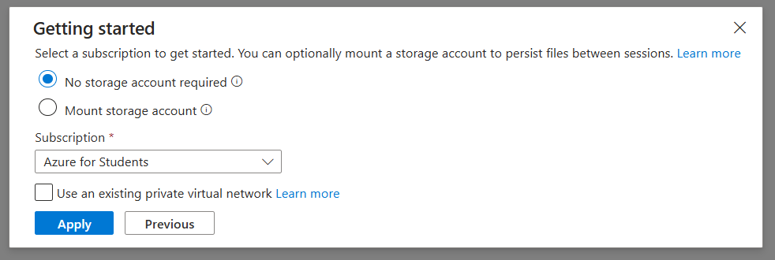
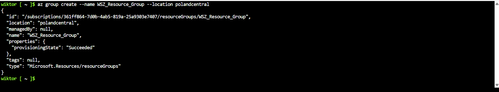
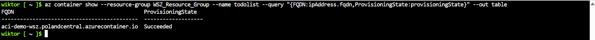
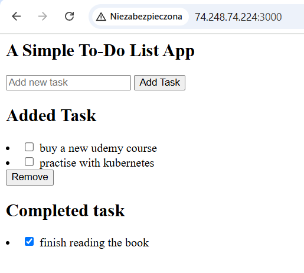
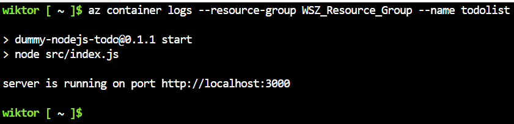
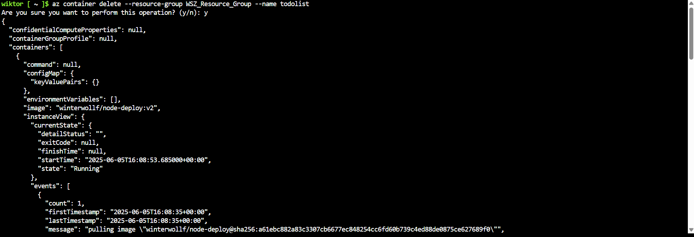
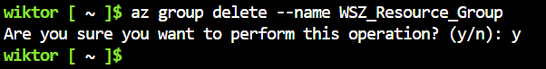
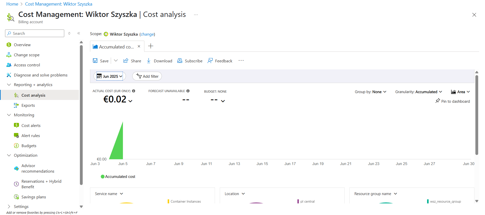

# Laboratorium 12 - Wdrażanie na zarządzalne kontenery w chmurze (Azure)

## Abstrakt

W ramach laboratorium zapoznano się z platformą Microsoft Azure oraz jej możliwościami w zakresie zarządzania kontenerami. Przeprowadzono proces wdrożenia aplikacji w kontenerze, począwszy od utworzenia grupy zasobów, poprzez uruchomienie kontenera z wybranym obrazem, monitorowanie działania oraz analizę logów, aż po usunięcie zasobów i ocenę poniesionych kosztów. Celem ćwiczenia było praktyczne poznanie narzędzi chmurowych oraz zdobycie umiejętności efektywnego zarządzania środowiskiem kontenerowym w chmurze.

### Zapoznanie z platformą

**1) Cennik**


**2) Uruchomienie Azure Cloud Shell**





### Wdrożenie kontenera 

**1) Utworzenie własnej resource group**

```bash
az group create --name WSZ_Resource_Group --location polandcentral
```

Powyższa komenda tworzy `resource group` o nazwie `WSZ_Resource_Group` podpiętą do lokalizacji `Poland Central`.



**2) Utworzenie kontenera**

Kontener został utworzony na podstawie obrazu `winterwollf/node-deploy:v2` dostępnego na DockerHub. Jest to obraz, na którym pracuje od początku zajęć laboratoryjnych.

```bash
az container create --resource-group WSZ_Resource_Group --name todolist --image winterwollf/node-deploy:v2 --dns-name-label aci-demo-wsz --ports 3000 --os-type linux --memory 1.5 --cpu 1
```

Powyższa komenda tworzy kontener o nazwie `todolist` przypisany do grupy `WSZ_Resource_Group`. Kontener udostępnia usługę na porcie `3000`. Dodatkowo przypisano 1.5 GB pamięci RAM oraz 1 rdzeń procesora.


**3) Działanie aplikacji**

```bash
az container show --resource-group WSZ_Resource_Group --name todolist --query "{FQDN:ipAddress.fqdn,ProvisioningState:provisioningState}" --out table
```

Powyższa komenda wyświetli `Fully Qualified Domain Name` oraz `ProvisioningState`.





**4) Logi**

```bash
az container logs --resource-group WSZ_Resource_Group --name todolist
```

Powyższa komenda wyświetli logi `stdout/stderr`.



**5) Zatrzymanie i usunięcie kontenera**

```bash
az container delete --resource-group WSZ_Resource_Group --name todolist
```

Powyższa komenda usunie kontener o nazwie `todolist` z resource group o nazwie `WSZ_Resource_Group`.



```bash
az container list --resource-group WSZ_Resource_Group --output table
```

Powyższa komenda wyświetli listę kontenerów z grupy `WSZ_Resource_Group`. W naszym przypadku lista jest pusta, co znaczy, że nie mamy żadnego kontenera.


**6) Zatrzymanie i usunięcie resource group**

```bash
az group delete --name WSZ_Resource_Group
```

Powyższa komenda usunie resource group o nazwie `WSZ_Resource_Group`.



**7) Analiza poniesionych kosztów**

Uruchamiając panel analizy kosztów, możemy zobaczyć podsumowanie naszych wydatków. Wdrożenie przedstawione powyżej kosztowało 0,02 USD.



