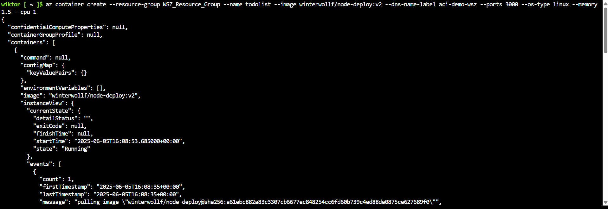
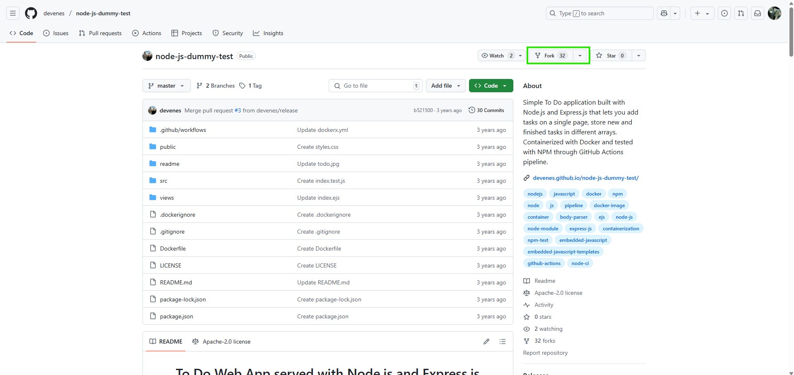
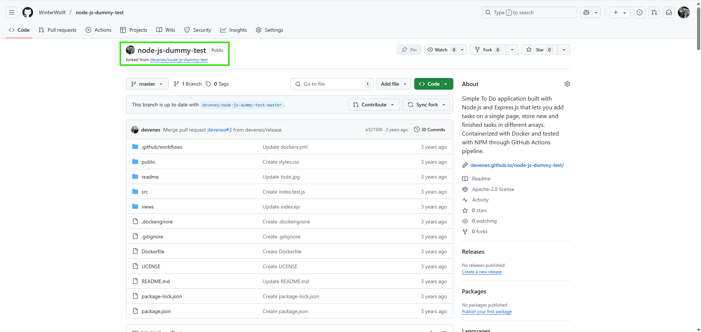
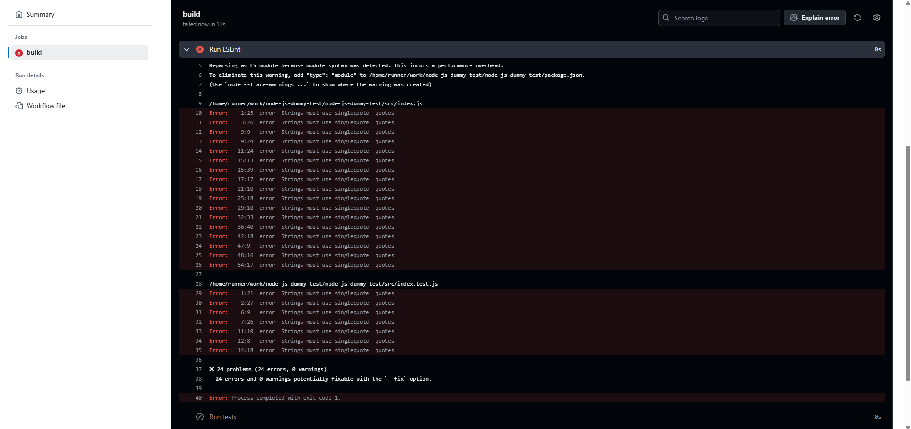

# Laboratorium 12 - Wdrażanie na zarządzalne kontenery w chmurze (Azure)

## Abstrakt

W ramach laboratorium zapoznano się z platformą Microsoft Azure oraz jej możliwościami w zakresie zarządzania kontenerami. Przeprowadzono proces wdrożenia aplikacji w kontenerze, począwszy od utworzenia grupy zasobów, poprzez uruchomienie kontenera z wybranym obrazem, monitorowanie działania oraz analizę logów, aż po usunięcie zasobów i ocenę poniesionych kosztów. Celem ćwiczenia było praktyczne poznanie narzędzi chmurowych oraz zdobycie umiejętności efektywnego zarządzania środowiskiem kontenerowym w chmurze.

### Zapoznanie z platformą

**1) Cennik**


**2) Uruchomienie Azure Cloud Shell**


### Wdrożenie kontenera 

**1) Utworzenie własnej resource group**

```bash
az group create --name WSZ_Resource_Group --location polandcentral
```

Powyższa komenda tworzy `resource group` o nazwie `WSZ_Resource_Group` podpiętą do lokalizacji `Poland Central`.


**2) Utworzenie kontenera**

Kontener został utworzony na podstawie obrazu `winterwollf/node-deploy:v2` dostępnego na DockerHub. Jest to obraz, na którym pracuje od początku zajęć laboratoryjnych.

```bash
az container create --resource-group WSZ_Resource_Group --name todolist --image winterwollf/node-deploy:v2 --dns-name-label aci-demo-wsz --ports 3000 --os-type linux --memory 1.5 --cpu 1
```

Powyższa komenda tworzy kontener o nazwie `todolist` przypisany do grupy `WSZ_Resource_Group`. Kontener udostępnia usługę na porcie `3000`. Dodatkowo przypisano 1.5 GB pamięci RAM oraz 1 rdzeń procesora.




**3) Działanie aplikacji**

```bash
az container show --resource-group WSZ_Resource_Group --name todolist --query "{FQDN:ipAddress.fqdn,ProvisioningState:provisioningState}" --out table
```

Powyższa komenda wyświetli `Fully Qualified Domain Name` oraz `ProvisioningState`.


**4) Logi**

```bash
az container logs --resource-group WSZ_Resource_Group --name todolist
```

Powyższa komenda wyświetli logi `stdout/stderr`.


**5) Zatrzymanie i usunięcie kontenera**

```bash
az container delete --resource-group WSZ_Resource_Group --name todolist
```

Powyższa komenda usunie kontener o nazwie `todolist` z resource group o nazwie `WSZ_Resource_Group`.


```bash
az container list --resource-group WSZ_Resource_Group --output table
```

Powyższa komenda wyświetli listę kontenerów z grupy `WSZ_Resource_Group`. W naszym przypadku lista jest pusta, co znaczy, że nie mamy żadnego kontenera.


**6) Zatrzymanie i usunięcie resource group**

```bash
az group delete --name WSZ_Resource_Group
```

Powyższa komenda usunie resource group o nazwie `WSZ_Resource_Group`.


**7) Analiza poniesionych kosztów**

Uruchamiając panel analizy kosztów, możemy zobaczyć podsumowanie naszych wydatków. Wdrożenie przedstawione powyżej kosztowało 0,02 USD.


# Laboratorium 13 - Shift-left: GitHub Actions

## Abstrakt

Celem laboratorium było praktyczne zapoznanie się z platformą GitHub Actions oraz jej możliwościami w zakresie automatyzacji procesów CI/CD. W ramach ćwiczenia skonfigurowano workflow, wykorzystano różne triggery uruchamiania akcji, a także zintegrowano narzędzie do analizy statycznej kodu (ESLint). Dodatkowo, laboratorium obejmowało przygotowanie artefaktów wdrożeniowych oraz weryfikację poprawności działania procesu na przykładzie projektu `node-js-dummy-test`.

### Zapoznanie z platformą

**1) Triggery**

W GitHub Actions wyróżniamy następujące Triggery:
- `on push` - wykonywany po każdym commicie do konkretnej gałęzi,
- `pull_request` - wykonywany przy każdym Pull Request do konkretnej gałęzi,
- `workflow_dispatch` - wykonywany ręcznie na żądanie przez użytkownika z odpowiednimi uprawnieniami,
- `schedule` - wykonywanie w konkretnym czasie (datowo),
- `fork` - wykonywany przy forkowaniu repozytorium,
- itp. - [Pełna lista dostępnych triggerów](httpsLab_13//docs.github.com/en/actions/writing-workflows/choosing-when-your-workflow-runs/events-that-trigger-workflows)

**2) Cennik**

GitHub Actions podobnie jak Azure jest płatną usługą, chociaż istnieje darmowy plan, który jest bardzo ograniczony względem możliwości jego wykorzystania.


**3) Fork repozytorium `node-js-dummy-test`**






**4) Sklonowanie repozytorium**

```bash
git clone git@github.com:WinterWollf/node-js-dummy-test.git
```

Powyższa komenda sklonuje sforkowane repozytorium, ponieważ zdecydowałem się na zklonowanie repozytorium przy pomocy uwieżytelnienia przez SSH, musiałem podać hasło do klucza SSH.


**5) Utworzenie nowego brancha**

```bash 
cd node-js-dummy-test
git checkout -b ino_dev
git push -u origin ino_dev
```

Powyższe komendy tworzą nowego brancha o nazwie `ino_dev`. Ostatnia komenda wypycha zmiany do zdalnego repozytorium.


**6) Usunięcie istniejących `workflows`**

Obecnie repozytorium zawiera 3 workflows. Zostały one usunięte, następnie zostało utworzone workflow o nazwie `build_and_test.yml`.


**7) Plik `workflow`**

```yaml
name: Build and Test

on:
  push:
    branches:
      - ino_dev
  pull_request:
    branches:
      - ino_dev
  workflow_dispatch:
    inputs:
      tags:
        description: 'Test tags'

jobs:
  build:
    runs-on: ubuntu-latest

    steps:
      - name: Checkout repo
        uses: actions/checkout@v4

      - name: Set up Node.js
        uses: actions/setup-node@v4
        with:
          node-version: '20'

      - name: Install dependencies
        run: npm install

      - name: Run tests
        run: npm test
```

Akcja o nazwie `Build and Test` będzie wykonywana zawsze przy:
- commitowaniu do repozytorium zdalnego na gałąź `ino_dev` -> sekcja `on push`,
- wykonywaniu pull requesta do gałęzi `ino_dev` -> sekcja `on pull_request`,
- po ręcznym wymuszeniu przez użytkownika (kliknięcie odpowiedniego przycisku) -> sekcja workflow_dispatch,

Sekcja `jobs` definiuje zadania do wykonania. W tym przypadku zadanie o nazwie `build`, które będzie uruchamiane na wirtualnej maszynie z systemem `ubuntu-latest`.
- pierwszy krok klonuje repozytorium do środowiska GitHub Actions -> `actions/checkout`,
- drugi krok ustawia środowisko uruchomieniowe Node.js w wersji `20` -> `setup-node`,
- trzeci krok instaluje zależności projektu z pliku `package.json`,
- czwarty krok uruchamia testy jednostkowe. 


**8) Dodanie ESLint**

Zdecydowano się na dodanie narzędzia do analizy kodu ESLint. Sforkowany projekt nie wspierał natywnie narzędzia ESLint, aby dodać takie wsparcie należało zainstalować narzędzie ESLint oraz utworzyć jego konfigurację w katalgou `eslint.config.js`.

```bash
npm install --save-dev eslint@latest
```

Powyższa komenda instaluje narzędzie ESLint w najnowszej wersji. Dopisek `--save-dev` oznacza, że pakiet zostanie zainstalowany jako zależność deweloperska - nie jest ona wymagana w środowisku produkcyjnym. 


```js
export default [
  {
    files: ['*Lab_13/*.js', '*Lab_13/*.ts', '*Lab_13/*.jsx', '*Lab_13/*.tsx'],
    languageOptions: {
      ecmaVersion: 'latest',
      sourceType: 'module',
    },
    rules: {
      semi: ['error', 'always'],
      quotes: ['error', 'single'],
    },
  },
];
```

Powyższy plik przedstawia konfigurację ESLint, która definiuje reguły dla plików JavaScript i TypeScript, wymuszając użycie średników i pojedynczych cudzysłowów oraz ustawiając najnowszą wersję ECMAScript i typ źródła jako moduł.

Następnie dodano odpowiednią sekcję do pliku `build_and_test.yml`.

```yaml
jobs:
  build:
    runs-on: ubuntu-latest

    steps:
      ...

      - name: Run ESLint
        run: npx eslint . --ext .js,.jsx,.ts,.tsx
        
      - name: Run tests
        run: npm test
```

Dodanie powyższego fragmentu sprawi, że przed uruchomieniem testów, kod będzie analizowany przez narzędzie ESLint.




Akcja skończyła się niepowodzeniem, ponieważ narzędzie ESLint wykryło nieprawidłowości w analizowanym kodzie - były to błędy związane z użyciem podwójnego cudzysłowia zamiast pojedynczego. 

**9) Pull Request**

W momencie utworzenia `Pull Requesta` została uruchomiona `Akcja`, ponieważ tak jak wyżej zakończyła się ona niepowodzeniem, otrzymaliśmy o tym stosowny komunikat. Ustawienia repozytorium pozwalają na `Merge` takiego `Pull Requesta`, nawet w sytuacji, gdy akcja zakończyła się niepowodzeniem. 


Zmieniono ustawienia repozytorium poprzez dodanie `Ruleset`, który wymusza poprawne przejście akcji, w celu dokonania merga.


W celu zaprezentowania poprawności działania, dodano do polecenia uruchamiania narzędzia ESLint flagę `--fix`, która w miarę możliwości jakie oferuje to narzędzie spróbuje "naprawić" kod.

```yaml
jobs:
  build:
    runs-on: ubuntu-latest

    steps:
      ...

      - name: Run ESLint
        run: npx eslint . --ext .js,.jsx,.ts,.tsx --fix
        
      - name: Run tests
        run: npm test
```

Zastosowanie falgi `--fix` "naprawiło" kod, co umożliwiło akcji pomyślne zakończenie. Spowodowało to możliwość mergowania 


**10) Artefakt - paczka ZIP**

Tak jak w przypadku Jenkinsa zdecydowano się na stworzenie artefaktu w postaci paczki ZIP. W pliku `build_and_test.yml` dodano odpowienie sekcje.

```yaml
jobs:
  build:
    runs-on: ubuntu-latest

    steps:
      ...

      - name: Run tests
        run: npm test

      - name: Create deployment package (.zip)
        run: |
          mkdir -p dist
          cp -r node_modules src views package.json dist/
          cd dist
          zip -r app-${{ github.run_number }}.zip Lab_13/*
        shell: bash

      - name: Upload deployment artifact
        uses: actions/upload-artifact@v4
        with:
          name: app-${{ github.run_number }}.zip
          path: dist/app-${{ github.run_number }}.zip
```

Po pomyślnym zakończeniu testów dodane zostały dwa kroki odpowiedzialne za utworzenie oraz opublikowanie artefaktu.

1. Pierwszy krok o nazwie `Create deployment package (.zip)` tworzy katalog `dist`, kopiuje do niego katalogi `node_modules`, `src`, `views` oraz plik `package.json` – czyli wszystko, co potrzebne do wdrożenia aplikacji. Wchodzi do katalogu `dist` i pakuje całość do pliku `.zip`, gdzie `github.run_number` to numer kolejnego uruchomienia workflow.

2. Drugi krok o nazwie `Upload deployment artifact` używa oficjalnej akcji `upload-artifact`, przesyła utworzony plik `.zip` jako artefakt do podglądu i pobrania bezpośrednio z interfejsu GitHub Actions.

Historia znajduje się w pliku `history.txt`.