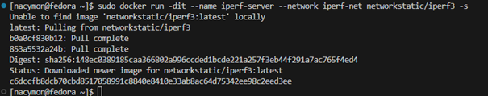
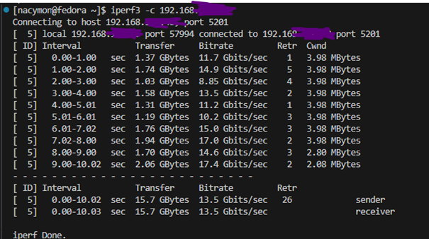

Agata Wojciechowska gr.8 , 417460

ZAJĘCIA_01
_______________________________________________________________________________

1.	Zainstalowanie systemu operacyjnego opartego o Linux, pracujący w maszynie wirtualnej.
Zainstalowany system to Feodora bez środowiska graficznego. Maszynie przydzielono 8GB pamięci RAM oraz 36GB na dysku. Aby umożliwić łączność pomiędzy maszyną a hostem wykorzystano połączenie mostkowe.

2.	Zalogowanie przez SSH do zainstalowanej maszyny wirtualnej.
Początkowo po uruchomieniu Feodory należy podać nazwę użytkownika oraz ustawić hasło. Następnie uruchomiono  SSH w Feodora Server za pomocą:
sudo dnf install -y openssh-server
sudo systemctl enable --now sshd

Po czym sprawdzono adres ip przy użyciu polecenia ip a:

  

3.	Połączenie z SSH i SFTP
a.	SSH z hosta(Windows) do maszyny wirtualnej
Otworzenie PowerShell i wpisanie komendy ssh użytkownik@192.168.X.X:

b.	FileZilla (SFTP)
Uruchomienie aplikacji i wpisanie odpowiednich informacji w odpowiedznie pola, tj.:
Host: ip 192.168.X.X
Użytkownik: nazwa konta na Feodora Serwer
Hasło: hasło ustalone dla danej nazwy konta
Port: 22 (22 ponieważ połączenie jest mostkowe)
Następnie klikamy „Szybkie łączenie”.

4.	Klonowanie repozytorium GitHub przez SSH.
a.	W Feodora Serwer należy wygenerować klucz SSH przy pomocy polecenia:
ssh-keygen -t rsa -b 4096
Polecenie generuje klucz, a następnie pyta o passphrase, czyli ustalenie hasła. Można pomiąć ustawienie hasła klikając dwukrotnie enter ponieważ zapytanie o ustawienie pada dwa razy.

b.	Aby wyświetlić klucz należy wpisac polecenie:
cat ~/.ssh/id_rsa.pub
Po wykonaniu komendy powinien wyświetlić się klucz zaczynający się następująco:

c.	Klucz można kopiować na wiele sposobów jednak w tym przypadku użyto do tego FileZilli, aby mieć dostęp do klucza na hoście. Otworzono program FileZilla. Następne połączono się z serwerem i znaleziono plik z kluczem SSH w folderze w którym został on zapisany tj. „.ssh”.

d.	Dodanie klucza do GitHub.
Należy przejść na strone GitHub. Wejść w ustawienia i znaleźć zakładkę „SSH and GPG keys”, po czym kliknąć „New SSH key” i wkleić wcześniej wygenerowany klucz.

e.	Testowanie połączenia.
Aby sprawdzić czy Feodora Server jest odpowiednio połączony z GitHubem można wpisać następujące polecenie:
ssh -T git@github.com

f.	Klonowanie repozytorium przy użyciu polecenia:
git clone git@github.com:InzynieriaOprogramowaniaAGH/MDO2025_INO.git
Po sklonowaniu materiały powinny pojawić się w folderze użytkownika.

g.	Tworzenie gałęzi zgodnie z poleceniem.
Aby utworzyć gałąź należy przenieść się do gałęzi odpowiedniej grupy w tym przypadku będzie to gałąź o nazwie „GLC08” przy pomocy polecenia git checkout GLC08. Następnie aby utworzyć gałąź należy wpisać git branch nazwa_galezi w tym przypadku będzie to AW417460. Na sam koniec przechodzimy do naszej nowo utworzonej gałęzi ponownie przy użyciu polecenia git checkout.

Ostateczny wynik powinien wyglądać następująco:

Zielony napis oznacza gałąź w której obecnie się znajdujemy.

5.	Konfiguracja VisualStudio Code z Remote-SSH.
Aby połączyć serwer z VS Code należy najpierw pobrać rozszerzenie Remote-SSH wchodząc w zakładkę Extensions i wyszukując odpowiednie rozszerzenie. Po pobraniu należy wcisnąć skrót klawiszowy Ctrl+Shift+P i wyszukać Remote-SSH: Connect to host. Potem należy podać adres ip serwera tak jak przy Windows+SSH. Na koniec należy podać hasło do serwera i poczekać na połączenie.

ZAJĘCIA_02
_______________________________________________________________________________

1.	Pobranie obrazów przy pomocy polecenia sudo docker pull nazwa_obrazu.

2.	Zalogowanie się do dockera.

3.	Uruchomienie kontenera z obrazu busybox
a.	Uruchomienie przy pomocy polecenia: sudo docker run busybox
b.	Uruchomienie kontenera w trybie interaktywnym poleceniem sudo docker run -it busybox sh
c.	Wyświetlenie numeru wersji poleceniem busybox –help | head -n 1
d.	Wyjście z kontenera poleceniem exit.

Przy pierwszym uruchomieniu (nieinteraktywnym) busybox wykona się i zakończy.
4.	Uruchomienie systemu w kontenerze feodora
a.	Uruchomienie interaktywnego kontenera za pomocą polecenia sudo docker run -it fedora bash
b.	Sprawdzenie procesu PID 1

c.	Sprawdzenie procesów dockera na hoście w osobnym terminalu

d.	Zaktualizowanie pakietow za pomocą polecenia dnf uptade -y
e.	Wyjście z kontenera poleceniem exit
5.	Stworz, zbuduj i uruchom plik ‘Dockerfile’.
a.	Stworzenie pliku Dockerfile przy pomocy nano Dockerfile

b.	Zbudowanie obrazu przy pomocy poleceia sudo docker bulid -t mój_obraz .

c.	Uruchomienie kontenera w trybie interaktywnym i sprawdzenie czy repozytorium się sklonowało

6.	Pokazanie uruchomionych kontenerów.

7.	Czyszczenie obrazów (nieużywanych).

ZAJĘCIA_03
_______________________________________________________________________________

Do wykonanie zadania znaleziono projekt doctest. 

1. Sklonowanie repozytorium

Przejście do katalogu repozytorium i utworzenie folderu o nazwie „build” za pomocą polecenia mkdir, a następnie przejście do niego.
2.	Budowanie projektu.

3. Testy.

4.	Stworzenie plikow Dockerfile

5.	Budowanie obrazu

6.	Budowanie obrazu testowego

ZAJĘCIA_04
_______________________________________________________________________________

ZACHOWYWANIE STANU
1.	Stworzenie woluminu wejściowego i wyjściowego.

2.	Uruchomienie nowego kontenera na bazie obrazu z wcześniejszych zajęć.

3.	Sklonowanie repozytorium na wolumin wejściowy.

4.	Uruchomienie kontenera i przeprowadzenie buildu wewnątrz kontenera

5.	Sprawdzenie zawartości wolumina wyjściowego

6.	Przeprowadzenie tej samej operacji, ale klonowanie  przeprowadzono wewnątrz kontenera za pomocą gita.

EKSPORTOWANIE PORTU
1.	Stworzenie własnej sieci mostkowej

2.	Uruchomienie kontenera jako serwer iperf3

3.	Test stworzonego serwera

4.	Uruchomienie klienta w drugim kontenerze

5.	Uruchomienie serwera z wystawionym portem na hosta

6.	Uruchomienie serwera z wystawionym portem z innego hosta

7.	Zapisanie wyników testu 

INSTALACJA JENKINS

