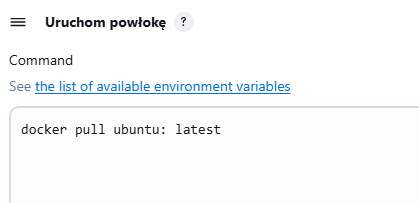

1.	Utworzenie instancji Jenkins z docker

a)	Utworzenie instancji Jenkins zostało wykonane w ramach poprzedniego sprawozdania.

b)	Aby rozpocząć pracę z Jenkinsem uruchomiono następujące kontenery:
 
 

 

c)	Uruchomienie strony.

2.	Zadania wstępne - uruchomienie.

a)	Utworzenie projektu, który wyświetla uname.

Wybieramy z menu na stronie „+ nowy projekt”

 

Następnie wybieramy projekt ogólny i nadajemy mu nazwę

 

W opcjach konfiguracji przechodzimy do sekcji kroki budowania, z rozwijanej listy wybieramy uruchom powłokę, a następnie w oknie które wyskoczy wpisujemy nasze polecenie.

 
 
Klikamy zapisz i klikamy uruchom w menu po lewej stronie

 
 
Dostajemy komunikat z zielona ikonka co oznacza ze wszystko uruchomiło się poprawnie.

b)	Utwórz projekt który zwraca błąd, gdy godzina jest nieparzysta.

Powtarzamy powyższe kroki. Zmieniamy jedynie polecenie.

#!/bin/bash
HOUR=$(date +%H)
if [ $((HOUR % 2)) -ne 0 ]; then
    echo "Błąd: godzina ($HOUR) jest nieparzysta!"
    exit 1
else
    echo "Godzina ($HOUR) jest parzysta..."
fi
Otrzymany wynik:

 
 
 

c)	Pobranie w projekcie obrazu kontenera ubuntu, stosująć docker pull.

Ponownie powtarzamy kroki, zmieniamy treść polecenia powłoki.

 

 

3.	Zadania wstępne – pipeline.

Utwórz nowy obiekt typu pipeline.

 
 
Wpisz treść pipeline'u bezpośrednio do obiektu.

Spróbuj sklonować repo przedmiotowe (MDO2025_INO).

    stages {
        stage('Clone repository') {
            steps {
                script {
                    sh 'rm -rf * && git clone ${REPO_URL}'
                }
            }
        }

Zrób checkout do swojego pliku Dockerfile (na osobistej gałęzi) właściwego dla buildera wybranego w poprzednim sprawozdaniu programu.

        stage('Checkout Dockerfile') {
            steps {
                script {
                    sh 'cd MDO2025_INO && git checkout ${BRANCH}'
                }
            }
        }

Zbuduj Dockerfile.
        
        stage('Build Docker Image') {
            steps {
                script {
                    sh 'cd MDO2025_INO/ITE/GCL08/AW417460/Sprawozdanie_1/Woluminy && docker build -t ${DOCKER_IMAGE} -f Dockerfile.build .'
                }
            }
        }

 
 

Cały pipeline:

pipeline {
    agent any
    
    environment {
        REPO_URL = 'https://github.com/InzynieriaOprogramowaniaAGH/MDO2025_INO.git'
        BRANCH = 'AW417460'
        DOCKER_IMAGE = 'my-builder-image'
    }
    
    stages {
        stage('Clone repository') {
            steps {
                script {
                    sh 'rm -rf * && git clone ${REPO_URL}'
                }
            }
        }
        
        stage('Checkout Dockerfile') {
            steps {
                script {
                    sh 'cd MDO2025_INO && git checkout ${BRANCH}'
                }
            }
        }
        
        stage('Build Docker Image') {
            steps {
                script {
                    sh 'cd MDO2025_INO/ITE/GCL08/AW417460/Sprawozdanie_1/Woluminy && docker build -t ${DOCKER_IMAGE} -f Dockerfile.build .'
                }
            }
        }
    }
}

Uruchom stworzony pipeline drugi raz.

 
 

4.	Pipeline – projekt.

Do wykonania zadania posłużymy się repozytorium Node-red.

Przed utworzeniem pipeline’u należy zrobić fork na repozytorium z projektem.
 
  

  

Utworzenie pipeline’u rozpoczynamy od utworzenia nowego projektu typu pipeline, podobnie jak w zadaniu powyżej. Przechodzimy do zakładki „Nowy projekt +”, klikamy typ „pipeline”, nadajemy nazwę „node-red-pipeline”.

W opcjach konfiguracji ustawiamy następująco:

Definition: Pipeline from script SCM 

SCM: Git 

Repository URL: https://github.com/nacymon/node-red 

Branch Specifier: */master 

Script path: Jenkinsfile 

 
 
Następnie musimy sklonować repozytorium na maszynę i utworzyć pliki Dockerfile oraz Jenkinsfile, które później musimy dodac do forka. 

Plik Jenkinsfile wygląda następująco:

pipeline {
    agent any

    environment {
        DOCKER_IMAGE = "nacymon/node-red-ci"
        CONTAINER_NAME = "RED"
        DOCKER_NETWORK = "CI"
        NODE_PORT = "3000"
    }

    stages {
        stage('Checkout') {
            steps {
                git 'https://github.com/nacymon/node-red'
            }
        }

        stage('Build Docker Image') {
            steps {
                sh "docker build -t $DOCKER_IMAGE ."
            }
        }

        stage('Create Network') {
            steps {
                sh "docker network create $DOCKER_NETWORK || true"
            }
        }

        stage('Run Node-RED') {
            steps {
                sh "docker rm -f $CONTAINER_NAME || true"
                sh "docker run -d --name $CONTAINER_NAME --network $DOCKER_NETWORK -p $NODE_PORT:$NODE_PORT $DOCKER_IMAGE"
                sh "sleep 5"
            }
        }

        stage('Health Check') {
            steps {
                sh """
                    docker run --rm --network $DOCKER_NETWORK curlimages/curl:8.7.1 \
                    curl -f http://$CONTAINER_NAME:$NODE_PORT
                """
            }
        }

        stage('Push to DockerHub') {
            steps {
                withCredentials([usernamePassword(credentialsId: 'dockerhub-creds', usernameVariable: 'DOCKER_USER', passwordVariable: 'DOCKER_PASS')]) {
                    sh 'echo $DOCKER_PASS | docker login -u $DOCKER_USER --password-stdin'
                    sh "docker push $DOCKER_IMAGE"
                }
            }
        }
    }

    post {
        always {
            echo 'Cleanup'
            sh "docker rm -f $CONTAINER_NAME || true"
            sh "docker network rm $DOCKER_NETWORK || true"
        }
    }
}

Plik Dockerfile wygląda następująco:

FROM node:20-slim

RUN apt-get update && \
    apt-get install -y --no-install-recommends curl ca-certificates git && \
    rm -rf /var/lib/apt/lists/*

RUN npm install -g --omit=dev node-red

WORKDIR /usr/src/app

COPY settings.js /data/settings.js
COPY . .

ENV PORT=3000
EXPOSE 3000

CMD ["node-red", "--port", "3000"]

Diagram aktywności procesu CI/CD

•	Start

•	Manual trigger lub commit do repozytorium

•	Pobranie kodu z SCM (Checkout)
– Klonowanie repozytorium zawierającego Jenkinsfile, Dockerfile oraz kod Node-RED.

•	Budowanie obrazu Dockera (Build)
– Wykonanie komendy docker build w celu utworzenia obrazu aplikacji Node-RED.

•	Utworzenie sieci Docker (network create)
– Tworzenie odizolowanej sieci CI na potrzeby komunikacji między kontenerami.

•	Uruchomienie kontenera Node-RED (Deploy)
– Kontener RED zostaje uruchomiony z przypisaniem do sieci CI oraz portem 3000.

•	Test zdrowia aplikacji (Health check)
– W osobnym kontenerze curl wykonywane jest żądanie HTTP do kontenera RED po adresie http://RED:3000.

•	Warunek: Czy test zdrowia zakończył się sukcesem?
    Tak:
    o	Logowanie do Docker Hub
    o	Wysłanie obrazu (docker push)
    Nie:
    Pipeline kończy się błędem

•	Czyszczenie środowiska (Cleanup)
– Usuwanie kontenera RED i sieci CI, niezależnie od sukcesu lub porażki wcześniejszych etapów.

•	Stop

Dodajemy pliki na repo, dodając commita na repozytorium github.

a)	git add .

b)	git commit -m „Add files”

c)	git push

Dodatkowo musiałam dodać w Credentials Jenkinsa dockera, bo chyba nie zrobiłam tego wcześniej.

Po tej operacji uruchamiamy pipeline i weryfikujemy jego poprawność.

Dla upewnienia się, że wszystko faktycznie w końcu działa uruchomiono pipeline jeszcze raz.

Tworzony pipeline CI/CD w Jenkinsie realizuje pełną ścieżkę krytyczną obejmującą następujące etapy: inicjalizację, klonowanie repozytorium, budowanie obrazu Docker, testowanie uruchomionej aplikacji, jej wdrożenie oraz publikację obrazu na Docker Hub. Proces oparty jest na kontenerze Docker-in-Docker (dind), co umożliwia wykonywanie wszystkich operacji dockerowych w izolowanym środowisku. Pipeline buduje obraz aplikacji Node-RED, uruchamia kontener w dedykowanej sieci Docker o nazwie „CI”, eksponuje aplikację na porcie 3000 oraz przeprowadza test zdrowotny przy użyciu osobnego kontenera curl, który komunikuje się z usługą po nazwie hosta w ramach tej samej sieci. Po pozytywnym teście obraz aplikacji jest publikowany na Docker Hub z użyciem zaszyfrowanych danych logowania. Pipeline zawiera również etap czyszczenia, który usuwa kontener oraz sieć po zakończeniu pracy, niezależnie od rezultatu. 