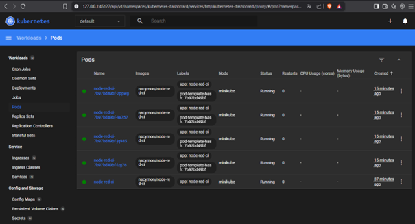

Agata Wojciechowska gr.8 

Zajęcia: Automatyzacja i zdalne wykonywanie poleceń za pomocą Ansible
1. Instalacja Ansible.
    Utworzono nową maszynę wirtualną z systemem Fedora 41, zgodnie z konfiguracją poprzedniej maszyny.

    Podczas instalacji:
    - Utworzono nowego użytkownika o nazwie ansible.
    - Po zakończeniu instalacji zmieniono nazwę hosta na ansible-target za pomocą    polecenia: sudo hostnamectl set-hostname ansible-target

    

    Następnie sprawdzono czy czy program tar oraz serwer openssh jest już zainstalowany.

    

    Zrobienie migawki maszyny.

    

    Na nowo utworzonej maszynie z systemem Fedora 41 zainstalowano oprogramowanie Ansible za pomocą polecenia: sudo dnf install ansible -y

    

    

    Do nawiązania połączenia SSH między maszynami wykorzystano wcześniej wygenerowany klucz publiczny (utworzony podczas pierwszych laboratoriów). W celu przekazania klucza na maszynę docelową użyto polecenia: ssh-copy-id ansible@ansible-target

    Początkowo maszyna źródłowa nie rozpoznawała hosta o nazwie ansible-target, dlatego w pliku /etc/hosts dodano odpowiednią linię z adresem IP maszyny docelowej: 192.168.X.X ansible-target

    

    Po wykonaniu powyższych kroków hasło nie było już wymagane przy logowaniu.

    

2. Inwentaryzacja.
    Nazwy hostów maszyn zostały ustalone przy pomocy polecenia hostnamectl.
    W przypadku maszyny ansible-target operacja ta została wykonana wcześniej  podczas konfiguracji.

    

    Dopisanie nazw hostów do pliku /etc/hosts na obu maszynach.

    

    Zweryfikowanie łączności obu maszyn.

    

    

    Stworzenie pliku inwentaryzacji z sekcjami Orchestrators i Endpoints.

    

    Wysłanie za pomocą pliku inventory.ini żądania ping do wszystkich maszyn.

    

3. Zdalne wywoływanie procedur.
    Po wykonaniu inwentaryzacji maszyn utworzono playbook, którego celem było wykonanie podstawowych operacji administracyjnych na wszystkich hostach.

    Zakres działania playbooka:
    - Wysłanie żądań ping do wszystkich maszyn.
    - Skopiowanie pliku inwentaryzacji na maszyny.
    - Aktualizacja pakietów w systemie.
    - Restart usług sshd i rngd.

    Zawartość pliku playbook.yml:
        ---
        - hosts: all
      become: yes
      tasks:
        - name: Ping machines
          ansible.builtin.ping:

        - name: Copy inventory file
          ansible.builtin.copy:
            src: ./inventory.ini
            dest: /tmp/inventory.ini

        - name: Update all packages
          ansible.builtin.dnf:
            name: '*'
            state: latest
            update_cache: yes

        - name: Restart sshd and rngd
          ansible.builtin.systemd:
            name: "{{ item }}"
            state: restarted
          loop:
            - sshd
            - rngd

    Playbook został uruchomiony z poziomu maszyny sterującej.

    

    Aby operacja się wykonała należało zainstalować program na obu maszynach przy pomocy polecenia: sudo dnf install rng-tools

    Sprawdzenie działania z wyłączonym serwerem ssh.

    

    

    Podczas uruchamiania playbooka maszyna ansible-target była nieosiągalna (unreachable). W związku z tym żadne zadanie z playbooka nie zostało na niej wykonane.

    Mimo tego Ansible poprawnie wykonał operacje na drugiej, osiągalnej maszynie. Jest to zgodne z domyślnym działaniem Ansible, które pozwala kontynuować wykonywanie zadań na dostępnych hostach, pomijając te niedostępne.

4. Zarządzanie stworzonym artefaktem.
    Celem tego etapu było uruchomienie aplikacji opublikowanej w poprzednich zajęciach w postaci kontenera Docker.

    Wykonane kroki:
    - Zbudowano i uruchomiono kontener zgodnie z sekcją Deploy z wcześniejszych zajęć.
    - Pobrano obraz aplikacji z Docker Hub, który został opublikowany podczas kroku Publish.
    - Na maszynie docelowej zainstalowano Dockera z użyciem Ansible.
    - Zweryfikowano łączność z kontenerem.
    - Zatrzymano i usunięto kontener.

    Zawartość playbooka:
        ---
        - hosts: Endpoints
      become: yes
      tasks:
        - name: Install required system packages
          ansible.builtin.dnf:
            name:
              - python3-packaging
              - python3-pip
              - docker
            state: present
            update_cache: yes

        - name: Install Python 'requests'
      ansible.builtin.pip:
        name: requests
        executable: pip3

        - name: Start and enable Docker service
          ansible.builtin.service:
            name: docker
            state: started
            enabled: yes

        - name: Create Docker network CI (if not exists)
          shell: docker network create CI || true
          ignore_errors: true

        - name: Pull Docker image
          community.docker.docker_image:
            name: nacymon/node-red-ci:latest
            source: pull

        - name: Stop and remove existing container (if exists)
          community.docker.docker_container:
            name: RED
            state: absent
            force_kill: true

        - name: Remove any container using port 3000
          shell: |
            for id in $(docker ps -q --filter "publish=3000"); do docker rm -f $id; done
          ignore_errors: true

        - name: Run Node-RED container in CI network
          community.docker.docker_container:
            name: RED
            image: nacymon/node-red-ci:latest
            state: started
            restart_policy: unless-stopped
            networks:
              - name: CI
            published_ports:
              - "3000:3000"

        - name: Wait for the container to be ready
          wait_for:
            port: 3000
            host: "localhost"
            state: started
            delay: 5
            timeout: 60
            msg: "Node-RED is not available on port 3000"

        - name: Test HTTP response from container
          uri:
            url: http://localhost:3000
            return_content: yes
          register: http_response

        - name: Show HTTP response status
          debug:
            msg: "Node-RED HTTP status: {{ http_response.status }}"

        - name: Stop and remove Docker container
          community.docker.docker_container:
            name: RED
            state: absent
            force_kill: true

    Uruchomiony plik.

    

    Ubranie powyższych kroków w rolę, za pomocą szkieletowania ansible-galaxy.
    Utworzenie nowej roli.

    

    Utworzenie pliku playbooka w ścieżce /deploy-container/tasks/playbook.yml i skopiowanie do niego treści z playbooka2.

    Utworzenie kolejnego playbooka korzystającego z utworzonej roli o treści:
                ---
        - hosts: Endpoints
        become: yes
        roles:
            - deploy_container

    

Zajęcia: Pliki odpowiedzi dla wdrożeń nienadzorowanych
1. Instalacja nienadzorowana systemu Fedora z pliku odpowiedzi
    Przeniesienie pliku anaconda-ks.cfg z roota do swojego katalogu przy pomocy polecenia: sudo cp /root/anaconda-ks.cfg .

    Aby ustawić właściciela pliku należało skorzystać z polecenia sudo chown nacymon:nacymon anaconda-ks.cfg.

    Dodanie do pliku potrzebnych repozytoriów.
        url --mirrorlist=http://mirrors.fedoraproject.org/mirrorlist?repo=fedora-41&arch=x86_64

        repo --name=update --mirrorlist=http://mirrors.fedoraproject.org/mirrorlist?repo=updates-released-f41&arch=x86_64

    Ustawiono nazwe hosta na inną niż domyslna : network  --hostname=nacymonhost

    Gotowy plik:

    

    W celu automatyzacji instalacji systemu, stworzono nową maszynę wirtualną. Podczas uruchamiania instalatora Fedory, w ekranie startowym wciśnięto klawisz E, aby przejść do edycji parametrów jądra.

    Na końcu wiersza zaczynającego się od linux dodano parametr wskazujący zdalny plik odpowiedzi Kickstart: inst.ks=[adres URL do pliku Kickstart]

    Plik przesłano na repozytorium. Aby adres prowadził bezpośrednio do zawartości pliku, należy w repozytorium GitHub kliknąć "Raw", a potem skopiować link. Link skrócono przy pomocy narzędzia tinyurl, bo był bardzo długi.

    

    Edycja parametrów jądra.
    

    Gdy instalacja przebiegła pomyślnie, należało wyłączyć maszynę i usunąc plik ISO podpięty w ustawieniach, ponieważ po zakończeniu instalacji uruchamiał się plik instalacyjny zamiast właściwego systemu operacyjnego.

    

2. Rozszerzenie pliku odpowiedzi.
    W zadaniu należało rozszerzyć plik odpowiedzi o repozytoria i oprogramowanie potrzebne do uruchomienia programu, zbudowanego w ramach projektu pipeline.

    Utworzono plik anaconda-ks_2.cfg, skopiowano zawartość poprzedniego pliku i dodano następujące modyfikacje:

        # Generated by Anaconda 41.35
        # Generated by pykickstart v3.58
        #version=DEVEL

        # Keyboard layout
        keyboard --vckeymap=pl --xlayouts='pl'
        # System language
        lang pl_PL.UTF-8

        # Network configuration
        network  --bootproto=dhcp --device=enp0s3 --ipv6=auto --activate
        network  --hostname=nacymonhost

        # Repository configuration
        url --mirrorlist=http://mirrors.fedoraproject.org/mirrorlist?repo=fedora-41&arch=x86_64
        repo --name=update --mirrorlist=http://mirrors.fedoraproject.org/mirrorlist?repo=updates-released-f41&arch=x86_64

        # Packages to install
        %packages
        @^custom-environment
        docker
        wget
        curl
        bash
        %end

        # Partitioning
        ignoredisk --only-use=sda
        autopart
        clearpart --none --initlabel

        # Time zone
        timezone Europe/Warsaw --utc

        # User configuration
        rootpw --iscrypted --allow-ssh $y$j9T$yy8OR/agtVZD4OLQAj6Ap1.N$P0kUHjULI/s9mip8eeH/sMGnKg.s.//tui4FeWeVgN0
        user --groups=wheel --name=nacymon --password=$y$j9T$e7esf2FHm5CU5pJCI7POp/6K$pcZSiVqrk3nJb6Pi64MylW.dDggnSsBUirLnBT2Iea9 --iscrypted

        # Enable setup agent on first boot
        firstboot --enable

        # Post-installation configuration
        %post --log=/root/ks-post.log --interpreter=/bin/bash

        # Enable Docker to start on boot
        systemctl enable docker

        # Create startup script for the Node-RED CI container
        cat << 'EOF' > /usr/local/bin/start-node-red-ci.sh
        #!/bin/bash
        # Wait until Docker is fully running
        until systemctl is-active --quiet docker; do
          sleep 1
        done

        # Check if the container already exists, if not – run it
        if ! docker ps -a --format '{{.Names}}' | grep -q '^container-test$'; then
          docker run -d --name container-test -p 3000:3000 nacymon/node-red-ci
        fi
        EOF

        # Make the script executable
        chmod +x /usr/local/bin/start-node-red-ci.sh

        # Create a systemd service to run the container at boot
        cat << 'EOF' > /etc/systemd/system/node-red-ci.service
        [Unit]
        Description=Start Node-RED CI container
        After=network-online.target docker.service
        Requires=docker.service

        [Service]
        ExecStart=/usr/local/bin/start-node-red-ci.sh
        Type=oneshot
        RemainAfterExit=yes

        [Install]
        WantedBy=multi-user.target
        EOF

        # Enable the custom systemd service
        systemctl enable node-red-ci.service

        %end

        # Automatically reboot after installation is complete
        reboot

    Następnie ponowiono kroki z pierwszej części zadania, a efektem była instalacja systemu z działającym kontenerem.

    

Zajęcia: Wdrażanie na zarządzalne kontenery: Kubernetes
1. Instalacja klastra Kubernetes
    Przeprowadzenie instalacji zgodnie z instrukcja na stronie minikube.

    

    Zaopatrzenie się w kubectl.

    

    Uruchomienie Kubernetes.

    

    Uruchomienie dashboardu w przeglądarce.

    

    

2. Analiza posiadanego kontenera.
    Użyto obrazu zawierającego oprogramowanie node-red opublikowany na dockerhub przez pipeline utworzony na poprzenich zajęciach.

    

3. Uruchomienie oprogramowania.
    Uruchomienie kontenera ze swoją aplikacją na stosie k8s.

    

    

    Sprawdzenie działania poda.

    

    

    Przekierowanie portu aby połączyć się z kontenerem.

    

    Sprawdzenie działania.

    

    HTTP 200 OK w odpowiedzi na: curl -I http://localhost:3000
    To oznacza, że:
    - Aplikacja działa.
    - Port-forward działa.
    - Node-RED poprawnie odpowiada na żądania HTTP.

4. Przekucie wdrożenia manualnego w plik wdrożenia.
    Zapisanie aplikacji w pliku wdrożenia.
    Utworzenie pliku node-red-deployment.yaml o treści:

        apiVersion: apps/v1
        kind: Deployment
        metadata:
          name: node-red-ci
        spec:
          replicas: 4
          selector:
            matchLabels:
              app: node-red-ci
          template:
            metadata:
              labels:
                app: node-red-ci
            spec:
              containers:
                - name: node-red-container
                  image: nacymon/node-red-ci
                  ports:
                    - containerPort: 3000

    

    Sprawdzenie stanu wdrożenia.

    

    Informacja deployment redis-app successfully rolled out oznacza, że deployment zakończył się sukcesem. Deployment z 4 replikami zwiększa dostępność aplikacji — awaria jednej instancji nie zakłóca działania całości. Repliki umożliwiają skalowanie i równoważenie obciążenia, co zapewnia wydajność przy większym ruchu i zapobiega przeciążeniom.

    Wyeksportowanie wdrożenia jako serwis.
    Wyeksportowanie portu, aby aplikacja działała z zewnątrz.

    

    Przekierowanie portu do serwisu.

    

    

    Utworzony deployment na dashboardzie.

    

    

    

5. Przygotowanie nowego obrazu.
    Stworzenie dodatkowej wersji obrazu, którego uruchomienie kończy się błędem. (Na podobnej zasadzie stworzono wersję obrazu v1, która była nowszą wersją poprzedniego obrazu)

    

    

6. Zmiany w deploymencie.
    Zmiana pliku wdrożenia zmieniając liczbę replik. Początkową liczbą replik było 4.

    

    Z 4 do 8:

    

    

    Z 8 do 1:

    

    Z 1 do 0:

    

    Z 0 do 4:
    
    

    

    Zastosowanie w deploymencie wadliwego obrazu. Zmieniona wersja pliku wdrożenia:

    

    Po uruchomieniu, operacja nie chce się wykonać.

    

    Po sprawdzenia statusu wdrożenia, można zauważyć, że Kubernetes ciągle próbuje wdrożyć wadliwą wersję, lecz ciągle kończy się do niepowodzeniem:

    

    

    CrashLoopBackOff oznacza, że pod ciągle się uruchamia, crashuje i Kubernetes próbuje go restartować, ale kontener nie może się stabilnie uruchomić.

    

    Ponieważ wersja obrazu jest wadliwa, przywracamy poprzednią za pomocą polecenia: kubectl rollout undo deployment/node-red-ci

    Pody znów pracują na poprzedniej wersji obrazu.

    

    Historia deploymentu.

    

7. Kontrola wdrożenia
    Korzystając z historii wdrożeń, można uzyskać informacje o konkretnym wdrożeniu, podając numer rewizji.

    

    Napisanie skryptu weryfikującego, czy wdrożenie "zdążyło" się wdrożyć w 60 sekund.

    Treść pliku:

    

    Uruchomienie skryptu.

    

8. Strategie wdrożenia.
    - Recreate:
        W tej strategii wdrożenia najpierw zatrzymywane są wszystkie stare pody, a dopiero potem uruchamiane nowe. Może to powodować chwilową niedostępność aplikacji.

        Aby zastosować tę strategię, w pliku wdrożenia należy ustawić:
        strategy:
            type: Recreate

    - Rolling update:
        Domyślna strategia wdrożenia, w której nowe pody uruchamiane są stopniowo, zastępując stare — zapewnia ciągłą dostępność aplikacji.

        Aby dostosować parametry wdrożenia, w pliku należy dodać:
        strategy:
          type: RollingUpdate
          rollingUpdate:
            maxUnavailable: 2
            maxSurge: 30%

    - Canary Deployment workload:
        Aby zastosować strategię canary, należy utworzyć nowy deployment z nowszą wersją obrazu oraz mniejszą liczbą replik niż w wersji stabilnej. Nowa wersja jest udostępniana ograniczonej grupie użytkowników, co umożliwia wczesne wykrycie błędów przed pełnym wdrożeniem.

        Stworzenie pliku wdrożenia o treści:
        apiVersion: apps/v1
        kind: Deployment
        metadata:
          name: node-red-workload
        spec:
          replicas: 2
          strategy:
            type: RollingUpdate
            rollingUpdate:
              maxUnavailable: 2
              maxSurge: 40%
          selector:
            matchLabels:
              app: node-red-cl
          template:
            metadata:
              labels:
                app: node-red-cl
            spec:
              containers:
                - name: node-red-container
                  image: nacymon/node-red-ci:v1
                  ports:
                    - containerPort: 3000

    

    W ramach canary deploymentu oba Deploymenty działają pod tym samym serwisem, z czego 2 z 8 podów korzystają z nowej wersji aplikacji. Dzięki temu tylko część ruchu trafia do nowej wersji, co umożliwia jej testowanie w warunkach produkcyjnych. Ewentualne błędy mogą zostać wykryte i naprawione przed pełnym wdrożeniem.

    
