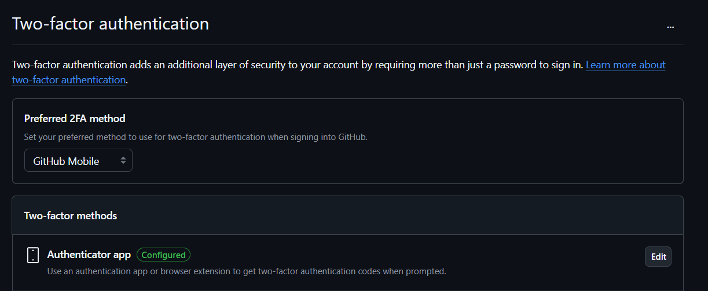

# Zajęcia 01
## 1. Intalacja klienta Git i obsługi kluczy SSH

W celu zaintalowania klienta Git wykonano poniższe polecenie:

    sudo dnf intall git -y

Poprawność intalacji można zweryfikować wykorzytując <code style="color:rgb(35, 186, 101);">git --version</code>

Jeżeli wszytko wykonało się poprawnie polecenie wypiszę wypisze wersję git'a obecną w naszym systemie. Dla pewności możemy dodatkowo sprawdzić dystrybutora pakietu ktory właśnie pobraliśmy. 

Obsługa kluczy jest możliwa dzięki pakietowi openssh-client który był już domyślnie zainstalowany na wykorzystywanej maszynie. 

## 2. Klonowanie [repozytorium przedmiotowego](https://github.com/InzynieriaOprogramowaniaAGH/MDO2025_INO) za pomocą HTTPS

Do wykonania tego zadania wykorzystano link prowadzący do repozytorium oraz polecenie: 

    git clone https://github.com/InzynieriaOprogramowaniaAGH/MDO2025_INO

## 3. Dostęp do repozytorium jako uczestnik oraz klonowanie go za pomocą klucza SSH

Utworzenie dwóch kluczny SSH (inne niż RSA), w tym jednego zabezpieczonego hasłem 

W celu bezpiecznego dostępu do repozytorium github konieczne było utworzenie klucza, zdecydowano się na klucz <code style="color:rgb(35, 186, 101);">ED25519</code> a proces jego tworzenia wyglądał następująco:

    ssh-keygen -t ed25519

Klucz został zapisany z domyślną nazwą oraz w domślnej lokalizacji nie zabezpieczony hasłem.

Drugi z kluczy (tym razem <code style="color:rgb(35, 186, 101);">ECDSA</code>) wygenerowano w podobny sposób jednak tym razem użyto hasła do jego zabezpieczenia. 

Jeden z wygenerowanych kluczy został skonfigurowany jako metoda dostępnu do GitHub. Osiągnięo to kopiując zawartość pliku .pub w odpowiednie miejsce na stwoim profilu. 

Uruchomiono agenta uwierzytelniania SSH za pomocą polecenia:

    eval $(ssh-agent)

Teraz możliwe jest skolowanie repozytorium z wykorzystaniem SSH

    git clone git@github.com:InzynieriaOprogramowaniaAGH/MDO2025_INO.git

Na zakończenie konfigurowane zotało uwierzytelnianie dwuetapowe 

## 4. Przelączenie sę na gałąż główną, a potem na gałąź grupy.

Przełączanie się pomiędzy gałęziami możliwe jest dzięki poleceniu <code style="color:rgb(35, 186, 101);">git checkout</code>. Aby wywietlić wszystkie dostępne załęzie wykorzystano polecenie: 

    git branch -a

Przełączenie się na gałąź głowną było możliwe za pomocą polecenia: 

    git checkout remotes/origin/main

Stąd przełączono się na galąź grupy (GCL08). 

## 5. Utworzenie gałęzi zawierające w nazwie inicjały i numer indeksu. 

Z gałęzi grupowej utworzono gałąz peronalną. 

 

 ## 6. Rozpoczęcie pracy na nowej gałęzi

 W katalogu właściwym dla grupy utworzono nowy katalog, o nazwie identycznej jak nazwa gałęzi. 

 Utworzono githooka weryfikującego poprawność tworzonynych commitów i dodanie go do katalogu .git/hooks:

    #!/bin/bash

    PATTERN="^AZ416400" 

    COMMIT_MSG_FILE="$1"
    COMMIT_MSG=$(head -n 1 "$COMMIT_MSG_FILE")

    if [[ ! $COMMIT_MSG =~ $PATTERN ]]; then
        echo "BŁĄD: Każdy commit message musi zaczynać się od '$PATTERN'"
        exit 1  
    fi

    echo "Commit message jest poprawny!"
    exit 0 

Definiujemy wzorzec <code style="color:rgb(35, 186, 101);"> ^AZ416400</code>, oznaczający, że wiadomość musi zaczynać się od tej sekwencji znaków. Następnie pobierana jest ścieżka do pliku z wiadomością commita i odczytana z niego pierwsza linia. Jeśli ta linia nie pasuje do wzorca, skrypt wypisuje błąd i kończy działanie z kodem 1 (niepowodzenie). Jeśli pasuje, wyświetla komunikat o poprawności i kończy się kodem 0 (sukces).

Utworzono w osobistym katalogu i dodano plik ze sprawozdaniem tak aby git mogł go śledzić za pomocą polecenia <code style="color:rgb(35, 186, 101);"> git add</code> oraz przeprowadzono test działania wczesniej utworzoneho hooka.

Dzięki wcześniej wykonanym poleceniom aby zmiany mogły zostać wysłane do zdalnego hosta wystarczyło użyć <code style="color:rgb(35, 186, 101);"> git push</code>

