# Zajęcia 05

## Utworzenie instancji Jenkins

Aby rozdzielić pracę i bardziej ją uporządkować utworzono nową gałąz na której od teraz będzie przeprowadzana cała praca.

Następne kroki wykonywane były według dokumentacji na stronie internetowej: https://www.jenkins.io/doc/book/installing/docker/

Rozpoczynamy od utworzenia sieci:

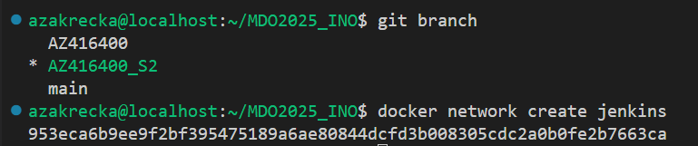

Według poradnika pierwszym krokiem jest utworzenie kontenera <code style="color:rgb(35, 186, 101);"> docker:dind</code> z wykorzystaniem komendy:

    docker run \
    --name jenkins-docker \
    --rm \
    --detach \
    --privileged \
    --network jenkins \
    --network-alias docker \
    --env DOCKER_TLS_CERTDIR=/certs \
    --volume jenkins-docker-certs:/certs/client \
    --volume jenkins-data:/var/jenkins_home \
    --publish 2376:2376 \
    docker:dind \
    --storage-driver overlay2

Wszystkie parametry polecenia są szczegółowo opisane na stronie zawierającej dokumentacje.

Pomyślne wykonanie powyższego polecenia:

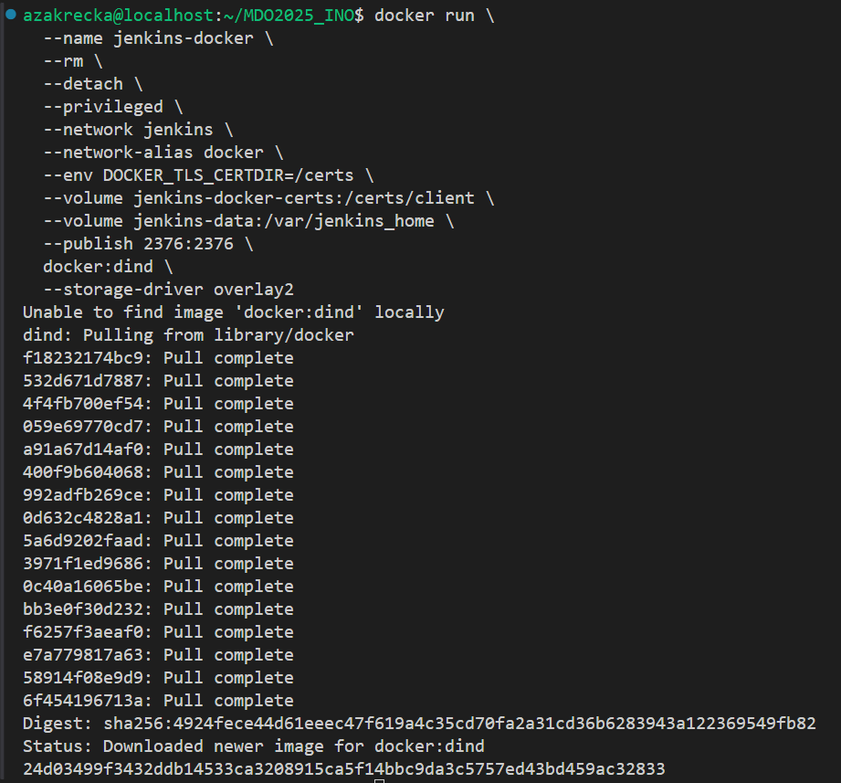

Dalej, należy utworzyć plik Dockerfile do zbudowania kontenera blueocean:

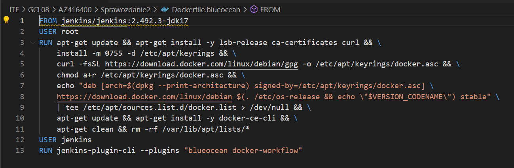

Budujemy kontener z wykorzystaniem polecenia:

    docker build -t myjenkins-blueocean -f Dockerfile.blueocean .

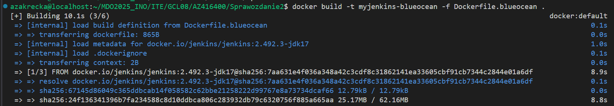    

Uruchomienie utworzonego wcześniej obrazu kontenera:

    docker run \
    --name jenkins-blueocean \
    --restart=on-failure \
    --detach \
    --network jenkins \
    --env DOCKER_HOST=tcp://docker:2376 \
    --env DOCKER_CERT_PATH=/certs/client \
    --env DOCKER_TLS_VERIFY=1 \
    --publish 8080:8080 \
    --publish 50000:50000 \
    --volume jenkins-data:/var/jenkins_home \
    --volume jenkins-docker-certs:/certs/client:ro \
    myjenkins-blueocean

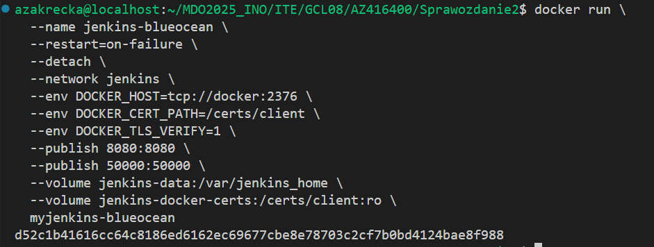

Podobnie jak poprzednio wszystkie parametry zostały dokładnie opisane w dokumentacji.

## Konfiguracja wstępna i pierwsze uruchomienie

Jenkins domyślne dotępny jest dla nas w przeglądarce jako localhost na porcie 8008 dzięki odpowiedniej konfiguracji kontenerów która opiana zotała powyżej.

Po odblokowaniu i pierwszym uruchomieniu Jenkinsa (co pokazane zotało w poprzednim prawozdaniu) ukazuje się nam ekran konfiguracji i zotajemy poprozeni o zaintalowanie pluginów. W tym wypadku została wybrana opcja intalacja standardowa: 

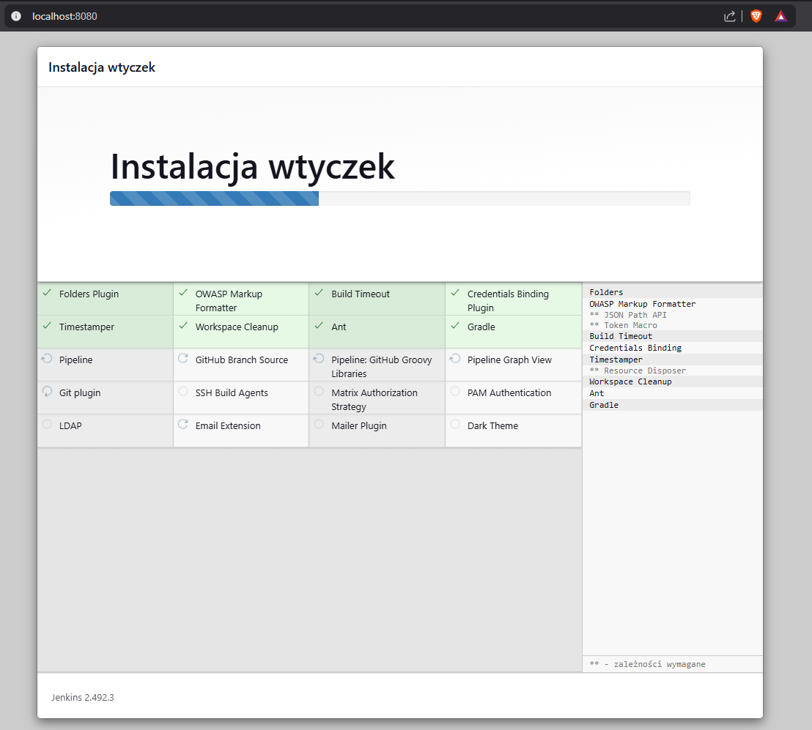

Utworzenie konta adminitratora:

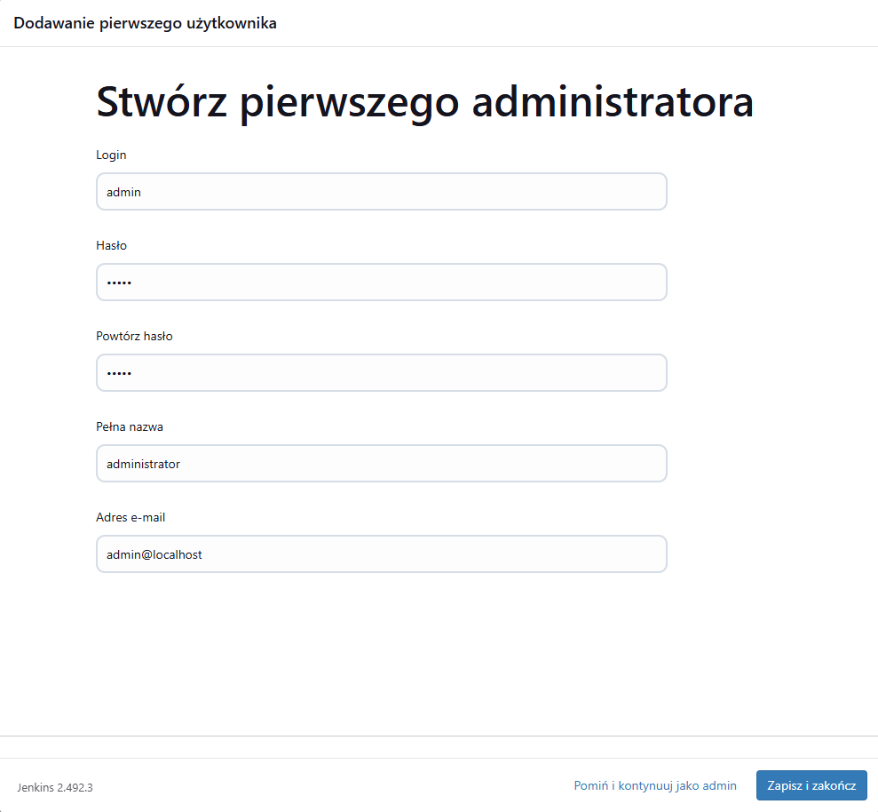

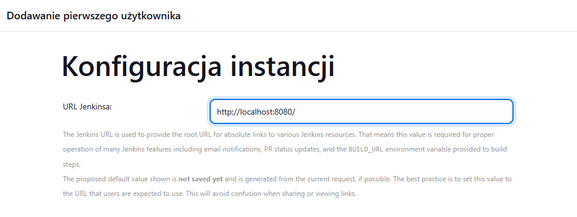

Konfiguracja zakończona:

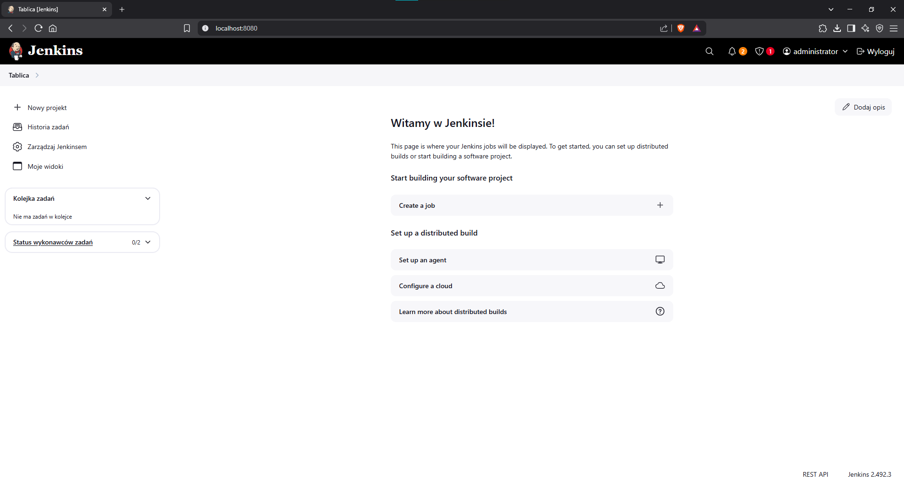

## Utworzenie projektów

Aby utworzyć nowy projekt wybieramy odpowiednia opcje dotępną po lewej tronie ekranu gdzie natępnie możemy nadać mu nazwę oraz okrelić jego typ:

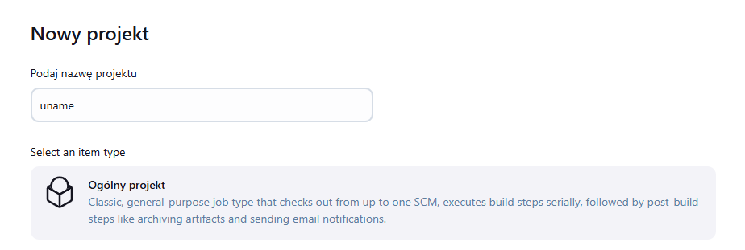

Przedoimy ię do zakładki konfiguracji gdzie natępnie w ekcji kroki budowania możemy umieścić treść polecenia, które ma się wykonać po uruchomieniu projektu:

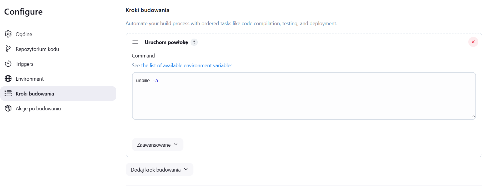

Test utworzonego projektu:

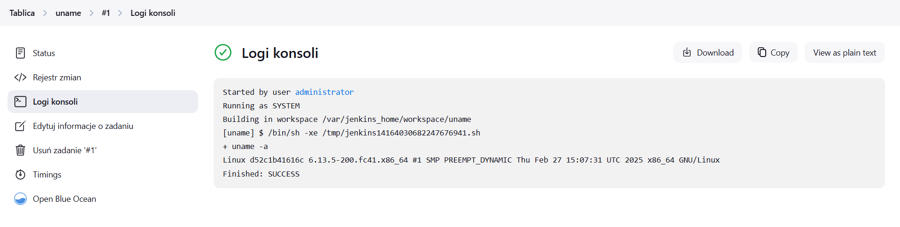

Natępny test polega na utworzeniu skryptu ktory wyświetla błąd jeśli godzina jest nieparzysta. Jego kod io wynik działania widoczny jest poniżej:

    #!/bin/bash

    HOUR=$(date +%H)
    HOUR=$((10#$HOUR))  

    if [ $((HOUR % 2)) -ne 0 ]; then
        echo "Błąd: Godzina ($HOUR) jest nieparzysta!"
        exit 1
    else
        echo "OK: Godzina ($HOUR) jest parzysta."
        exit 0
    fi

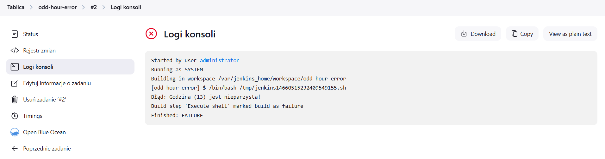

Na zakończenie wypróbowano działanie docker in docker. Pierwsze próby zakończyły się niepowodzeniem.

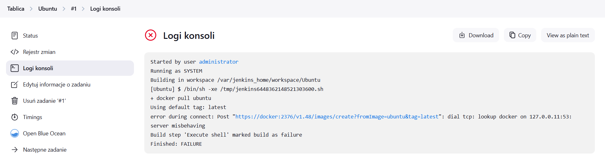

Restart kontenera dind naprawił sytuacje: 

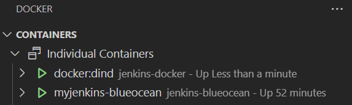

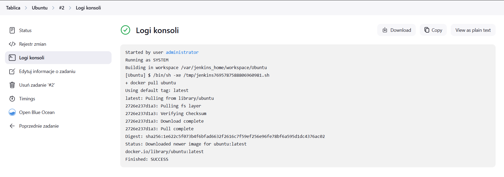

## Utworzenie pierwszego pipelinea

Tworzyny nowy obiekt pipeline analogicznie jak tworzyliśmy poprzednie projekty, jednak z menu wybierając odpowiedni tym projektu.
Pipeline to zautomatyzowany zestaw kroków, które są wykonywane w celu zbudowania, przetestowania i wdrożenia aplikacji. Pozwala zdefiniować cały proces w pliku konfiguracyjnym co umożliwia powtarzalność i automatyzację.

W pierwszym etapie, klonowane jest zdalne repozytorium Git włanie w nim znajduje się dockerfile którego będziemy używać. Najpierw próbuje się usunąć istniejący obraz Dockera, jako zabezpieczenie przed ewentualnymi błędami. Potem usuwane są wszystkie nieużywane dane i cache'e builda Dockera. Na końcu tworzony budowany jest obraz według z podanego Dockerfilea.

    pipeline {
        agent any

        stages {
            stage('Clone') {
                steps {
                    git branch: 'AZ416400', 
                        url: 'https://github.com/InzynieriaOprogramowaniaAGH/MDO2025_INO.git'
                }
            }

            stage('Build') {
                steps {
                    dir('ITE/GCL08/AZ416400/Sprawozdanie1/Dockerfiles') {
                        sh 'docker rmi -f irssi-build || true'
                        sh 'docker builder prune --force --all'
                        sh 'docker build -t irssi-build -f Dockerfile.irssibld .'
                    }
                }
            }
        }
    }

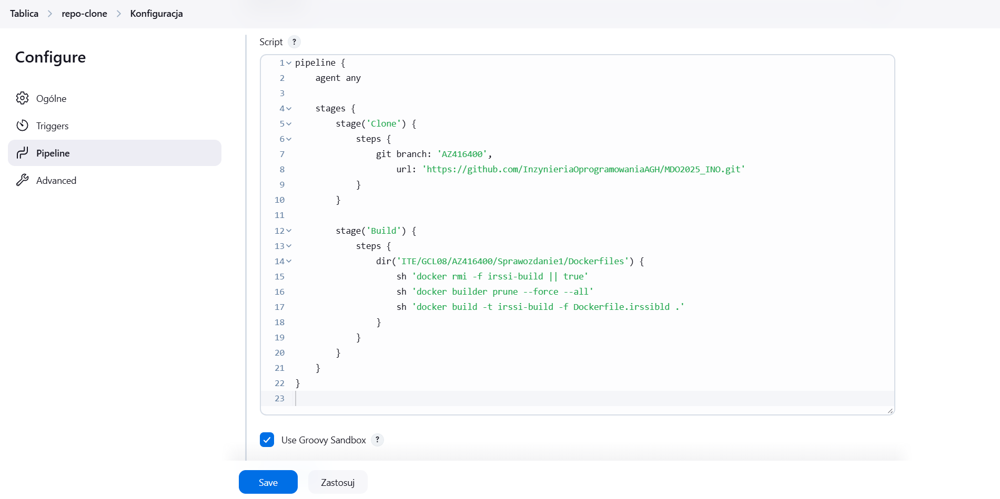

Uruchomienie skryptu:

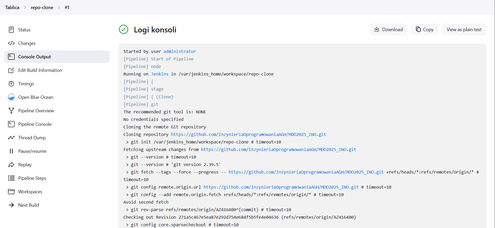

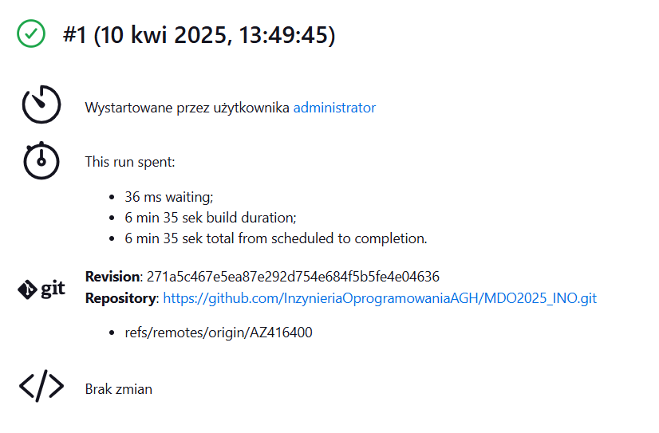

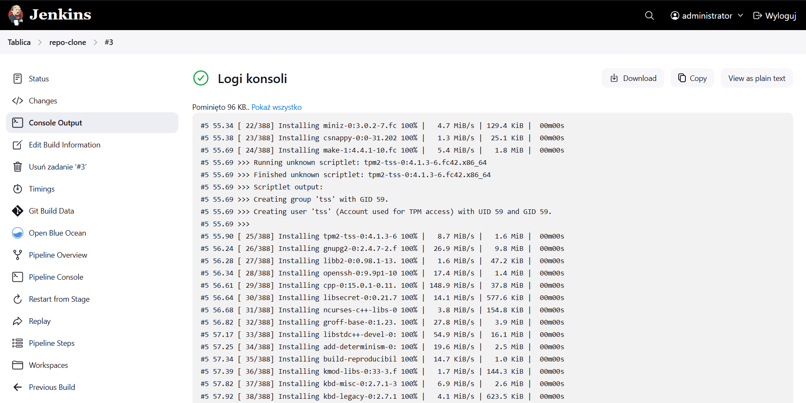

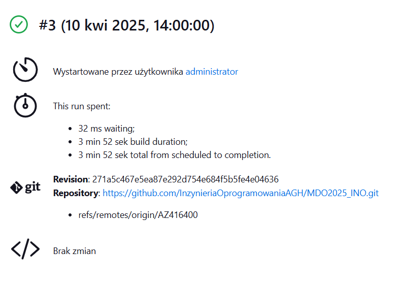

Obserwując czay wykonania obu pipelineów możemy zauważyć podobne wynki czasowe, co sugeruje, że oba pipeline'y wykonały tę samą pracę i żadne czynności nie zostały pominięte chociażby poprzez cache'owanie

# Zajęcia 06/07

Rozpoczynamy proces tworzenia pipelineu dla aplikacj Redis najpierw próbujemy przeprowadzić proces samodzielnie testowo

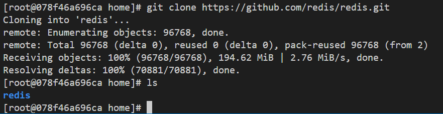

Instlacja potrzebnych dependencji

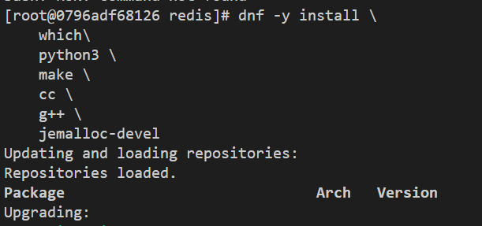

Uruchomienie kompilacji kodu źródłowego:

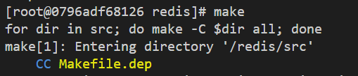

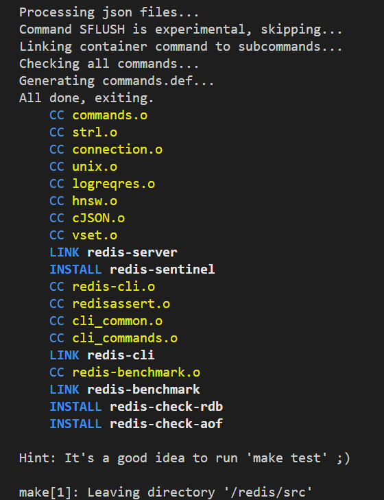

Przeprowadzenie testów w osobnym kontenerze:

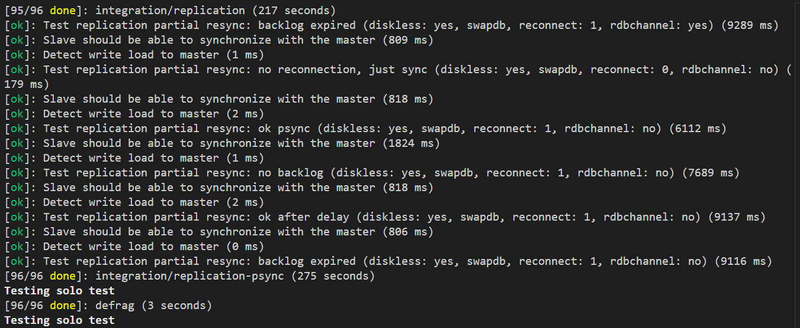

Testy nie przeszły - jeden z nich zwrócił nie odpowienią wartość w pierwszej próbie, w następnych podejściach już wszystko było w porządku. Ten konkretny test będzie w dalszej części zadania często nie przechodził, (prawodpodobnie z powodu ustawień maszyny na którym działa) dlatego też testy będą wykonywane wielokrotnie tudzież błąd będzie pomijany.

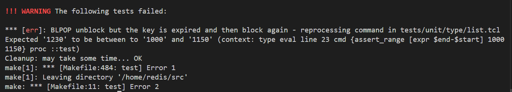

Tworzenie dockerfile dla kontenera Buildowego który zastąpi nam konieczność ręcznej kompilacji programu.

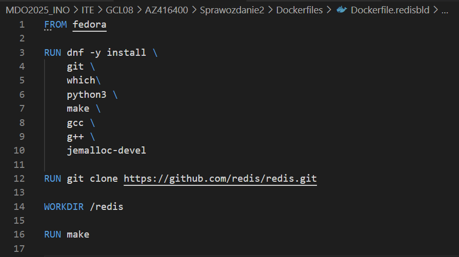

Zbudowanie obrazu kontenera Buildowego:

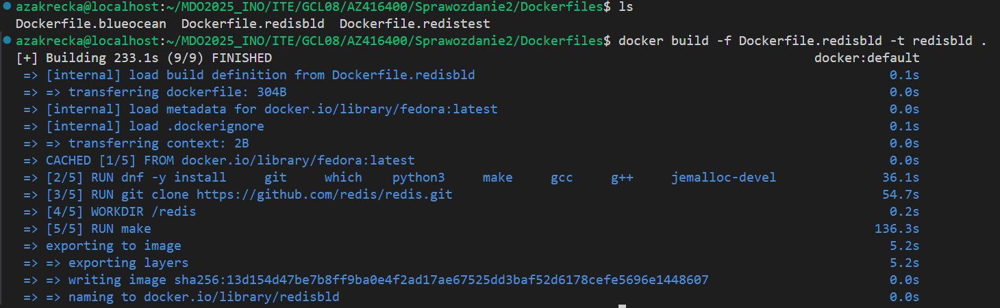

Dockerfile dla kontenera testowego na podstawie kontenera Buildowego:

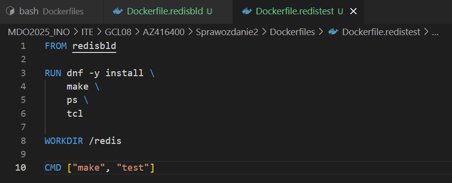

Budowanie obrazu kontenera testowego:

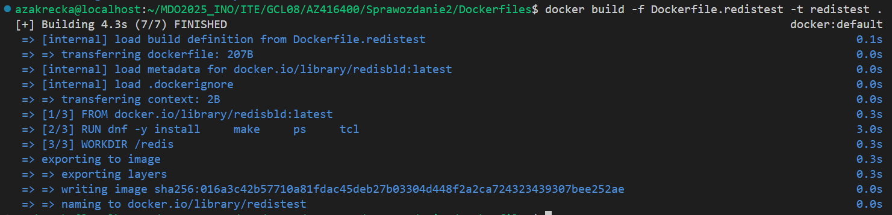

Uruchomienie kontenera i przeprowadzenie testów ponownie:

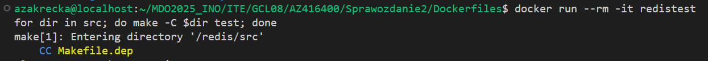

Utworzenie docker compose:

Pobranie docker compose - konieczne było zrobienie tego ręcznie tylko tak działało:

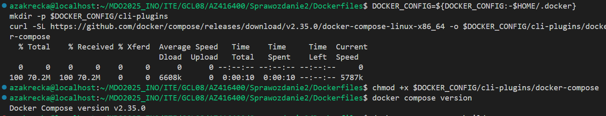

Uruchoienie docker compose:

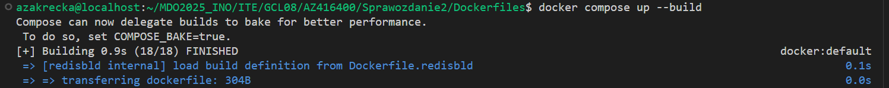

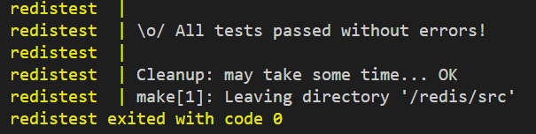

Instalacja docker compose dla Jenkinsa:

Utworzono pipeline dla całego procesu:

    pipeline {
        agent any

        environment {
            IMAGE_TAG = new Date().getTime()
        }

        stages {
            stage('Prepare') {
                steps {
                    sh 'rm -rf MDO2025_INO'
                    sh 'git clone https://github.com/InzynieriaOprogramowaniaAGH/MDO2025_INO.git'
                    dir("MDO2025_INO") {
                        sh 'git checkout AZ416400_S2'
                    }
                }
            }

            stage('Build Redis') {
                steps {
                    dir("MDO2025_INO/ITE/GCL08/AZ416400/Sprawozdanie2/Dockerfiles") {
                        sh 'docker build --no-cache -t redisbld:${IMAGE_TAG} -f Dockerfile.redisbld .'
                    }
                }
            }

            stage('Test Redis') {
                steps {
                    dir("MDO2025_INO/ITE/GCL08/AZ416400/Sprawozdanie2/Dockerfiles") {
                        sh 'docker build --no-cache --build-arg IMAGE_TAG=${IMAGE_TAG} -t redistest:${IMAGE_TAG} -f Dockerfile.redistest .'
                    }
                }
            }
        }
    }

W ramach pipeline'a dla Jenkinsa przygotowano skrypt realizujący proces CI/CD dla projektu Redis. Pipeline ustawia zmienną IMAGE_TAG generującą unikalny znacznik czasu, dzięki czemu każda wersja budowanego obrazu Dockera jest unikalna i łatwa do zarządzania.

W etapie Prepare usuwany jest lokalny katalog, klonowane jest repozytorium z GitHuba i następuje przełączenie na odpowiednią gałąź. W kroku Build Redis pipeline przechodzi do katalogu z Dockerfile'ami i buduje obraz Dockera redisbld, bez użycia cache'a, co zapewnia aktualność procesu. W etapie Test Redis budowany jest obraz redistest na podstawie Dockerfile.redistest, z przekazaną zmienną IMAGE_TAG, umożliwiającą powiązanie wersji testowej z odpowiednią wersją builda.

Pipeline w ten sposób realizuje kluczowe kroki ścieżki krytycznej: klonowanie (clone), budowanie (build) oraz przygotowanie testów (test).

Wyodrębnienie skompilowanych plików na wolumin dla przejścia do etapu deploy:

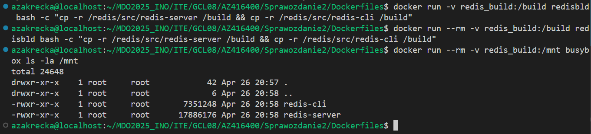

Uruchomienie nowego kontenera i sprawdzenie czy potrzebne pliki znajdują się we właściwym miejscu

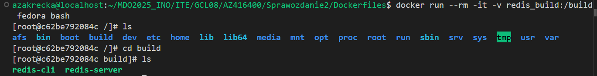

Instalacja potrzebych pakietów:

    sudo dnf install rpm-build rpmdevtools

Setup potrzebnych narzędzi:

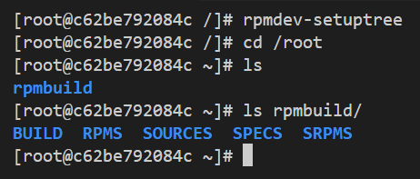

Odpowiednie przygotowanie kodu źródłowego - spakowanie go do archiwum w odpowiednim katalogu:

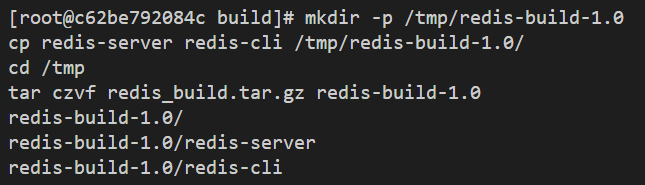

Plik .spec:

    Name:           redis-build
    Version:        1.0
    Release:        1%{?dist}
    Summary:        Redis build (redis-server and redis-cli)

    License:        BSD
    URL:            https://redis.io/
    Source0:        redis_build.tar.gz

    BuildArch:      x86_64

    %global debug_package %{nil}

    %description
    Redis build including redis-server and redis-cli

    %prep
    %setup -q

    %build

    %install
    mkdir -p %{buildroot}/usr/local/bin
    cp redis-server %{buildroot}/usr/local/bin/
    cp redis-cli %{buildroot}/usr/local/bin/

    %files
    /usr/local/bin/redis-server
    /usr/local/bin/redis-cli

    %changelog
    * Sat Apr 26 2025 - 1.0-1
    - Initial build

W celu przygotowania instalowalnego artefaktu w formacie RPM stworzono plik specyfikacji redis-build.spec. Plik ten definiuje podstawowe informacje o pakiecie, takie jak jego nazwa (redis-build), wersja (1.0), numer wydania (1) oraz licencja (BSD). Źródłem dla budowy pakietu jest archiwum redis_build.tar.gz, które zawiera pliki binarne redis-server oraz redis-cli.

Pakiet przeznaczony jest dla architektury x86_64, a sekcja %install określa proces kopiowania plików binarnych do katalogu /usr/local/bin, skąd mogą być one później bezpośrednio uruchamiane po instalacji pakietu. W sekcji %files wskazano oba binaria jako zawartość pakietu. Zrezygnowano z tworzenia osobnego pakietu debug (%global debug_package %{nil}), ponieważ nie jest to wymagane w tym przypadku.

Zbudowanie RPM: 
    
    rpmbuild -ba redis_build.spec

Zakończenie procesu powodzeniem:

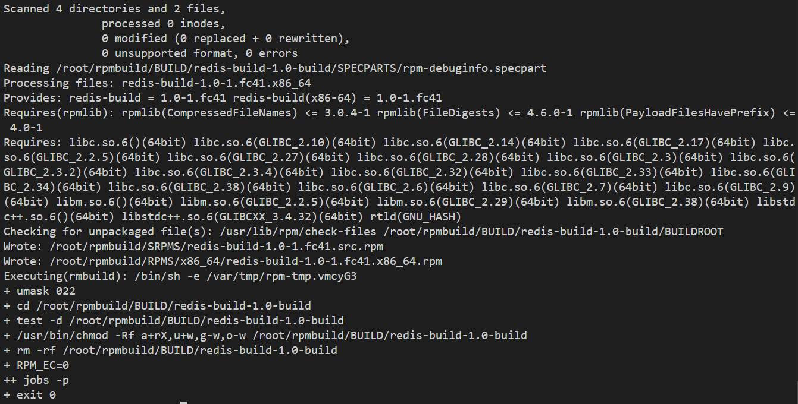

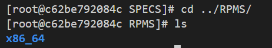

Instalacja powstałego pakietu i test jego działania:

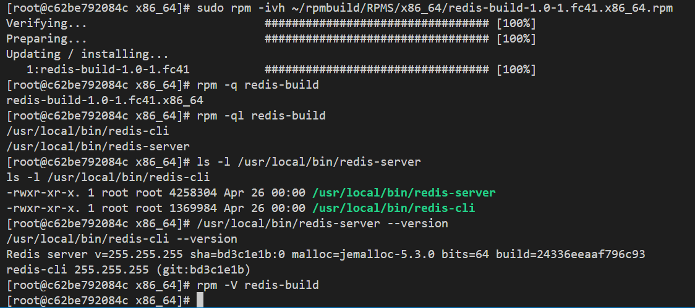

Utworzenie dockerfile automatyzującego kontener deploy:

Przeprowadzenie builda kontenera deploy:

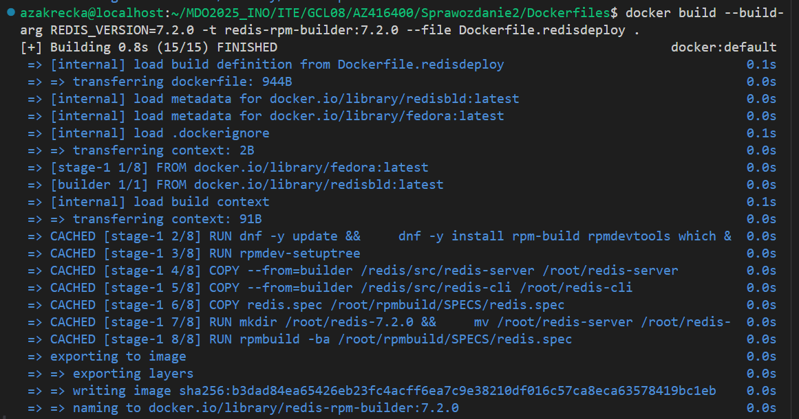

Uruchomie utworzonego kontenera i zapisanie RPM na woluminie:

    docker run --rm -v output:/output redis-rpm-builder:7.2.0

Sprawdzenie poprawności wykonenaj operacji:

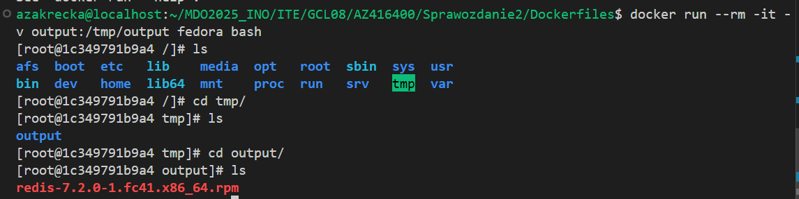

Instalacja i uruchomienie Redisa z własnoręcznie utworzonego pakietu:

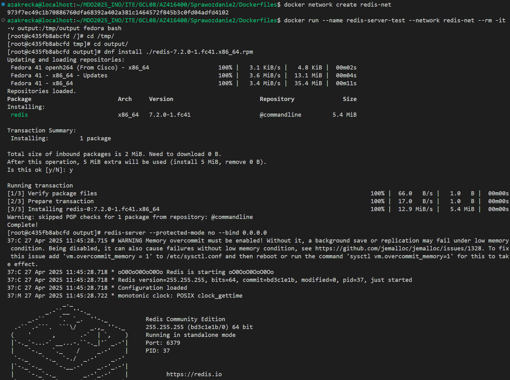

Test łączności z Redisem pobranym z zewnętrznego repozytorium:

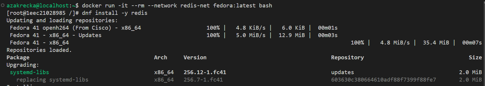

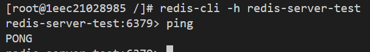

Modyfikacja .spec na potrzeby pipelineu:

    Name:           redis
    Version:        __REDIS_VERSION__
    Release:        1%{?dist}
    Summary:        Redis server built externally

    License:        BSD
    URL:            https://redis.io/
    Source0:        redis-__REDIS_VERSION__.tar.gz

    BuildArch:      x86_64

    %define debug_package %{nil}

    %description
    Redis packaged from precompiled binaries.

    %prep
    %setup -q

    %build

    %install
    mkdir -p %{buildroot}/usr/local/bin
    install -m 0755 redis-server %{buildroot}/usr/local/bin/redis-server
    install -m 0755 redis-cli %{buildroot}/usr/local/bin/redis-cli

    %files
    /usr/local/bin/redis-server
    /usr/local/bin/redis-cli

    %changelog
    * Sun Apr 27 2025 - __REDIS_VERSION__
    - Packaged redis-server and redis-cli binaries into RPM

Utworzenie Dockerfilea dla kontenera z naszym redisem do testów RPMa (przy okazji zmodyfikowane pozostałych dockerfileów do pipelinea - .redistest miał problem z wersją jednego z pakietów więc musiałam zainstalować je ręcznie)

Gotowy pipeline:

    pipeline {
        agent any

        environment {
            IMAGE_TAG = sh(script: "date +%Y%m%d%H%M%S", returnStdout: true).trim()
        }

        stages {
        stage('Prepare') {
                steps {
                    sh 'rm -rf MDO2025_INO'
                    sh 'git clone --branch AZ416400_S2 --single-branch https://github.com/InzynieriaOprogramowaniaAGH/MDO2025_INO.git'
                }
            }

            stage('Build Redis') {
                steps {
                    dir("MDO2025_INO/ITE/GCL08/AZ416400/Sprawozdanie2/Dockerfiles") {
                        sh 'docker build --no-cache -t redisbld:${IMAGE_TAG} -f Dockerfile.redisbld .'
                    }
                }
            }

            stage('Test Redis') {
                steps {
                    dir("MDO2025_INO/ITE/GCL08/AZ416400/Sprawozdanie2/Dockerfiles") {
                        sh 'docker build --no-cache --build-arg IMAGE_TAG=${IMAGE_TAG} -t redistest:${IMAGE_TAG} -f Dockerfile.redistest .'
                    }
                }
            }
            
            stage('Deploy RPM') {
                steps {
                    dir("MDO2025_INO/ITE/GCL08/AZ416400/Sprawozdanie2/Dockerfiles") {
                        sh """
                            mkdir -p ../redis_rpm_output
                            
                            docker build --no-cache --build-arg IMAGE_TAG=${IMAGE_TAG} --build-arg REDIS_VERSION=${IMAGE_TAG} -t redisdeploy:${IMAGE_TAG} -f Dockerfile.redisdeploy .
                            docker create --name temp_redisdeploy redisdeploy:${IMAGE_TAG}
                            docker cp temp_redisdeploy:/root/rpmbuild/RPMS/x86_64/. ../redis_rpm_output/
                            docker rm temp_redisdeploy
            
                            ls -l ../redis_rpm_output
                        """
                    }
                }
            }
            
            stage('Test RPM') {
                steps {
                    dir("MDO2025_INO/ITE/GCL08/AZ416400/Sprawozdanie2") {
                        sh '''
            
                            docker build --no-cache -t myredis:${IMAGE_TAG} -f ./Dockerfiles/Dockerfile.redisrpmtest .
        
                            docker network create redis-test-net || true
                            docker run -d --name myredis-server --network redis-test-net myredis:${IMAGE_TAG} redis-server --protected-mode no
                            docker run -d --name official-redis --network redis-test-net redis:7.2.0
            
                            echo "[INFO] Waiting 5 seconds for Redis servers to boot up..."
                            sleep 5
            
                            docker exec official-redis redis-cli -h myredis-server ping
                            docker rm -f myredis-server official-redis || true
                            docker network rm redis-test-net || true
                        '''
                    }
                }
            }
            
            stage('Publish RPM') {
                steps {
                    dir("MDO2025_INO/ITE/GCL08/AZ416400/Sprawozdanie2/redis_rpm_output") {
                        script {
                            def rpmFile = sh(script: "ls *.rpm", returnStdout: true).trim()
            
                            if (rpmFile) {
                                echo "[INFO] Found RPM: ${rpmFile}"
                                archiveArtifacts artifacts: "${rpmFile}", fingerprint: true
                            } else {
                                error "No RPM file found in redis_rpm_output. Build failed."
                            }
                        }
                    }
                }
            }
        }
    }

W etapie Deploy RPM pipeline przechodzi do katalogu Dockerfiles, gdzie tworzony jest katalog redis_rpm_output na potrzeby gromadzenia gotowych plików RPM. Następnie budowany jest nowy obraz Dockera redisdeploy, bazujący na przygotowanym wcześniej środowisku. W ramach budowy wykorzystano przekazywanie zmiennych IMAGE_TAG oraz REDIS_VERSION, aby zapewnić spójność wersji pakietu. Po utworzeniu kontenera z tego obrazu, za pomocą polecenia docker cp, plik RPM jest kopiowany do katalogu redis_rpm_output, a tymczasowy kontener jest usuwany.

Etap Test RPM obejmuje walidację poprawności działania zbudowanego pakietu. W tym celu przygotowywany jest nowy obraz Dockera myredis, bazujący na pakiecie RPM wygenerowanym w poprzednim kroku. Pipeline tworzy własną sieć Dockera redis-test-net i uruchamia dwa kontenery: jeden zawierający własną wersję Redis-a (myredis-server), a drugi — oficjalny obraz Redis-a (official-redis). Po krótkim czasie potrzebnym na inicjalizację, pipeline wykonuje polecenie redis-cli ping z kontenera official-redis w kierunku własnej instancji Redis, aby upewnić się, że serwer działa poprawnie. Po teście kontenery i sieć są sprzątane, aby nie zostawiać niepotrzebnych zasobów.

Ostatnim krokiem jest Publish RPM, w którym pipeline przechodzi do katalogu redis_rpm_output, wyszukuje wygenerowany plik RPM i archiwizuje go jako artefakt builda w Jenkinsie. Jeśli plik RPM jest dostępny, zostaje zapisany z fingerprintem w systemie, co pozwala na późniejsze śledzenie jego pochodzenia i wersji. W przypadku niepowodzenia w znalezieniu pliku RPM, pipeline zgłasza błąd i przerywa dalsze wykonywanie.

Gotowe testy pipelinea i artefakt (krok publish) jako zakończenie całego procesu:

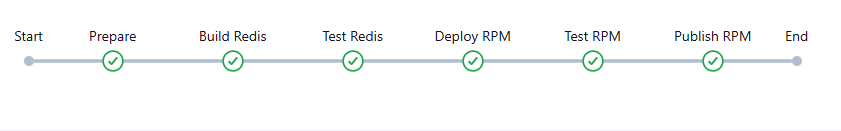

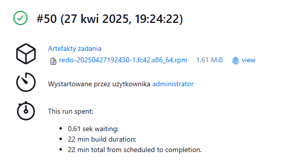

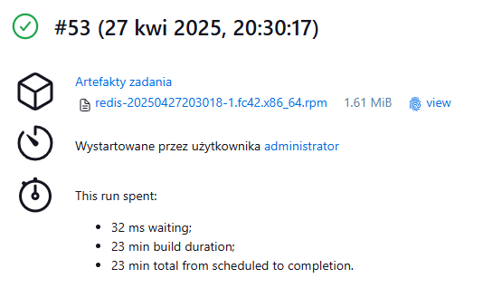