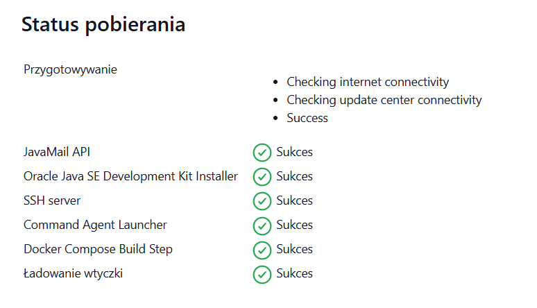
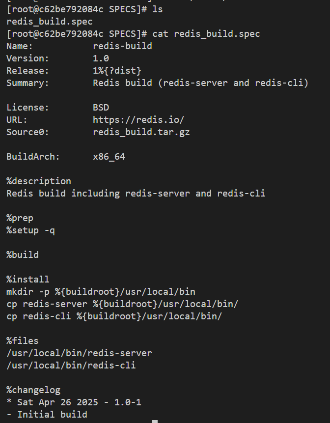

# Zajęcia 05

## Utworzenie instancji Jenkins

Aby rozdzielić pracę i bardziej ją uporządkować utworzono nową gałąz na której od teraz będzie przeprowadzana cała praca.

Następne kroki wykonywane były według dokumentacji na stronie internetowej: https://www.jenkins.io/doc/book/installing/docker/

Rozpoczynamy od utworzenia sieci:

Według poradnika pierwszym krokiem jest utworzenie kontenera <code style="color:rgb(35, 186, 101);"> docker:dind</code> z wykorzystaniem komendy:

    docker run \
    --name jenkins-docker \
    --rm \
    --detach \
    --privileged \
    --network jenkins \
    --network-alias docker \
    --env DOCKER_TLS_CERTDIR=/certs \
    --volume jenkins-docker-certs:/certs/client \
    --volume jenkins-data:/var/jenkins_home \
    --publish 2376:2376 \
    docker:dind \
    --storage-driver overlay2

Wszystkie parametry polecenia są szczegółowo opisane na stronie zawierającej dokumentacje.

Pomyślne wykonanie powyższego polecenia:

Dalej, należy utworzyć plik Dockerfile do zbudowania kontenera blueocean:

Budujemy kontener z wykorzystaniem polecenia:

    docker build -t myjenkins-blueocean -f Dockerfile.blueocean .

    

Uruchomienie utworzonego wcześniej obrazu kontenera:

    docker run \
    --name jenkins-blueocean \
    --restart=on-failure \
    --detach \
    --network jenkins \
    --env DOCKER_HOST=tcp://docker:2376 \
    --env DOCKER_CERT_PATH=/certs/client \
    --env DOCKER_TLS_VERIFY=1 \
    --publish 8080:8080 \
    --publish 50000:50000 \
    --volume jenkins-data:/var/jenkins_home \
    --volume jenkins-docker-certs:/certs/client:ro \
    myjenkins-blueocean

Podobnie jak poprzednio wszystkie parametry zostały dokładnie opisane w dokumentacji.

## Konfiguracja wstępna i pierwsze uruchomienie

Jenkins domyślne dotępny jest dla nas w przeglądarce jako localhost na porcie 8008 dzięki odpowiedniej konfiguracji kontenerów która opiana zotała powyżej.

Po odblokowaniu i pierwszym uruchomieniu Jenkinsa (co pokazane zotało w poprzednim prawozdaniu) ukazuje się nam ekran konfiguracji i zotajemy poprozeni o zaintalowanie pluginów. W tym wypadku została wybrana opcja intalacja standardowa: 

Utworzenie konta adminitratora:

Konfiguracja zakończona:

## Utworzenie projektów

Aby utworzyć nowy projekt wybieramy odpowiednia opcje dotępną po lewej tronie ekranu gdzie natępnie możemy nadać mu nazwę oraz okrelić jego typ:

Przedoimy ię do zakładki konfiguracji gdzie natępnie w ekcji kroki budowania możemy umieścić treść polecenia, które ma się wykonać po uruchomieniu projektu:

Test utworzonego projektu:

Natępny test polega na utworzeniu skryptu ktory wyświetla błąd jeśli godzina jest nieparzysta. Jego kod io wynik działania widoczny jest poniżej:

    #!/bin/bash

    HOUR=$(date +%H)
    HOUR=$((10#$HOUR))  

    if [ $((HOUR % 2)) -ne 0 ]; then
        echo "Błąd: Godzina ($HOUR) jest nieparzysta!"
        exit 1
    else
        echo "OK: Godzina ($HOUR) jest parzysta."
        exit 0
    fi

Na zakończenie wypróbowano działanie docker in docker. Pierwsze próby zakończyły się niepowodzeniem.

Restart kontenera dind naprawił sytuacje: 

## Utworzenie pierwszego pipelinea

Tworzyny nowy obiekt pipeline analogicznie jak tworzyliśmy poprzednie projekty, jednak z menu wybierając odpowiedni tym projektu.
Pipeline to zautomatyzowany zestaw kroków, które są wykonywane w celu zbudowania, przetestowania i wdrożenia aplikacji. Pozwala zdefiniować cały proces w pliku konfiguracyjnym co umożliwia powtarzalność i automatyzację.

W pierwszym etapie, klonowane jest zdalne repozytorium Git włanie w nim znajduje się dockerfile którego będziemy używać. Najpierw próbuje się usunąć istniejący obraz Dockera, jako zabezpieczenie przed ewentualnymi błędami. Potem usuwane są wszystkie nieużywane dane i cache'e builda Dockera. Na końcu tworzony budowany jest obraz według z podanego Dockerfilea.

    pipeline {
        agent any

        stages {
            stage('Clone') {
                steps {
                    git branch: 'AZ416400', 
                        url: 'https://github.com/InzynieriaOprogramowaniaAGH/MDO2025_INO.git'
                }
            }

            stage('Build') {
                steps {
                    dir('ITE/GCL08/AZ416400/Sprawozdanie1/Dockerfiles') {
                        sh 'docker rmi -f irssi-build || true'
                        sh 'docker builder prune --force --all'
                        sh 'docker build -t irssi-build -f Dockerfile.irssibld .'
                    }
                }
            }
        }
    }

Uruchomienie skryptu:

Obserwując czay wykonania obu pipelineów możemy zauważyć podobne wynki czasowe, co sugeruje, że oba pipeline'y wykonały tę samą pracę i żadne czynności nie zostały pominięte chociażby poprzez cache'owanie

# Zajęcia 06/07

    pipeline {
        agent any

        environment {
            IMAGE_TAG = new Date().getTime()
        }

        stages {
            stage('Prepare') {
                steps {
                    sh 'rm -rf MDO2025_INO'
                    sh 'git clone https://github.com/InzynieriaOprogramowaniaAGH/MDO2025_INO.git'
                    dir("MDO2025_INO") {
                        sh 'git checkout AZ416400_S2'
                    }
                }
            }

            stage('Build Redis') {
                steps {
                    dir("MDO2025_INO/ITE/GCL08/AZ416400/Sprawozdanie2/Dockerfiles") {
                        sh 'docker build --no-cache -t redisbld:${IMAGE_TAG} -f Dockerfile.redisbld .'
                    }
                }
            }

            stage('Test Redis') {
                steps {
                    dir("MDO2025_INO/ITE/GCL08/AZ416400/Sprawozdanie2/Dockerfiles") {
                        sh 'docker build --no-cache --build-arg IMAGE_TAG=${IMAGE_TAG} -t redistest:${IMAGE_TAG} -f Dockerfile.redistest .'
                    }
                }
            }
        }
    }

    Name:           redis-build
    Version:        1.0
    Release:        1%{?dist}
    Summary:        Redis build (redis-server and redis-cli)

    License:        BSD
    URL:            https://redis.io/
    Source0:        redis_build.tar.gz

    BuildArch:      x86_64

    %global debug_package %{nil}

    %description
    Redis build including redis-server and redis-cli

    %prep
    %setup -q

    %build

    %install
    mkdir -p %{buildroot}/usr/local/bin
    cp redis-server %{buildroot}/usr/local/bin/
    cp redis-cli %{buildroot}/usr/local/bin/

    %files
    /usr/local/bin/redis-server
    /usr/local/bin/redis-cli

    %changelog
    * Sat Apr 26 2025 - 1.0-1
    - Initial build

---
    
    rpmbuild -ba redis_build.spec

    docker run --rm -v output:/output redis-rpm-builder:7.2.0

    Name:           redis
    Version:        __REDIS_VERSION__
    Release:        1%{?dist}
    Summary:        Redis server built externally

    License:        BSD
    URL:            https://redis.io/
    Source0:        redis-__REDIS_VERSION__.tar.gz

    BuildArch:      x86_64

    %define debug_package %{nil}

    %description
    Redis packaged from precompiled binaries.

    %prep
    %setup -q

    %build

    %install
    mkdir -p %{buildroot}/usr/local/bin
    install -m 0755 redis-server %{buildroot}/usr/local/bin/redis-server
    install -m 0755 redis-cli %{buildroot}/usr/local/bin/redis-cli

    %files
    /usr/local/bin/redis-server
    /usr/local/bin/redis-cli

    %changelog
    * Sun Apr 27 2025 - __REDIS_VERSION__
    - Packaged redis-server and redis-cli binaries into RPM

    pipeline {
        agent any

        environment {
            IMAGE_TAG = sh(script: "date +%Y%m%d%H%M%S", returnStdout: true).trim()
        }

        stages {
        stage('Prepare') {
                steps {
                    sh 'rm -rf MDO2025_INO'
                    sh 'git clone --branch AZ416400_S2 --single-branch https://github.com/InzynieriaOprogramowaniaAGH/MDO2025_INO.git'
                }
            }

            stage('Build Redis') {
                steps {
                    dir("MDO2025_INO/ITE/GCL08/AZ416400/Sprawozdanie2/Dockerfiles") {
                        sh 'docker build --no-cache -t redisbld:${IMAGE_TAG} -f Dockerfile.redisbld .'
                    }
                }
            }

            stage('Test Redis') {
                steps {
                    dir("MDO2025_INO/ITE/GCL08/AZ416400/Sprawozdanie2/Dockerfiles") {
                        sh 'docker build --no-cache --build-arg IMAGE_TAG=${IMAGE_TAG} -t redistest:${IMAGE_TAG} -f Dockerfile.redistest .'
                    }
                }
            }
            
            stage('Deploy RPM') {
                steps {
                    dir("MDO2025_INO/ITE/GCL08/AZ416400/Sprawozdanie2/Dockerfiles") {
                        sh """
                            mkdir -p ../redis_rpm_output
                            
                            docker build --no-cache --build-arg IMAGE_TAG=${IMAGE_TAG} --build-arg REDIS_VERSION=${IMAGE_TAG} -t redisdeploy:${IMAGE_TAG} -f Dockerfile.redisdeploy .
                            docker create --name temp_redisdeploy redisdeploy:${IMAGE_TAG}
                            docker cp temp_redisdeploy:/root/rpmbuild/RPMS/x86_64/. ../redis_rpm_output/
                            docker rm temp_redisdeploy
            
                            ls -l ../redis_rpm_output
                        """
                    }
                }
            }
            
            stage('Test RPM') {
                steps {
                    dir("MDO2025_INO/ITE/GCL08/AZ416400/Sprawozdanie2") {
                        sh '''
            
                            docker build --no-cache -t myredis:${IMAGE_TAG} -f ./Dockerfiles/Dockerfile.redisrpmtest .
        
                            docker network create redis-test-net || true
                            docker run -d --name myredis-server --network redis-test-net myredis:${IMAGE_TAG} redis-server --protected-mode no
                            docker run -d --name official-redis --network redis-test-net redis:7.2.0
            
                            echo "[INFO] Waiting 5 seconds for Redis servers to boot up..."
                            sleep 5
            
                            docker exec official-redis redis-cli -h myredis-server ping
                            docker rm -f myredis-server official-redis || true
                            docker network rm redis-test-net || true
                        '''
                    }
                }
            }
            
            stage('Publish RPM') {
                steps {
                    dir("MDO2025_INO/ITE/GCL08/AZ416400/Sprawozdanie2/redis_rpm_output") {
                        script {
                            def rpmFile = sh(script: "ls *.rpm", returnStdout: true).trim()
            
                            if (rpmFile) {
                                echo "[INFO] Found RPM: ${rpmFile}"
                                archiveArtifacts artifacts: "${rpmFile}", fingerprint: true
                            } else {
                                error "No RPM file found in redis_rpm_output. Build failed."
                            }
                        }
                    }
                }
            }
        }
    }

