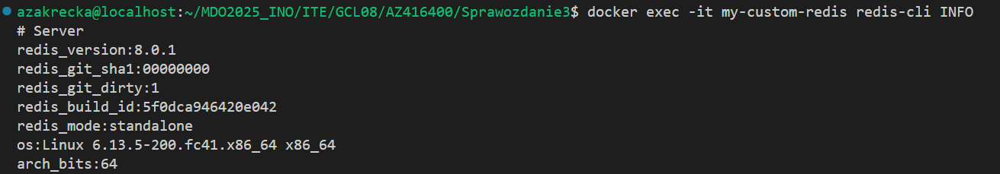
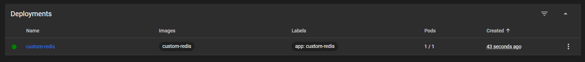

# Zajęcia 08

## Konfiguracja maszyny zdalnej 

Utworzenie migawki maszyny

Instalacja Ansible

## Kuminikacja między maszynami poprzez SSH

Generowanie klucza SSH i test połączenia

Wprowadzenie nazw DNS dla maszyn

## Utworzenie i uruchomienie ansible playbooka

Test pliu `.ini`

Wykonanie zdefiniowanych czynności za pomocą playbooka

    - name: 1. Ping all hosts
    hosts: Endpoints
    gather_facts: no
    tasks:
        - name: Ping test
        ansible.builtin.ping:

    - name: 2. Copy inventory to endpoints
    hosts: Endpoints
    gather_facts: no
    tasks:
        - name: Copy inventory.ini to /tmp
        ansible.builtin.copy:
            src: ./inventory.ini
            dest: /tmp/inventory.ini

    - name: 3. Update system packages
    hosts: Endpoints
    become: yes
    tasks:
        - name: Update all packages
        ansible.builtin.dnf:
            name: "*"
            state: latest

    - name: 4. Restart services
    hosts: Endpoints
    become: true
    tasks:
        - name: Restart sshd
        ansible.builtin.service:
            name: sshd
            state: restarted

        - name: Restart rngd
        ansible.builtin.service:
            name: rngd
            state: restarted
            enabled: true

 

Uruchomienie aplikacji powstałej z artefaktu z playbooka z wykorzystaniem `ansible-galaxy`

 

# Zajęcia 09

## Wyodrębnienie i przeprowadzenie instalacji za pomocą pliku kicktart

Dodanie repozytoriów i wykonanie instalacji 

    # Generated by Anaconda 41.35
    # Generated by pykickstart v3.58
    #version=DEVEL

    # Keyboard layouts
    keyboard --vckeymap=pl --xlayouts='pl'
    # System language
    lang pl_PL.UTF-8

    # Network information
    network  --bootproto=dhcp --device=enp0s3 --ipv6=auto --activate --hostname=fedora-server

    %packages
    @^server-product-environment

    %end

    # Run the Setup Agent on first boot
    firstboot --enable

    # Repos
    url --mirrorlist=http://mirrors.fedoraproject.org/mirrorlist?repo=fedora-41&arch=x86_64
    repo --name=update --mirrorlist=http://mirrors.fedoraproject.org/mirrorlist?repo=updates-released-f41&arch=x86_64

    # Generated using Blivet version 3.11.0
    ignoredisk --only-use=sda
    autopart
    # Partition clearing information
    clearpart --all

    # System timezone
    timezone Europe/Warsaw --utc

    # Root password
    rootpw --iscrypted --allow-ssh $y$j9T$Pn5OIqlK3DDm0LYXfIuqbSAF$IfAFKMGeIBtuxRf3.bHdSaTb9vGO2olpI2mSL3EOy.8
    user --groups=wheel --name=azakrecka --password=$y$j9T$Jl7PoImDsug.iY7YqcZg33BK$pd.7W7IGljtNjo5ImnqcvKsUYotHJo0xlE5.DybtL30 --iscrypted --gecos="Aleksandra Zakrecka"

    reboot

## Utworzenie własnego repozytorium w celu udostępnienia artefaktu

Utwożenie maszyny WSL w celu udostępniania repozytorium 

Przesłanie artefaktu na maszyne

Weryfikacja działania

Udostępnianie portu i test działania

## Przeprowadzenioe instalacji zawierajacej artefakt

Dodanie sekcji `%post` do pliku kicksart odpowiedzialnego za instalacjie artefaktu

    %packages
    @^server-product-environment
    redis-20250427203018-1.fc42.x86_64
    %end

    %post --log=/root/post-install.log

    cat <<EOF > /etc/systemd/system/redis.service
    [Unit]
    Description=Redis In-Memory Data Store
    After=network.target

    [Service]
    ExecStart=/usr/local/bin/redis-server
    Restart=always
    User=root
    Group=root

    [Install]
    WantedBy=multi-user.target
    EOF

    systemctl daemon-reexec
    systemctl daemon-reload
    systemctl enable redis

    %end

Test działania

# Zajęcia 10

## Instalacja i konfiguracja kubernesta

## Utworzenie obrazu aplikacji z własnymi ustawieniami 

Wykorzystanie obrazu aplikacji Redis i dodanie do niego własnych ustawień  

Test zbudowaniego obrazu 

    docker run -d --name my-custom-redis -p 6379:6379 custom-redis

## Załadowanie obrazu i uruchomienie Poda

    minikube kubectl -- run custom-redis-pod --image=custom-redis --port=6379 --labels app=custom-redis --image-pull-policy=Never

## Przekierowanie portów i test działania 

    kubectl port-forward pod/custom-redis-pod 6379:6379

## Utworzenie Deploymentu z obrazu 

    kubectl create deployment custom-redis   --image=custom-redis   --dry-run=client -o yaml > redis-deploy.yaml

Ustawienie odpowieniej liczby podów

    spec:
    replicas: 5
    selector:
        matchLabels:
        app: custom-redis
    template:
        metadata:
        creationTimestamp: null
        labels:
            app: custom-redis
        spec:
        containers:
            - name: custom-redis
            image: custom-redis
            resources: {}
            terminationMessagePath: /dev/termination-log
            terminationMessagePolicy: File
            imagePullPolicy: Never
        restartPolicy: Always
        terminationGracePeriodSeconds: 30
        dnsPolicy: ClusterFirst
        securityContext: {}
        schedulerName: default-scheduler

## Przekierowanie portów i test działania 

Eksponowanie kontenera z Deploymentu poprzez wykorzystanie serwisu

Test połączenia spoza kastra minikube

Przekierowanie portu w celu udostępnienia go dla localhost

Przekierowanie portu w celu udostępnienia go poza maszynę wirtualną 

# Zajęcia 11

## Przygotowanie nowych wersji obrazu

Test wadliwego kontenera

Import utwożonych kontenerów do minikubea

    minikube image load redis-custom:vx

## Przeprowadzanie zmian w deploy

Zwiększenie replik do 8

Zmniejszenie replik do 1 

Zmniejszenie replik do 0 

Ponowne zwiększenie ilości replik 

Wprowadzenie nowego obrazu

Wprowadzenie wadliwego obrazu

## Przywracanie poprzedniej wersji wadliwego obrazu

## Monitorowanie wdrożenia

Napisanie własnego skryptu monitorującego 

## Strategie wdrożenia 

 Strategia Recreate, czyli takia, w której stara wersja aplikacji zostaje całkowicie usunięta przed uruchomieniem nowej. Zastosowanie tej strategii skutkuje tym, że w żadnym momencie nie działają równocześnie stare i nowe pody. Przez krótki okres, żaden z podów nie jest aktywny, co oznacza, że usługa Redis jest chwilowo niedostępna.

W przeciwieństwie do strategii Recreate, w której najpierw usuwa się wszystkie stare instancje, tutaj w strategii RollingUpdate nowe pody są uruchamiane równolegle z istniejącymi. Parametry widoczne na zrzucie ekranu informują o maksymalnej ilości niedostepnych podów jednoczenieśnie (tutaj 2) i o ilczbie tymczasowo uruchomionych podów (tutaj 30%)

Wdrożenie realizowane w modelu Canary Deployment, tkieruje tylko część użytkowników do nowej wersji aplikacji, a reszta nadal obsługiwana jest przez wersję stabilną. W tym przypadku wykorzystano dwa oddzielne Deploymenty. Wykorzystano odpwiednie polecenia służące do przefiltrowania logów i sprawdzenia, które pody obsłużyły przychodzące żądania. W przypadku wykrycia błędów (np. w logach lub monitoringu) strategia pozwala na szybkie wycofanie tej wersji bez wpływu na większość użytkowników, którzy nadal korzystają z wersji stabilnej.

