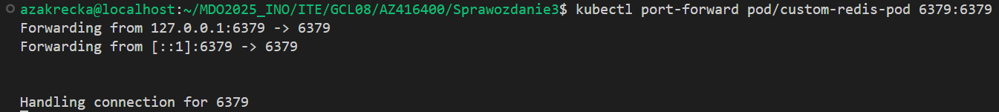

# Zajęcia 08

## Konfiguracja maszyny zdalnej 

## Kuminikacja między maszynami poprzez SSH

## Utworzenie i uruchomienie ansible playbooka

 

 

# Zajęcia 09

## Wyodrębnienie i przeprowadzenie instalacji za pomocą pliku kicktart

    # Generated by Anaconda 41.35
    # Generated by pykickstart v3.58
    #version=DEVEL

    # Keyboard layouts
    keyboard --vckeymap=pl --xlayouts='pl'
    # System language
    lang pl_PL.UTF-8

    # Network information
    network  --bootproto=dhcp --device=enp0s3 --ipv6=auto --activate --hostname=fedora-server

    %packages
    @^server-product-environment

    %end

    # Run the Setup Agent on first boot
    firstboot --enable

    # Repos
    url --mirrorlist=http://mirrors.fedoraproject.org/mirrorlist?repo=fedora-41&arch=x86_64
    repo --name=update --mirrorlist=http://mirrors.fedoraproject.org/mirrorlist?repo=updates-released-f41&arch=x86_64

    # Generated using Blivet version 3.11.0
    ignoredisk --only-use=sda
    autopart
    # Partition clearing information
    clearpart --all

    # System timezone
    timezone Europe/Warsaw --utc

    # Root password
    rootpw --iscrypted --allow-ssh $y$j9T$Pn5OIqlK3DDm0LYXfIuqbSAF$IfAFKMGeIBtuxRf3.bHdSaTb9vGO2olpI2mSL3EOy.8
    user --groups=wheel --name=azakrecka --password=$y$j9T$Jl7PoImDsug.iY7YqcZg33BK$pd.7W7IGljtNjo5ImnqcvKsUYotHJo0xlE5.DybtL30 --iscrypted --gecos="Aleksandra Zakrecka"

    reboot

## Utworzenie własnego repozytorium w celu udostępnienia artefaktu

## Przeprowadzenioe instalacji zawierajacej artefakt

    %packages
    @^server-product-environment
    redis-20250427203018-1.fc42.x86_64
    %end

    %post --log=/root/post-install.log

    cat <<EOF > /etc/systemd/system/redis.service
    [Unit]
    Description=Redis In-Memory Data Store
    After=network.target

    [Service]
    ExecStart=/usr/local/bin/redis-server
    Restart=always
    User=root
    Group=root

    [Install]
    WantedBy=multi-user.target
    EOF

    systemctl daemon-reexec
    systemctl daemon-reload
    systemctl enable redis

    %end

# Zajęcia 10

## Instalacja i konfiguracja kubernesta

## Utworzenie obrazu aplikacji z własnymi ustawieniami 

    docker run -d --name my-custom-redis -p 6379:6379 custom-redis

## Załadowanie obrazu i uruchomienie Poda

    minikube kubectl -- run custom-redis-pod --image=custom-redis --port=6379 --labels app=custom-redis --image-pull-policy=Never

## Przekierowanie portów i test działania 

    kubectl port-forward pod/custom-redis-pod 6379:6379

## Utworzenie Deploymentu z obrazu 

    kubectl create deployment custom-redis   --image=custom-redis   --dry-run=client -o yaml > redis-deploy.yaml

    spec:
    replicas: 5
    selector:
        matchLabels:
        app: custom-redis
    template:
        metadata:
        creationTimestamp: null
        labels:
            app: custom-redis
        spec:
        containers:
            - name: custom-redis
            image: custom-redis
            resources: {}
            terminationMessagePath: /dev/termination-log
            terminationMessagePolicy: File
            imagePullPolicy: Never
        restartPolicy: Always
        terminationGracePeriodSeconds: 30
        dnsPolicy: ClusterFirst
        securityContext: {}
        schedulerName: default-scheduler

## Przekierowanie portów i test działania 

# Zajęcia 11

    minikube image load redis-custom:vx

