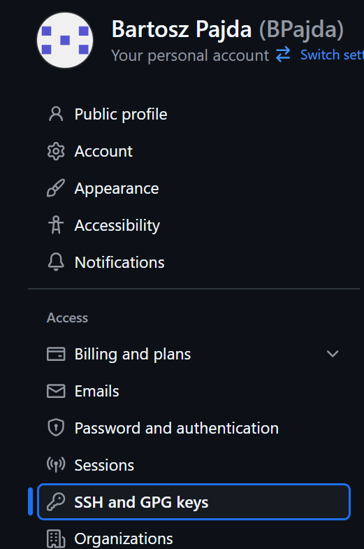
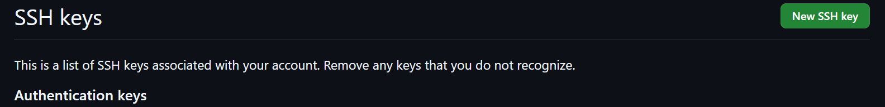

# 1. Zainstaluj klienta Git i obsługę kluczy SSH

## konfiguracja ssh, maszyny wirtualnej oraz srodowiska pracy w VSC


## Utowrzenie folderu przedmiotowego oraz instalacja gita

do zainsatlowania gita nalezy użyc nizej wymienionych polecen:
```sh
mkdir devops
sudo dnf install -y git
git --version
```


## sklonowanie repozytorium predmiotowego narazie przez https

uźywamy polecenia:
```sh
git clone https://(adres repozytorium).git
```


adres znajdujemy na stronie repozytorium


### historia polecen do tego punktu:


# 2. Generacja kluczy ssh oraz sklonowanie po SSH

## Wygenerowanie pierwszego klucza ssh
W pierwszej kolejnosci generujemy klucz bez zabezpieczen poleceniem:
```sh
ssh-keygen -t klucz szyfrowania[u nas => ed25519] -C "email konta github"
```
przy czym w kolejnych krokach wybieramy miejsce zapisu kluczy (u nas domysle), a w miejscu gdzie pytaja nas o hasło klikamy enter zostawiajac klucz jako niezabezpieczony


## Wygenerowanie drugiego klucza ssh (zabezpieczonego)

klucz generujemy w ten sam sposob jak pierwszy z roznica ze gdy pytaja nas o haslo to je ustawiamy.


### nalezy pamietac ze w kazdym wypadku generujemy 2 klucze - publiczny i prywatny

## Dodanie klucza do githuba:
aby znalezc miejsce do dodania kluczy ssh na githubie musimy kolejno:
```
Kliknac w profil > settings > SSH and GPG keys > new SSH key
```




nastepnie dodajemy klucz:


### historia polecen do tego punktu: 


## Utworzenie agenta ssh
mozna utworzyc agenta ssh by przy kazdym odpaleniu sesji nie trzeba bylo caly czas wpisywac hasła. Mozna go utworzyc następująco:
```sh
eval "$(ssh-agent -s)"
ssh-add ~/.(sciezka do klucza)
```


## Sklonowanie repozytorium przez SSH
uzywamy komendy:
```sh
git clone (analogicznie link z githuba)
```
link po ssh znajdujemy:


### nalezy pamietac by zrobic to w osobnym folderze


### historia polecen do tego punktu


# 3. Utworzenie gałęzi lokalnej

## Stworzenie nowej gałęzi lokalnej wraz z nowym folderem na któym będziemy pracować

folder tworzymy analogicznie jak eyżej
do utworzenia nowej galęzi używamy komendy:
```sh
git checckout -b (nazwa brancha)
```


### Historia polecen tego punktu:


# 4. Praca na nowej gałezi

## Utworzenie git hooka
git hook - jest to wymog dla gita by kazdy commit zaczynal sie od okreslonych słów w naszym przypadku sa to inicjały i nr albumu


## Dodanie git hooka do configa
w pierwszej kolejnosci musimy dodac naszemu git hookowi uprawninia do wykonywania 
```sh
chmod +x (plik)
```
nastepnie dodajemy do configa naszego nowo utworzonego git hooka

```sh
git config --local core.hooksPath (sciezka do pliku)
```


## Sprawdzenie dzialania git hooka


# 5. Spuszowanie galezi do galezi grupowej 

