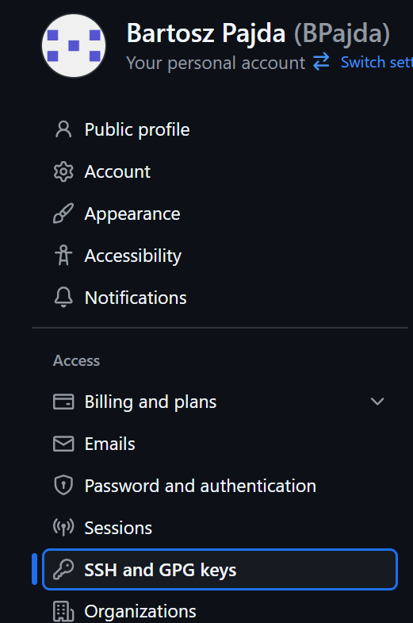
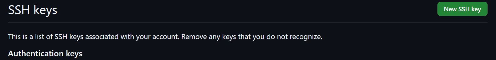

# **LAB 1**
# 1. Zainstaluj klienta Git i obsługę kluczy SSH

## konfiguracja ssh, maszyny wirtualnej oraz srodowiska pracy w VSC


## Utowrzenie folderu przedmiotowego oraz instalacja gita

do zainsatlowania gita nalezy użyc nizej wymienionych polecen:
```sh
mkdir devops
sudo dnf install -y git
git --version
```


## sklonowanie repozytorium predmiotowego narazie przez https

uźywamy polecenia:
```sh
git clone https://(adres repozytorium).git
```


adres znajdujemy na stronie repozytorium


### historia polecen do tego punktu:


# 2. Generacja kluczy ssh oraz sklonowanie po SSH

## Wygenerowanie pierwszego klucza ssh
W pierwszej kolejnosci generujemy klucz bez zabezpieczen poleceniem:
```sh
ssh-keygen -t klucz szyfrowania[u nas => ed25519] -C "email konta github"
```
przy czym w kolejnych krokach wybieramy miejsce zapisu kluczy (u nas domysle), a w miejscu gdzie pytaja nas o hasło klikamy enter zostawiajac klucz jako niezabezpieczony


## Wygenerowanie drugiego klucza ssh (zabezpieczonego)

klucz generujemy w ten sam sposob jak pierwszy z roznica ze gdy pytaja nas o haslo to je ustawiamy.


### nalezy pamietac ze w kazdym wypadku generujemy 2 klucze - publiczny i prywatny

## Dodanie klucza do githuba:
aby znalezc miejsce do dodania kluczy ssh na githubie musimy kolejno:
```
Kliknac w profil > settings > SSH and GPG keys > new SSH key
```




nastepnie dodajemy klucz:


### historia polecen do tego punktu: 


## Utworzenie agenta ssh
mozna utworzyc agenta ssh by przy kazdym odpaleniu sesji nie trzeba bylo caly czas wpisywac hasła. Mozna go utworzyc następująco:
```sh
eval "$(ssh-agent -s)"
ssh-add ~/.(sciezka do klucza)
```


## Sklonowanie repozytorium przez SSH
uzywamy komendy:
```sh
git clone (analogicznie link z githuba)
```
link po ssh znajdujemy:


### nalezy pamietac by zrobic to w osobnym folderze


### historia polecen do tego punktu


# 3. Utworzenie gałęzi lokalnej

## Stworzenie nowej gałęzi lokalnej wraz z nowym folderem na któym będziemy pracować

folder tworzymy analogicznie jak eyżej
do utworzenia nowej galęzi używamy komendy:
```sh
git checckout -b (nazwa brancha)
```


### Historia polecen tego punktu:


# 4. Praca na nowej gałezi

## Utworzenie git hooka
git hook - jest to wymog dla gita by kazdy commit zaczynal sie od okreslonych słów w naszym przypadku sa to inicjały i nr albumu


## Dodanie git hooka do configa
w pierwszej kolejnosci musimy dodac naszemu git hookowi uprawninia do wykonywania 
```sh
chmod +x (plik)
```
nastepnie dodajemy do configa naszego nowo utworzonego git hooka

```sh
git config --local core.hooksPath (sciezka do pliku)
```


## Sprawdzenie dzialania git hooka


# 5. Spuszowanie galezi do galezi grupowej 


# **LAB 2**
# 1. Instalacja dockera na maszynie

jak zainstalowac: https://docs.docker.com/engine/install/fedora/


## Sprawdzenie dzialania dockera hello-worldem


## Dodanie uzytkownika do grupy docker


# 2. Utworzenie konta docker

Konto mozna zalozyc na: https://app.docker.com/signup


# 3. Pobierz obrazy
## pobiezemy obrazy: hello-world, busybox, ubuntu, mysql
potrzeba użyc komend:
```sh
docker pull hello-world
docker pull busybox
docker pull ubuntu
docker pull mysql
```


# 4. Uruchom kontener z obrazu busybox
do uruchomienia kontenera potrzebowac bedziemy komendy:
 ```sh
docker run -i -d --name Test busybox sleep 3600
 ```
gdzie:
* -i - pozwala na interakcje z kontenerem
* -d - uruchamia kontener w tle
* --name - nadaje nazwe kontenerowi
* sleep 3600 - upewnia nas ze kontener bedzie aktywny przez 3600 sekund a nie zamknie sie w trakcie

## Podłącz się do kontenera interaktywnie i wywołaj numer wersji

nastepnie zeby dostac sie do interaktywnej powloki kontenera musimy:

```sh
docker exec -it Test sh
```
aby wywołać nr wersji w kontenerze piszemy:

```sh
busybox | head -1
```


# 5. Uruchom "system w kontenerze"
do uruchomienia kontenera potrzebowac bedziemy komendy:
 ```sh
docker run -i -t -d --name Ubuntu ubuntu sleep 3600
 ```

## Zaprezentuj PID1 w kontenerze i procesy dockera na hoście
nastepnie zeby dostac sie do interaktywnej powloki kontenera musimy:

```sh
docker exec -it Ubuntu sh
```

bastepnie wywolujemy to kolejno w kontenerze i na hoscie:
```sh
ps -fe
```


# 6. Stwórz własnoręcznie, zbuduj i uruchom prosty plik Dockerfile bazujący na wybranym systemie i sklonuj nasze repo

Tworzymy dockerfila w folderze lab2:
```dockerfile
FROM ubuntu

RUN apt-get update && apt-get install -y git

WORKDIR /app
RUN git clone https://github.com/InzynieriaOprogramowaniaAGH/MDO2025_INO.git
```


nastepnie w folderze w ktorym mamy dockerfila (u nas lab2):
```sh
docker build . -t test-ubuntu-image
```


analogicznie jak wczesniej wchodzimy do kontenera i sprawdzamy czy sie dobrze pobralo


# 7. Pokaż uruchomione ( != "działające" ) kontenery, wyczyść je.
żeby sprawdzic liste kontenerow:
```sh
docker ps -la

docker rm Test Ubuntu test-ubuntu
```


# 8. Wyczyść obrazy
```sh
docker image prune
```


# **LAB3**
# 1. Wybór oprogramowania na zajęcia

# Oprogramowanie z podlinkowanego repozytorium na zajeciach
repozytorium: https://github.com/irssi/irssi
## klonujemy repozytorium


# Doinstalowujemy wszystkie potrzebne rzeczy z requirements
Używamy flagi
* -devel - jest to wymagane do kompilacji. Inaczej zostaly by pobrane same binarki.

```sh
sudo dnf -y install gcc glib2-devel openssl-devel perl-devel ncurses-devel meson ninja
```


# Uruchomienie Builda
```sh
meson Build
```


# Uruchomienie Builda po doinstalowaniu brakujacych bibliotek


# Nastepnie uruchomimy testy jednostkowe 
```sh
ninja -C Build test
```


### history


# 2. Przeprowadzenie buildu w kontenerze

## Wykonujemy te same polecenia co wyżej tylko w kontenerze ubuntu

Analogicznie do tego jak to robilismy w lab2, uruchamiamy kontener i kolejno wykonujemy na nim polecenia jak w punkcie 1


ze wzgledu ze to ubuntu to trzeba uzyc odpowiednikow dla ubuntu
```sh
apt update && apt -y install git gcc libglib2.0-dev libssl-dev libperl-dev libncurses-dev meson ninja-build perl
```


# 2. Stwórz dwa pliki Dockerfile automatyzujące kroki powyżej, z uwzględnieniem następujących kwestii

## Pierwszy docker file odpowiadajacy za builda

```Dockerfile
FROM ubuntu

RUN apt -y update && \
    apt -y install git meson gcc libglib2.0-dev libssl-dev libncurses-dev libutf8proc-dev libperl-dev

RUN git clone https://github.com/irssi/irssi.git
WORKDIR /irssi

RUN meson Build
RUN ninja -C Build
```


## Stworzenie obrazu

```sh
docker build -f Dockerfile.build -t docker-build-irrsi .
```


## Drugi docker file odpowiadajacy za testy

```Dockerfile
FROM docker-build-irrsi

WORKDIR /irssi

CMD [ "ninja", "-C", "Build", "test" ]
```


## Tworzymy obraz testu analogicznie

```sh
docker build -f Dockerfile.test -t docker-test-irrsi2 .
```


## Tworzymy oraz uruchamiamy kontener bazujacy na docker-test-irrsi2

```sh
docker run --rm --name oby-dzialalo docker-test-irrsi2
```


# ***LAB4***
dokumentacje do woluminów można znaleźć tu:
https://docs.docker.com/storage/volumes/

# 1. Zachowywanie stanu

## Przygotowanie woluminów: wejsciowego i wyjsciowego

```sh
docker volume create vol-in
docker volume create vol-out
```


## Przygotowanie kontenera analogicznie do ostatnich zajec tylko bez gita
Dockerfile.build zrobiony jest analogicznie jak na wczesniejszych zajeciach, tylko po usunięciu gita i wszystkiego co z nim związane
```Dockerfile
FROM ubuntu

RUN apt -y update && \
    apt -y install meson gcc libglib2.0-dev libssl-dev libncurses-dev libutf8proc-dev libperl-dev

WORKDIR /app
```
Budujemy obraz
```sh
docker build -f Dockerfile.build -t build .
```


## Utworzenie kontenera z obrazu oraz podpiecie woluminów
```sh
docker run -it --name build-vol -v vol-in:/vol-in -v vol-out:/vol-out build /bin/bash
```


## Sklonowanie repozytorium na pierwszy wolumin (wejściowy)
przez to ze nie mamy gita w naszym kontenerze, utworzymy kontener pomocniczy w którym bedzie już git. Uzyjemy do tego alpine/git - lekki i ma tylko to co potrzeba
```sh
docker pull alpine/git

docker run --rm -v vol-in:/vol-in alpine/git clone https://github.com/irssi/irssi.git /vol-in
```
flaga -rm swiadczy o tym ze kontener zostanie usuniety po wykonaniu pracy


## Uruchom build w kontenerze
przez wzglad na używanie repozytorium z wczesniejszych zajec budujemy je dokladnie w ten sam sposob 
```sh
meson setup Build
ninja -C Build
```


## Zapisanie Builda na woluminie wyjściowym
```sh
cp -r /vol-in/Build /vol-out
```


## Upewnienie sie ze dane są dostępne po wyłączeniu kontenera
wykorzystamy do tego ponownie kontener pomocniczy, tak jak wczesniej uzyjemy alpine
```sh
docker run --rm -v vol-out:/vol-out alpine ls /vol-out
```


Powyższe kroki można wykonać Dockerfilem oraz docker buildem jezeli dodamy odpowiednia linijke (jak wy ostatnich zajeciach podczas testowania => CMD [...]) która wykona za nas polecenia które kolejno byśmy wpisali w terminalu. Jednak uważam, że kontener tymczasowy świetnie sie do tego sprawdza i przyspiesza znacznie pracę.

# 2. Eksponowanie portu
dokumentacja do tego punktu:
* iperf = https://iperf.fr/
* network = https://docs.docker.com/engine/reference/commandline/network_create/
## Uruchom wewnątrz kontenera serwer iperf (iperf3)
W tym celu utworzymy dockerfila
```Dockerfile
FROM ubuntu

RUN apt-get update && apt-get install -y iperf3

EXPOSE 5201

CMD ["iperf3", "-s"]
```
nastepnie budujemy obraz
```sh
docker build -f Dockerfile.iperf -t iperf-server .
```


żeby można bylo sie z tym kontenerem połączyć musimy przekierowac port
```sh
docker run -d -p 5201:5201 --name ubuntu-iperf-server iperf-server
```


## Połącz się z nim z drugiego kontenera, zbadaj ruch
do wykonania tego uzyjemy maszyny ubuntu z wczesniejszych zajec. By dostac sie na maszyne po jej odpaleniu uzywamy polecenia:
```sh
docker exec -it Ubuntu /bin/bash
```
na maszynie doinstalowywujemy iperf3 (analogicznie jak w Dockerfile). do przetestowania ruchu można użyć dwoch polecen:
```sh
iperf3 -c ubuntu-iperf-server   (po nazwie)
iperf3 -c 172.17.0.2            (po ip)
```
przy czym polecenie po nazwie nam nie zadziala, bo dzialamy na sieci domyslnej!!!


## Ponów ten krok, ale wykorzystaj własną dedykowaną sieć mostkową (zamiast domyślnej).
w pierwszej kolejności tworzymy nową sieć
```sh
docker network create iperf-net
```


zeby zmienic siec niestety konieczne jest utworzenie kontenerów od nowa (albo nie tyle co konieczne co prostsze).
W tym celu wykonamy dodatkowego dockerfila, ktory bedzie mial w sobie ubuntu z zainstalowanym juz iperf3
```Dockerfile
FROM ubuntu

RUN apt-get update && apt-get install -y iperf3

CMD ["/bin/bash"]
```
przez to ze dodajemy linjke z CMD teraz podczas uruchamiania go jestesmy w stanie z automatu wywolac polecenie w cmd do sprawdzenia polaczenia.
Analogicznie tworzymy obraz
```sh
docker build -f Dockerfile.iperf -t iperf-server .
```


Teraz kolejno uruchamiamy kontenery w pierwszej kolejnosci serwer(jezeli nie usunelismy wczesniejszego kontenera to trzeba zmienic nazwe)
```sh
docker run -d --network=iperf-net -p 5201:5201 --name iperf-server-ubuntu iperf-server 
docker run --rm  -it --network=iperf-net --name iperf-ubuntu-c iperf-ubuntu iperf3 -c iperf-server-ubuntu
```
Przypomnienie flag:
* -d => kontener dziala w tle
* --network => przypisuje siec
* -p => przekierowuje port
* -rm => tymczasowy kontener, po zakanczeniu pracy jest usuwany
* -it => dziala podobnie do execa, daje mozliwosc korzystania z terminalu
Fragment 'iperf3 -c iperf-server-ubuntu' dziala tylko dzieki temu ze w obrazie jest CMD oraz flaga -it


## Połącz się spoza kontenera (z hosta i spoza hosta)
Połączenie z hosta: 
```sh
sudo dnf install -y iperf3 (jeżeli nie ma doinstalowanego na hoscie)
iperf3 -c localhost
```


Nastepnie bedziemy sie łączyć z kontenerem postawionym na komputerze z systemem windows (głównym komputerze).
Do tego stawiamy prosty kontener dockerowy z ubuntu  na komputerze głównym


ja wykorzystalem do tego docker desktop gdzie mozna szybko pobrac obraz i postawic kontener ale mozna to zrobic terminalowo jak w tym sprawozdaniu juz bylo robione.
Nastepnie sprawdzamy ip jakie ma nasza maszyna wirtualna na ktorej stoi nasz iperf-server-ubuntu
```sh
ip a
```


teraz w naszym kontenerze na glownym komputerze doinstalowujemy konieczne rzeczy:
```sh
apt-get update
apt-get install iperf3
```
oraz łączymy się z naszym iperf-server-ubuntu przez ip i port ktory jest wyeksponowany
```sh
iperf3 -c 192.168.100.57 -p 5201
```


# 3. Instancja Jenkins
Instalacje przeprowadzimy wedle instrukcji w dokumentacji jenkinsa: https://www.jenkins.io/doc/book/installing/docker/

## Utworzenie sieci Jenkinsa
siec tworzymy w taki sam sposob jak wczesniej
```sh
docker network create jenkins
```


## Doinstalowanie dinda
Jest on konieczny do późniejszego używania komend dockerowych w jenkinsie
```sh
docker run \
  --name jenkins-docker \
  --rm \
  --detach \
  --privileged \
  --network jenkins \
  --network-alias docker \
  --env DOCKER_TLS_CERTDIR=/certs \
  --volume jenkins-docker-certs:/certs/client \
  --volume jenkins-data:/var/jenkins_home \
  --publish 2376:2376 \
  docker:dind \
  --storage-driver overlay2
```
Dokladny opis kazdej z flag znajduje sie w linku wyżej


## Utworzenie Dockerfila na podstawie oryginalnego obrazu (dockerowego) jenkinsa 
Cała treść dockerfila znajduje sie w dokumentacji jenkinsa

```Dockerfile
FROM jenkins/jenkins:2.492.2-jdk17
USER root
RUN apt-get update && apt-get install -y lsb-release ca-certificates curl && \
    install -m 0755 -d /etc/apt/keyrings && \
    curl -fsSL https://download.docker.com/linux/debian/gpg -o /etc/apt/keyrings/docker.asc && \
    chmod a+r /etc/apt/keyrings/docker.asc && \
    echo "deb [arch=$(dpkg --print-architecture) signed-by=/etc/apt/keyrings/docker.asc] \
    https://download.docker.com/linux/debian $(. /etc/os-release && echo \"$VERSION_CODENAME\") stable" \
    | tee /etc/apt/sources.list.d/docker.list > /dev/null && \
    apt-get update && apt-get install -y docker-ce-cli && \
    apt-get clean && rm -rf /var/lib/apt/lists/*
USER jenkins
RUN jenkins-plugin-cli --plugins "blueocean docker-workflow"
```

nastepnie budujemy obraz z Dockerfila

```sh
docker build -f Dockerfile.jenkins -t myjenkins-blueocean:2.492.2-1 .
```


## Uruchomienie kontenera z imaga
podobnie jak wyzej flagi sa wszystkie opisane w dokumentacji

```sh
docker run \
  --name jenkins-blueocean \
  --restart=on-failure \
  --detach \
  --network jenkins \
  --env DOCKER_HOST=tcp://docker:2376 \
  --env DOCKER_CERT_PATH=/certs/client \
  --env DOCKER_TLS_VERIFY=1 \
  --publish 8080:8080 \
  --publish 50000:50000 \
  --volume jenkins-data:/var/jenkins_home \
  --volume jenkins-docker-certs:/certs/client:ro \
  myjenkins-blueocean:2.492.2-1 
```
pokazanie dzialajacych kontenerow:


## Odblokowanie i rejestracja w jenkinsie
w pierwszej kolejnosci przechodzimy na strone internetowa:
(adres maszyny):(port na ktorym ją udostepnilismy)
u nas jest to

```sh
192.168.100.57:8080
```
Po wejsciu na strone zobaczymy:


Aby odblokowac jenkinsa musimy wejsc do kontenera z dindem u nas jenkins-docker
```sh
docker exec -it jenkins-docker sh
```
A nastepnie by pozyskac haslo uzywamy komendy:

```sh
cat /var/jenkins_home/secrets/initialAdminPassword
```


Nastepnie pojawi sie opcja doinstalowania pluginów. Nie przejmujemy się tym i klikam w sugerowane (pozniej pozostale da sie doinstalowac). Po instalacji nadszedł czas na utworzenie pierwszego administratora


## Koniec Konfiguracji

