# ***LAB5***

# 1. Utworzenie instancji Jenkinsa
[Opisane dokładnie w ostatnich labach](../Sprawozdanie1/README.md)

# 2. Zadania wstępne
## Konfiguracja wstępna i pierwsze uruchomienie
### Projekt wywietlajacy uname

W pierwszej kolejnosci Tworzymy projekt w tablicy klikajac Nowy projekt
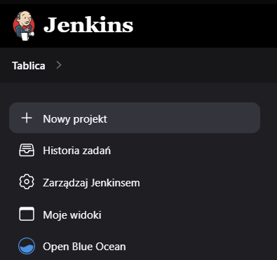

Nastepnie nadajemy nazwe oraz wybieramy projekt ogolny
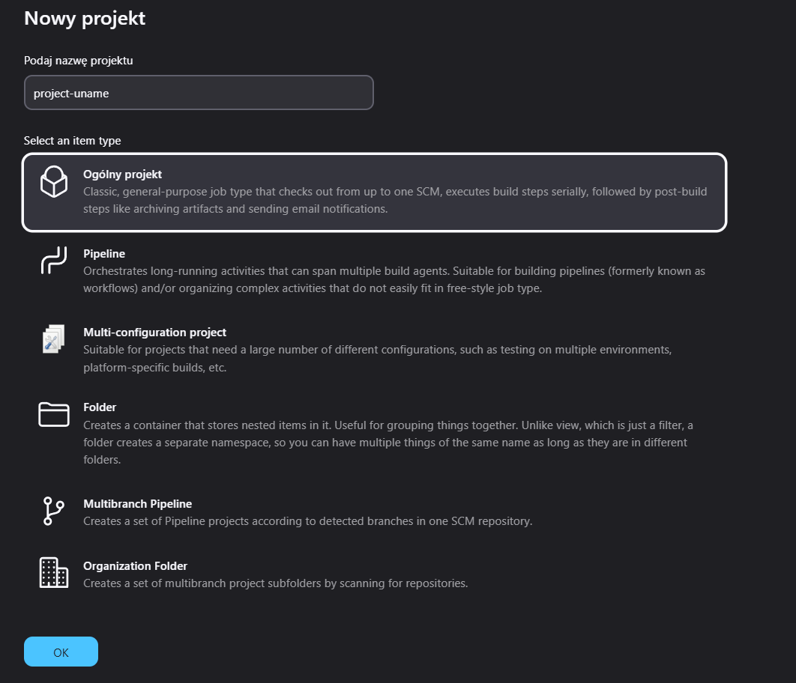 

Schodzimy do zakladki o nazwie Kroki Budowania > Dodaj krok budowania > Uruchom Powłoke 

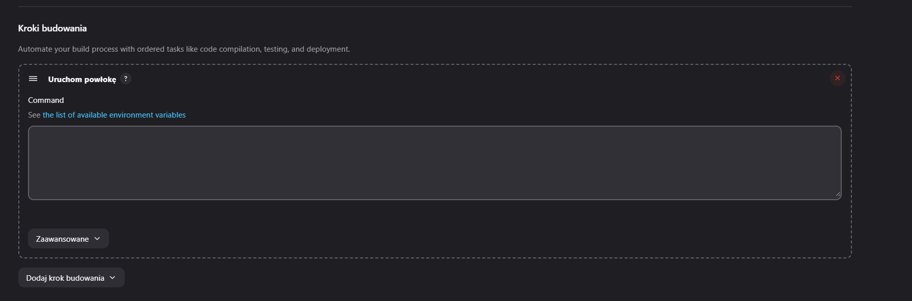

Dodajemy w wyznaczonym miejscu polecenie 
```sh
#!/bin/bash

uname -a
```
a nastepnie zapisujemy konfiguracje
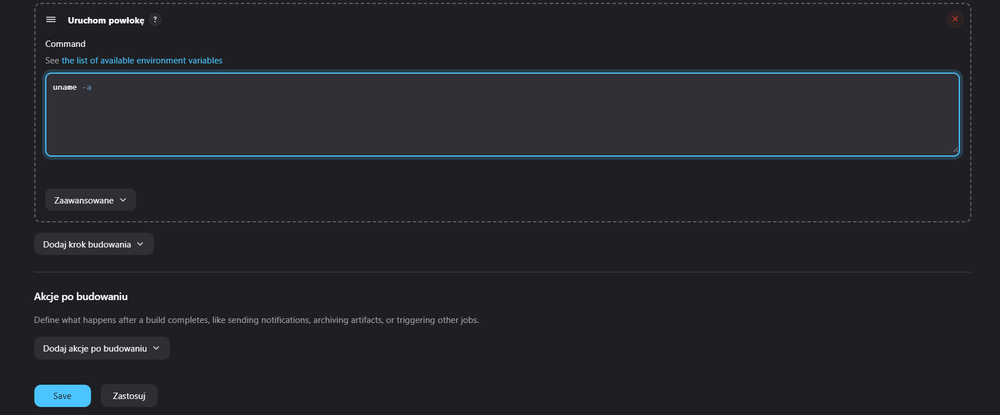

Nastepnie pojawi nam sie po lewej stronie w projekcie opcja uruchom > po czym efekt powinien sie nam pojawic na dole w Builds

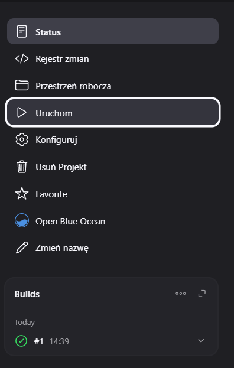

Po kliknięciu w artefakt uruchomienia (u nas jest to 1 w buildie) >
pojawi nam sie menu do artefaktu 

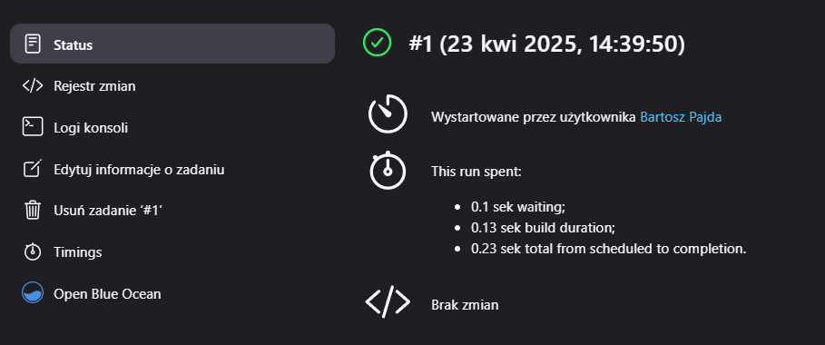

Nas interesują tutaj logi

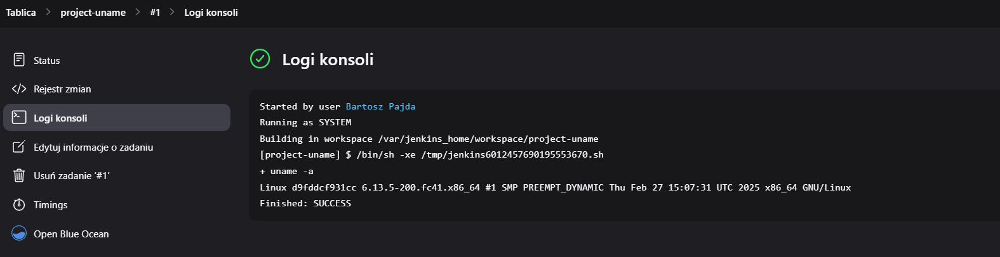

### Projekt wyswietlajacy blad, gdy godzina jest nieparzysta
TWorzymy projekt analogicznie jak w punkcie wyzej do momentu Uruchomienia powłoki. PO uruchomieniu powloki w wyznaczonym miejscu wpisujemy:
```bash
#!/bin/bash

hour=$(date +%-H)

if (( hour % 2 != 0 )); then
    echo "Błąd: godzina $hour jest nieparzysta"
    exit 1
else
    echo "Godzina $hour jest parzysta"
    exit 0
fi
```
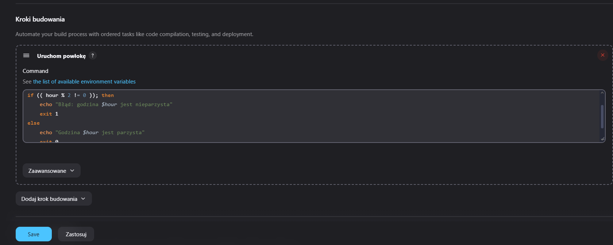

Po zapisaniu i uruchomieniu sprawdzamy artefakt

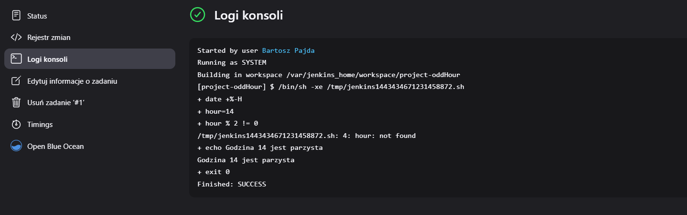


### Pobranie w projekcie obraz kontenera ubuntu

My to zrobimy w naszym pierwszym projekcie. Wiec w Tablicy Jenkinsa wybieramy nasz pierwszy projekt:

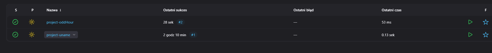

gdzie wchodzimy w konfiguruj:

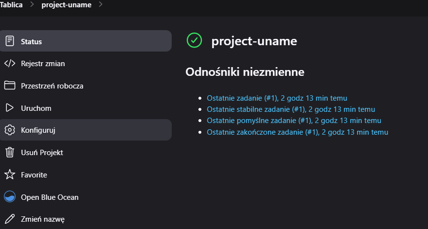

Dodajemy w konfiguracji linijke docker pulla
```sh
#!/bin/bash

uname -a
docker images
docker pull ubuntu
docker images
```

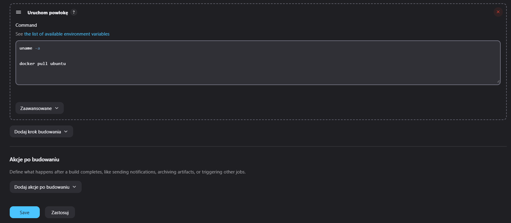

Nastepnie powinno nam sie pokazac w logach artefaktu:

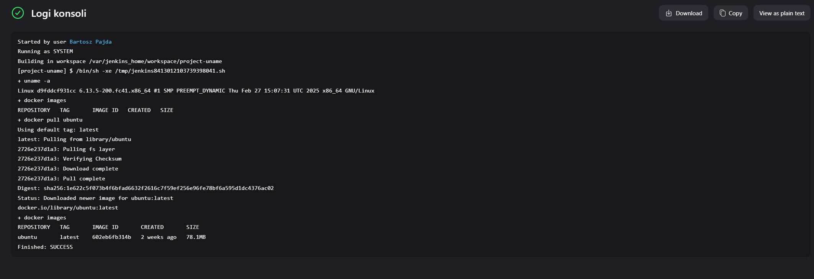

***Uwaga*** Upewnij sie ze oba kontenery dockerowe dzialaja (blueocean i dind)

## obiekt typu pipeline
### Utwórz nowy obiekt typu pipeline
Tworzymy nowy projekt i tym razem zamiast projektu ogólnego wybieramy pipeline

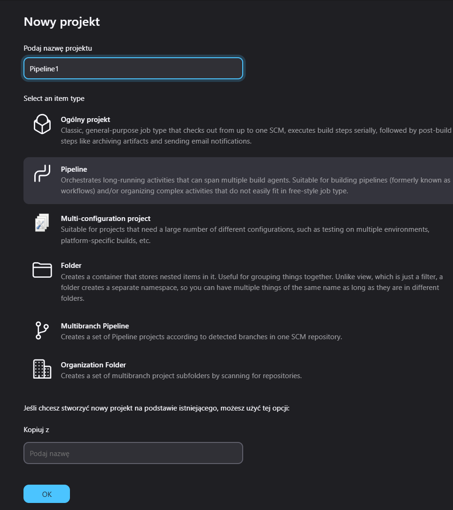

Nastepnie w pipeline script wpisujemy:

```Dockerfile
pipeline {
    agent any

    stages {
        stage('Clean') {
            steps {
                cleanWs()
                sh 'docker image rm -f docker-irssi-build docker-irssi-test'
                sh 'docker builder prune -a -f'
            }
        }
        
        stage('Git clone') {
            steps {
                git url: 'https://github.com/InzynieriaOprogramowaniaAGH/MDO2025_INO.git', branch: 'BP417137'
            }
        }
        
        stage('Build') {
            steps {
                dir('ITE/GCL08/BP417137/Sprawozdanie1/lab3') {
                    sh 'docker build -f Dockerfile.build -t docker-irssi-build .'
                }
            }
        }
        
        stage('Test') {
            steps {
                dir('ITE/GCL08/BP417137/Sprawozdanie1/lab3') {
                    sh 'docker build -f Dockerfile.test -t docker-irssi-test .'
                }
            }
        }
    }
}
```
budujemy to wedlug struktury podanej w dokumentacji jenkinsa: https://www.jenkins.io/doc/book/pipeline/

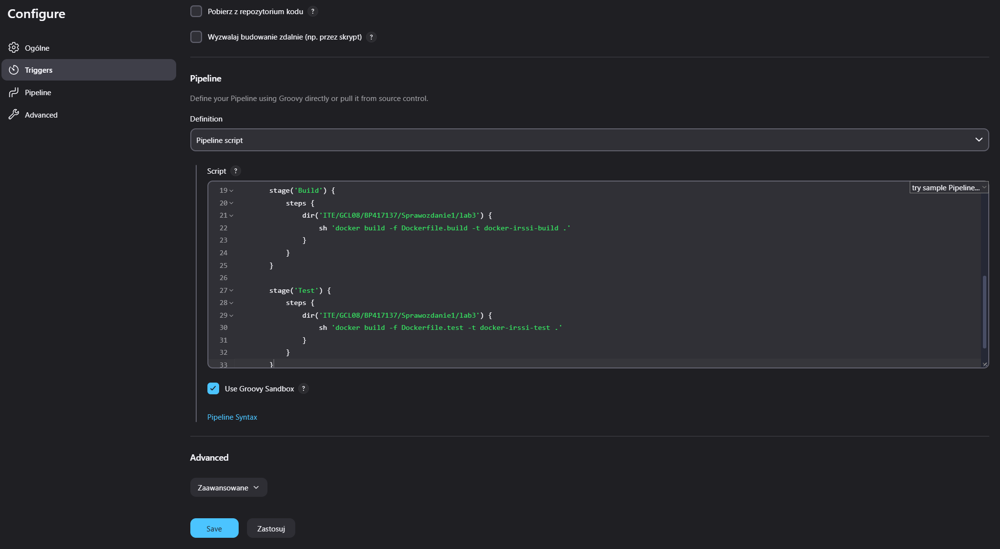
