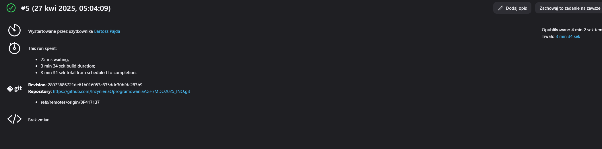

# ***LAB5***

# 1. Utworzenie instancji Jenkinsa
[Opisane dokładnie w ostatnich labach](../Sprawozdanie1/README.md)

# 2. Zadania wstępne
## Konfiguracja wstępna i pierwsze uruchomienie
### Projekt wywietlajacy uname

W pierwszej kolejnosci Tworzymy projekt w tablicy klikajac Nowy projekt


Nastepnie nadajemy nazwe oraz wybieramy projekt ogolny

 

Schodzimy do zakladki o nazwie Kroki Budowania > Dodaj krok budowania > Uruchom Powłoke 


Dodajemy w wyznaczonym miejscu polecenie 
```sh
#!/bin/bash

uname -a
```
a nastepnie zapisujemy konfiguracje


Nastepnie pojawi nam sie po lewej stronie w projekcie opcja uruchom > po czym efekt powinien sie nam pojawic na dole w Builds


Po kliknięciu w artefakt uruchomienia (u nas jest to 1 w buildie) >
pojawi nam sie menu do artefaktu 


Nas interesują tutaj logi


### Projekt wyswietlajacy blad, gdy godzina jest nieparzysta
TWorzymy projekt analogicznie jak w punkcie wyzej do momentu Uruchomienia powłoki. PO uruchomieniu powloki w wyznaczonym miejscu wpisujemy:
```bash
#!/bin/bash

hour=$(date +%-H)

if (( hour % 2 != 0 )); then
    echo "Błąd: godzina $hour jest nieparzysta"
    exit 1
else
    echo "Godzina $hour jest parzysta"
    exit 0
fi
```


Po zapisaniu i uruchomieniu sprawdzamy artefakt


### Pobranie w projekcie obraz kontenera ubuntu

My to zrobimy w naszym pierwszym projekcie. Wiec w Tablicy Jenkinsa wybieramy nasz pierwszy projekt:


gdzie wchodzimy w konfiguruj:


Dodajemy w konfiguracji linijke docker pulla
```sh
#!/bin/bash

uname -a
docker images
docker pull ubuntu
docker images
```


Nastepnie powinno nam sie pokazac w logach artefaktu:


***Uwaga*** Upewnij sie ze oba kontenery dockerowe dzialaja (blueocean i dind)

## obiekt typu pipeline
### Utwórz nowy obiekt typu pipeline
Tworzymy nowy projekt i tym razem zamiast projektu ogólnego wybieramy pipeline


Nastepnie w pipeline script wpisujemy:

```Dockerfile
pipeline {
    agent any

    stages {
        stage('Clean') {
            steps {
                cleanWs()
                sh 'docker image rm -f docker-irssi-build docker-irssi-test'
                sh 'docker builder prune -a -f'
            }
        }
        
        stage('Git clone') {
            steps {
                git url: 'https://github.com/InzynieriaOprogramowaniaAGH/MDO2025_INO.git', branch: 'BP417137'
            }
        }
        
        stage('Build') {
            steps {
                dir('ITE/GCL08/BP417137/Sprawozdanie1/lab3') {
                    sh 'docker build -f Dockerfile.build -t docker-irssi-build .'
                }
            }
        }
        
        stage('Test') {
            steps {
                dir('ITE/GCL08/BP417137/Sprawozdanie1/lab3') {
                    sh 'docker build -f Dockerfile.test -t docker-irssi-test .'
                }
            }
        }
    }
}
```
budujemy to wedlug struktury podanej w dokumentacji jenkinsa: https://www.jenkins.io/doc/book/pipeline/


pipeline sie udał


Drugie uruchomienie pipelina



# 3. Kompeltny Pipeline - Express.js
Link do repozytorium wykorzystywanego repozytorium: https://github.com/expressjs/express

## Etap BUILD
### w pierwszej kolejnosci przygodowujemy dockerfila pod image builda

```Dockerfile
FROM node:20
WORKDIR /app
RUN git clone https://github.com/expressjs/express.git
WORKDIR /app/express
RUN npm install
```
### Tworzymy obraz

```sh
docker build -f Dockerfile.build -t express-build-img .
```


## Etap TEST
### Przygotowujemy dockerfila pod image test
```Dockerfile
FROM express-build-img

WORKDIR /app/express

RUN npm test
```

### Tworzymy obraz

```sh
docker build -f Dockerfile.test -t express-test-img .
```


## Etap DEPLOY

W repozytorium expressa jest wiele róznych przykładów użycia. Ja skorzystałem z przykladu downloads, którego budowa wyglada tak:


### Przygotowujemy dockerfila pod image deploy

```Dockerfile
FROM node:20-slim

COPY --from=express-build-img /app/express /app

WORKDIR /app

CMD ["node", "examples/downloads"]
```

### Tworzymy Obraz

```sh
docker build -f Dockerfile.deploy -t express-deploy-img .
```


### Tworzymy nowa sieć

```sh
docker network create express
```


### Uruchamiamy kontener deploya

```sh
docker run -d --rm --network express --name express-deploy-container -p 3000:3000 express-deploy-img
```


Upewniamy się, że wszystko działa

```sh
docker logs express-deploy-container
```


Teraz aby sprawdzić co nam przeglądarka pokazuje na porcie 3000, musimy ten port udostępnić. Ja skorzystalem z możliwości udostępnienia portu przez VSC


### Tworzymy kontener z curlem 
curl jest minimalistyczny i wysyla zapytanie o to co jest na stronie - idealne narzedzie do sprawdzenia dzialania kontenera

```sh
docker run --rm --network express curlimages/curl curl -s express-deploy-container:3000
```


## Etap Publish
bedziemy to publikowac na dockerhuba wiec do tego musimy poczynic pewne przygotowania
### Tworzymy obraz pod docker pusha

```sh
docker build -f Dockerfile.deploy -t bpajda/express-deploy-img:latest .
```


### Nastepnie logujemy sie na docker huba


### Pushujemy obraz na dockerhuba

```sh
docker push bpajda/express-deploy-img:latest
```


### Przygotowanie pipelina
 W pierwszej kolejnosci aby mozna bylo sie logowac do docker huba trzeba dodac na jenkinsie credsy


### Tworzymy pipeline

```Dockerfile
pipeline {
    agent any

    environment {
        APP_DIR = 'ITE/GCL08/BP417137/Sprawozdanie2/lab6'
    }

    stages {
        stage('Etap Clone') {
            steps {
                git branch: 'BP417137', url: 'https://github.com/InzynieriaOprogramowaniaAGH/MDO2025_INO.git'
            }
        }

        stage('Etap Clean') {
            steps {
                dir("${APP_DIR}") {
                    sh 'docker rmi -f express-build-img || true'
                    sh 'docker rmi -f express-test-img || true'
                    sh 'docker rmi -f bpajda/express-deploy-img || true'
                    sh 'docker builder prune --force --all || true'
                    sh 'docker network rm express || true'
                    sh 'docker rm -f express-deploy-container || true'
                }
            }
        }

        stage('Etap Build') {
            steps {
                dir("${APP_DIR}") {
                    sh 'docker build -f Dockerfile.build -t express-build-img .'
                }
            }
        }

        stage('Etap Test') {
            steps {
                dir("${APP_DIR}") {
                    sh 'docker build -f Dockerfile.test -t express-test-img .'
                }
            }
        }
        
        stage('Etap Deploy') {
            steps {
                dir("${APP_DIR}") {
                    sh 'docker build -f Dockerfile.deploy -t bpajda/express-deploy-img:latest .'
                }
            }
        }

        stage('Etap Test2') {
            steps {
                dir("${APP_DIR}") {
                    sh '''
                        docker network create express || true
                        docker run -d --rm --network express --name express-deploy-container -p 3000:3000 bpajda/express-deploy-img:latest
                        sleep 5
                        docker run --rm --network express curlimages/curl curl -s --fail express-deploy-container:3000
                    '''
                }
            }
        }

        stage('Etap Publish') {
            steps {
                script {
                    withCredentials([usernamePassword(
                        credentialsId: 'dockerhub-creds',
                        usernameVariable: 'DOCKER_USER',
                        passwordVariable: 'DOCKER_PASS'
                    )]) {
                        sh "echo ${DOCKER_PASS} | docker login -u ${DOCKER_USER} --password-stdin"
                    }

                    docker.withRegistry('https://registry.hub.docker.com', 'dockerhub-creds') {
                        docker.image("bpajda/express-deploy-img:latest").push()
                    }
                }
            }
        }
    }
}
```
### etap Build (przeszło)


### etap test (przeszło)


### etap deploy (przeszło)


### etap test2 (przeszło)


### etap publish (przeszło)


### obraz spushowany na dockerhuba


### Uzupelnienie skryptu o utworzenie artefaktu oraz zapisanie w formie Jenkinsfila w repo

```Dockerfile
pipeline {
    agent any

    environment {
        APP_DIR = 'ITE/GCL08/BP417137/Sprawozdanie2/lab6'
    }

    stages {
        stage('Etap Clone') {
            steps {
                git branch: 'BP417137', url: 'https://github.com/InzynieriaOprogramowaniaAGH/MDO2025_INO.git'
            }
        }

        stage('Etap Clean') {
            steps {
                dir("${APP_DIR}") {
                    sh 'docker rmi -f express-build-img || true'
                    sh 'docker rmi -f express-test-img || true'
                    sh 'docker rmi -f bpajda/express-deploy-img || true'
                    sh 'docker builder prune --force --all || true'
                    sh 'docker network rm express || true'
                    sh 'docker rm -f express-deploy-container || true'
                }
            }
        }

        stage('Etap Build') {
            steps {
                dir("${APP_DIR}") {
                    sh 'docker build -f Dockerfile.build -t express-build-img .'
                }
            }
        }

        stage('Etap Test') {
            steps {
                dir("${APP_DIR}") {
                    sh 'docker build -f Dockerfile.test -t express-test-img .'
                }
            }
        }
        
        stage('Etap Deploy') {
            steps {
                dir("${APP_DIR}") {
                    sh 'docker build -f Dockerfile.deploy -t bpajda/express-deploy-img:latest .'
                }
            }
        }

        stage('Etap Test2') {
            steps {
                dir("${APP_DIR}") {
                    sh '''
                        docker network create express || true
                        docker run -d --rm --network express --name express-deploy-container -p 3000:3000 bpajda/express-deploy-img:latest
                        sleep 5
                        docker run --rm --network express curlimages/curl curl -s --fail express-deploy-container:3000
                    '''
                }
            }
        }

        stage('Etap Publish') {
            steps {
                script {
                    withCredentials([usernamePassword(
                        credentialsId: 'dockerhub-creds',
                        usernameVariable: 'DOCKER_USER',
                        passwordVariable: 'DOCKER_PASS'
                    )]) {
                        sh "echo ${DOCKER_PASS} | docker login -u ${DOCKER_USER} --password-stdin"
                    }

                    docker.withRegistry('https://registry.hub.docker.com', 'dockerhub-creds') {
                        docker.image("bpajda/express-deploy-img:latest").push()
                    }
                }
            }
        }

        stage('Etap Artefakt') {
            steps {
                dir("${APP_DIR}") {
                    sh '''
                        docker create --name temp_pack bpajda/express-deploy-img:latest
                        docker cp temp_pack:/app ./app-content
                        docker rm temp_pack
        
                        docker run --rm -v "$PWD/app-content":/app -w /app node:20 npm pack
                    '''
                    archiveArtifacts artifacts: 'app-content/*.tgz', fingerprint: true
                }
            }
        }
    }
}
```