# ***LAB8***
# Instalacja zarządcy Ansible
## Utwórz drugą maszynę wirtualną
### Utworz uzytkownika ansible i ustaw hostname na ansible-target

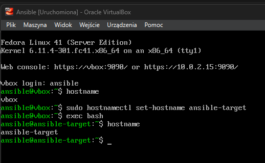


### instalacja programu tar i serwera OpenSSH (sshd)

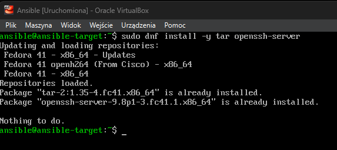

### wlaczenie ssh

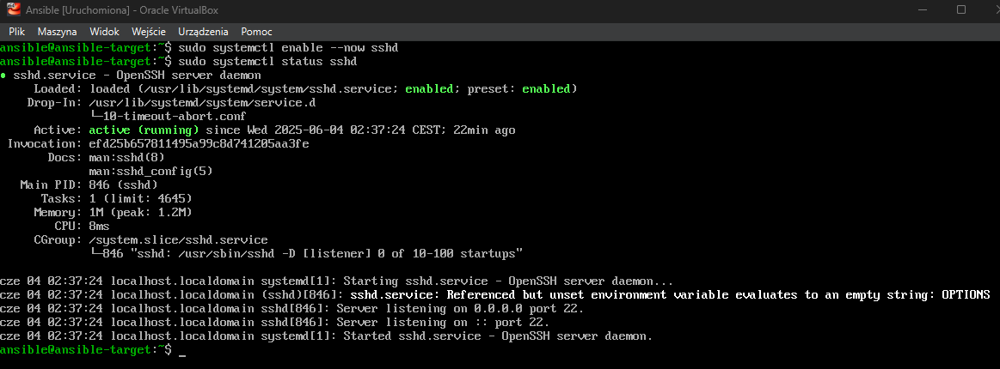

### Zrób migawkę maszyny (i/lub przeprowadź jej eksport)

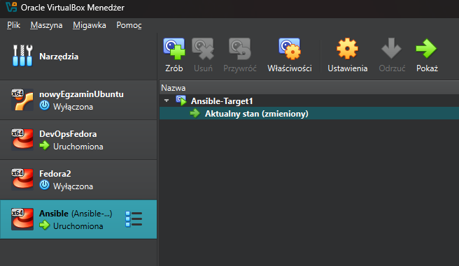

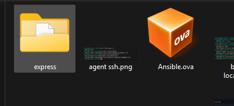

## Na głównej maszynie wirtualnej, zainstaluj oprogramowanie Ansible
### Zmaiana hostname na glownej maszynie

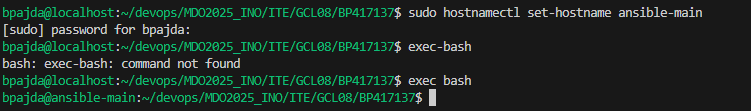

### Zainstalowanie ansible

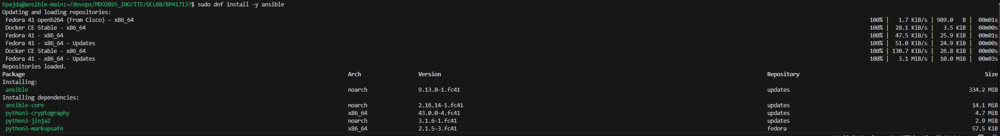

### Wygenerowanie nowych kluczy ssh

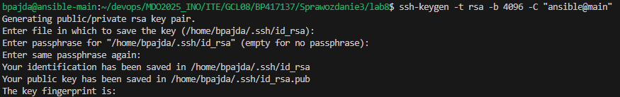

### Wymiana kluczy miedzy maszynami

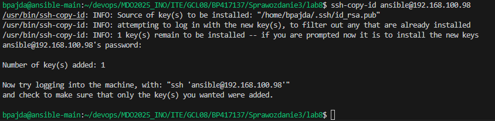

### Zalogowanie bez uzycia hasla

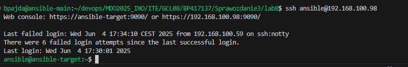

# Inwentaryzacja

### Dodanie na dwóch maszynach DNS w celu rozpoznawania nazwy hostów (plik /etc/hosts)

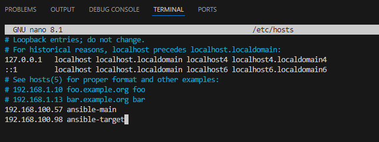

### Ping po nazwie do sprawdzenia

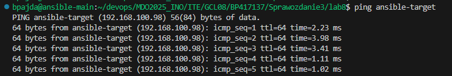

### Stwórz plik inwentaryzacji (inventory.ini)

```ini
[Orchestrators]
ansible-main

[Endpoints]
ansible-target ansible_user=ansible
```

### Wyślij żądanie ping do wszystkich maszyn przy pomocy ansible

```sh
ansible all -i inventory.ini -m ping
```

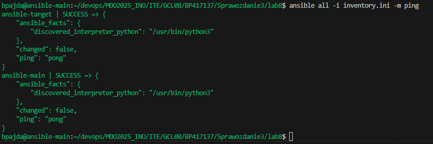

# Zdalne wywoływanie procedur

### Stworzenie playbooka (yaml) z taskiem do pinga

```yaml
- name: Ping everyone
  hosts: all
  gather_facts: no
  tasks:
    - name: Ping
      ansible.builtin.ping:
```

```sh
ansible-playbook -i task1/inventory.ini task1/playbook.yaml 
```

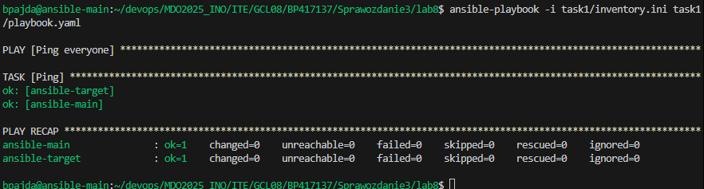

### Uzupelnienie yamla o kolejno: skopiowanie ini do endpointow, ponowny ping, update packages, restart sshd i rngd

```yaml
- name: Ping everyone
  hosts: all
  gather_facts: no
  tasks:
    - name: Ping
      ansible.builtin.ping:

- name: Copy ini to Endpoints
  hosts: Endpoints
  gather_facts: no
  tasks:
    - name: Copy ini file
      ansible.builtin.copy:
        src: inventory.ini
        dest: /tmp/inventory.ini

- name: Ping everyone again
  hosts: all
  gather_facts: no
  tasks:
    - name: Ping to compare
      ansible.builtin.ping:

- name: Update packages
  hosts: all
  become: yes
  tasks:
    - name: Update all packages
      ansible.builtin.yum:
        name: "*"
        state: latest
        update_cache: yes

- name: Restart sshd and rngd
  hosts: all
  become: yes
  tasks:
    - name: Restart sshd
      ansible.builtin.service:
        name: sshd
        state: restarted
      ignore_errors: yes 

    - name: Restart rngd
      ansible.builtin.service:
        name: rngd
        state: restarted
      ignore_errors: yes  
```

konieczne jest dodanie w ini userow z ktorymi sie laczysz oraz ich hasel bo inaczej pojawi sie fatal error

```ini
[Orchestrators]
ansible-main ansible_user=bpajda ansible_become_pass=zaq1@WSX

[Endpoints]
ansible-target ansible_user=ansible ansible_become_pass=zaq1@WSX
```

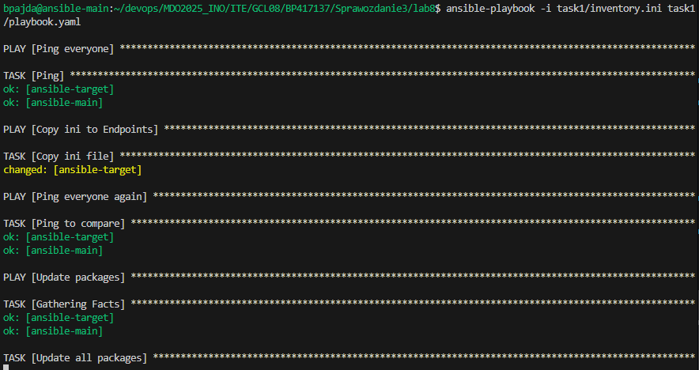

Niestety po wielu probach, poszukiwaniach i zostawieniu wszytskiego na okolo 3h nie przeszlo przez etap "package update". mimo tego bledu nie wyrzucilo zadnego, wiec obecnie to pomine jezeli bedzie to konieczne to dorobie jednak na obecna chwile nie mam ani czasu ani cierpliwosci do tego ;))

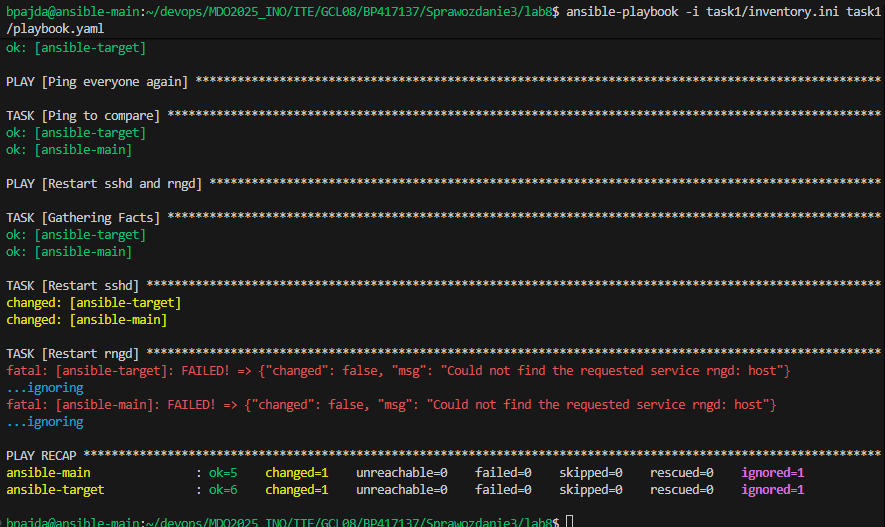

Jak widac na zdj kolejne etapy przeszly jednak nie znalazlo rngd na zadnym z hostow - do pomocy dodalem opcje igorowania bledow tego etapu(nie wiedzialem czy trzeba na sile doinstalowywac czy nie)

# Zarządzanie stworzonym artefaktem

## Jeżeli artefaktem z Twojego pipeline'u był kontener:

- Zbuduj i uruchom kontener sekcji Deploy z poprzednich zajęć
- Pobierz z Docker Hub aplikację "opublikowaną" w ramach kroku Publish
- Na maszynie docelowej, Dockera zainstaluj Ansiblem!
- Zweryfikuj łączność z kontenerem ( przez wzglad na to ze projektem jest ekspress to tak jak ostatnio wlacze serwis i go wysle do niego zapytanie)
- Zatrzymaj i usuń kontener

### ini bedzie wygladal u nas tak samo wiec mozna przekopiowac

```sh
[Orchestrators]
ansible-main ansible_user=bpajda ansible_become_pass=zaq1@WSX

[Endpoints]
ansible-target ansible_user=ansible ansible_become_pass=zaq1@WSX
```

### Utworzenie yamla

```yaml
- name: Express with Docker
  hosts: Endpoints
  become: yes
  vars:
    docker_img: "docker.io/bpajda/express-deploy-img"
    container_name: "express-deploy"
    app_port: 3000

  tasks:
    - name: Install Docker
      become: true
      command: dnf install -y docker
      args:
        creates: /usr/bin/docker

    - name: Start Docker
      ansible.builtin.service:
        name: docker
        state: started
        enabled: yes

    - name: Pull Docker image
      ansible.builtin.docker_image:
        name: "{{ docker_img }}"
        tag: latest
        source: pull

    - name: Create and start Docker container
      ansible.builtin.docker_container:
        name: "{{ container_name }}"
        image: "{{ docker_img }}"
        state: started
        restart_policy: always
        published_ports:
          - "{{ app_port }}:{{ app_port }}"

    - name: Test
      ansible.builtin.uri:
        url: "http://localhost:{{ app_port }}"
        status_code: 200
      register: app_status
      until: app_status is success
      retries: 5
      delay: 10

    - name: Status
      ansible.builtin.debug:
        msg: "Express application is running at http://{{ inventory_hostname }}:{{ app_port }}"
      when: app_status is success

    - name: Response
      ansible.builtin.uri:
        url: "http://localhost:{{ app_port }}"
        return_content: yes
      register: app_response
      when: app_status is success
    
    - name: Response msg
      ansible.builtin.debug:
        msg: "Application response: {{ app_response.content }}"

    - name: Stop container
      ansible.builtin.docker_container:
        name: "{{ container_name }}"
        state: stopped

    - name: Remove container
      ansible.builtin.docker_container:
        name: "{{ container_name }}"
        state: absent
```

```sh
ansible-playbook -i task2/inventory.ini task2/playbook.yaml
```

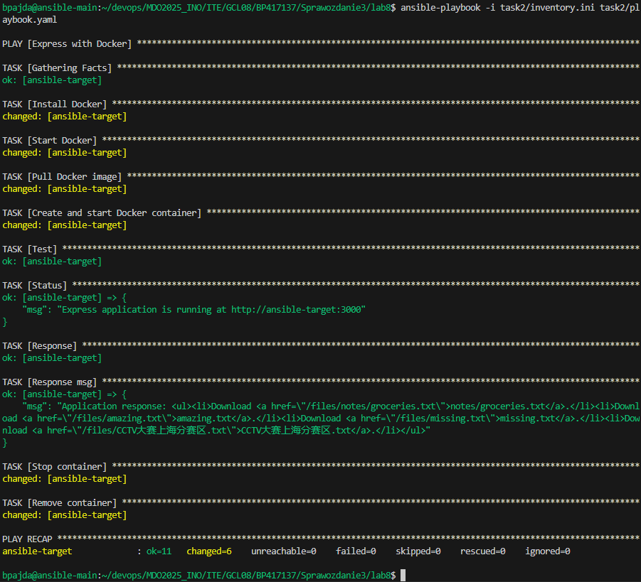

# ***LAB9***

# Pliki odpowiedzi dla wdrożeń nienadzorowanych

## SKopiowanie anacondy do naszego folderu na repo

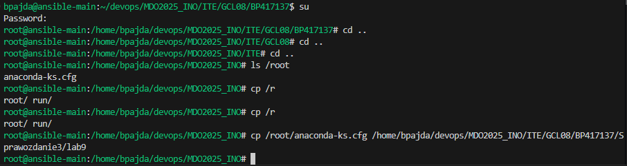

## Edycja pliku pod potrzeby własne. U nas dodanie: wzmianek o repozytorium fedory, ustawienie zakladania dysku, uzytkownika i hostname:

Niestety pojawil sie blad odczytu pliku, z tego powodu trzeba zmienic autora na naszego uzytkownika by moc swobodnie edytowac plik:

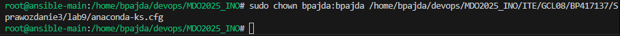

Po naprawiniu bledu przechodzimy do edycji pliku anaconda-ks.cfg

```sh
# Generated by Anaconda 41.35
# Generated by pykickstart v3.58
#version=DEVEL
graphical

url --mirrorlist=http://mirrors.fedoraproject.org/mirrorlist?repo=fedora-41&arch=x86_64
repo --name="updates" --mirrorlist=http://mirrors.fedoraproject.org/mirrorlist?repo=updates-released-f41&arch=x86_64

# Keyboard layouts
keyboard --vckeymap=us --xlayouts='us'
# System language
lang en_US.UTF-8


network --hostname=bpajda_anakonda
network --bootproto=dhcp --device=link --activate --onboot=yes

%packages
@^server-product-environment
@admin-tools
@cloud-infrastructure
@text-internet

%end

# Run the Setup Agent on first boot
firstboot --enable

# System timezone
timezone Europe/Warsaw --utc

# Root password
rootpw --lock

user --groups=wheel --name=bpajda --password=zaq1@WSX --plaintext --gecos="Bartosz Pajda"

# Partitioning
ignoredisk --only-use=sda

clearpart --all --initlabel

autopart --type=lvm

reboot
```

