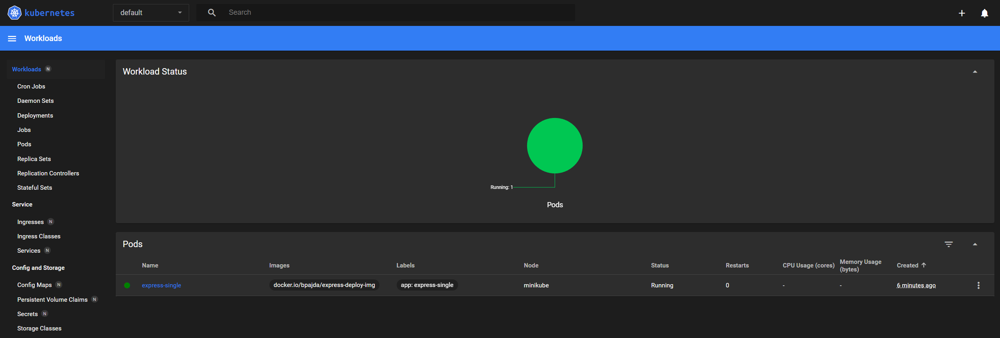

# ***LAB8***
# Instalacja zarządcy Ansible
## Utwórz drugą maszynę wirtualną
### Utworz uzytkownika ansible i ustaw hostname na ansible-target


### instalacja programu tar i serwera OpenSSH (sshd)


### wlaczenie ssh


### Zrób migawkę maszyny (i/lub przeprowadź jej eksport)


## Na głównej maszynie wirtualnej, zainstaluj oprogramowanie Ansible
### Zmaiana hostname na glownej maszynie


### Zainstalowanie ansible


### Wygenerowanie nowych kluczy ssh


### Wymiana kluczy miedzy maszynami


### Zalogowanie bez uzycia hasla


# Inwentaryzacja

### Dodanie na dwóch maszynach DNS w celu rozpoznawania nazwy hostów (plik /etc/hosts)


### Ping po nazwie do sprawdzenia


### Stwórz plik inwentaryzacji (inventory.ini)

```ini
[Orchestrators]
ansible-main

[Endpoints]
ansible-target ansible_user=ansible
```

### Wyślij żądanie ping do wszystkich maszyn przy pomocy ansible

```sh
ansible all -i inventory.ini -m ping
```


# Zdalne wywoływanie procedur

### Stworzenie playbooka (yaml) z taskiem do pinga

```yaml
- name: Ping everyone
  hosts: all
  gather_facts: no
  tasks:
    - name: Ping
      ansible.builtin.ping:
```

```sh
ansible-playbook -i task1/inventory.ini task1/playbook.yaml 
```


### Uzupelnienie yamla o kolejno: skopiowanie ini do endpointow, ponowny ping, update packages, restart sshd i rngd

```yaml
- name: Ping everyone
  hosts: all
  gather_facts: no
  tasks:
    - name: Ping
      ansible.builtin.ping:

- name: Copy ini to Endpoints
  hosts: Endpoints
  gather_facts: no
  tasks:
    - name: Copy ini file
      ansible.builtin.copy:
        src: inventory.ini
        dest: /tmp/inventory.ini

- name: Ping everyone again
  hosts: all
  gather_facts: no
  tasks:
    - name: Ping to compare
      ansible.builtin.ping:

- name: Update packages
  hosts: all
  become: yes
  tasks:
    - name: Update all packages
      ansible.builtin.yum:
        name: "*"
        state: latest
        update_cache: yes

- name: Restart sshd and rngd
  hosts: all
  become: yes
  tasks:
    - name: Restart sshd
      ansible.builtin.service:
        name: sshd
        state: restarted
      ignore_errors: yes 

    - name: Restart rngd
      ansible.builtin.service:
        name: rngd
        state: restarted
      ignore_errors: yes  
```

konieczne jest dodanie w ini userow z ktorymi sie laczysz oraz ich hasel bo inaczej pojawi sie fatal error

```ini
[Orchestrators]
ansible-main ansible_user=bpajda ansible_become_pass=zaq1@WSX

[Endpoints]
ansible-target ansible_user=ansible ansible_become_pass=zaq1@WSX
```


Niestety po wielu probach, poszukiwaniach i zostawieniu wszytskiego na okolo 3h nie przeszlo przez etap "package update". mimo tego bledu nie wyrzucilo zadnego, wiec obecnie to pomine jezeli bedzie to konieczne to dorobie jednak na obecna chwile nie mam ani czasu ani cierpliwosci do tego ;))


Jak widac na zdj kolejne etapy przeszly jednak nie znalazlo rngd na zadnym z hostow - do pomocy dodalem opcje igorowania bledow tego etapu(nie wiedzialem czy trzeba na sile doinstalowywac czy nie)

# Zarządzanie stworzonym artefaktem

## Jeżeli artefaktem z Twojego pipeline'u był kontener:

- Zbuduj i uruchom kontener sekcji Deploy z poprzednich zajęć
- Pobierz z Docker Hub aplikację "opublikowaną" w ramach kroku Publish
- Na maszynie docelowej, Dockera zainstaluj Ansiblem!
- Zweryfikuj łączność z kontenerem ( przez wzglad na to ze projektem jest ekspress to tak jak ostatnio wlacze serwis i go wysle do niego zapytanie)
- Zatrzymaj i usuń kontener

### ini bedzie wygladal u nas tak samo wiec mozna przekopiowac

```sh
[Orchestrators]
ansible-main ansible_user=bpajda ansible_become_pass=zaq1@WSX

[Endpoints]
ansible-target ansible_user=ansible ansible_become_pass=zaq1@WSX
```

### Utworzenie yamla

```yaml
- name: Express with Docker
  hosts: Endpoints
  become: yes
  vars:
    docker_img: "docker.io/bpajda/express-deploy-img"
    container_name: "express-deploy"
    app_port: 3000

  tasks:
    - name: Install Docker
      become: true
      command: dnf install -y docker
      args:
        creates: /usr/bin/docker

    - name: Start Docker
      ansible.builtin.service:
        name: docker
        state: started
        enabled: yes

    - name: Pull Docker image
      ansible.builtin.docker_image:
        name: "{{ docker_img }}"
        tag: latest
        source: pull

    - name: Create and start Docker container
      ansible.builtin.docker_container:
        name: "{{ container_name }}"
        image: "{{ docker_img }}"
        state: started
        restart_policy: always
        published_ports:
          - "{{ app_port }}:{{ app_port }}"

    - name: Test
      ansible.builtin.uri:
        url: "http://localhost:{{ app_port }}"
        status_code: 200
      register: app_status
      until: app_status is success
      retries: 5
      delay: 10

    - name: Status
      ansible.builtin.debug:
        msg: "Express application is running at http://{{ inventory_hostname }}:{{ app_port }}"
      when: app_status is success

    - name: Response
      ansible.builtin.uri:
        url: "http://localhost:{{ app_port }}"
        return_content: yes
      register: app_response
      when: app_status is success
    
    - name: Response msg
      ansible.builtin.debug:
        msg: "Application response: {{ app_response.content }}"

    - name: Stop container
      ansible.builtin.docker_container:
        name: "{{ container_name }}"
        state: stopped

    - name: Remove container
      ansible.builtin.docker_container:
        name: "{{ container_name }}"
        state: absent
```

```sh
ansible-playbook -i task2/inventory.ini task2/playbook.yaml
```


# ***LAB9***

# Pliki odpowiedzi dla wdrożeń nienadzorowanych

## SKopiowanie anacondy do naszego folderu na repo


## Edycja pliku pod potrzeby własne. U nas dodanie: wzmianek o repozytorium fedory, ustawienie zakladania dysku, uzytkownika i hostname:

Niestety pojawil sie blad odczytu pliku, z tego powodu trzeba zmienic autora na naszego uzytkownika by moc swobodnie edytowac plik:


Po naprawiniu bledu przechodzimy do edycji pliku anaconda-ks.cfg

```sh
# Generated by Anaconda 41.35
# Generated by pykickstart v3.58
#version=DEVEL
graphical

url --mirrorlist=http://mirrors.fedoraproject.org/mirrorlist?repo=fedora-41&arch=x86_64
repo --name="updates" --mirrorlist=http://mirrors.fedoraproject.org/mirrorlist?repo=updates-released-f41&arch=x86_64

# Keyboard layouts
keyboard --vckeymap=us --xlayouts='us'
# System language
lang en_US.UTF-8


network --hostname=fedoraInstall
network --bootproto=dhcp --device=link --activate --onboot=yes

%packages
@^server-product-environment
@admin-tools
@cloud-infrastructure
@text-internet

%end

# Run the Setup Agent on first boot
firstboot --enable

# System timezone
timezone Europe/Warsaw --utc

# Root password
rootpw --lock

user --groups=wheel --name=bpajda --password=root --plaintext --gecos="Bartosz Pajda"

# Partitioning
ignoredisk --only-use=sda

clearpart --all --initlabel

autopart --type=lvm

reboot
```
## SPrawdzenie poprawnosci i dostepu do pliku: przy pomocy raw.githubusercontent
https://raw.githubusercontent.com/InzynieriaOprogramowaniaAGH/MDO2025_INO/BP417137/ITE/GCL08/BP417137/Sprawozdanie3/lab9/anaconda-ks.cfg


## Instalacja nowej maszyny z ISo, po wejsciu do gruba klikamy e i wchodzimy w opcje, tam dodajemy init.ks=sciezka do anacondy


## Rozszerz plik odpowiedzi o repozytoria i oprogramowanie potrzebne do uruchomienia programu, zbudowanego w ramach projektu - naszego pipeline'u.

```sh
# Generated by Anaconda 41.35
# Generated by pykickstart v3.58
#version=DEVEL
graphical

url --mirrorlist=http://mirrors.fedoraproject.org/mirrorlist?repo=fedora-41&arch=x86_64
repo --name="updates" --mirrorlist=http://mirrors.fedoraproject.org/mirrorlist?repo=updates-released-f41&arch=x86_64

# Keyboard layouts
keyboard --vckeymap=us --xlayouts='us'
# System language
lang en_US.UTF-8

network --hostname=fedoraInstall
network --bootproto=dhcp --device=link --activate --onboot=yes

%packages
@^server-product-environment
@admin-tools
@cloud-infrastructure
@text-internet
moby-engine 

%end

# Run the Setup Agent on first boot
firstboot --enable

# System timezone
timezone Europe/Warsaw --utc

# Root password
rootpw --lock

user --groups=wheel --name=bpajda --password=root --plaintext --gecos="Bartosz Pajda"

# Partitioning
ignoredisk --only-use=sda
clearpart --all --initlabel
autopart --type=lvm

reboot

%post --log=/root/kickstart-post.log

# Konfiguracja Docker i kontenera

systemctl enable docker.service

cat << 'EOF' > /usr/local/sbin/run-my-app-container.sh
#!/bin/bash

IMAGE_NAME="bpajda/express-deploy-img"
CONTAINER_NAME="my-express-app"

sleep 10

if ! docker pull $IMAGE_NAME; then
    exit 1
fi

if [ "$(docker ps -aq -f name=^/${CONTAINER_NAME}$)" ]; then
    docker stop $CONTAINER_NAME
    docker rm $CONTAINER_NAME
fi

if ! docker run -d --name $CONTAINER_NAME -p 8080:3000 --restart=unless-stopped $IMAGE_NAME; then
    exit 1
fi

EOF

chmod +x /usr/local/sbin/run-my-app-container.sh

cat << 'EOF' > /etc/systemd/system/run-my-app-container.service
[Unit]
Description=Pull and run my application container
Requires=docker.service
After=network-online.target docker.service

[Service]
Type=oneshot
RemainAfterExit=yes
ExecStart=/usr/local/sbin/run-my-app-container.sh

[Install]
WantedBy=multi-user.target
EOF

systemctl daemon-reload
systemctl enable run-my-app-container.service

echo "Konfiguracja Docker i kontenera zakończona."
echo "Kontener bpajda/express-deploy-img zostanie pobrany i uruchomiony po restarcie systemu."
echo "Będzie dostępny na porcie 8080 hosta (mapowany na port 3000 kontenera)."

%end
```


# ***LAB 10 i 11***
# Wdrażanie na zarządzalne kontenery: Kubernetes (1)
## Instalacja klastra Kubernetes
### Pobranie i instalacja minikube
Instalacja przeprowadzona zgodnie z dokumentacja: https://minikube.sigs.k8s.io/docs/start/


```sh
curl -LO https://storage.googleapis.com/minikube/releases/latest/minikube-latest.x86_64.rpm
sudo rpm -Uvh minikube-latest.x86_64.rpm
```


### uruchamiamy klasster

polecenie doinstalowuje wszystkie potrzebne pakiety
```sh
minikube start
```


### Pobranie kubectl

```sh
minikube kubectl -- get po -A
```


### Dodanie aliasu dla ułatwienia pracy

```sh
alias kubectl="minikube kubectl --"
```


### Uruchomienie panelu minikube
```sh
minikube dashboard
```


Dzieki uzycia w VSC automatycznie przekierowano port i mozna wejsc w link


A owy link nas przekierowuje do panelu kubernetesa


## Uruchomienie posiadanego kontenera

Przez wzglad na to ze moim kontenerem jest aplikacja webowa na kontenerze dockerowym najpierw trzeba:

### Pobranie kontenera z dockera

```sh
docker pull bpajda/express-deploy-img
```


### Stworzenie poda (musimy stworzyc poda na nasz kontener i podac mu port na ktorym bedzie sie komunikowac)

```sh
kubectl run express-single --image=docker.io/bpajda/express-deploy-img --port=3000 --labels app=express-single
```


### Przekierowujemy port by mozna bylo sie komunikowac z podem wewnatrz maszyny

```sh
kubectl port-forward pod/express-single 3001:3000
```


Dodajemy przekierowanie portu w vsc, by miec komunikacje z tym z poziomu komputera


### W panelu pojawil sie wpis o nowym podzie




## Plik wdrozeniowy

### Stworzenie wdrozenia na bazie obrazu expressa

```sh
kubectl create deployment express-depl --image=docker.io/bpajda/express-deploy-img
```


W panelu można zauwazyc nowy wpis o deploymencie


### Wystawienie portu do komunikacji z wdrozeniem analogicznie jak wyzej

```sh
kubectl expose deployment express-depl --type=NodePort --port=3000
```


### skalowanie wdrozenia

klikamy w przycisk scale przy deploymencie


Po kliknieciu scale czekamy chwile i tworza nam sie dodatkowe pody


### Przgotowanie yamla (pliku wdrozeniowego)

Wszystko co do teraz zrobilismy na deploymencie jest w nim zapisane i gdy tak jak w przypadku scale klikniemy edit mamy dostep do calego pliku konfiguracyjnego.


kopiujemy ten plik i wklejamy do pliku yaml stworzonego w repozytorium


Z pliku trzeba usuną sekcje: status


Dla pokazania różnicy zmienimy liczbe podow na 5


### dodajemy konfiguracje w oparciu o plik yaml

```sh
kubectl apply -f ./ITE/GCL08/BP417137/Sprawozdanie3/lab10/express-depl.yaml
```


ilosc podow wzrosla


# mozna sprawdzic status wdrozenia rolloutem

```sh
kubectl rollout status deployment/express-depl
```

