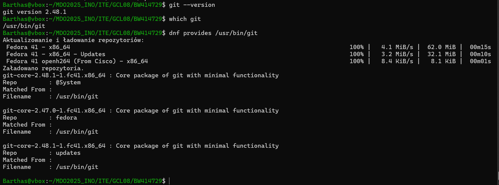
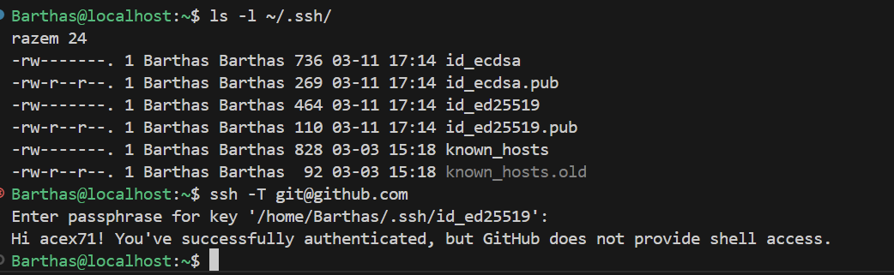
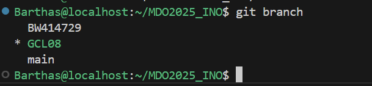
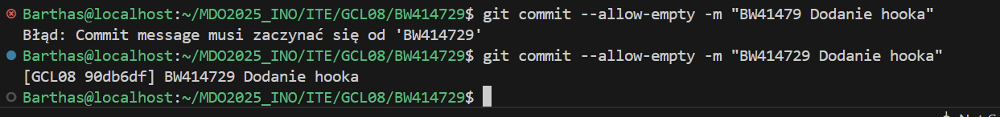

# Sprawozdanie - BW414729
## 1. Instalacja Git, SSH i przygotowanie do pracy
- Zainstalowałem Git

- Wygenerowałem klucze SSH \
Wygenerowałem 2 klcuze z czego 1 zabezpieczyłem hasłem i podpiołem go do githuba.

- na podstawie gałęzi grupowej utworzyłem zwoją o inicjałach BW414729:

## 2. Praca na moimbranchu
- Stworzyłem folder o nazwie moich inicjałów, stworzyłem tam fodler oraz obecne labolatria 

- napisanie GitHooka ktory weryfikuje czy kazdy moj commit message zaczna sie od moich inicjałów

```sh
#!/bin/sh
MSG=$(cat "$1")
if ! echo "$MSG" | grep -qE "^BW414729"; then
  echo "Błąd: Commit message musi zaczynać się od 'BW414729'"
  exit 1
fi
```

- nadanie mu uprawnien do wykonywania za pomocą koemndy:
```
chmod +x .git/hooks/commit-msg
```
- testowanie działania skryptu
