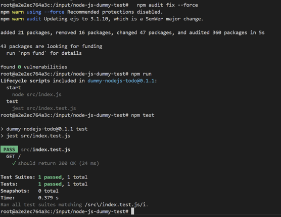

# Sprawozdanie 1 - BW414729

## Labolatoria 1 Wprowadzenie, Git, Gałęzie, SSH
### 1. Instalacja Git, SSH i przygotowanie do pracy
1.  Zainstalowałem Git


2.  Wygenerowałem klucze SSH \
Wygenerowałem 2 klucze z czego 1 zabezpieczyłem hasłem i podpiołem go do githuba.


3.  na podstawie gałęzi grupowej utworzyłem swoją z inicjałuchi nr. albumu BW414729:


4.  Stworzyłem folder o nazwie moich inicjałów i nr. albumu, stworzyłem tam folder Lab1, oraz Sprawozdanie1.

- napisanie GitHooka ktory weryfikuje czy każdy mój commit message zaczna sie od moich inicjałów

```sh
#!/bin/sh
MSG=$(cat "$1")
if ! echo "$MSG" | grep -qE "^BW414729"; then
  echo "Błąd: Commit message musi zaczynać się od 'BW414729'"
  exit 1
fi
```

5.  nadanie mu uprawnien do wykonywania za pomocą komendy:
```
chmod +x .git/hooks/commit-msg

```
6.  testowanie działania skryptu


##############################################################
## Labolatoria 2 Git, Docker
### 2. Zestawienie środowiska
1.   Dockera na serwerze Fedora, oraz pobrałem wymagane obrazy.
   - instalacja dockera 


   - dodanie użytkownika do grupy docekr poleceniem
   ```bash
   sudo usermod -aG docker $USER
   ```

   - instalacja obrazów do dockera


2.  Uruchomiłem kontener z obrazu busybox
  - efekt uruchomienia kontenera
  
  - podłączyłem się do kontenera interaktywnie i wywołałem numer wersji.
  

3.  uruchomiłem system w kontenerze fedora
   - proces PID1 w kontenerze
  
   - procesy dockera na hoście
     

4.  Napisałem prostego Dockerfile bazując na fedorze, na który sklonoiwałem nasze repozytorium i zainstalowałem gita

```dockerfile
FROM fedora:latest

RUN dnf update -y && dnf install -y git

RUN git clone https://github.com/InzynieriaOprogramowaniaAGH/MDO2025_INO.git

WORKDIR MDO2025_INO

CMD ["/bin/bash"]
```
5.  Zbudowałem obraz mdo2025_ino_image


6.  Uruchomiłem go w trybie interaktywnym i zweryfikowałem czy jest tam nasze repozytorium


6.  zaktualizowałem pakiety fedory na kontenerze

Nie wyswietla repozytoriów bo wszystkie są aktualne 

7. Uruchomione kontenery przed wyczyszczeniem i po wyczyszczeniu


## Labolatoria 3 Dockerfiles, kontener jako definicja etapu
- na potrzebu tego labolatorium skorzystałem z irssi i nide-js-dummy-test dostępnch po poniższymi linkami:
  - https://github.com/irssi/irssi
  - https://github.com/devenes/node-js-dummy-test
- Poprałem powyższe repozytoria i następnie wykonałem kroki podane w instrukcji, poniżej szczegółowy ich opis dla poszczególnych repozytoriów:

### IRSSI
1.  Program został poprawnie zbudowany przy użyciu systemu budowania Meson i narzędzia ninja. Zostało to wykoanne za pomocą poleceń podanych przez autora:

```bash
git clone https://github.com/irssi/irssi
cd irssi
dnf install -y git meson ninja-build gcc gcc-c++ glib2-devel openssl-devel ncurses-devel libtool perl && dnf 
meson Build
ninja -C Build && sudo ninja -C Build install
```

2.  Pobrane za pomocą dnf repozytoria są niezbędne do prawidłowego działania Irssi.
Dowód pobrania odpowieniego repozytorium:


3.  Następnie uruchomiłem Irssi by potwirdzić prawidłowe działanie:


4.  Po czy  uruchomiłem dla niego testy za pomocą ```ninja test```:

Jak widać na screenie wszystkie testy zostały wykonane pomyślnie.

5. Następnoie napisałem dwa Dockerfile automatyzujące powyższe kroki:
 
 -  Dockerfile.irssibld do budowania

  ```dockerfile
  FROM fedora:latest

  RUN dnf --assumeyes install git meson gcc glib2-devel ncurses-devel perl-Ext* utf8proc*
  RUN git clone https://github.com/irssi/irssi
  WORKDIR /irssi/
  RUN meson Build
  ```

  - Powyższy Dockerfile został zbudowany za pomocą polecenia
  ```sh
  docker build -f Dockerfile.irssibld -t irssi-buidl .
  ```
  

  - Następnie za pomocą docker images sprawdziłem czy na pewno został stworzony.

  

  - Następnie uruchomiłem kontener irssi-buidl:latest za pomocą
  ```sh
  docker run --rm -it irssi-buidl:latest sh
  ```
  

  - Następnie za pomocją Dockerfile.irssitest:

  ```sh
  FROM irssi-build
  WORKDIR /irssi/Build
  CMD ["ninja", "test"]
  ```

  - Jak można zauważyć, Dockerfile bierze z irssi-build a nie z irssi-buidl, gdyż w trakcie wykonywania wcześniejszych krokó wystąpiła literówka którą póżniej poprawiłem.

  - Zbudowałem obraz irssi-test za pomocą:
  ```sh
  docker build -f Dockerfile.irssitest -t irssi-test .
  ```
  

  - Uruchomiono kontener irssitest za pomocą komendy docker run --rm -it irssi-test:latest Pomimo wystąpienia paru warningów wszystkie testy zakończyły się sukcesem, a szczegółowe wyniki wskazują, że każdy test przeszedł pomyślnie. Kontener działa poprawnie i aplikacja irssi została pomyslnie przetestowana.

  

### NODE-JS-DUMMY-TEST

1.  Na początku sklonowałem repozytorium anastępnie wykonałem poniższe komendy aby przetestwoać działanie repozytorium.

```sh
cd node-js-dummy-test
npm install
npm audit fix
npm audit fix --force
npm start
```


2.  Po powyższych koemndach koemndach aplikacja się uruchomiła, na localhost na porcie 3000
. Poniżej dowód na działanei apliakcji.


3.  Następnie za pomocą polecneia ```npm install ``` uruchomiłem testy, które przeszły pomyślnie. 


4.  Następnoie napisałem dwa Dockerfile automatyzujący powyższe kroki:

- Dockerfile.nodebld
```sh
FROM node:22.14.0

RUN git clone https://github.com/devenes/node-js-dummy-test

WORKDIR /node-js-dummy-test
RUN npm install
```
- Nastepnie za jego pomocą zbudowałem go polecneiem:
```sh
docker build -t nodebld -f Dockerfile.nodebld .
```


- Następnie uruchomiłem kontener poleceniem:

```sh
docker run --rm -it nodebld sh
```
 aby uzyskać interaktywny dostęp do środka kontenera. Po wejściu do kontenera, wylistowano zawartość katalogu, co ujawnia strukturę aplikacji


- Zbudowałem napsiałem kolejny Dockerfile do uruchamiania testów.
Dockerfile.nodetest
```sh
FROM nodebld
WORKDIR /node-js-dummy-test
CMD ["npm", "test"]
```

- Za jego pomocą zbudowałem drugi kontener Docker, przeznaczony do uruchamianai testów za pomocą koemndy:

```sh
docker build -t nodetest -f ./Dockerfile.nodetest .
```


- Następnie uruchomiłem kontener poleceniem:
```sh
docker run --rm -it nodetest sh
```

- Po czym uruchomiłem w nim testy.

...

## Labolatoria 4

### Zachowywanie stanu
1.  Utworzyłem woluminy input-vol i output-vol, po czym zainstalowałem je w kontenerze build_container za pomocą polecenia:

```sh
docker run -it --name build_container -v input-vol:/input -v output-vol:/output node:20-slim bash
```


2.  Aktualizacja pakietów i instalacja build-essential.


3.  Sklonowałem repozytorium node-js-dummy-test, a następnie przeniosłem je do kontenera za pomocą polecenia:
```sh
docker cp node-js-dummy-test/ build_container:/input
```
Dzięki temu  zawartość repozytorium trafiła do katalogu /app/input w kontenerze, który jest zamontowany na woluminie input_volume.


5.  Następnie uruchomiłem kontener i sprawdziłem zawarość katalogu /input, gdzie potwierdziłem poprawne skopiwoanie repozytorium.


6.  Następnie zainstalowałem wymagane pakiety przypomocy polecenia 

```sh
npm install
```


7.  Po instalacji wymaganych pakietów uruchomiłem testy za pomocą 
```sh
npm test
```
8.  Wszsytkie testy zakończyły się pomyślne.


9.  Po uruchomieniu aplikacji i zapisaniu logów w pliku app.log, pliki zostały zapisane na woluminie wyjściowym, co zapewnia ich dostępność po wyłączeniu kontenera. 
- W tym celu wykorzystałem komende:
```sh
node src/index.js > ../../output/app.log
```
która sprawia że logi zapiwyane są w pliku app.log w katalogu output w kontenerze.


10. Następnie skopiowałem wyszstkie pliki z katalogu /input/src/ do /output za pomocą ```cp -r```. Dzięki temu wszystkie pliki, w tym logi aplikacji, zostały zapisane na woluminie wyjściowym i będą dostępne po wyłączeniu kontenera.


11. Następnie zatrzymalem kontener build-container, po czym uruchomiłem nowy, do którego przypisalem wolumin output-vol, a następnie zweryfikowałem,że pliki wcześniej zapisane na woluminie dalej w nim są dostępne. Dzięki temu możliwe było potwierdzenie, że zapisane pliki pozostały dostępne po wyłączeniu kontenera.


12. W tej części, repozytorium node-js-dummy-test zostało sklonowane bezpośrednio wewnątrz kontenera, w katalogu /input/repo/. Klonowanie odbyło się w katalogu /input/repo/, co oznacza, że pliki repozytorium trafiły bezpośrednio na wolumin wejściowy.


13. Powyższe kroki można wykonać za pomocą docker build i pliku Dockerfile, przy użyciu opcji RUN --mount w celu pracy z woluminami podczas procesu budowania obrazu. Dzięki tej opcji możemy przeprowadzić operację klonowania repozytorium bez konieczności uruchamiania kontenera i manualnego używania Gita w środku kontenera.

- Przykład użycia RUN --mount w Dockerfile
```sh
FROM node:16

RUN --mount=type=volume,source=input_volume,target=/app/input \
    git clone https://github.com/devenes/node-js-dummy-test.git /input/repo

WORKDIR /input/repo
RUN npm install

COPY . /output/repo
```
- Użycie RUN --mount w Dockerfile jest doskonałym rozwiązaniem, jeśli chcemy zautomatyzować proces klonowania repozytorium oraz instalacji zależności w trakcie budowania obrazu, bez konieczności ręcznego klonowania repozytorium wewnątrz kontenera.

### Eksponowanie portu
1.  Uruchomiłem kontener z serwerm iperf3 za pomocą polecenia:
```sh
docker run --name iperf-server -d --rm -p 5201:5201 networkstatic/iperf3 -s
```
Obraz networkstatic/iperf3 został pobrany z repozytorium, a kontener został uruchomiony na porcie 5201. Za pomocą polecenia ```docker ps``` mozemy zoabczyc status kontenera.


2.  Aby uzyskać adres IP użylem polecenia 
```sh
docker inspect iperf-server | grep IP
```
Adres IP kontenera to 172.17.0.2


3.  Uruchomiłm drugi kontener, który połączył się z serwerem iperf3, używając adresu IP 172.17.0.2 i portu5201.
Polecenie:
```sh
docker run --rm -it networkstatic/iperf3 -c 172.17.0.2
```
uruchomiło klienta iperf3, który rozpoczął pomiar przepustowości. 
Z wyników można odczytać, że transfer danych wynosił średnio 32-33 Bbit/s


4.  Została utworzona dedykowana sieć mostkowa o nozaiwe bridge-network za pomocą koemndy:
```sh
docker network create --driver bridge bridge-network
```
Dzięki użyciu sterownika bridge, umożliwiono połączenie kontenerów w tej samej sieci.

5.  Został zatrzymany porpzedni kontener iperf-server, który autoamtycznie się usunął bo zotał stworzony z ```--rm```


6.  Następnei utworzyłem nowy kontener serwera iperf, tylko żę podłączony do sieci mostkowej bridge-network. Uruchomiłem ównież klienta ipref3 w tym samym mostku sieciowym, który połączył się z serwerem i przeprowadził test przepustowości. Wyniki pokazały transfer danych na poziomie około 27 Gbit/s.


7.  Został uruchomiony kontener klienta iperf3, który połączył się z serwerem iperf3 działającym w kontenerze, używając adresu IP 172.19.0.2 (w tej samej sieci mostkowej bridge-network). Jednak w tym przypadku połączenie zostało nawiązane z hosta, a nie z innego kontenera. Test przepustowości wykazał transfer danych na poziomie 28.4 Gbit/s.

Adres IP kontenera iperf-server został uzyskany za pomocą polecenia ```docker inspect```, a adres IP przypsiany do kontenera to 172.19.0.2 co potwierdza, że serwer iperf3 działa w tej samej sieci mostkowej co klient.


8. Wyświetliłem logi kontenera iperf-server, które pokazują dwa testy przepustowości:
* Pierwszy test – połączenie z kontenera o adresie IP 172.19.0.3, transfer danych na poziomie 2.1 Gbit/s.
* Drugi test – połączenie z hosta (adres IP 172.19.0.1), z zakończeniem transferu na poziomie 28.4 Gbit/s.
* Logi te potwierdzają prawidłowe zdiałanie serwera i klienta iperf3, oraz umożliwiają analizę przepustowości między kontenerami i hostem.


### Instancja Jenkins

1.  W pierwszym kroku wykonano polecenie do utworzenia dedykowanej sieci Docker o nazwie jenkins. Następnie wykonano polecenie pobrania obrazu docker:dind.


2.  Uruchomiono kontener Docker z obrazem docker:dind:


3.  Zbudowano obraz na podstawie pliku Dockerfile.jenkins:

```sh
FROM jenkins/jenkins:2.492.3-jdk17
USER root
RUN apt-get update && apt-get install -y lsb-release ca-certificates curl && \
    install -m 0755 -d /etc/apt/keyrings && \
    curl -fsSL https://download.docker.com/linux/debian/gpg -o /etc/apt/keyrings/docker.asc && \
    chmod a+r /etc/apt/keyrings/docker.asc && \
    echo "deb [arch=$(dpkg --print-architecture) signed-by=/etc/apt/keyrings/docker.asc] \
    https://download.docker.com/linux/debian $(. /etc/os-release && echo \"$VERSION_CODENAME\") stable" \
    | tee /etc/apt/sources.list.d/docker.list > /dev/null && \
    apt-get update && apt-get install -y docker-ce-cli && \
    apt-get clean && rm -rf /var/lib/apt/lists/*
USER jenkins
RUN jenkins-plugin-cli --plugins "blueocean docker-workflow"
```
- poleceniem:
```sh
 docker build -t myjenkins-blueocean:2.492.3-1 -f Dockerfile.jenkins .
 ```


4.  Uruchomiono kontener myjenkins-blueocean:2.492.3-1


5.  Wyświetlenie konetenerów


6.  Docker nie miał uprawnień do zapisów w katalogu /var/jenkins_home więc sprawdziłem volume, i zobaczyłem, że dane są w:```/var/lib/docker/volumes/jenkins-data/_data```.
 Następnie zmeiniłem właściciela tego katalogu na Jenkinsa poleceniem:
 ```sh
 sudo chown -R 1000:1000 /var/lib/docker/volumes/jenkins-data/_data
```
Dzięki czemu Jenkins zyskał dostęp do swojego home direcotry.


7.  Po tej poprawce Jenkins się uruchomił i po skopiowaniu hasła jenkins uruchomił się w przeglądarce gdzie zainstalowałem sugerowane wtyczki, oraz utworzyłem użytkowanika.


