# Sprawozdanie 1 - BW414729

## Labolatoria 1 Wprowadzenie, Git, Gałęzie, SSH
### 1. Instalacja Git, SSH i przygotowanie do pracy
- Zainstalowałem Git


- Wygenerowałem klucze SSH \
Wygenerowałem 2 klucze z czego 1 zabezpieczyłem hasłem i podpiołem go do githuba.


- na podstawie gałęzi grupowej utworzyłem swoją z inicjałuchi nr. albumu BW414729:


- Stworzyłem folder o nazwie moich inicjałów i nr. albumu, stworzyłem tam folder Lab1, oraz Sprawozdanie1.

- napisanie GitHooka ktory weryfikuje czy każdy mój commit message zaczna sie od moich inicjałów

```sh
#!/bin/sh
MSG=$(cat "$1")
if ! echo "$MSG" | grep -qE "^BW414729"; then
  echo "Błąd: Commit message musi zaczynać się od 'BW414729'"
  exit 1
fi
```

- nadanie mu uprawnien do wykonywania za pomocą koemndy:
```
chmod +x .git/hooks/commit-msg

```
- testowanie działania skryptu


##############################################################
## Labolatoria 2 Git, Docker
### 2. Zestawienie środowiska
- zainstalowałem Dockera na serwerze Fedora, oraz pobrałem wymagane obrazy.
   - instalacja dockera 
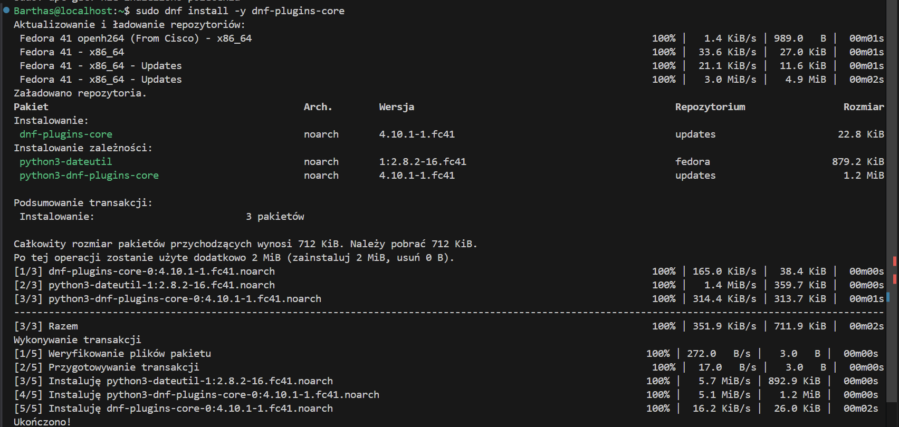
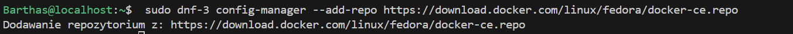
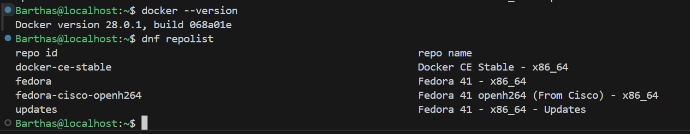
   - dodanie użytkownika do grupy docekr poleceniem
   ```bash
   sudo usermod -aG docker $USER
   ```

   - instalacja obrazów do dockera
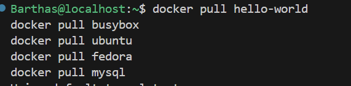
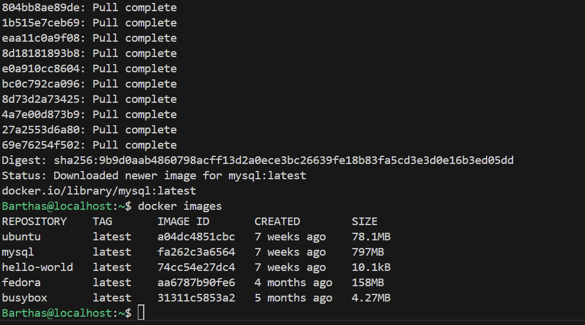

- Uruchomiłem kontener z obrazu busybox
  - efekt uruchomienia kontenera
  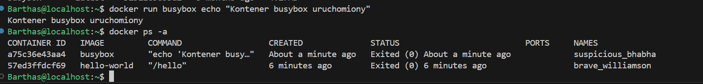
  - podłączyłem siędo kontenera interaktywnie i wywołałem numer wersji.
  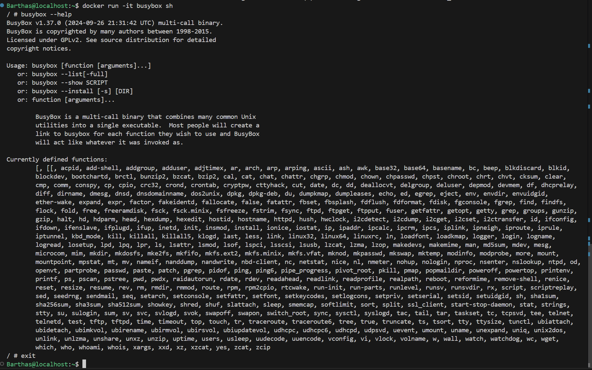

- uruchomiłem system w kontenerze fedora
   - proces PID1 w kontenerze
  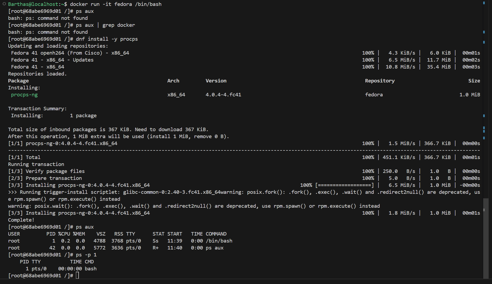
   - procesy dockera na hoście
     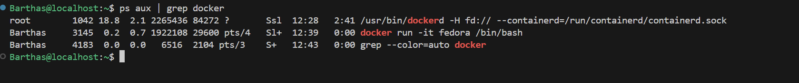

- Napisałem prostego Dockerfile bazując na fedorze, na który sklonoiwałem nasze repozytorium i zainstalwoałem gita

```dockerfile
FROM fedora:latest

RUN dnf update -y && dnf install -y git

RUN git clone https://github.com/InzynieriaOprogramowaniaAGH/MDO2025_INO.git

WORKDIR MDO2025_INO

CMD ["/bin/bash"]
```
- Zbudowałem obraz mdo2025_ino_image
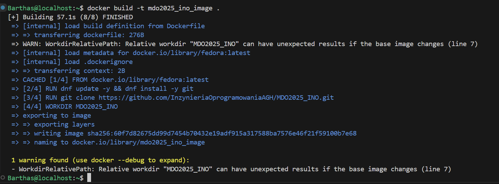

- Uruchomiłem go w trybie interaktywnym i zweryfikowałem czy jest tam nasze repozytorium
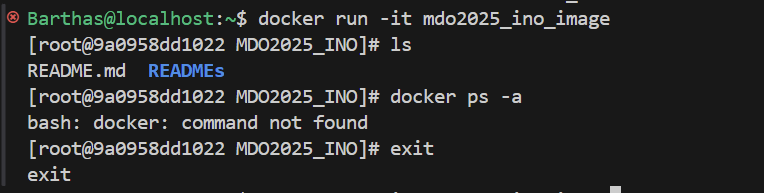

- zaktualizowałem pakiety fedory na kontenerze
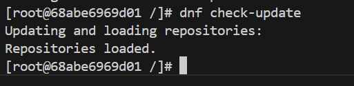
Nie wyswietla repozytoriów bo wszystkie są aktualne 

- Uruchomione kontenery przed wyczyszczeniem i po wyczyszczeniu
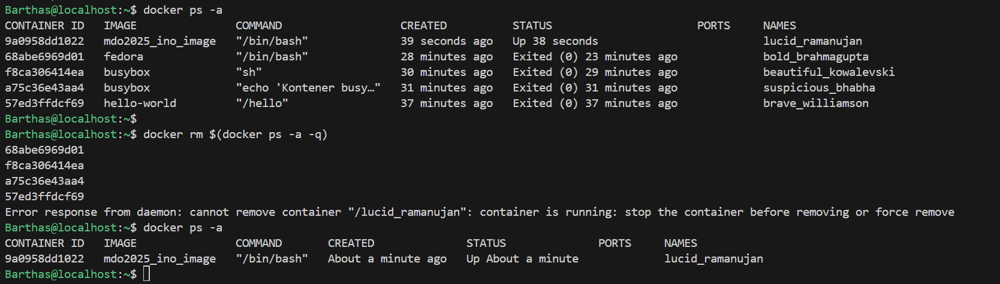

## Labolatoria 3 Dockerfiles, kontener jako definicja etapu
- na potrzebu tego labolatorium skorzystałem z irssi i nide-js-dummy-test dostępnch po poniższymi linkami:
  - https://github.com/irssi/irssi
  - https://github.com/devenes/node-js-dummy-test
- Poprałem powyższe repozytoria i następnie wykonałem kroki podane w instrukcji, poniżej szczegółowy ich opis dla poszczególnych repozytoriów:

### IRSSI
Program został poprawnie zbudowany przy użyciu systemu budowania Meson i narzędzia ninja. Zostało to wykoanne za pomocą poleceń podanych przez autora:

```bash
git clone https://github.com/irssi/irssi
cd irssi
dnf install -y git meson ninja-build gcc gcc-c++ glib2-devel openssl-devel ncurses-devel libtool perl && dnf 
meson Build
ninja -C Build && sudo ninja -C Build install
```
Pobrane za pomocą dnf repozytoria są niezbędne do prawidłowego działania Irssi.
Dowód pobrania odpowieniego repozytorium:
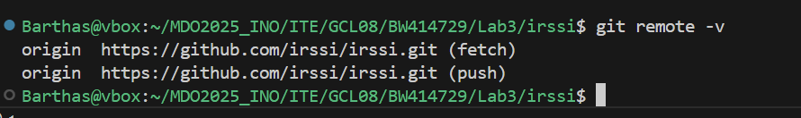
Następnie uruchomiłem Irssi by potwirdzić prawidłowe działanie:
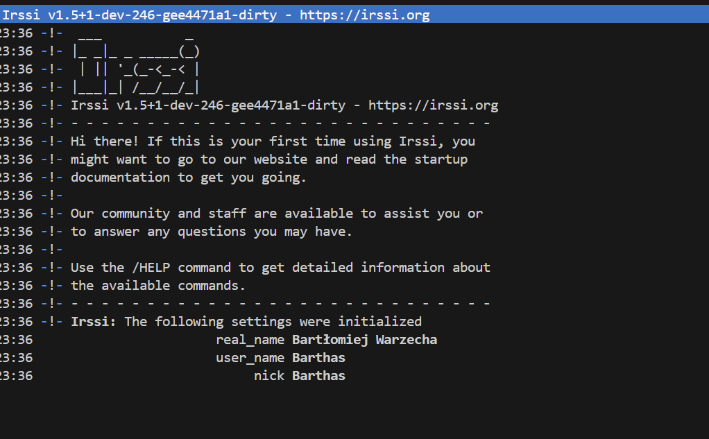
Po czy jeszcze uruchomiłem dla niego testy za pomocą ```ninja test```:
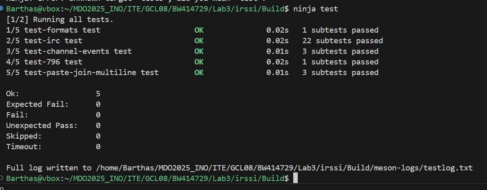
Jak widać na screenie wszystkie zostały zaliczone.

Następnoie napisałe

### NODE-JS-DUMMY-TEST


## Labolatoria 4

### Zachowywanie stanu
### Eksponowanie portu
### Instancja Jenkins