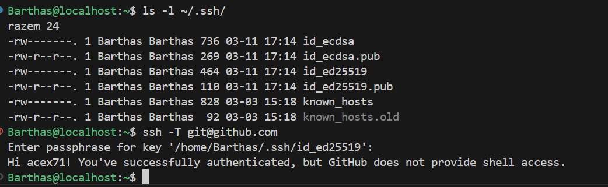
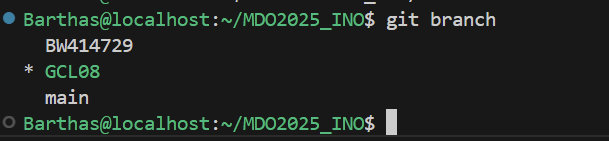

# Sprawozdanie 1 - BW414729
## 1. Instalacja Git, SSH i przygotowanie do pracy
- Zainstalowałem Git


- Wygenerowałem klucze SSH \
Wygenerowałem 2 klucze z czego 1 zabezpieczyłem hasłem i podpiołem go do githuba.


- na podstawie gałęzi grupowej utworzyłem swoją z inicjałuchi nr. albumu BW414729:


- Stworzyłem folder o nazwie moich inicjałów i nr. albumu, stworzyłem tam folder Lab1, oraz Sprawozdanie1.

- napisanie GitHooka ktory weryfikuje czy każdy mój commit message zaczna sie od moich inicjałów

```sh
#!/bin/sh
MSG=$(cat "$1")
if ! echo "$MSG" | grep -qE "^BW414729"; then
  echo "Błąd: Commit message musi zaczynać się od 'BW414729'"
  exit 1
fi
```

- nadanie mu uprawnien do wykonywania za pomocą koemndy:
```
chmod +x .git/hooks/commit-msg

```
- testowanie działania skryptu


##############################################################

## 2. Git, Docker
- zainstalowałem Dockera na serwerze Fedora, oraz pobrałem wymagane obrazy.
   - instalacja dockera 


   - dodanie użytkownika do grupy docekr poleceniem
   ```bash
   sudo usermod -aG docker $USER
   ```

   - instalacja obrazów do dockera


- Uruchomiłem kontener z obrazu busybox
  - efekt uruchomienia kontenera
  
  - podłączyłem siędo kontenera interaktywnie i wywołałem numer wersji.
  

- uruchomiłem system w kontenerze fedora
   - proces PID1 w kontenerze
  
   - procesy dockera na hoście
     

- Napisałem prostego Dockerfile bazując na fedorze, na który sklonoiwałem nasze repozytorium i zainstalwoałem gita

```dockerfile
FROM fedora:latest

RUN dnf update -y && dnf install -y git

RUN git clone https://github.com/InzynieriaOprogramowaniaAGH/MDO2025_INO.git

WORKDIR MDO2025_INO

CMD ["/bin/bash"]
```
- Zbudowałem obraz mdo2025_ino_image


- Uruchomiłem go w trybie interaktywnym i zweryfikowałem czy jest tam nasze repozytorium


- zaktualizowałem pakiety fedory na kontenerze

Nie wyswietla repozytoriów bo wszystkie są aktualne 

- Uruchomione kontenery przed wyczyszczeniem i po wyczyszczeniu


