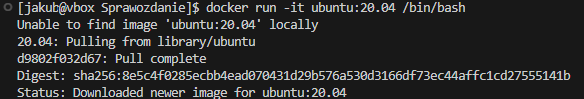
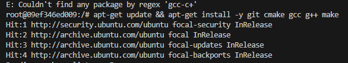

Jakub Tyliński, Grupa 8, 416081

---ZAJĘCIA_01---

Temat: Wprowadzenie, Git, Gałęzie, SSH

Poszczególne wykonane kroki:
1. Zainstalowałem klienta Git i obsługę kluczy SSH
   Zainstalowałem najnowszą wersję Git oraz skonfigurowałem obsługę kluczy SSH w moim systemie. Dzięki temu mogłem w pełni korzystać z funkcjonalności systemu kontroli wersji i bezpiecznie łączyć się z repozytoriami.

     

2. Sklonowałem repozytorium przedmiotowe za pomocą HTTPS i personal access token
   Użyłem polecenia git clone https://... i w trakcie autoryzacji podałem swój personal access token. Pozwoliło mi to pobrać repozytorium i jednocześnie zweryfikować moje uprawnienia.

   

3. Upewniłem się w kwestii dostępu do repozytorium jako uczestnik i sklonowałem je za pomocą klucza SSH
   Zapoznałem się z dokumentacją GitHub dotyczącą kluczy SSH i wygenerowałem dwa klucze (jeden z nich zabezpieczyłem hasłem):
   ssh-keygen -t ed25519 -C "mój_email"
   ssh-keygen -t ecdsa -b 521 -C "mój_email"

   

   Następnie dodałem je do swojego konta na GitHubie i sklonowałem to samo repozytorium, korzystając już z protokołu SSH. W ten sposób zweryfikowałem, że mam pełny dostęp jako uczestnik.

   

   

   Dodatkowo skonfigurowałem uwierzytelnianie dwuskładnikowe (2FA), by jeszcze bardziej zabezpieczyć konto (wybrałem opcję z podpieciem numeru telefonu)
4. Przełączyłem się na gałąź main, a potem na gałąź mojej grupy

   

5. Utworzyłem gałąź o nazwie „inicjały & nr indeksu” od gałęziając się od brancha grupy (JT416081)

   

6. Rozpocząłem pracę na nowej gałęzi i dodałem Git hooka
   W katalogu właściwym dla grupy utworzyłem nowy folder, również nazwany „JT416081"

   

   Przygotowałem Git hooka  sprawdzającego, czy każdy mój komunikat commita zaczyna się od „inicjały & nr indeksu”. Skrypt dodałem do stworzonego katalogu i skopiowałem go we właściwe miejsce, aby uruchamiał się przy każdym git commit.

   

   Poniżej zamieszczam treść Git hooka:

```
#!/bin/bash

COMMIT_MSG_FILE=$1
COMMIT_MSG=$(head -n1 "$COMMIT_MSG_FILE")

PREFIX="JT416081"   

if [[ $COMMIT_MSG != $PREFIX* ]]; 
then
  echo "BŁĄD: Wiadomość commita musi zaczynać się od: $PREFIX"
  exit 1
fi

exit 0
```
   W dalszej części "wypchnołem" wszystkie swoje pliki na GitHuba na swojego osobistego brancha

   

   Ostatnim zadaniem była próba wciągnięcia mojej gałęzi do gałęzi grupowej. Próba nie udana

   


---ZAJĘCIA_02---

Temat: Git, Docker

1. Zainstalowanie Dockera

   

2. Zarejestrowanie się w Docker Hub

   

3. Pobranie obrazów `hello-world`, `busybox`, `ubuntu`, `fedora`, `mysql` z wykorzystaniem "docker pull"

   

4. Uruchomienie konteneru z obrazu `busybox`
   - Efekt uruchomienia kontenera:

   

   - Podłączenie się do kontenera interaktywnie i wywołanie numeru wersji

   

5. Uruchomienie konteneru z obrazu `ubuntu`

   - `PID1` w kontenerze i procesy dockera na hoście:

   

   

   - Zaktualizowanie pakietów:

   

   - Wyjście:

   

6. Stworzono własnoręcznie plik `Dockerfile` 

```
FROM ubuntu:20.04

ENV DEBIAN_FRONTEND=noninteractive

RUN apt update && apt install -y git

RUN git clone --depth 1 https://github.com/InzynieriaOprogramowaniaAGH/MDO2025_INO.git /app

WORKDIR /app

CMD ["/bin/bash"]
```

   - Sprawdzenie czy zawiera gita oraz nasze repozytorium:

   

7. Pokazanie uruchomionych kontenerów

   

8. Wyczyszczenie obrazów (tylko tych nie używanych)

   

---ZAJĘCIA_03---

Na potrzeby tego zadania znalazłem projekt json-c – jest to biblioteka C do obsługi JSON-a, rozwijana jako projekt open-source na GitHubie.
Repozytorium posiada otwartą licencję (MIT), a także zawiera kompletny system budowania oparty o CMake i Makefile. Dodatkowo dostępne są testy jednostkowe, które można odpalić jako cel make test.
Sklonowanie repozytorium:

   

Kompilacja przebiegła bez błędów po zainstalowaniu wymaganych pakietów:

   

   

Testy wykonały się poprawnie, a wynik końcowy był jasno sformułowany:

   

Proces w kontenerze, interaktywnie

Na potrzeby konteneryzacji użyłem obrazu bazowego ubuntu:20.04. Uruchomiłem kontener w trybie interaktywnym z TTY:

   

Po wejściu do kontenera doinstalowałem potrzebne pakiety:

   

Klonowanie repo i budowanie:

   

   

Testowanie:

   

Dockerfile do budowania i testowania
Stworzyłem pierwszy Dockerfile, który wykonuje wszystkie kroki aż do zbudowania projektu:

```
FROM ubuntu:20.04

ENV DEBIAN_FRONTEND=noninteractive

RUN apt-get update && apt-get install -y  git cmake gcc g++ make

WORKDIR /json-c

RUN git clone https://github.com/json-c/json-c.git src

WORKDIR /json-c/src

RUN mkdir build
WORKDIR /json-c/src/build

RUN cmake ..
RUN make
```

   


Drugi Dockerfile bazuje na poprzednim obrazie (np. json-c-builder) i wykonuje tylko testy:

```
FROM json-c-builder:latest

WORKDIR /json-c/src/build

CMD ["make", "test"]
```

   