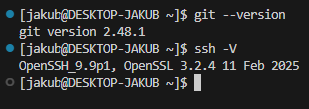
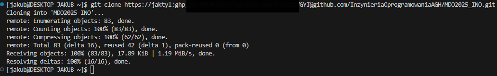
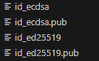
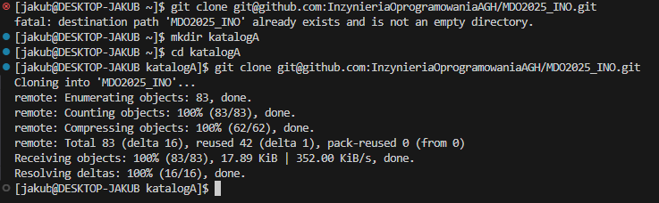
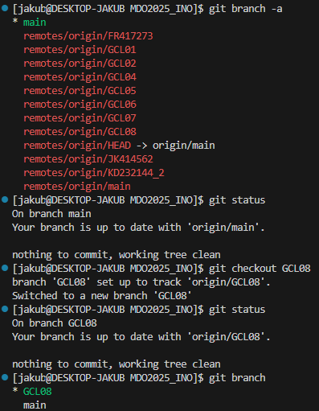
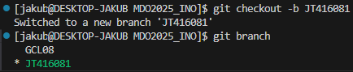
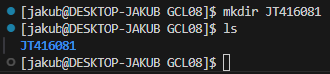
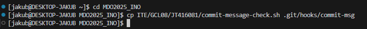
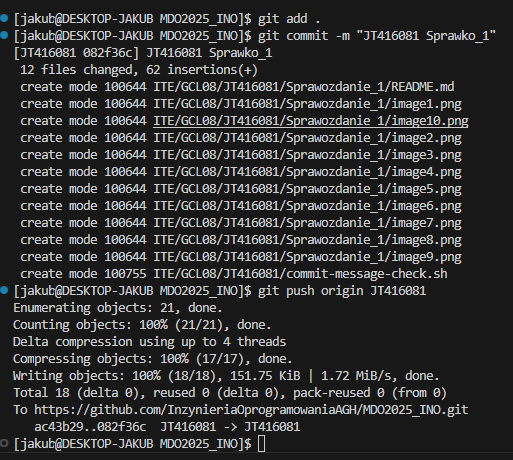
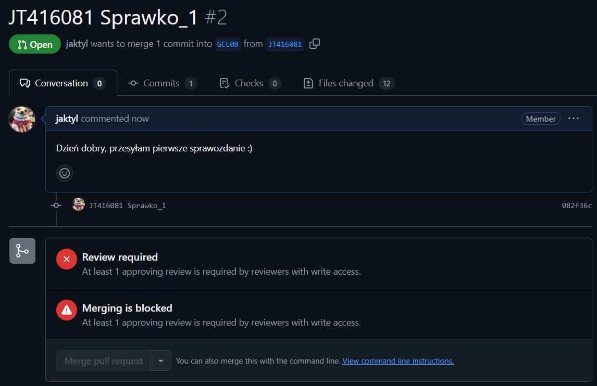

Jakub Tyliński, Grupa 8, 416081

Temat: Wprowadzenie, Git, Gałęzie, SSH

Poszczególne wykonane kroki:
1. Zainstalowałem klienta Git i obsługę kluczy SSH
   Zainstalowałem najnowszą wersję Git oraz skonfigurowałem obsługę kluczy SSH w moim systemie. Dzięki temu mogłem w pełni korzystać z funkcjonalności systemu kontroli wersji i bezpiecznie łączyć się z repozytoriami.
     
2. Sklonowałem repozytorium przedmiotowe za pomocą HTTPS i personal access token
   Użyłem polecenia git clone https://... i w trakcie autoryzacji podałem swój personal access token. Pozwoliło mi to pobrać repozytorium i jednocześnie zweryfikować moje uprawnienia.
   
3. Upewniłem się w kwestii dostępu do repozytorium jako uczestnik i sklonowałem je za pomocą klucza SSH
   Zapoznałem się z dokumentacją GitHub dotyczącą kluczy SSH i wygenerowałem dwa klucze (jeden z nich zabezpieczyłem hasłem):
   ssh-keygen -t ed25519 -C "mój_email"
   ssh-keygen -t ecdsa -b 521 -C "mój_email"
   
   Następnie dodałem je do swojego konta na GitHubie i sklonowałem to samo repozytorium, korzystając już z protokołu SSH. W ten sposób zweryfikowałem, że mam pełny dostęp jako uczestnik.
   
   
   Dodatkowo skonfigurowałem uwierzytelnianie dwuskładnikowe (2FA), by jeszcze bardziej zabezpieczyć konto (wybrałem opcję z podpieciem numeru telefonu)
4. Przełączyłem się na gałąź main, a potem na gałąź mojej grupy
   
5. Utworzyłem gałąź o nazwie „inicjały & nr indeksu” od gałęziając się od brancha grupy (JT416081)
   
6. Rozpocząłem pracę na nowej gałęzi i dodałem Git hooka
   W katalogu właściwym dla grupy utworzyłem nowy folder, również nazwany „JT416081"
   
   Przygotowałem Git hooka  sprawdzającego, czy każdy mój komunikat commita zaczyna się od „inicjały & nr indeksu”. Skrypt dodałem do stworzonego katalogu i skopiowałem go we właściwe miejsce, aby uruchamiał się przy każdym git commit.
   
   Poniżej zamieszczam treść Git hooka:

#!/bin/bash

COMMIT_MSG_FILE=$1
COMMIT_MSG=$(head -n1 "$COMMIT_MSG_FILE")

PREFIX="JT416081"   

if [[ $COMMIT_MSG != $PREFIX* ]]; 
then
  echo "BŁĄD: Wiadomość commita musi zaczynać się od: $PREFIX"
  exit 1
fi

exit 0

   Następnie Wysłałem zmiany (git push) do zdalnego repozytorium i spróbowałem wciągnąć (merge) moją gałąź do gałęzi grupowej.
   
   Na sam koniec stworzyłem Pull Requesta 
   
   