Jakub Tyliński, Grupa 8, 416081

**Uruchomienie Jenkins**

Wszystkie kroki uruchamiania środowiska Jenkins zostały wykonane z wykorzystaniem podesłanej dokumentacji!

Krok_1: Utworzenie sieci mostkowej:

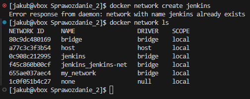

Krok_2: Uruchomienie pomocnika DIND:

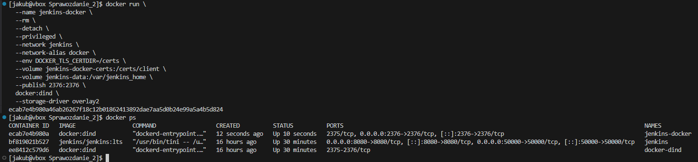

Krok_3: Stworzenie pliku Dockerfile oraz wykonanie docker build:

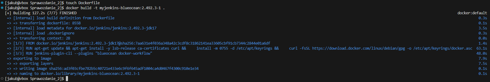

Krok_4: Uruchomienie kontenera:

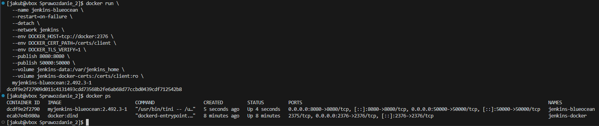

Krok_5: Ekran startowy:


**Zadania wstępne**

Utworzenie projektu, który wyświetla `uname`:

 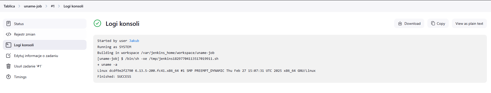

Utworzenie projektu, który zwraca błąd, gdy w przypadku nieparzystej godziny:

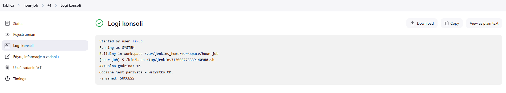

Projekt pobierający obraz kontenera `ubuntu` (przy pomocy `docker pull`):

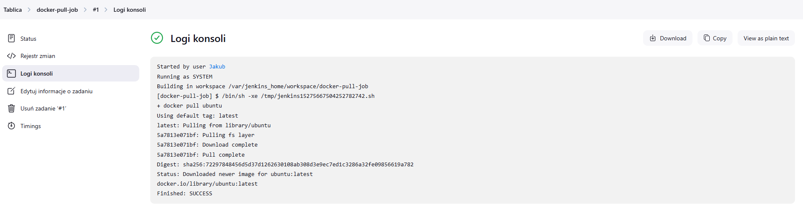

Wszystkie trzy joby prawidłowo wykonane joby:

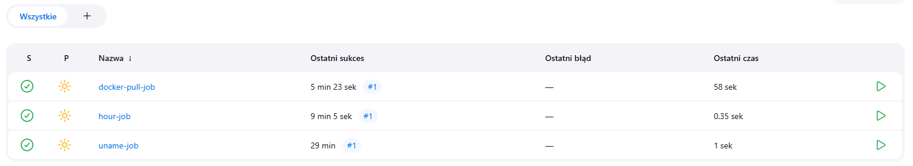

**Obiekt typu pipeline**

Przedstawiony skrypt w pierwszym kroku klonował nasze wskazane repozytorium przedmiotowe. Następnie, za pomocą polecenia dir(), zmienił katalog roboczy. W wybranym folderze następiło przełączenie na moją gałąź - JT416081. Kolejnym etapem była zmiana katalogu na lokalizację zawierającą plik Dockerfile.build. Cały proces pipeline'u zakończył się sukcesem. Problem pojawił się jednak podczas drugiego uruchamiania ze względu na fakt, że w kontenerze istniało już sklonowane repozytorium. W celu pozbycia się tego problemu zostało dodane usuwanie katalogu z repozyorium oraz czyszczenie kontenerów

```
pipeline {
    agent any
    stages {
        stage('Zadanie') {
            steps {
                echo 'Klonowanie repozytorium przedmiotowego'
                sh '''
                rm -rf MDO2025_INO
                git clone https://github.com/InzynieriaOprogramowaniaAGH/MDO2025_INO.git
                '''
                dir('MDO2025_INO') {
                    sh '''
                    git checkout JT416081
                    '''
                }
                dir('MDO2025_INO/ITE/GCL08/JT416081/Sprawozdanie/LAB_3') {
                    sh '''
                    docker container prune -f
                    docker builder prune -f
                    docker image prune -f
                    docker build -f ./Dockerfile.build -t json-c .
                    docker run -d --rm json-c
                    '''
                }
            }
        }
    }
}
```

Pipeline zakończony sukcesem:

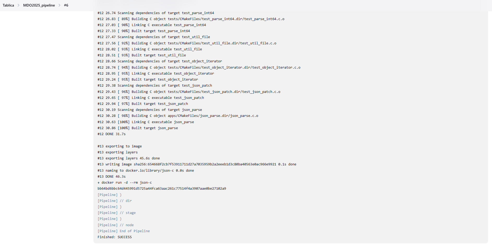

**Pipeline-projekt**

Zdecydowałem się na wykonanie pełnego projektu CI z wykorzystaniem biblioteki cJSON. cJSON to lekka biblioteka napisana w języku C, której głównym zadaniem jest generowanie, modyfikowanie i drukowanie danych w formacie JSON.

Dockerfile.build

```
FROM gcc:14

RUN git clone https://github.com/DaveGamble/cJSON.git
WORKDIR /cJSON
RUN mkdir build && cd build && cmake .. && make
```


Dockerfile.test:

```
FROM cjson-build
WORKDIR /cJSON/build
CMD ["ctest", "--verbose"]
```

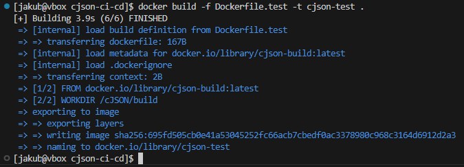

Tworzenie tymczasowego kontenera i kopiowanie plików cJON.c oraz cJON.h:

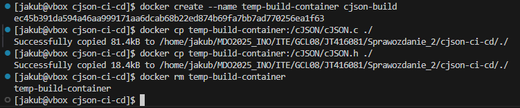

Proces ten był niezbędny w celu przerzuczenia tych plików z kontenera na moją VM. Dalej  te dwa pliki będą potrzebne w procesie deployu

Dockerfile.deploy:

```
FROM alpine:latest
WORKDIR /app
COPY cJSON.h .
COPY cJSON.c .
```

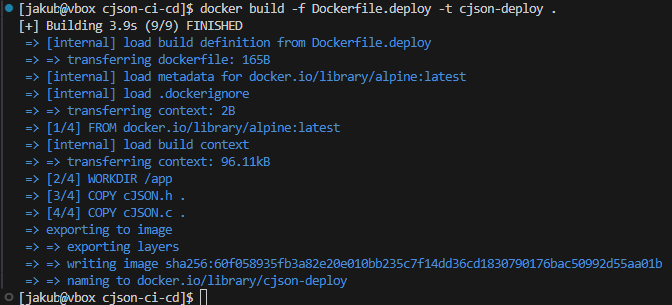

Wszystkie stworzone obrazy razem:


Stworzenie sieci i uruchomienie deploy:

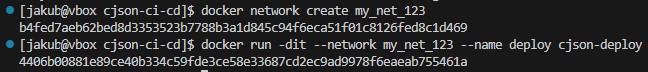

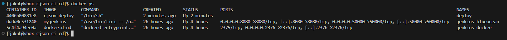

Smoke Test z małym programem main.c:

Program tworzy obiekt JSON, dodaje do niego parę klucz-wartość "hello": "world", a następnie wypisuje wynik na standardowe wyjście. Test ma na celu sprawdzenie, czy biblioteka została poprawnie zbudowana i działa zgodnie z oczekiwaniami.

Do stworzenia tego programu został wykorzystany chat gpt!

```
#include "cJSON.h"
#include <stdio.h>
#include <stdlib.h>

int main() {
    cJSON *root = cJSON_CreateObject();
    cJSON_AddStringToObject(root, "hello", "world");

    char *printed = cJSON_Print(root);
    printf("%s\n", printed);

    cJSON_Delete(root);
    free(printed);
    return 0;
}
```


Push do DockerHub:

Przed zrobieniem pusha było wymagane zalogowanie się

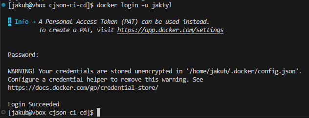

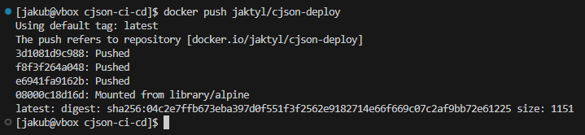

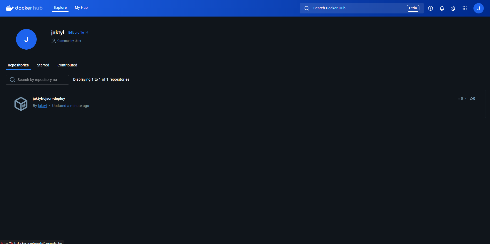

Publish – artefakt ZIP:

W tym kroku przygotowałem artefakt — specjalny plik .zip, który zawiera najważniejsze pliki projektu - cJSON.c oraz cJSON.h

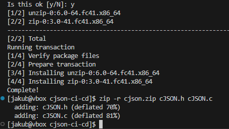

**Jenkinsfile**

Utworzenie globalengo credientials dla DockerHub:

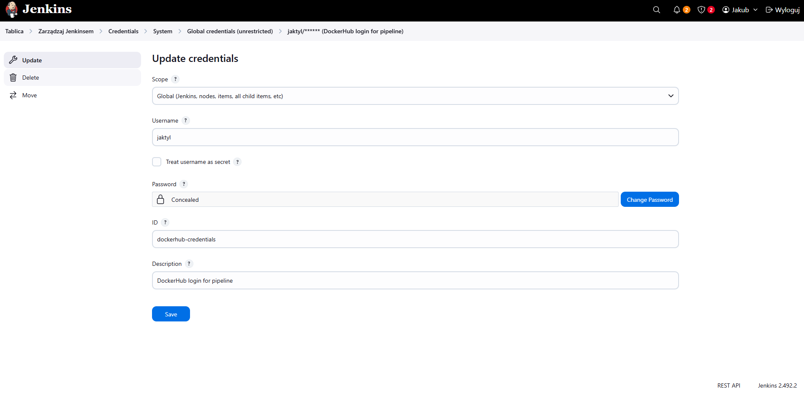

Pipeline SCM:

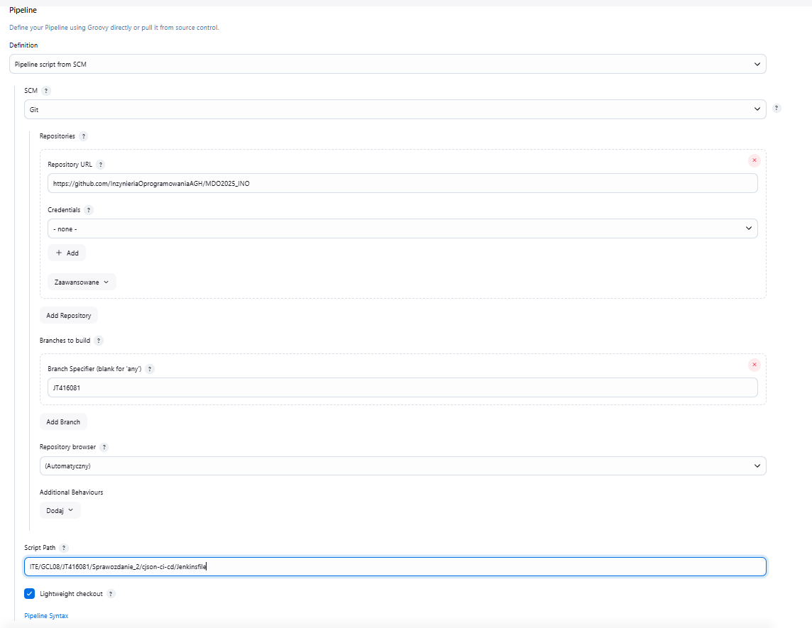

Opis zawartości Jenkinsfile:

  Clone
  Pobierana jest zawartość repozytorium GitHub z odpowiedniej gałęzi (JT416081)

  Clean
  Środowisko Dockera jest czyszczone: usuwane są stare kontenery, wolumeny, sieci oraz nieużywane obrazy, aby zapewnić świeże środowisko budowy

  Build
  Tworzony jest obraz Dockera (cjson-build) kompilujący projekt cJSON przy użyciu pliku Dockerfile.build

  Test
  udowany jest obraz testowy (cjson-test), uruchamiane są testy jednostkowe, a wyniki są zapisywane i archiwizowane jako artefakt 

  Deploy
  Z obrazu build kopiowane są pliki cJSON.c i cJSON.h, następnie tworzony jest obraz wdrożeniowy 

  SmokeTest
  Przeprowadzany jest szybki test działania aplikacji (kompilacja main.c + cJSON.c i sprawdzenie poprawności działania programu).

  Publish
  Tworzony jest plik ZIP  zawierający pliki źródłowe. Obraz Dockera jest publikowany do DockerHuba, a plik ZIP archiwizowany w Jenkinsie jako artefakt.

```
pipeline {
    agent any

    environment {
        IMAGE_BUILD = 'cjson-build'
        IMAGE_TEST = 'cjson-test'
        IMAGE_DEPLOY = 'cjson-deploy'
        DOCKERHUB_REPO = 'jaktyl/cjson-deploy' 
        ZIP_BASE = 'cjson'
        VERSION = "v${BUILD_NUMBER}"
        IMAGE_TAG = "jaktyl/cjson-deploy:v${BUILD_NUMBER}" 
    }

    stages {
        stage('Clone') {
            steps {
                git branch: 'JT416081', url: 'https://github.com/InzynieriaOprogramowaniaAGH/MDO2025_INO'
            }
        }

        stage('Clean') {
            steps {
                dir('ITE/GCL08/JT416081/Sprawozdanie_2/cjson-ci-cd') {
                    sh '''
                        docker container ls -a -q | xargs -r docker rm -f
                        docker volume ls -q | xargs -r docker volume rm -f
                        docker network ls -q --filter type=custom | xargs -r docker network rm -f
                        docker builder prune --all --force
                        docker images -q | sort -u | grep -vE '^(gcc:14|alpine:latest)$' | xargs -r docker rmi -f
                    '''
                }
            }
        }

        stage('Build') {
            steps {
                dir('ITE/GCL08/JT416081/Sprawozdanie_2/cjson-ci-cd') {
                    sh 'docker build -f Dockerfile.build -t $IMAGE_BUILD .'
                }
            }
        }

        stage('Test') {
            steps {
                dir('ITE/GCL08/JT416081/Sprawozdanie_2/cjson-ci-cd') {
                    sh 'docker build -f Dockerfile.test -t $IMAGE_TEST .'
                    sh 'docker run --rm $IMAGE_TEST > test-${VERSION}.log'
                    archiveArtifacts artifacts: "test-${VERSION}.log", onlyIfSuccessful: true
                }
            }
        }

        stage('Deploy') {
            steps {
                dir('ITE/GCL08/JT416081/Sprawozdanie_2/cjson-ci-cd') {
                    sh '''
                        docker create --name temp-build-container $IMAGE_BUILD
                        docker cp temp-build-container:/cJSON/cJSON.c ./cJSON.c
                        docker cp temp-build-container:/cJSON/cJSON.h ./cJSON.h
                        docker rm temp-build-container
                        docker build -f Dockerfile.deploy -t $IMAGE_DEPLOY:$VERSION .
                    '''
                }
            }
        }

        stage('SmokeTest') {
            steps {
                dir('ITE/GCL08/JT416081/Sprawozdanie_2/cjson-ci-cd') {
                    sh '''
                        docker network create ci || true
                        docker run -dit --network ci --name deploy $IMAGE_DEPLOY:$VERSION
                        sleep 3
                        docker run --rm --network ci -v $PWD:/app -w /app gcc:14 bash -c "gcc -o app main.c cJSON.c && ./app"
                        docker stop deploy
                        docker rm deploy
                        docker network rm ci
                    '''
                }
            }
        }

        stage('Publish') {
            steps {
                dir('ITE/GCL08/JT416081/Sprawozdanie_2/cjson-ci-cd') {
                    withCredentials([usernamePassword(credentialsId: 'dockerhub-credentials', usernameVariable: 'DOCKER_USER', passwordVariable: 'DOCKER_PASS')]) {
                        sh '''
                            docker run --rm -v $(pwd):/app -w /app alpine sh -c "apk add --no-cache zip && zip -r ${ZIP_BASE}-${VERSION}.zip cJSON.c cJSON.h"
                            echo "$DOCKER_PASS" | docker login -u "$DOCKER_USER" --password-stdin
                            docker tag $IMAGE_DEPLOY:$VERSION $IMAGE_TAG
                            docker push $IMAGE_TAG
                        '''
                        archiveArtifacts artifacts: "${ZIP_BASE}-${VERSION}.zip", onlyIfSuccessful: true
                    }
                }
            }
        }
    }
}
```

Wynik działania zakończony sukcesem: 

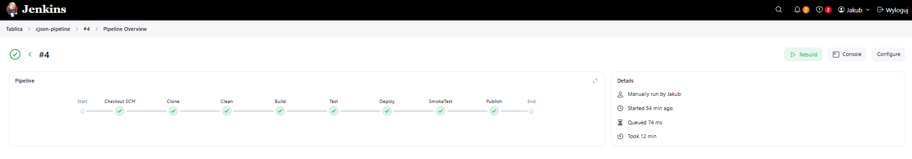