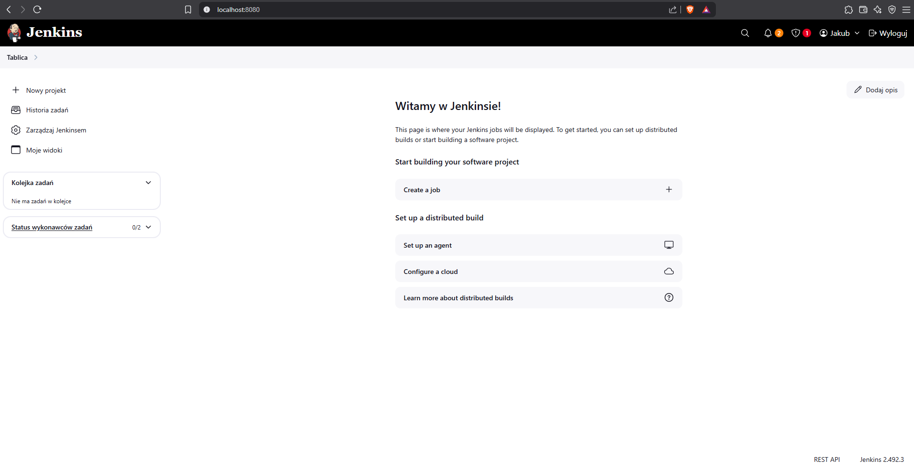
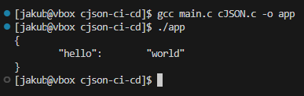

Jakub Tyliński, Grupa 8, 416081

**Uruchomienie Jenkins**

Wszystkie kroki uruchamiania środowiska Jenkins zostały wykonane z wykorzystaniem podesłanej dokumentacji!

Krok_1: Utworzenie sieci mostkowej:


Krok_2: Uruchomienie pomocnika DIND:


Krok_3: Stworzenie pliku Dockerfile oraz wykonanie docker build:


Krok_4: Uruchomienie kontenera:


Krok_5: Ekran startowy:



**Zadania wstępne**

Utwórzenie projektu, który wyświetla `uname`:

 

Utwórzenie projektu, który zwraca błąd, gdy w przypadku nieparzystej godziny:


Projekt pobierający obraz kontenera `ubuntu` (przy pomocy `docker pull`):


Wszystkie trzy joby prawidłowo wykonane joby:


**Obiekt typu pipeline**

Przedstawiony skrypt w pierwszym kroku klonuje wskazane repozytorium. Następnie, za pomocą polecenia dir(), zmienia katalog roboczy. W wybranym folderze następuje przełączenie na moją gałąź - JT416081. Kolejnym etapem była zmiana katalogu na lokalizację zawierającą plik Dockerfile.build. Cały proces pipeline'u zakończył się sukcesem.

```
pipeline {
    agent any
    stages {
        stage('Zadanie') {
            steps {
                echo 'Klonowanie repozytorium przedmiotowego'
                sh '''
                rm -rf MDO2025_INO
                git clone https://github.com/InzynieriaOprogramowaniaAGH/MDO2025_INO.git
                '''
                dir('MDO2025_INO') {
                    sh '''
                    git checkout JT416081
                    '''
                }
                dir('MDO2025_INO/ITE/GCL08/JT416081/Sprawozdanie/LAB_3') {
                    sh '''
                    docker container prune -f
                    docker builder prune -f
                    docker image prune -f
                    docker build -f ./Dockerfile.build -t json-c .
                    docker run -d --rm json-c
                    '''
                }
            }
        }
    }
}
```


cJSON -projekt

Dockerfile.build

```
FROM gcc:14

RUN git clone https://github.com/DaveGamble/cJSON.git
WORKDIR /cJSON
RUN mkdir build && cd build && cmake .. && make
```


Dockerfile.test:

```
FROM cjson-build
WORKDIR /cJSON/build
CMD ["ctest", "--verbose"]
```


Dockerfile.deploy:

```
FROM alpine:latest
WORKDIR /app
COPY cJSON.h .
COPY cJSON.c .
```
Tworzenie tymczasowego kontenera i kopiowanie plików cJON.c oraz cJON.h:


## 5. **Tworzenie sieci i uruchomienie Deploy**


## 6. **(Opcjonalnie) Smoke Test z małym programem main.c**

```
#include "cJSON.h"
#include <stdio.h>
#include <stdlib.h>

int main() {
    cJSON *root = cJSON_CreateObject();
    cJSON_AddStringToObject(root, "hello", "world");

    char *printed = cJSON_Print(root);
    printf("%s\n", printed);

    cJSON_Delete(root);
    free(printed);
    return 0;
}
```



## 7. **Push do DockerHub**


8. **Publish – artefakt ZIP*


JENKINSFILE


credientials:


