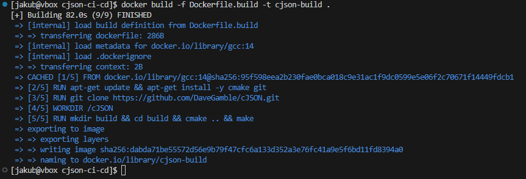
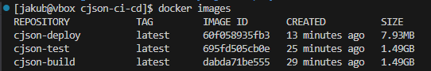

Jakub Tyliński, Grupa 8, 416081

---ZAJĘCIA_05---

### Przygotowanie
🌵 Utwórz instancję Jenkins
* Upewnij się, że na pewno działają kontenery budujące i testujące, stworzone na poprzednich zajęciach
* Zapoznaj się z instrukcją instalacji Jenkinsa: https://www.jenkins.io/doc/book/installing/docker/
  * Uruchom obraz Dockera który eksponuje środowisko zagnieżdżone
  * Przygotuj obraz blueocean na podstawie obrazu Jenkinsa (czym się różnią?)
  * Uruchom Blueocean
  * Zaloguj się i skonfiguruj Jenkins
  * Zadbaj o archiwizację i zabezpieczenie logów


### Zadanie wstępne: uruchomienie
🌵 Zadanie do wykonania na ćwiczeniach
* Konfiguracja wstępna i pierwsze uruchomienie
  * Utwórz projekt, który wyświetla `uname`

 

  * Utwórz projekt, który zwraca błąd, gdy... godzina jest nieparzysta


  * Pobierz w projekcie obraz kontenera `ubuntu` (stosując `docker pull`)


 All job:


### Zadanie wstępne: obiekt typu pipeline
🌵 Ciąg dalszy sprawozdania - zadanie do wykonania po wykazaniu działania Jenkinsa
* Utwórz nowy obiekt typu `pipeline`
* Wpisz treść *pipeline'u* bezpośrednio do obiektu (nie z SCM - jeszcze!)
  * https://www.jenkins.io/doc/book/pipeline/syntax/
  * https://www.jenkins.io/doc/pipeline/steps/git/
  * https://www.jenkins.io/doc/pipeline/examples/#unstash-different-dir
  * [https://www.jenkins.io/doc/book/pipeline/docker/](https://www.jenkins.io/doc/book/pipeline/docker/#building-containers)
* Spróbuj sklonować repo przedmiotowe (`MDO2025_INO`)
* Zrób *checkout* do swojego pliku Dockerfile (na osobistej gałęzi) właściwego dla *buildera* wybranego w poprzednim sprawozdaniu programu
* Zbuduj Dockerfile
* Uruchom stworzony *pipeline* drugi raz

```
pipeline {
    agent any
    stages {
        stage('Zadanie') {
            steps {
                echo 'Klonowanie repozytorium przedmiotowego'
                sh '''
                rm -rf MDO2025_INO
                git clone https://github.com/InzynieriaOprogramowaniaAGH/MDO2025_INO.git
                '''
                dir('MDO2025_INO') {
                    sh '''
                    git checkout JT416081
                    '''
                }
                dir('MDO2025_INO/ITE/GCL08/JT416081/Sprawozdanie/LAB_3') {
                    sh '''
                    docker container prune -f
                    docker builder prune -f
                    docker image prune -f
                    docker build -f ./Dockerfile.build -t json-c .
                    docker run -d --rm json-c
                    '''
                }
            }
        }
    }
}
```


cJSON -projekt

Dockerfile.build

```
FROM gcc:14

RUN git clone https://github.com/DaveGamble/cJSON.git
WORKDIR /cJSON
RUN mkdir build && cd build && cmake .. && make
```



Dockerfile.test:

```
FROM cjson-build
WORKDIR /cJSON/build
CMD ["ctest", "--verbose"]
```


Dockerfile.deploy:

```
FROM alpine:latest
WORKDIR /app
COPY cJSON.h .
COPY cJSON.c .
```
Tworzenie tymczasowego kontenera i kopiowanie plików cJON.c oraz cJON.h:




## 5. **Tworzenie sieci i uruchomienie Deploy**


## 6. **(Opcjonalnie) Smoke Test z małym programem main.c**

```
#include "cJSON.h"
#include <stdio.h>
#include <stdlib.h>

int main() {
    cJSON *root = cJSON_CreateObject();
    cJSON_AddStringToObject(root, "hello", "world");

    char *printed = cJSON_Print(root);
    printf("%s\n", printed);

    cJSON_Delete(root);
    free(printed);
    return 0;
}
```


## 7. **Push do DockerHub**


8. **Publish – artefakt ZIP*


JENKINSFILE

